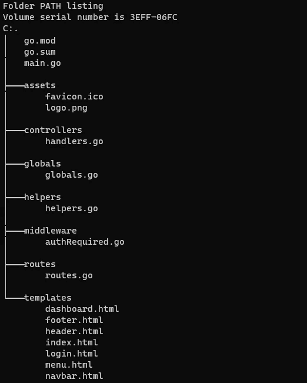

# 如何使用 Gin For Golang 创建一个简单的 Web 登录

> 原文：<https://betterprogramming.pub/how-to-create-a-simple-web-login-using-gin-for-golang-9ac46a5b0f89>

## 在这个例子中，我将向您展示如何使用 Gin HTTP web Framework for Golang 为 Web 应用程序构建一个简单的登录系统。

照片由[汝嫣·艾登](https://unsplash.com/@ruyan75?utm_source=medium&utm_medium=referral)在 [Unsplash](https://unsplash.com?utm_source=medium&utm_medium=referral) 拍摄

在这里，我展示了一个带有登录系统和会话管理的简单概念验证 web 应用程序的示例。它是用 Go 语言(Golang)编写的，并且利用了 Gin HTTP Web 框架。这里提供的例子很容易扩展。

我构建代码的方式受到了 Akhil Sharma 构建“餐馆管理后端”示例代码的启发。此外，一些身份验证、登录和注销代码改编自 Depado 的身份验证示例。剩下的都是基于我之前的文章。参见文章末尾的参考资料，获取这些内容的链接。

# 先决条件

调试时，确保 HTTP 缓存被禁用。这也要求在调试时打开检查器或 DevTools。

*   如果您使用 Firefox Inspector，请转到设置，找到高级设置，然后选中“*禁用 HTTP 缓存(当工具箱打开时)*。”
*   对于 Chrome DevTools，进入首选项，找到网络设置，并选中“*禁用缓存(当 DevTools 打开时)*。”

# 目录结构

在上面的截图中，可以看到项目的文件和目录布局。您在这里看到的目录依次是名为`/gin_session_auth`的目录的子目录。这一点很重要，因为这也是项目的名称。

当处理包时，我们总是从项目的名称开始，然后添加包的名称。例如，如果你想处理`controllers`包，你应该写`"gin_session_auth/controllers"`。您将在下面列出的文件的导入中看到这一点。

# 全局/全局. go

首先，我们定义几个全局变量。我们在这里定义的用于会话管理。

我们可以添加许多其他信息，例如服务器的地址和端口。或者，我们也可以编写代码从 JSON 或 YAML 文件中导入全局变量，而不是像我们在这里所做的那样硬编码它们。

不要忘记让变量以大写字母开头，这样它们可以被导出到其他包中。在整个项目中注意这一点。

# main.go

这是运行整个项目的主要函数。参见我的[上一篇文章](/how-to-render-html-pages-with-gin-for-golang-9cb9c8d7e7b6)关于用 Gin 加载 HTML 模板的基础知识。在这里，我将讨论那篇文章中没有提到的一些额外的概念。

在第 4 行和第 5 行，我们为 Gin 导入了会话中间件。在这种情况下，我们将使用 Cookie 后端保存会话数据。这个中间件还提供了其他后端，如 Redis、MongoDB、memstore 等。点击查看会话中间件[的 Github 页面。](https://github.com/gin-contrib/sessions)

在第 10–12 行，我们导入了一些我们在这个项目的其他地方定义的包(见下面标题下的讨论)。

在第 21 行，我们告诉 Gin 路由器使用会话中间件和安全 cookie 后端。`globals.Secret`变量包含安全 cookie 的认证密钥。

在第 23 和 24 行，我们为公共路由创建了一个路由器组。

在第 26–28 行，我们为私有路由创建了一个路由器组。此外，我们告诉这个组使用认证中间件。这个中间件将在实际的处理程序运行之前运行。因此，在允许用户查看私人网页之前，我们可以检查用户是否已经过身份验证。

# 路线/路线. go

这里我们从`controllers`包中调用处理程序。对于每个允许的路由，我们定义一个 HTTP 处理函数。

登录和访问 web 应用程序的索引页面不需要身份验证；因此，这些路线在`PublicRoutes()`功能中定义。

另一方面，访问仪表板需要用户登录。此外，如果用户还没有被认证，那么注销也没有多大意义。这些路线在`PrivateRoutes()`功能中定义。

# 控制器/处理器. go

在这个文件中，我们定义了 HTTP 路由的所有处理程序。

在第 14–31 行，我们处理 HTTP GET `/login`路由的动作。如果用户仍处于登录状态，系统会要求他在登录之前先注销。在任何情况下，名为`login.html`的 HTML 模板都会被呈现，然后由 Gin 使用`HTML()`函数作为响应返回。

响应包含一个要求输入用户名和密码的表单。当用户提供这些并点击提交按钮时，一个 HTTP POST 请求被发送到我们的 web 应用程序。

在第 33–63 行，处理程序处理`/login`路线的 POST 请求。如果用户已经登录，系统会要求他先注销。

如果用户没有提供用户名或密码，系统会要求他这样做。名为`EmptyUserPass()`的助手函数为我们检查这一点。然后，如果用户提供的用户名或密码组合不存在，他会被告知这些不正确。

密码检查由名为`CheckUserPass()`的助手函数完成。最后，如果无法保存会话，则会通知用户此情况。

当一切顺利时，用户使用 Gin 框架中的`Redirect()`功能被重定向到他的仪表板。

在一个更现实的设置中，用户名和密码不仅会被检查是否为空，还会根据其他标准来检查，比如它们包含的字符的长度和类型。这将需要更复杂的验证功能。

在第 65-82 行，我们实现了`/logout`路线的注销功能。首先，检索当前会话。如果此会话不存在，则会记录一条错误消息，并且不会再发生任何事情。否则，将删除并保存当前会话。如果无法保存新的空会话，则会记录一条错误消息。最后，用户被重定向到位于`/`的索引页面。

在第 84-93 行和第 95-104 行，分别实现了索引页和仪表板的处理程序。这些处理程序或多或少都是这样做的。他们检索当前会话并提取用户，然后为索引或仪表板返回一个呈现的 HTML 模板。模板中使用用户名。

# 中间件/身份验证必需. go

这个文件中实现了用于检查用户是否已经过身份验证的中间件。它只是检查会话是否存在。如果会话为零，则用户被重定向到`/login`路由。否则，Gin 框架会被告知进入下一步。

在这种情况下，下一步将是处理私有路由的处理程序之一。另一方面，如果已经安装了其他中间件功能，那么下一步可能就是这些功能之一。

# 助手/助手。走

这里有一些助手函数。

在第 8-25 行，我们实现了一个检查用户名和密码的功能。在这里，我们保持简单，并定义了两种可能的用户名和密码组合；你好+我和约翰+多伊。

当然，在(更)实际的设置中，这些用户名和密码不会被硬编码。相反，它们会从某种数据库中检索出来。该数据库将允许我们更改现有密码，并添加新的用户名和密码组合。

在第 27-29 行，检查用户名和密码以确保它们都不为空。

# 超文本标记语言模板

您可以看到上面这个项目中使用的所有 HTML 模板。这里有几件事需要注意:

*   在第 10 行，[布尔玛 CSS 框架](https://bulma.io/documentation/)被加载。
*   在第 22–48 行，添加了一些 Javascript 来为布尔玛提供一些功能。更具体地说，这个脚本将允许用户点击一个“汉堡包”来显示导航条菜单。点击这里了解更多关于这个[的信息。](https://bulma.io/documentation/components/navbar/)

查看下面的参考资料，了解更多关于 HTML 模板、Gin 和 Golang 的信息。

# 参考

[布尔玛 CSS 框架文档](https://bulma.io/documentation/)

[【会话】Github 上的 Gin](https://github.com/gin-contrib/sessions)

[“gin-auth-example”由 Depado 在 Github 上发布](https://github.com/Depado/gin-auth-example)

[Github 上 AkhilSharma90 的《golang-餐厅-管理-后端》](https://github.com/AkhilSharma90/golang-restaurant-management-backend)

[“如何在 Golang 中使用模板”，作者 Jes Fink-Jensen](/how-to-use-templates-in-golang-46194c677c7d)

[“如何使用 Golang 模板生成 HTML”，作者 Jes Fink-Jensen](/how-to-generate-html-with-golang-templates-5fad0d91252)

[“如何使用 Gin 为 Golang 呈现 HTML 页面”，作者 Jes Fink-Jensen](/how-to-render-html-pages-with-gin-for-golang-9cb9c8d7e7b6)