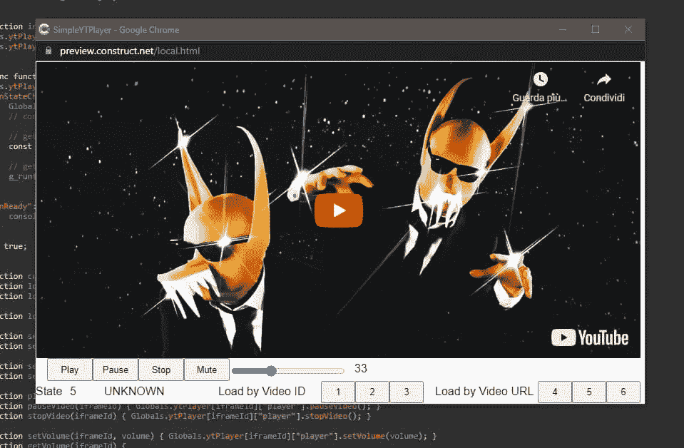
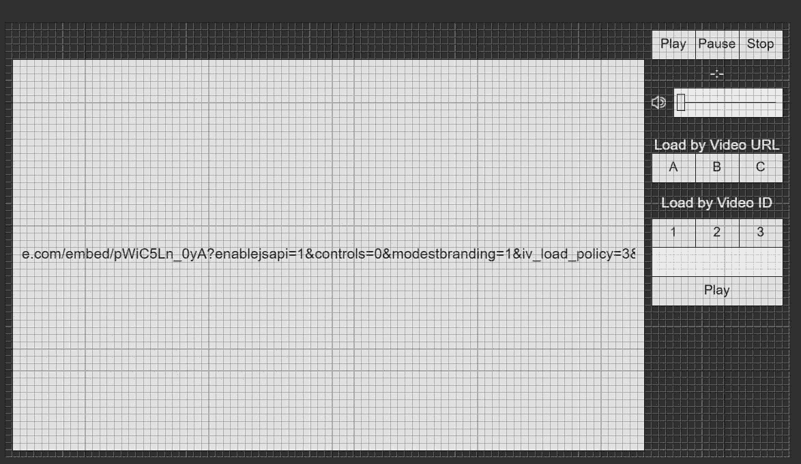
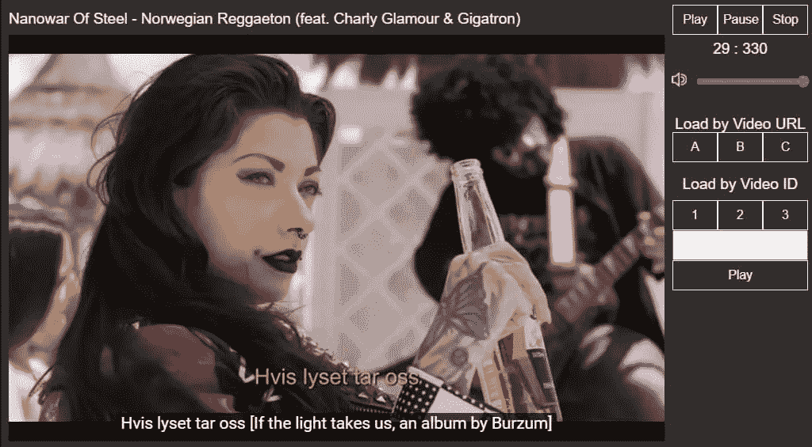
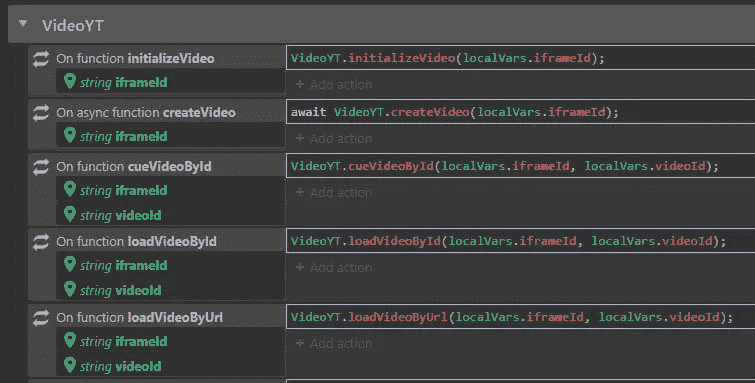
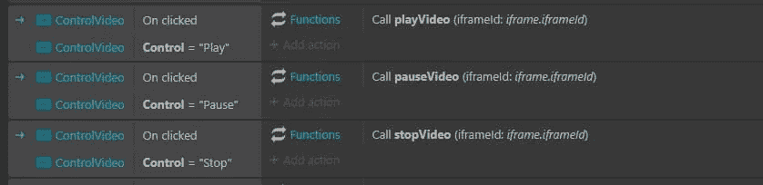

# 如何用 JavaScript 创建一个简单的 YouTube 播放器

> 原文：<https://betterprogramming.pub/how-to-create-a-simple-youtube-player-with-javascript-9f10af62ea4a>

## 有趣玩家的简要指南

我最成功的开源项目之一是我为 Construct 3 收集的模板。与其说是专门用于视频游戏的部分，不如说是我尝试集成 JavaScript 和事件表的部分。我认为给出一些使用 JavaScript 创建自定义 YouTube 视频播放器的技巧可能会有用。

首先，让我们看看我想要达到的目标:

界面相当简单。视频占据了屏幕的大部分。在顶部，有标题的空间，在右边有一些控制回放的按钮(`Play`、 `Pause`、`Stop`和`volume`)。仍然在右边，但再往下，一些按钮允许你选择播放哪个视频，也可能通过 YouTube ID 选择其他视频。

这是一个旨在演示的项目，所以我将从两个独立的 JSON 文件开始观看 YouTube 视频的功能放在了代码中。第一个是视频 id，第二个是 URL。当然，你可以选择你喜欢的方法。

你也可以从这个链接下载代码:[simple-YouTube-player . c3p](https://blog.stranianelli.com/c3p/simple-youtube-player.c3p)。

运行项目时，界面如下所示:

# 让我们编码

现在是最有趣的部分:如何使用 JavaScript 创建一个简单的 YouTube 播放器。首先当然推荐咨询[官方文档](https://developers.google.com/youtube/iframe_api_reference)。

我需要两个函数在页面启动时运行。使用`LoadAPI`，我将 YouTube 蜜蜂导入到我的项目中，如下所示:

我需要另一个函数来创建播放器并分配我感兴趣的监控事件(例如，能够通过自定义按钮控制视频的执行)。

最后，我可以使用`createVideo`函数并传递`iframeId`作为参数来创建实际的视频。代码如下:

使用这些代码取决于项目的类型和框架。我在示例项目中使用这个函数向主界面传递一些信息。

# 创建自定义命令

因为我已经将 YouTube 播放器链接到了网页 iFrame，所以我可以创建自定义函数在我的代码中使用。我也可以在同一个页面上有多个视频，只要它们每个都有不同的 ID。

## 播放、暂停和停止视频

## 管理视频的音量

## 加载视频

## 线索视频

## 加载播放列表

## 获取视频的时长

# 没有代码的 YouTube

至于 JavaScript 部分，我想我可以到此为止了。对于那些想要查看项目的事件表中插入的部分的人来说，只需调用相应的函数即可。

例如，函数 C3 不外乎如下:

同样，我可以以“隐藏”的方式使用 JS 来管理视频播放。

感谢阅读！敬请关注更多内容。

***不要错过我的下一篇文章—报名参加我的*** [***中邮箱列表***](https://medium.com/subscribe/@el3um4s)

 [## 通过我的推荐链接加入 Medium—Samuele

### 阅读萨缪尔的每一个故事(以及媒体上成千上万的其他作家)。不是中等会员？在这里加入一块…

el3um4s.medium.com](https://el3um4s.medium.com/membership)