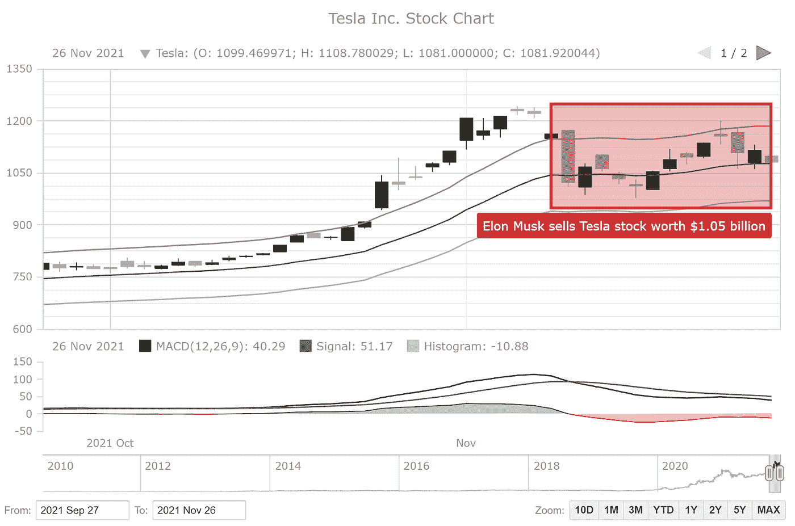
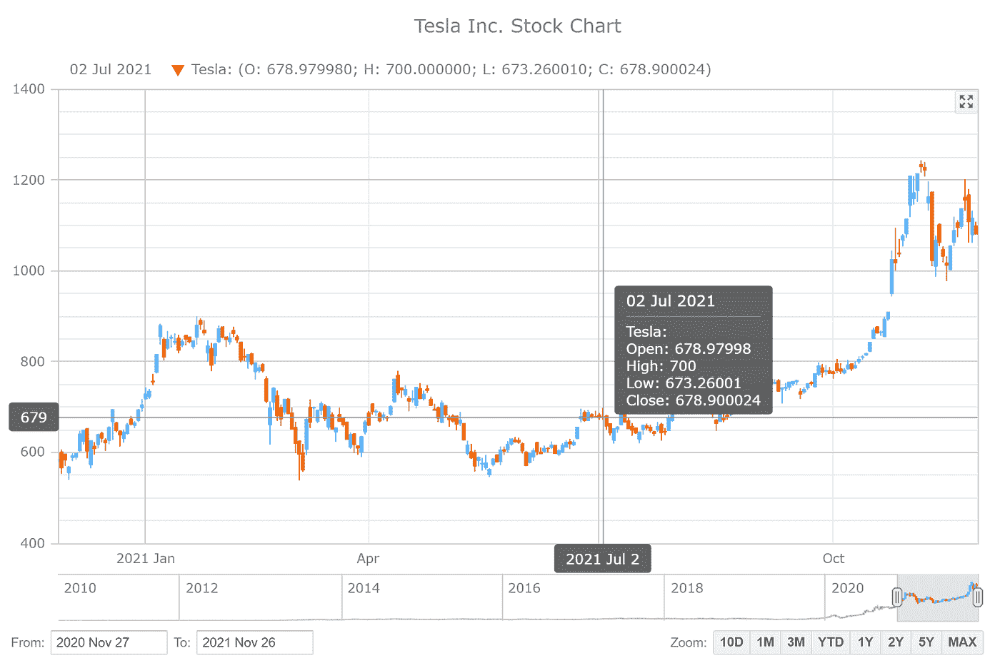
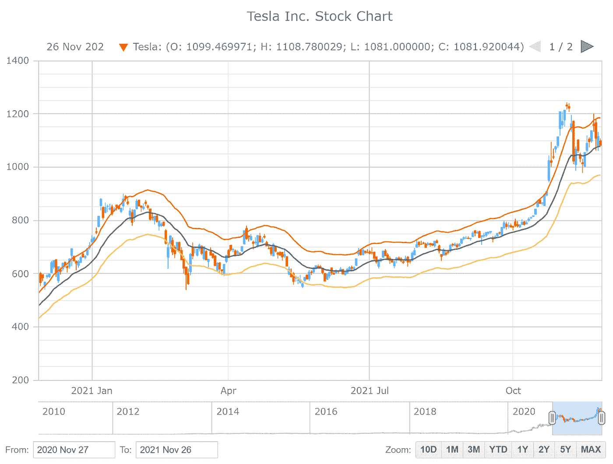
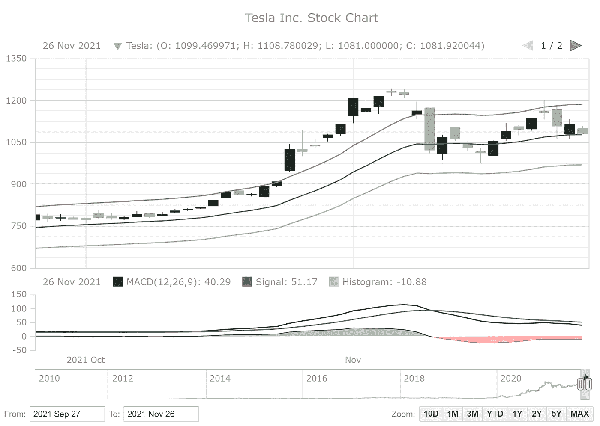
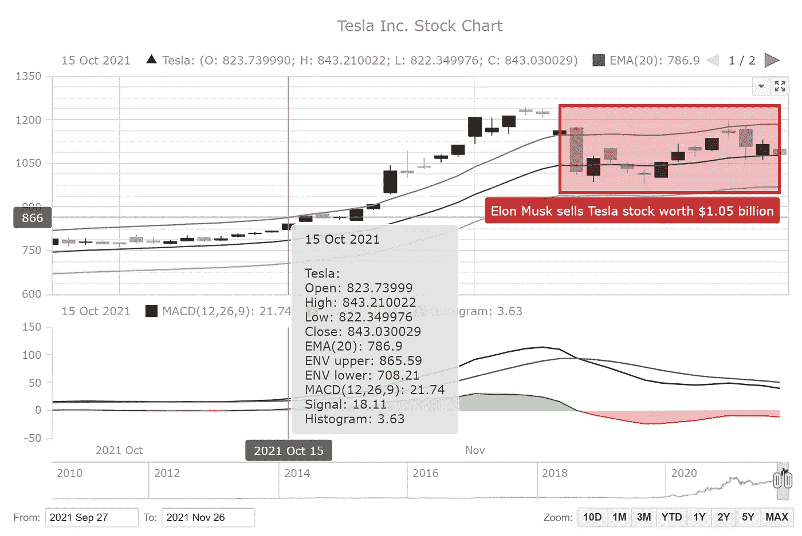

# 使用 AnyChart JavaScript 库构建股票图表

> 原文：<https://betterprogramming.pub/how-to-create-a-stock-chart-in-javascript-c250769045c2>

## 一步一步的教程，建立一个交互式的股票图表，显示特斯拉的价格在过去几年

作者图片

数据可视化广泛应用于各个领域。其中一个领域是金融交易，股票图表对于智能市场数据分析和决策制定至关重要。无论你是否投资股票，我很肯定你已经遇到过这样的图形，甚至可能需要现在就建立一个。那么，你想知道如何制作股票图表吗？我准备向您展示一个使用 Tesla 股票价格数据和 JavaScript 的简单方法！在本教程中，请跟随我，您将学习如何快速创建优雅、交互式的 JS 股票图表，就像您在图片中看到的那样。

# **什么是股票图？**

你们中的大多数人可能知道一些基本知识，但为了确保我们都在同一页上，我将简要地告诉你什么是股票图表。

股价图基本上是通过在 Y 轴上绘制价格或成交量，在 X 轴上绘制时间段，来表示一段时间内股票的价格或成交量的变化。

在快节奏的金融市场中，股票图表在帮助投资者发现趋势并做出正确的买卖决定方面发挥着非常重要的作用。

最常用于描绘股票的图表类型是烛台股票图。但是您也可以使用开盘-盘高-盘低-收盘(OHLC)、折线图、面积图、柱形图或其他形式的序列可视化，具体取决于特定的案例和任务。

# **待创建的股票走势图**

特斯拉是一家经常出现在新闻中的公司。这些年来，它呈指数级增长，这在它的股票价值中得到了很好的反映。因此，在本教程中，我将构建一个股票图表来展示特斯拉公司的价格变动。我还将向您展示如何添加各种技术指标，并说明最近围绕 Elon Musk 抛售股票的炒作的影响。

下面是 JavaScript 股票图表的最终版本，让您为接下来的步骤做好准备。

作者图片

# 用 JavaScript 构建股票图表

从头开始创建交互式股票图表可能是一项非常艰巨的任务，但使用适当的数据可视化工具会变得更加容易和快速。例如，有一些有用的 [JavaScript 图表库](https://en.wikipedia.org/wiki/Comparison_of_JavaScript_charting_libraries)能够创建金融图形，你可以使用任何适合你的需求。

在本教程中，我使用的是其中一个好的库——any chartJS 库，它有一些很棒的股票图表选项以及简洁的文档[供它们使用，并且对于任何非商业和教育用途都是免费的。](https://docs.anychart.com/Stock_Charts/Overview)

虽然这不是必需的，但是 HTML 和 JavaScript 的一些技巧可以帮助更快地理解这些概念。但是一切都很简单，会有大量的解释，所以即使你是新手也没什么好担心的。

开市铃已经响了，是时候创建股票走势图了！

## **1。制作一个 HTML 页面**

我做的第一件事是创建一个 HTML 页面来保存图表，并添加一个`div` 元素来呈现图表。应该给这个 block 元素一个惟一的 id，以便以后可以在代码中引用它。

我还设置了`div`的样式，我将宽度和高度定义为 100%，空白和填充为 0。这将在整个屏幕上显示股票图表。

## **2。添加所需的脚本**

因为我使用的是图表库，所以我需要从该库中为股票图表引用适当的 JS 脚本。记住，这些脚本包含在 HTML 页面的`head`部分。

对于股票图表，我需要添加多个脚本。首先，我包括 AnyChart 的'[核心](https://docs.anychart.com/Quick_Start/Modules#core)和'[股票](https://docs.anychart.com/Quick_Start/Modules#stock)模块。接下来，我添加了帮助加载数据的[数据适配器](https://docs.anychart.com/Quick_Start/Modules#data_adapter)模块。最后，我包含了用于用户界面元素的 [UI](https://docs.anychart.com/Quick_Start/Modules#common_ui) 和[导出](https://docs.anychart.com/Quick_Start/Modules#exports)模块，并启用导出特性，让您可以将图表保存为图像或将底层数据提取到数据文件中。

为了让股票 UI 特性正常工作，我还需要链接适当的样式表。

## **3。准备数据**

在这个股票图表中，我想可视化 Tesla Inc. (TSLA)的每日股票价格数据，所以我从[雅虎财经](https://finance.yahoo.com/quote/TSLA/history?p=TSLA)和 CSV 数据文件[这里](https://gist.githubusercontent.com/shacheeswadia/cd509e0b0c03964ca86ae7d894137043/raw/5f336c644ad61728dbac93026f3268b86b8d0680/teslaDailyData.csv)获取。

现在所有的准备工作都完成了，所以让我们开始交易，或者在我们的例子中，编写 JavaScript 股票图表代码！

## **4。编写必要的 JavaScript 代码**

首先，我将代码放在一个名为`anychart.onDocumentReady()`的函数中。这确保了在页面完全加载之前不会执行代码。接下来，我使用`anychart.data.loadCsvFile()`函数加载数据文件。

然后，我创建一个数据表，并将加载的数据添加到其中，但是在将这些数据用于我的股票图表之前，我需要对其进行映射。由于我正在创建一个蜡烛图，所以我绘制了开盘价、最高价、最低价和收盘价。

现在，我定义股票图，绘制它，并设置网格线。因为数字在查看股票数据值时很重要，所以为了更好的可读性，我启用了所有网格线。

现在是创造这个系列的主要部分。这是通过使用烛台绘图函数和我前面定义的映射来完成的。我给这个系列命名并添加一个图例图标。

股价图有长期的价值。因此，我在主图表下添加了一个 scroller 系列，使用户能够指定日期范围并仔细查看数据的值。我为默认显示设置了一年的范围。

为了方便用户，我提供了一个范围选择器，用户可以手动输入日期，还提供了一个范围选择器，只需点击一下就可以选择常用的时间段。

最后，我给图表一个标题，引用之前定义的图表容器，并绘制图表。

这是收盘铃，一个美丽的，功能的股票图表创建！

作者图片

你可以很快发现特斯拉的股价在过去一年中一直在波动，但总体趋势是积极的。将鼠标悬停在图表上，可以看到显示日期以及开盘、盘高、盘低和收盘值的功能性工具提示。这是这里已经提供的许多有用功能之一。

你可以在 [CodePen](https://codepen.io/shacheeswadia/pen/MWEWVxy?editors=0010) 上看到这个 JS 股票图表的初始版本以及完整的代码。

# 定制 JavaScript 股票图表

这个交互式股票图表看起来已经很不错了，展示了可以轻松深入研究的有用信息。但是，这仅仅是开始。

我将向您展示如何通过添加更多功能(更改系列、添加技术指标、注释等)和微调其可视化来定制 JS 股价图，所有这些都只需几个简化的操作。

## **A .系列类型和条件着色**

股价图通常用烛台来表示。但这不是强制性的。在这里，我想向您展示如何将数据可视化类型从显示所有四个值(开盘、盘高、盘低和收盘)的蜡烛图快速切换到折线图，在折线图中，您可以指定要绘制的值(默认情况下是第一个值，即本例中的开盘价)。因为只表示了一个值，所以这里不需要我前面做的映射。

因此，我简单地将系列指定为“line ”,并直接将数据表作为参数传递。

为了在线股价图中显示上涨和下跌的价格，我添加了有条件的颜色，如果价格下降，我将线的颜色指定为红色，如果价格上升，则为绿色。这可以使用内置的上升冲程和下降冲程功能非常方便地完成。要指定的选项有描边颜色、描边宽度、描边类型和描边结尾。

我还将 scroller 系列更改为线图表示。

你可以在 [CodePen](https://codepen.io/shacheeswadia/pen/jOGOxqq) 上仔细看看这个新的 JS 股价图版本。在接下来的步骤中，我将继续绘制烛台系列来表示数据。

## **B .技术指标:均线和包络线**

交易员和投资者通常依靠技术分析来确定趋势，了解金融工具是超买还是超卖，并决定何时卖出或买入。有多种技术指标可以对此有所帮助。让我们看看如何快速将它们添加到股票图表中。

我想包括两个流行的技术指标:指数移动平均线(EMA)和包络线。这两个指示器都可以用很少的代码很容易地绘制出来。

我所要做的就是映射我想要使用的数据值，我将它指定为收盘值，指示笔画宽度和颜色，EMA 线绘制在烛台图上。如果没有设置自定义值，我可以指定 EMA 周期，默认值是 50。

类似地，对于包络线指标，我只指定了绘图，较低和较高的波段线绘制在图表上。

看看下面这个带有均线和信封的 JS 股票图是什么样子的。您也可以在 [CodePen](https://codepen.io/shacheeswadia/pen/WNZNJjw) 上玩它的交互式版本(及其完整代码)，例如，您可以通过点击相应的图例项来隐藏和显示这些附加的技术指标线。

作者图片

## **MACD 指标**

MACD 或移动平均线收敛发散是一个动量指标，通常用信号线绘制。它是用 26 周期和 12 周期均线计算的，当它分别穿过信号线的上方或下方时，它会显示买入或卖出的信号。

我将 MACD 指标绘制成一个单独的图，代表 MACD 线、信号线，并在蜡烛图下方绘制一个面积直方图。我做的第一件事是禁用烛台图表的 X 轴，因为我将在 MACD 图。现在，我定义第二个图并绘制数据值。

接下来，我将系列类型设置为面积直方图，并为正值和负值定义描边和填充设置。最后，我只是设置这个图的高度为总高度的 40%。

## **D .牛逼振荡器**

Awesome 振荡器(AO)通过比较市场动量和整个股票价格在更长时间内的波动来显示工具的强弱。

我还将这个指标绘制成主图表下面的第二个图表，就像上一步一样。我给你看这个是为了说明各种技术指标可以很容易地绘制出来。

正如我对 MACD 图所做的那样，类似地，我定义了第二个图，并使用 ao 函数为 awesome 振荡器指标绘制数据。

我将线条的颜色指定为绿色代表上涨，红色代表下跌，并将图表的高度设置为 40%。

如果您将鼠标悬停在顶部或底部图表上，您将在右上角看到两个图标，这两个图标允许您上下移动该图，并使其全屏显示，隐藏另一个图表。

你可以在 CodePen 上玩这些 JS 股票图表版本，MACD 图[在这里](https://codepen.io/shacheeswadia/pen/abLbGLG?editors=0010)和 AO 图[在这里](https://codepen.io/shacheeswadia/pen/qBPBYVM?editors=0010)。

## **E .调色板**

让你的股价图看起来个性化的一个简单有效的方法是改变图表的颜色。AnyChart 库有预构建的设计主题，所以我只需要向`head`部分添加必要的脚本，并简单地在代码中设置它。在这里，我应用了单色主题。

看看股票图表看起来有多复杂和精致！

作者图片

现在，在最后的定制中，我将向您展示一个在股票图表中经常被要求的更酷的东西。

## **F .图解和注释**

在股价图中，可能需要添加额外显示或突出显示某些内容的自定义对象。例如，在 AnyChart JS 库中，有一个有用的特性可以让您创建[绘图和注释](https://docs.anychart.com/Stock_Charts/Drawing_Tools_and_Annotations/Overview)。

我将在这里向您展示如何突出显示一个特定的时期，并为它提供一个解释性说明。我将展示由于埃隆·马斯克出售大量自己的股票而导致特斯拉股价下跌的时候。

首先，我定义注释，然后创建一个矩形。我设置了各种参数，如矩形的宽度和高度，以及指示矩形开始和结束的日期。我还设置了从公司徽标中选择红色的笔画和填充值。

接下来，我在矩形下方创建注释标签。我再次定义标签的起始位置、尺寸、颜色，当然还有文本。

这只是一个简单的例子。如果你想了解更多关于这样的绘图和注释选项在现实生活中的外观和工作方式，请使用这个[演示工具](https://www.anychart.com/solutions/drawing-tools/)。

这就完成了定制，一个可爱的、交互式的、有洞察力的 JS 股票图表就完成了。看看下面的最终版本。它看起来不像是你会把钱押在上面的东西吗？你可以查看完整的 HTML/CSS/JavaScript 代码，并在 [CodePen](https://codepen.io/shacheeswadia/pen/wvrvXrr?editors=0010) 上根据你的喜好定制这个股票图表。

作者图片

# 结论

正如你所看到的，创建一个带有技术指标和注释的时尚的交互式股票图表最初看起来很复杂，但实际上非常简单方便。JavaScript 图表库很多，对于大多数支持这种图表类型的库来说，构建股票图表的过程是相似的。因此，您可以根据自己的需求和特定任务选择使用哪一种。

在本教程中，我向您展示了如何创建一种类型的股票图表——烛台状——并解释了如何快速更改系列，使其成为一条线。但是也有其他有趣的股票图表类型，你可以自己仔细看看，比如[这里](https://www.anychart.com/products/anystock/gallery/Stock_Chart_Types/)。

接着，制作股票图表，看看你能否预测接下来会发生什么。当然，在股票市场上，没有哪只股票是稳赚不赔的。但是学习如何绘制一个图肯定会是一个成功的决定！如果你需要任何帮助，请与我联系。