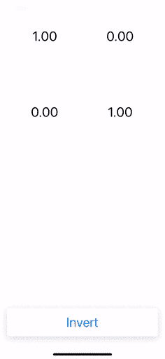

# 如何从 C++库创建 Swift 包

> 原文：<https://betterprogramming.pub/how-to-create-a-swift-package-from-a-c-library-fb5cd606220f>

## 了解 Swift 和 C++如何相互通信

在 [Unsplash](https://unsplash.com?utm_source=medium&utm_medium=referral) 上由 [Kira auf der Heide](https://unsplash.com/@kadh?utm_source=medium&utm_medium=referral) 拍摄的照片。

本教程将指导您创建自己的 [Swift 包](https://swift.org/package-manager/)的过程。它将为一个流行的 C++线性代数库— [Eigen](https://gitlab.com/libeigen/eigen) 提供绑定。为简单起见，只有 Eigen 功能的一个子集将被移植到 Swift。

# C++和 Swift 互操作的挑战

C++到 Swift 的绑定是一个复杂的故事，很大程度上取决于您希望移植哪种 C++代码。这两种语言没有明显的一对一的 API 映射。虽然存在自动绑定解决方案(例如 [Scapix](https://github.com/scapix-com/scapix) 、 [Gluecodium](https://github.com/heremaps/gluecodium) )，但它们只能成功映射 C++语言的一个子集。如果您是一名愿意编写可轻松转换成其他语言的代码的库开发人员，您可能会从这种绑定解决方案中受益。然而，如果您希望使用第三方库，那么您通常会遇到困难。在这种情况下，您可能只有一个选择:手动编写绑定。

Swift 的团队已经在其工具链中提供了 [C](https://github.com/apple/swift/blob/main/docs/HowSwiftImportsCAPIs.md) 和 [Objective-C](https://github.com/apple/swift/blob/main/docs/ObjCInterop.md) 互操作性。与此同时， [C++ interop](https://github.com/apple/swift/blob/main/docs/CppInteroperabilityManifesto.md) 有一个没有明确实现时间表的清单。该清单讨论了 C++/Swift 互操作性的可能设计和权衡。最具挑战性的问题之一是导入模板。似乎 C++模板和 Swift 泛型是相似的。然而，它们有重要的区别。在撰写本文时，Swift 不支持非类型模板参数、模板模板参数和参数包。同样，Swift 泛型是基于约束的(类似于 [C++20 概念](https://en.cppreference.com/w/cpp/concepts))。同时，C++模板执行语法替换(即尝试在调用位置用具体类型替换模板，并查看该类型是否支持模板中调用的语法)。

总而言之，如果你想从 Swift 调用一个高度模板化的 C++库，运气真不好！

# 问题设置

让我们尝试为高度模板化的 C++库 [Eigen](https://gitlab.com/libeigen/eigen) 进行手动绑定。这是一个流行的线性代数(矩阵、向量、数值解算器和相关算法)库。包装器的基本策略如下:选择一个具体类型，并将其包装成 Objective-C 类，该类将被导入 Swift。

将 Objective-C API 导入 Swift 的方法之一是直接向 Xcode 项目添加 C++库，并提供一个[桥接头](https://developer.apple.com/documentation/swift/imported_c_and_objective-c_apis/importing_objective-c_into_swift)。但是，您通常希望您的包装器作为一个单独的模块进行编译。在这种情况下，您需要软件包管理器的帮助。Swift 团队大力推广 [Swift 包管理器(SPM)](https://swift.org/package-manager/) 。从历史上看，SPM 缺乏一些阻止许多开发人员迁移到它的特性。然而，这几年已经有了很大的改善。在 Xcode 12 中，您终于可以将资源与您的包捆绑在一起，甚至可以在 Swift playground 中使用包。

在本教程中，我们将创建一个名为`SwiftyEigen`的 SPM 包。作为具体使用的类型，我们将采用一个具有任意行数和列数的浮点矩阵。`Matrix`类将有一个初始化器、下标和计算矩阵逆的逆方法。完整的项目托管在 GitHub 上[。](https://github.com/ksemianov/SwiftyEigen)

# 项目结构

SPM 有一个创建新库的有用模板:

然后我们添加第三方库(Eigen)作为子模块:

我们编辑我们的包裹清单，`Package.swift`:

这个包清单是包编译的诀窍。Swift 的构建系统将为 Objective-C 和 Swift 编译两个独立的目标。SPM 不允许在同一个目标中混合使用这两种语言。`ObjCEigen`目标使用来自`Sources/ObjC`文件夹的源代码，将`Sources/CPP`文件夹添加到标题搜索路径中，并定义`EIGEN_MPL2_ONLY`以保证在使用 Eigen 时获得 MPL2 许可。`SwiftyEigen`目标依赖于`ObjCEigen`并使用来自`Sources/Swift`文件夹的源。

# 手动绑定

现在我们为 Objective-C 类提供一个头文件，并把它放在`Sources/ObjCEigen/include`文件夹中:

我们有`rows`和`cols` get 属性，一个带有零和一个单位的初始化器，获取和设置单个值的方法，以及一个逆向方法。

这是在`Sources/ObjCEigen`文件夹中的实现:

现在我们在`Sources/Swift`向 Swift 公开我们的 Objective-C 代码(更多信息，请参见 [Swift 论坛](https://forums.swift.org/t/why-does-a-package-expose-the-targets-names-for-import-instead-of-product-library-name/16648/2)):

并为更干净的 API 提供下标:

# 用法示例

现在我们可以如下使用这个类:

最后，我们可以创建一个简单的示例项目，展示我们的包装器库`SwiftyEigen`的功能。它将允许我们输入一个 2x2 矩阵的值，然后计算它的逆。为此，您在 Xcode 中创建新的 iOS 项目，将包的文件夹从 Finder 拖放到 Project navigator 以添加本地依赖项，并在`Example target`的常规设置中添加`SwiftyEigen`框架。然后我们编写 UI 并完成项目:

作者截屏

参见 GitHub 上的完整代码[。](https://github.com/ksemianov/SwiftyEigen)

# 参考

*   [SwiftyEigen 项目](https://github.com/ksemianov/SwiftyEigen)
*   [特征线性代数库](https://gitlab.com/libeigen/eigen)
*   [Swift 包管理器](https://swift.org/package-manager/)
*   [C/Swift 互操作](https://github.com/apple/swift/blob/main/docs/HowSwiftImportsCAPIs.md)
*   [目标-C/Swift 互操作](https://github.com/apple/swift/blob/main/docs/ObjCInterop.md)
*   [目标-C 桥接接头](https://developer.apple.com/documentation/swift/imported_c_and_objective-c_apis/importing_objective-c_into_swift)
*   [C++/Swift 互操作清单](https://github.com/apple/swift/blob/main/docs/CppInteroperabilityManifesto.md)
*   [C++20 个概念](https://en.cppreference.com/w/cpp/concepts)
*   [自动桥接解决方案](https://github.com/scapix-com/scapix)

感谢您的阅读！