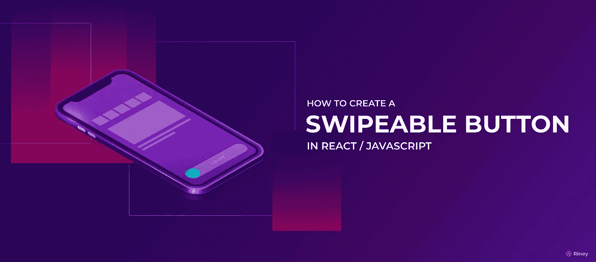
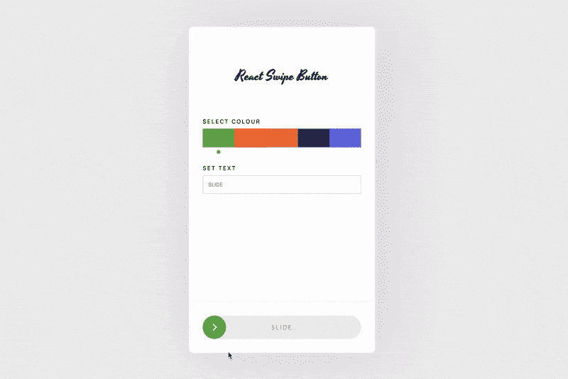
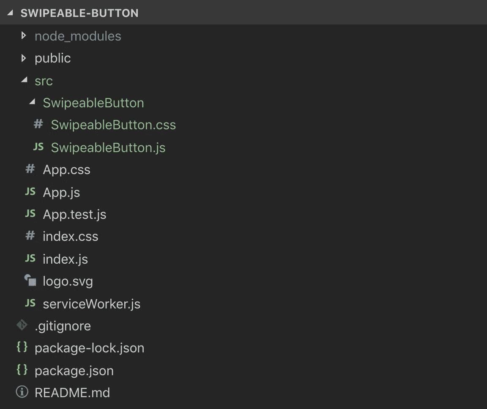
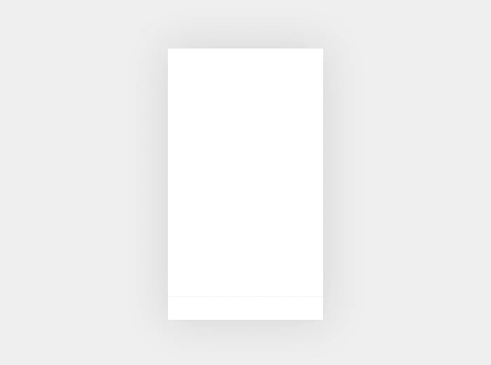
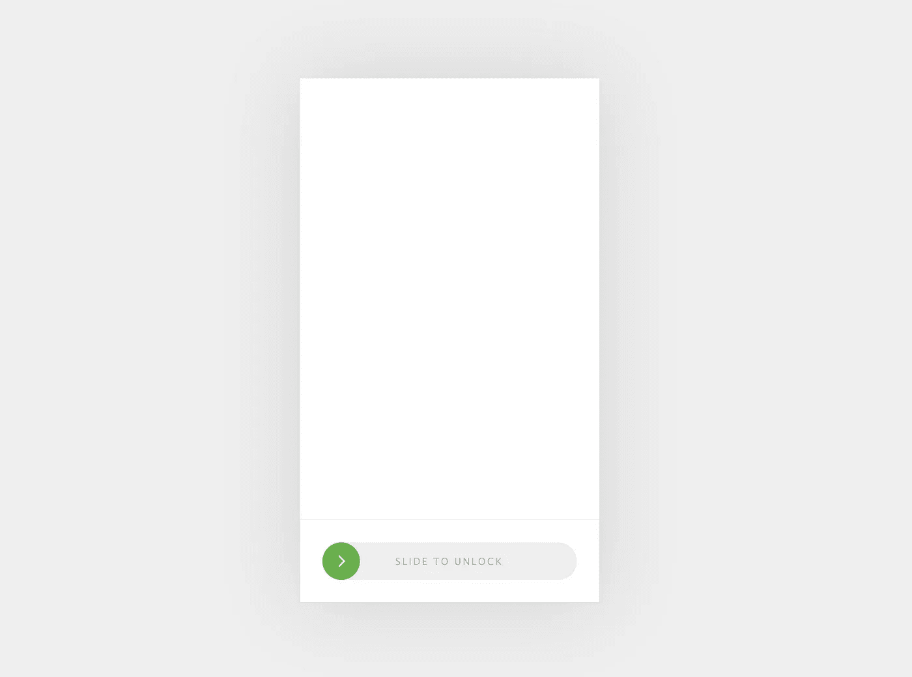

# 如何在 JavaScript 中创建一个可滑动按钮(React)

> 原文：<https://betterprogramming.pub/how-to-create-a-swipeable-button-in-javascript-react-c8d1214a0c20>

## 如何在 web 和移动应用程序中创建可滑动和可定制的按钮



# 介绍

我们的目标是在 React 中创建一个可滑动的按钮。它应该可以在网络和手机上工作，所以我们将处理鼠标事件和触摸事件。我们将制作一个可定制的按钮，以便我们可以在多个地方重复使用它。这是我们最终产品的样子:



# 设置样板应用程序

我们不会浪费时间为我们的基本 react 应用程序配置 Webpack，因为我们有一个来自脸书的名为 *create-react-app* 的优秀节点模块来生成 React 应用程序的样板版本。那些没有意识到这一点的人可以参考[的这个](https://www.codecademy.com/articles/how-to-create-a-react-app)文档。

一旦你使用 create-react-app 创建了你的应用，你就可以导航到你的应用文件夹并运行 *npm start* 来启动本地服务器。您可以使用您的网络浏览器访问它，网址为:[*http://127 . 0 . 0 . 1:3000*](http://127.0.0.1:3000/)。

```
~/> create-react-app swipeable-button
~/> ...
~/> ...
~/> ...
~/> cd swipeable-button
~/swipeable-button/> npm start
```

你能在浏览器中看到一个带有 React 标志的样板 web 应用吗？太棒了！现在是时候构建我们的组件了。

# 可旋转按钮

让我们从创建组件所需的文件文件夹开始。我们将在 *src* 目录中创建一个名为 *SwipeableButton* 的文件夹。在其中，我们将创建一个 *SwipeableButton.js* 和 *SwipeableButton.css* 。



现在，您的应用程序的文件夹结构将如下所示。在我们进入我们的组件并开始编写代码之前，让我们进入 *App.js* 并为我们的 *SwipeableButton* 制作一个感受移动屏幕的容器和另一个容器块。

App.js

App.css



希望在修改了 App.js 和 App.css 的代码后，会得到上面的结果。现在让我们看看 SwipeableButton.js。我们要做的第一件事是为外观和感觉编写代码。之后，我们将关注功能。

SwipeableButton.js

SwipeableButton.css

在我们为 *SwipeableButton，*构建完结构后，让我们将它导入到 *App.js* 中，看看我们有什么。

App.js



你得到上面的结果了吗？厉害！最后，我们将向组件添加功能。这就是我们要做的。

*   检测设备是否是触摸屏。
*   绑定触摸开始/鼠标按下事件
*   绑定触摸移动/鼠标移动事件
*   基于 TouchEvent/MouseEvent 更新滑块位置
*   绑定 TouchEnd/MouseUp 事件
*   验证用户是否在触摸端/鼠标抬起时完全滑动

## 检测设备是否是触摸屏

在 JavaScript 中，检测一个设备是否是触摸屏非常简单。在一行 JavaScript 代码的帮助下，我们将能够检测到它。

```
const isTouchDevice = 'ontouchstart' in document.documentElement
```

## 绑定触摸开始/鼠标按下事件

我们将把 TouchStart/MouseDown 事件绑定到滑块。为此，首先，我们必须为它创建 refs。一旦我们在 handle 函数上绑定了事件，我们将存储鼠标/触摸的起始 x 位置，并使一个标志的值为真。我们称这个标志为*可分的*。

## 绑定触摸移动/鼠标移动事件

让我们继续讨论 TouchMove/MouseMove 事件，我们将把它绑定到文档。在这种情况下，我们要做的第一件事就是检查*是否被激活。如果启用，我们将捕获触摸/鼠标的 x 位置，并将其存储到一个变量中。一旦我们从触摸/鼠标事件中获得值，我们将调用 *updateSliderStyle* 函数，它将更新滑块的位置。*

## 基于 TouchEvent/MouseEvent 更新滑块位置

在 *updateSliderStyle 中，*我们将从 TouchMove/MouseMove 事件中获取值，并更新滑块的样式。这将给用户一种滑动效果。

## 绑定 TouchEnd/MouseUp 事件

TouchEnd/MouseUp 是我们要绑定的最后一个事件——让我们将它绑定到文档。在我们捕捉到这个事件后，我们要做的第一件事就是检查标志*是否被激活。如果它被启用，那么我们知道用户必须尝试拖动滑块。现在滑动过程已经结束，所以让我们禁用标志 *isDraggable。**

## 验证用户是否在触摸端/鼠标抬起时完全滑动

我们要做的最后一件事是验证用户刷卡是否正确。我们将获取整个 SwipeableButton 的宽度，并取其 90%，然后我们将检查从 TouchEvent/MouseEvent 获得的值是否大于宽度。如果它有效，我们将调用一个函数 *onSuccess，*它是通过 props 传递的。如果不是，那么我们将滑块的位置设置回左边。

如果我们这样做，我们的代码库将如下所示:

SwipeableButton.js

App.js

现在，试着拖动滑块。哇，你刚刚做了一个很棒的可滑动按钮，现在是时候做一些修改来增加更多的功能和风格了。

# 工作演示和 NPM 图书馆

查看这里的 [**演示**](http://react-swipe-button.rinas.in/) ***，*** 如果你认为你不想经历所有这些事情，那么我们这里有现成的维护良好的 [**库**](https://www.npmjs.com/package/react-swipe-button) **。**快乐编码！

里诺伊的设计。有什么问题吗？我很乐意回答，如果你在某个地方托管你的 SwipeableButton 版本，请告诉我，我很乐意看到。