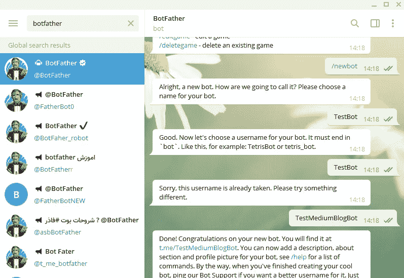
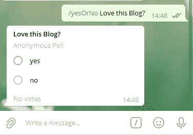

# 如何用 10 行代码创建一个电报机器人

> 原文：<https://betterprogramming.pub/how-to-create-a-telegram-bot-with-10-lines-of-code-4b38bc3a101a>

## *使用 NodeJS 和电报 API*


照片由 [Christian Wiediger](https://unsplash.com/@christianw?utm_source=unsplash&utm_medium=referral&utm_content=creditCopyText) 在 [Unsplash](https://unsplash.com/s/photos/telegram?utm_source=unsplash&utm_medium=referral&utm_content=creditCopyText) 上拍摄

[Telegram](https://telegram.org/) 是一款类似 WhatsApp 或脸书信使的信使 app。它有更多的功能，比如机器人，这在其他通讯应用中不容易创建。对于某些社区来说，它可能是一个很好的平台。

这些机器人可以在 Node 中用 JavaScript 制作，并具有广泛的功能，从创建投票到跟踪 Pokémon Go 突袭。今天我们将学习如何创建一些基本的电报机器人。

# 注册一个机器人

电报机器人需要注册。你可以在 Telegram 应用程序中通过给机器人父亲发消息来注册机器人。当心虚假账户:真正的僵尸父亲有一个验证标记。



注册一个机器人

你可以向机器人父亲发送“/newbot”消息，机器人父亲机器人会带你完成这个简单的过程。您将收到一个 HTTP API 令牌，您可以将它保存在安全的地方。这将用于将机器人连接到 API。

# 一个基本机器人

要创建一个新的 bot，我们首先需要初始化 NPM 或 Yarn，并安装 node-telegram-bot-api 包。我们可以通过在终端中运行这两个命令来实现:

```
npm init -y
npm i node-telegram-bot-api
```

然后我们可以创建我们的`index.js`，在其中我们将编码我们的电报机器人。我们可以在终端中使用`node index.js`来运行项目。

我们的基本 bot 只有十行代码，首先通过导入适当的包并使用 API 键设置 bot 来初始化 bot 本身。`bot.onText`函数将读取发送给它的所有以`/print`开头的消息，并重复在命令后找到的文本。


我们的打印命令在起作用

您可以随时更改它需要的命令，因为它只使用常规的正则表达式字符串。您还可以使用`bot.on('message')`来响应给定正则表达式之后的任何消息。你可以在[电报文档](https://core.telegram.org/bots)中阅读更多关于 bot API 的内容。

# 投票机器人

另一个众所周知的功能是设置投票。Telegram 使用`bot.sendPoll()`函数也很容易做到这一点，该函数使用一个`chatId`、一个字符串和一组选项作为参数。



行动中的投票

当你对它了解得越来越多时，你就可以创建更复杂的机器人，比如你以前可能见过的那些，但这是它的要点。电报机器人非常容易制作，我有兴趣在平台上看到令人惊叹的机器人。

# 结论

电报机器人 API 使得创建机器人变得非常容易。使用 BotFather 来注册它们是 Telegram 团队的一个很好的尝试。我确信许多非程序员也能理解这一点。

感谢您的阅读，祝您度过美好的一天。

*阅读更多来自 M. Vissers:*

[](https://medium.com/quick-programming/3-javascript-features-you-might-not-know-de8ef797b6e4) [## 你可能不知道的 3 个 JavaScript 特性

### 用模板文字调用函数，等等！

medium.com](https://medium.com/quick-programming/3-javascript-features-you-might-not-know-de8ef797b6e4)