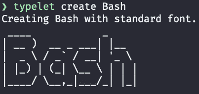
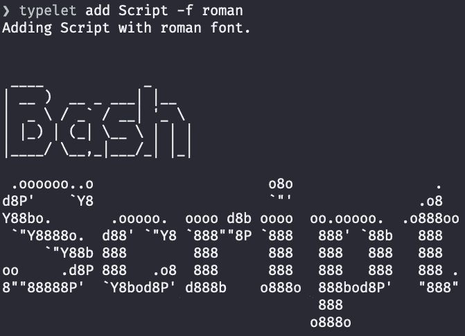
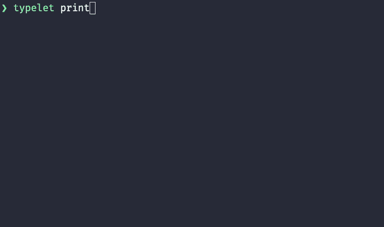
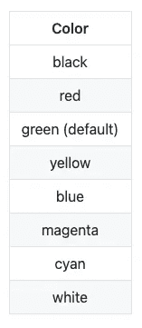
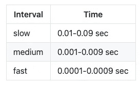
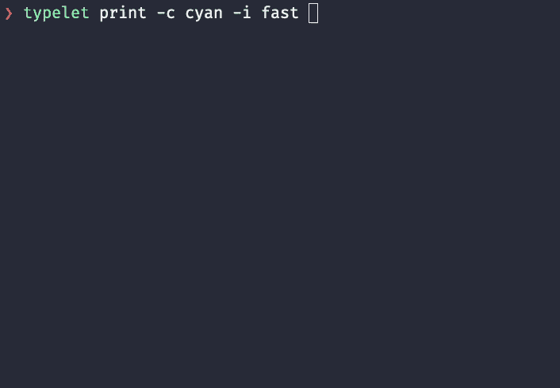
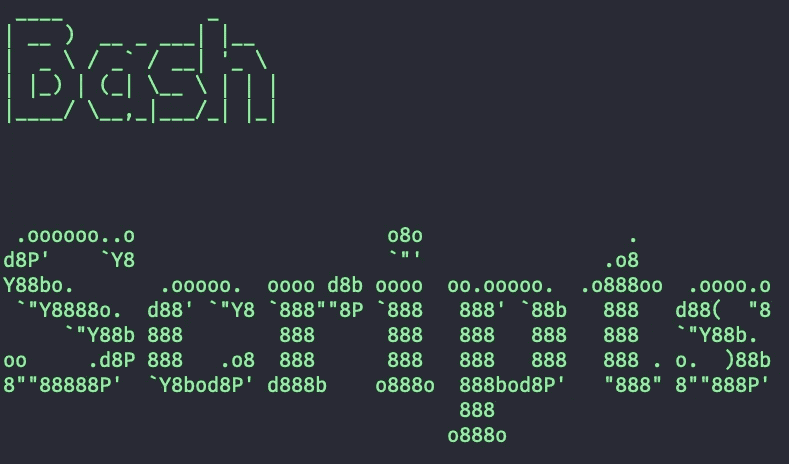
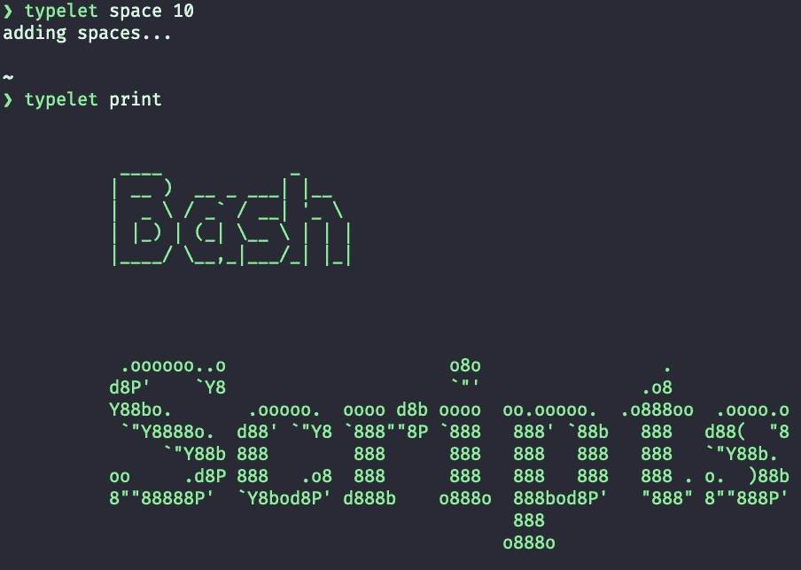
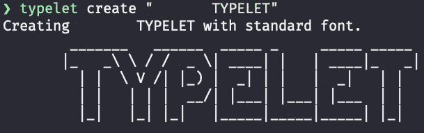
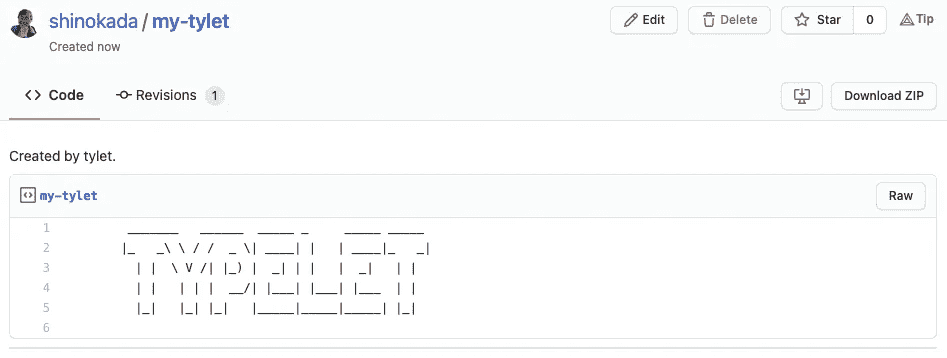

# 如何创建终端打字机效果

> 原文：<https://betterprogramming.pub/how-to-create-a-terminal-typewriter-effect-e31be3dcd359>

## [Typelet](https://github.com/shinokada/typelet) 允许你改变速度和颜色


卢卡·奥尼博尼在 [Unsplash](https://unsplash.com/?utm_source=unsplash&utm_medium=referral&utm_content=creditCopyText) 上拍摄的照片。作者 GIF。

```
**Table of Contents**
· [Introduction](#43e2)
· [Requirement](#7011)
· [Installation](#8f8d)
· [Creating a Word](#3477)
· [Adding Words](#f8fb)
· [Let’s Check What’s in the File](#4ea1)
· [Print](#9496)
  ∘ [Colors](#a4e9)
  ∘ [Speed/interval](#ac3e)
· [Empty Line](#da73)
· [Spaces](#febd)
· [Saving to a Gist](#9298)
· [Saving From a Gist](#7892)
· [How To Add Fonts](#e872)
· [Conclusion](#c69e)
· [Resources](#a43d)
```

# 介绍

[FIGlet 用不同的字体从你的文本中创建大的 ASCII 字母](https://towardsdatascience.com/the-ultimate-guide-to-your-terminal-makeover-e11f9b87ac99#0918)。我想在我的终端上打印出不同颜色和速度的打字机效果。为了解决这个问题，我创建了一个名为 [Typelet](https://github.com/shinokada/typelet) 的 Bash 脚本。

Typelet 实现了以上所有功能，甚至更多。

# 要求

Typelet 使用[figure](http://www.figlet.org/)t 创建信件，使用 [GitHub CLI](https://cli.github.com/) 将文件保存到 gist。

如果你是 Mac/Linux 用户，可以使用`brew`:

```
brew install figlet
```

## Figlet 字体

Figlet 根据系统安装不同的字体。安装 Figlet 后，找出您有哪些字体:

```
showfigfonts
```

请参见后面部分如何添加字体。

# 安装 Typelet

## [牛逼的包经理](https://medium.com/mkdir-awesome/a-new-simple-package-manager-for-script-languages-a1228fd0972a)

```
awesome install shinokada/typelet
```

## 家酿/Linuxbrew

```
brew tap shinokada/typelet
brew install typelet
```

## Debian/Ubuntu

你可以从[发布页面下载一个 Debian 包。](https://github.com/shinokada/typelet/releases)

```
sudo apt install ./typelet_XXXXXX_all.deb
```

你需要用你下载的版本改变`XXXXXX`。

# 创造一个词

第一步是使用`create`子命令创建一个单词:

```
typelet create Bash
```



typelet -c Bash 的输出。图片由作者提供。

默认字体是标准字体，但您可以使用`-f`或`--font`选项更改为任何字体。查看 [Figlet 示例网站](http://www.figlet.org/examples.html)上可用的字体。

```
typelet create Bash -f roman
```

记住`create`子命令会覆盖文件。

# 添加单词

接下来，我们来补充更多的单词。您可以使用`add`子命令添加一个单词(Linux 用户需要安装罗马字体):

```
typelet add Scripts -f roman
```



typelet add 脚本的输出-f roman。图片由作者提供。

你想加多少字都可以。

# 让我们看看文件里有什么

Typelet 将内容保存在`/tmp/typelet-file`中，您可以使用`read`子命令读取该文件:

```
typelet read
```

这将产生与前一幅图像完全相同的输出。

# 打印

您可以使用`print`子命令以默认设置打印。

颜色会是绿色，速度会是中等。

```
typelet print
```



铅字打印机的输出。图片由作者提供。

## 颜色；色彩；色调

要改变颜色，使用`-c`或`--color`选项，选择下表中的一种颜色:



打印命令的颜色。图片由作者提供。

## 速度/间隔

要改变速度/间隔，使用`-i`或`—-interval`选项。请使用慢速、中速或快速。



区间表。图片由作者提供。

让我们用青色和最快的速度打印:

```
typelet print -c cyan -i fast
```



快速打印输出。图片由作者提供。

# 空行

并非所有字体都添加相同的空行。使用`-e`或`--empty`选项添加一条线。您可以在单词的开头、结尾和后面添加空行。

```
typelet empty
```



使用 typelet empty 添加空行。图片由作者提供。

在上面的图片中，我在 Bash 后面添加了两行空行。

# 间隔

使用`-s`标志在所有行前添加空格。

```
typlet space 10
```



在所有行中添加十个空格后的输出。图片由作者提供。

如果您想要在单词/行前添加空格，请使用引号:

```
typelet create “      Typelet”
```



在单词前添加空格。图片由作者提供。

# 保留要点

使用`gist`选项将文件保存到要点:

```
typelet gist
```

这将打开浏览器并显示您的要点:



由铅字摘要创建的摘要。图片由作者提供。

# 从要点中拯救

使用`url`选项从 URL 提取并保存到本地文件:

```
typelet url [https://gist.github.com/shinokada/273855373667eb1bdee86e5efbfa91cc](https://gist.github.com/shinokada/4ad68465bf2aa07f3bab2cade11bd92f)
```

# 如何添加字体

有许多 Figlet 字体，但如果你愿意，你可以从 Figlet 字体网站或 [xero 的资源库](https://github.com/xero/figlet-fonts)添加新字体。

确保以小写保存文件名。

## 恰当的

如果用`sudo apt install figlet`命令安装 Figlet，字体文件保存在`/usr/share/figlet/`或`/usr/share/figlet/fonts/`中。

## 公司自产自用

如果您在 ARM64 Mac 上使用`brew`安装了 Figlet，请在`/opt/homebrew/Cellar/figlet/2.2.5/share/figlet/fonts`目录中安装文件。对于 x86_64 Mac，将文件安装在`/usr/local/Cellar/figlet/2.2.5/share/figlet/fonts`目录下。

# 结论

如果你在博客上使用[字体](https://github.com/shinokada/typelet)，请在评论区添加一个链接。我希望你喜欢使用它。作为奖励，您可以手动将 [ASCII art](https://www.asciiart.eu/) 添加到`/tmp/typelet-file`中，以便在您的终端上打印出来。如果你想创建自己的 ASCII 艺术，请阅读由 [Javascript Jeep 提供的“](https://medium.com/u/f9ffc26e7e69?source=post_page-----e31be3dcd359--------------------------------) [Python ASCII 艺术生成器](https://levelup.gitconnected.com/python-ascii-art-generator-60ba9eb559d7)🚙💨。

*如果您喜欢我的文章并希望收到我的简讯，请* [*注册*](http://newsletter.codewithshin.com/) *。*


jgs 的加菲猫形象。图片由作者提供。

**通过** [**成为**](https://blog.codewithshin.com/membership) **会员，可以完全访问媒体上的每一个故事。**


[https://blog.codewithshin.com/subscribe](https://blog.codewithshin.com/subscribe)

# 资源

*   [https://github.com/xero/figlet-fonts](https://github.com/xero/figlet-fonts)
*   [https://lachlanarthur.github.io/Braille-ASCII-Art/](https://lachlanarthur.github.io/Braille-ASCII-Art/)
*   [https://www.asciiart.eu/](https://www.asciiart.eu/)