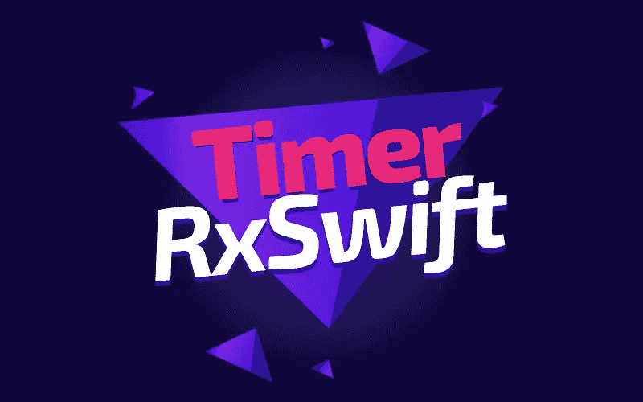
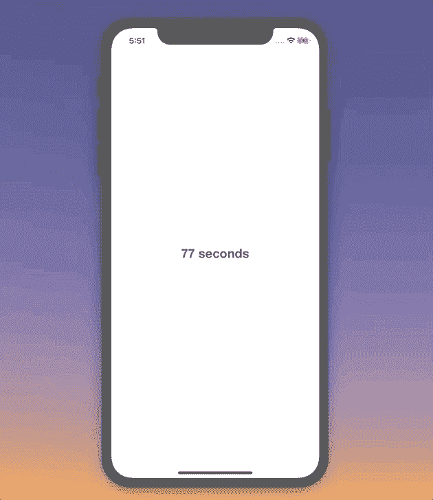

# 如何在 RxSwift 中创建定时器

> 原文：<https://betterprogramming.pub/how-to-create-a-timer-in-rxswift-578bf8712678>

## 并将其绑定到用户界面元素

今天，我们将学习如何在 [RxSwift](https://github.com/ReactiveX/RxSwift) 中轻松创建一个定时器，并将其绑定到屏幕上的一个`UILabel`。

该项目的源代码可以在文章的底部找到。

# 我们开始吧

在 RxSwift 中创建计时器非常简单。在我们的`ViewController`中有以下初始结构:

我们将使用`sourceObservable`属性来创建我们的计时器。让我们将下面的内容添加到`viewDidLoad()`方法中:

我们使用`.interval`操作符创建一个可观察的序列，在每个周期后产生一个值。在我们的例子中，周期是一秒。

现在，如果我们订阅此`Observable`，我们将看到控制台中从零开始打印的值。假设我们想从一开始计数。我们添加了`.map`操作符来实现我们想要的:

现在我们的目标是开始在我们之前创建的`label`属性上显示计时器的值。让我们再次使用一个`.map`操作符将每个接收到的`Int`值转换成一个`String`，并将结果字符串绑定到`label`:

结果，我们在屏幕上显示了计时器的值:

让我们不要忘记在`viewWillDisappear()`方法中处理可观察值并停止我们的计时器:

太好了！我们已经成功地在 RxSwift 中实现了一个定时器，并将其绑定到一个用户界面元素。

# 资源

该项目的源代码可以在 GitHub 上找到:

 [## zafarivaev/RxSwiftTimer

### 使用 RxSwift 实现的简单定时器应用程序。为一篇中等文章而写。- zafarivaev/RxSwiftTimer

github.com](https://github.com/zafarivaev/RxSwiftTimer) 

感谢阅读！