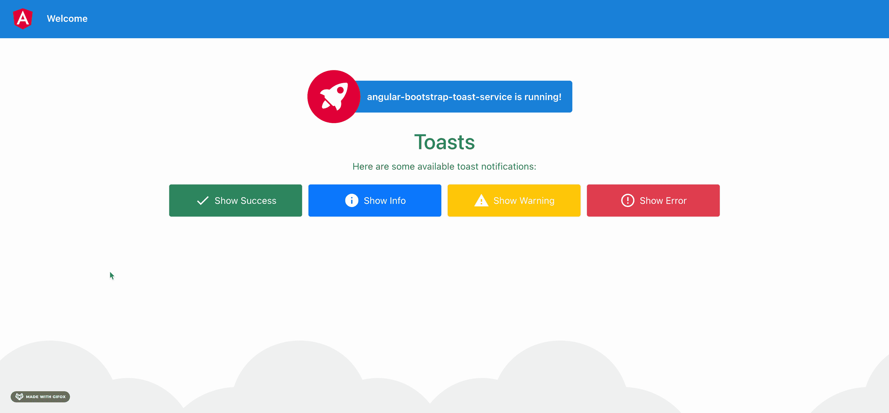

# 如何使用 Angular 14 和 Bootstrap 5 创建 Toast 服务

> 原文：<https://betterprogramming.pub/how-to-create-a-toast-service-using-angular-13-and-bootstrap-5-494e5c66627>

## 引入通用的通知模式来通知您的用户

Angular 14 烤面包机，带 Bootstrap 5 toast 通知(最初来自 [Pixabay](https://pixabay.com/images/id-1077984/) ，在 [Pixabay 许可](https://pixabay.com/service/license/)下)

在大多数 web 应用程序中，都需要向用户显示某种通知。一种常见的 UX 模式是所谓的 toast 通知。

这种情况下的祝酒词可以简单地解释为在屏幕上某处弹出的一条信息。在这篇文章中，我们想看看如何创建一个使用 Angular 14 发送 [Bootstrap 5 toast 通知](https://getbootstrap.com/docs/5.0/components/toasts/)的服务。

# 烤面包机的结构

我们的角形烤面包机由以下三部分组成:

*   这提供了敬酒的方法
*   负责管理和堆叠当前的祝酒词
*   `ToastComponent`呈现单个敬酒通知

[角形烤面包机应用预览](https://angular-toast-service.herokuapp.com/)

# 创建 Toast 服务

首先，我们需要创建 toast 服务，稍后我们可以从应用程序中调用它来发送不同类型的 toast。

对于服务，我们使用 RxJS 来处理使用 Observables 的 toast 事件。

# 构建烤面包机组件

烤面包机组件负责管理和堆叠面包片。为此，烤面包机订阅了我们之前创建的烤面包服务。

在组件的模板中，我们遍历所有当前的 toast 通知，显示它们相互堆叠在一起。

toaster 组件应该包含在 Angular 应用程序的`app.component.html`中，以确保 toast 事件触发时总是显示 toast 通知。

# 定义并设计祝酒词

最后但同样重要的是，我们需要照顾好每个祝酒者自己。单个 toast 主要定义显示和隐藏通知的方法。在这一点上，一个小的特别之处是错误祝酒词，因为我们不会让它们像其他祝酒词一样自动消失。

关于祝酒词的风格，你也可以参考 [Bootstrap 5 祝酒词文档](https://getbootstrap.com/docs/5.0/components/toasts/)。否则，您也可以在下面找到完整源代码的链接。

GitHub 上有完整的源代码:

 [## GitHub-svierk/angular-bootstrap-toast-service:🍞发送自举 5 的 Angular 14 项目…

### 该项目的想法是创建一个服务，允许显示不同类型的 toast 通知给…

github.com](https://github.com/svierk/angular-bootstrap-toast-service) 

# 在 Vercel 上部署应用程序

要查看正在运行的 toaster 应用程序，在 Vercel 上部署了一个实时版本:

[https://angular-bootstrap-toast-service.vercel.app/](https://angular-bootstrap-toast-service.vercel.app/)