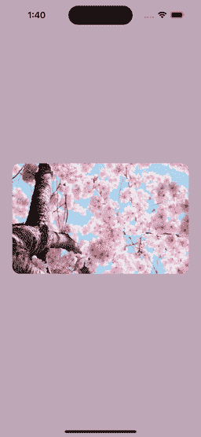
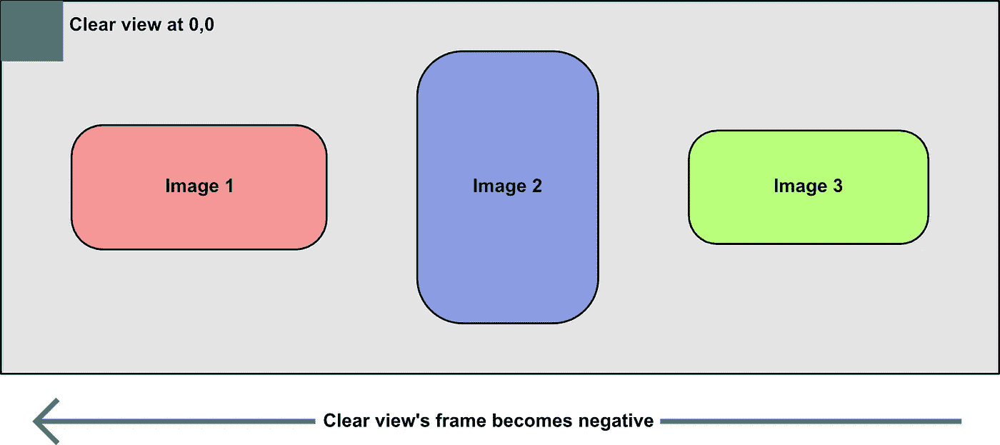

# 如何在 SwiftUI 中创建颜色渐变的过渡

> 原文：<https://betterprogramming.pub/how-to-create-a-transition-that-fades-between-colors-in-swiftui-6d6e275b7d62>

## 享受这一步一步的指南来创建这个有趣的项目


由 [Zalfa Imani](https://unsplash.com/@zalfaimani?utm_source=unsplash&utm_medium=referral&utm_content=creditCopyText) 在 [Unsplash](https://unsplash.com/s/photos/gallery?utm_source=unsplash&utm_medium=referral&utm_content=creditCopyText) 拍摄的照片

我喜欢当图像过渡时使用平均颜色背景的应用程序的外观。这项漂亮的技术可以通过计算给定图像的平均颜色来实现。此示例是使用 Unsplash 中的图像创建的，以创建所需的效果:



图库应用程序

项目的最终版本可以在 [GitHub](https://github.com/scottandrew/FadingScollerDemo.git) 上找到。

# 创建 Xcode 项目

1.  创建一个新的 SwifUI 项目
2.  将`ContentView`重命名为`GalleryView`。
3.  将`ContentView_Previews`更名为`GalleryView_Previews`。
4.  添加来自[https://github.com/siteline/SwiftUI-Introspect.git](https://github.com/siteline/SwiftUI-Introspect.git)的 SwiftUI-Introspect 包
5.  将图像添加到项目资源中。示例项目中的图像名为`Image 1, Image 2, Image 3,` 和 `Image 4`。

SwiftUI-Introspect 库将用于访问位于`Scrollview`之后的`UIScrollView`，因此可以将`isPagingEnabled`标志设置为`true`。

# 平均色码

平均色码不是原创。这是来自[https://christianselig.com/2021/04/efficient-average-color/](https://christianselig.com/2021/04/efficient-average-color/)的代码。这段代码快速高效。作者对他为什么创建这个代码有一个很好的解释。

代码在一个`UIImage`类别中，这个类别允许直接在图像上调用它。例如:`image.findAverageColor()`

# 创建 ImageEntry 模型

需要创建一个`ImageEntry.swift`文件。该文件将包含一个小结构来保存一个`UIImage`、一个 UUID 和平均颜色。采用图像名称的简单构造函数将完成所有工作。

做出的一个设计决策是将数据保存为`UIKit`对象。这使得代码不必在 SwiftUI 和 UIKit 之间来回切换，直到有必要的时候。

# 开始构建画廊视图

1.  创建一个显示在图库中的`ImageEntry`项目数组。
2.  将`ScrollView`包裹在`GeometryReader.`内`GeometryReader`将用于设置图像尺寸。稍后还需要视图的宽度来计算背景颜色。
3.  将`ScrollView`设为水平，使其左右滚动。
4.  在`LazyHStack`中布局图像。
5.  从当前`ImageEntry`中的`UIImage`创建`Image`。
6.  使`Image`适合屏幕，缩进 24 个带圆角的单元。
7.  使`ScrollView`分页。
8.  让`GeometryView`忽略屏幕的安全区域，这样整个屏幕用于布局。当添加彩色背景时，这一点很重要。

现在已经创建了一个没有背景的基本图库。画廊可以滚动，图像适合屏幕，保持其长宽比。

# 跟踪滚动视图的位置

转换需要知道`ScrollView`的偏移量。首先，必须创建自定义视图首选项来存储视图的偏移。

创建一个`ScrollViewOffsetPreferenceKey.swift`文件。

进入`reduce`时`value`已经设定。为 0 的`nextValue`需要加到`value`上。这将导致密钥发送更新消息。

# 跟踪滚动视图偏移量

为了跟踪`ScrollView`的偏移，需要向`ScrollView`添加一个空视图。当偏移量改变时，它需要通知用户界面。

1.  添加一个名为 scroll 的坐标空间，以跟踪相对于滚动视图的位置。(第 20 行)
2.  将`LazyHStack`包裹在`ZStack`中，这样视图可以在`ScrollView`中分层。(第二行)
3.  在`LazyHStack`的下面，增加了一个`GeometryReader`，它有一个清晰的彩色视图。(第 3-6 行)
4.  每次重绘时，获取清晰视图相对于滚动(`ScrollView`)坐标空间的位置，并将其存储在清晰视图的`ScrollViewPreferenceKey`中。(第 5-6 行)
5.  当在`ScrollViewPreferenceKey`上设置值时，调用`onPreferenceChange`修改器。该值是透明颜色视图的最新偏移量。(第 24–26 行)

当应用程序运行时，滚动视图的偏移量可以随着图库的滑动而在调试控制台中改变。

# 为什么会这样？



在滚动视图中，在`0,0`创建了一个清晰的视图。当用户向左滑动时，框架将改变并变为负值。清晰视图的框架相对于滚动视图的框架。由于清晰视图位于滚动视图的原点，偏移将与`UIScrollView.contentOffset`的结果匹配，但为负值。

# 颜色的延伸

从设计的角度来看，告诉一种颜色在它自己和另一种颜色之间进行插值是有意义的。因此，代码被放入`UIColor`的扩展中。

1.  `getComponents`是从`UIColor`中获取颜色分量的辅助函数。代码支持 RGBA 或带有 alpha 的白色值。
2.  `interpolate`函数返回源(自身)和目标颜色之间的颜色。

计算采用源颜色的剩余值，并将其添加到下一页的颜色量中。例如，如果源颜色为`red component = 1.0`，目标颜色为`red component = 0.5`，滚动 25%到下一页。计算如下:

```
newRed = (1.0–0.25) * 1.0 + 0.25 * 0.5newRed = 0.76 * 1.0 + 0.25 * 0.5newRed = 0.76 + 0.125newRed = 0.885
```

# 后台计算器

后台计算器是奇迹发生的地方。它需要两件事才能起作用:

1.  视图的宽度。这是应用程序中的屏幕。
2.  平均颜色阵列与图像的顺序相同。

计算器将是一个可观察的对象，发布计算的背景颜色。

1.  `color`保存上次计算的背景色的发布者
2.  `width`我们视图的宽度，用于页码计算
3.  `colors`平均颜色列表
4.  当`colors`被设置时，`color`发布者被设置为`colors`数组中的第一种颜色
5.  `calculateBackground(position:)`获取偏移量并计算当前背景颜色

# 仔细看看`calculateBackground(position:)`

大多数神奇的事情都发生在`calculateBackground(position:)`函数中。

1.  `fractionalPage`将当前页面与页面之间的分数偏移。例如，0.5 表示第 0 页和第 1 页之间的中点。
2.  `page`从`fractionalPage`双精度值创建一个整数。这将作为当前页面颜色的索引。
3.  `fromColor`是当前页面的背景色。
4.  如果`fractionalPage`在第一页和最后一页之间，计算新的背景颜色。如果没有，返回当前页面的颜色。例如，如果`fractionalPage`为 1.5，并且有两个页面，则在索引 2 处没有页面。这意味着不需要计算；背景将是当前页面的背景，即 1。

要计算页面之间的颜色:

1.  计算下一页
2.  得到页面之间的百分比，是`fractionalPage`的小数部分。
3.  调用`interpolate`获取当前页面和下一页面之间的颜色。

# 把所有的放在一起

为了将这些放在一起，需要将三样东西添加到`GalleryView`文件中。

1.  添加一个有状态的对象来保存`BackgroundCalculator`的实例。随着计算器发布的颜色更新，视图将重新绘制。(第 9 行)
2.  将`ScrollView`包裹在`ZStack`中(第 13 行)
3.  在`ScrollView`后面增加一个`Rectangle`，其前景色是`BackgroundCalculator`的计算色。(第 14 行)
4.  当`ScrollViewOffsetPrefrenceKey`的值改变时，根据`ScrollView`的当前位置计算新的背景颜色。新位置需要乘以-1。(第 39 行)
5.  当`GalleryView`出现时，需要将`GalleryView`的宽度和平均颜色列表传递给`BackgroundCalculator`。(第 43–44 行)

此时运行项目将在图像后面显示一个彩色背景，在颜色之间平滑过渡。

# 结论

我喜欢这种转变。我认为它赋予了观点间无聊的转换以个性。我希望你也喜欢这个，并在你的应用中找到它的用处。完成的项目可以在 [GitHub](https://github.com/scottandrew/FadingScollerDemo.git) 上找到。

如果你喜欢这篇文章，请留下评论。