# 如何使用 Python 和 Zapier 创建一个 Twitter 机器人

> 原文：<https://betterprogramming.pub/how-to-create-a-twitter-bot-using-python-and-zapier-4f855093069f>

## 使用 Python 和 Zapier 制作一个每小时发一个笑话的推特机器人

[亚历山大·奈特](https://unsplash.com/@agk42?utm_source=unsplash&utm_medium=referral&utm_content=creditCopyText)在 [Unsplash](https://unsplash.com/s/photos/bot?utm_source=unsplash&utm_medium=referral&utm_content=creditCopyText) 上拍照。

在本文中，我们将构建这个 Twitter 机器人。

Zapier 是一个工具，它可以让你通过集成各种应用程序来自动化任务和创建工作流。以下是您可以使用 Zapier 做的一些事情:

*   制作一个价格追踪器，当价格低于 x 美元时会通知你。
*   当您收到来自特定电子邮件 ID 的电子邮件时，在懈怠/不和谐中获得提醒。
*   每当某个 RSS 源更新时，就在推特上发布更新。
*   还有更多。

对于它们中的大多数，您不需要用 Python 或 JavaScript 编码。Zapier 提供的内置应用绰绰有余。但是，如果您愿意，也可以执行小的 Python 脚本。在本教程中，我们将使用 Python 和 Zapier。

在继续之前，让我们讨论一下 Zapier 对 Python 支持的一些限制:

1.  对于免费版本，我们只能运行采用 HTTP 客户端的短脚本
2.  `StoreClient`:内置实用程序[，用于在 Zap 运行之间存储和检索数据](https://zapier.com/help/create/code-webhooks/store-data-from-code-steps-with-storeclient)

*   我们将建造什么？
*   我们将构建一个 Twitter 机器人，它将使用官方笑话 API 获取随机笑话。我们还将添加一个功能，让用户指定每条推文中包含的标签列表。

# 这个机器人会每小时在推特上发布一个笑话和标签。

构建机器人的步骤

1.向 API 发出请求的 Python 脚本

# 我们将使用请求库并向 Joke API 发出 GET 请求。下面是发出请求的代码片段:

## 发出请求的代码

笑话是以问答的形式出现的，所以我们需要在发布之前格式化文本。我们还需要在末尾添加标签。

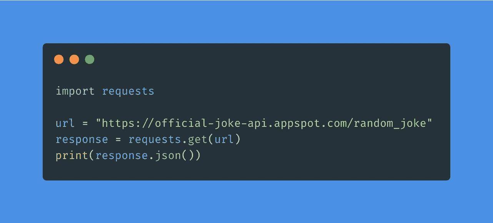

格式化推文

我们将创建一个空列表来存储问题、答案、标签和一些点字符。

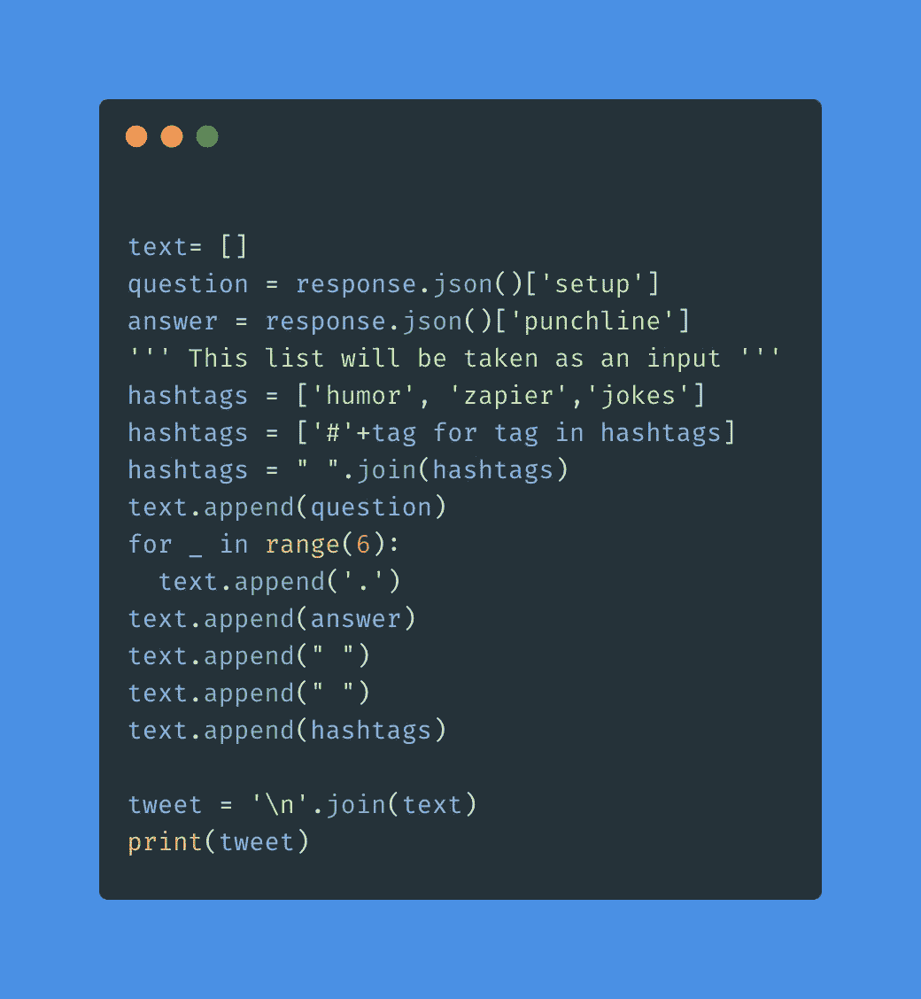

`join()`方法将用于创建最终的 tweet。

*   在使用 hashtags 之前，我们需要添加 hash 字符并创建一个包含所有 hashtags 的字符串。
*   以下是一条推文示例:
*   示例推文

现在我们已经完成了推文，我们可以进入下一步。

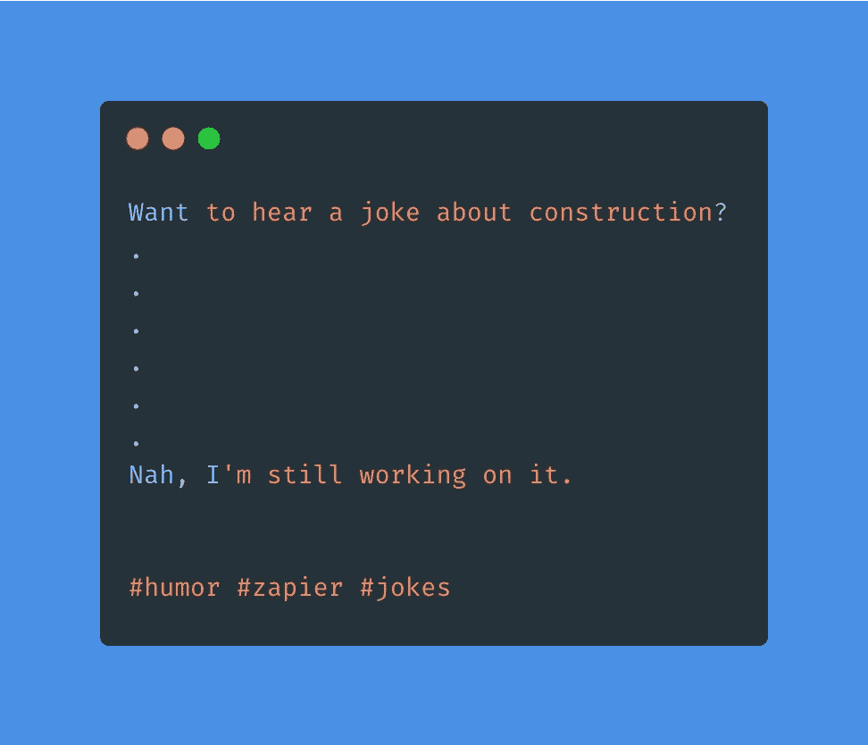

2.设置 Zapier 帐户并创建 Zap

在 Zapier 中创建的应用程序被称为 Zaps。

## 去[扎皮尔的网站](https://zapier.com/)免费注册。

注册后，登录您的帐户。

*   点击左侧边栏中的“Make A Zap”。
*   3.设置一个触发器
*   每次电击都需要一个触发器。触发器基本上是运行 Zap 的事件。一些可能的触发因素是:

## 接收电子邮件

在 GitHub 上接收 PR

*   RSS 源正在更新
*   在空闲时间接收消息
*   在 WooCommerce 上接收订单
*   时间表(例如每小时、每天、每周、每月)
*   由于我们想每天发推文，我们将选择“日程安排”触发器并选择“每天”这是右栏的第一项:
*   触发器屏幕截图

对于“触发事件”选项，选择“每小时”，然后单击“继续”

接下来，您可以选择是否希望在周末运行触发器。

*   单击“继续”后，您的触发器应该已创建。
*   您可以点击“测试触发器”来运行触发器。
*   运行触发器后的成功消息
*   如果您的触发器成功运行，您应该会看到上面的消息。

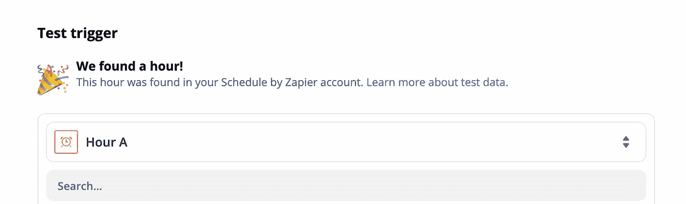

4.添加 Python 脚本

单击“+”按钮或“添加操作”按钮:

## 动作截图

*   搜索“代码”并选择“扎皮尔代码”在截图中，它是搜索结果中的第一项。

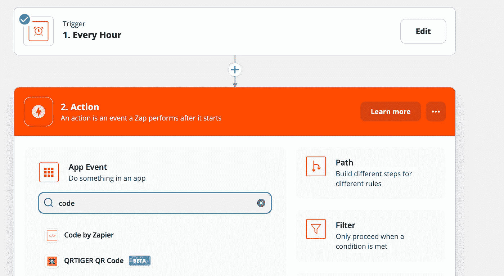

对于“动作事件”选项，选择“运行 Python”

*   Zapier 的代码截图
*   要输入数据，点击“输入数据”部分的“+”按钮。要访问输入，我们只需要访问`input_data`字典。所有的值都存储为字符串(即键 hashtags 的值实际上存储为字符串而不是列表)。

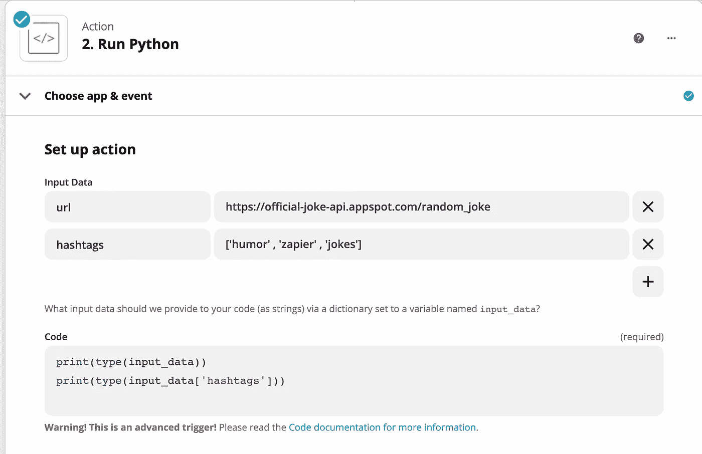

要将它们转换成列表，我们可以使用`eval()`函数。这同样适用于字典值。

点击“继续”，然后点击“测试和检查”这将运行代码。

现在，我们可以复制之前创建的 Python 脚本，并做一些修改:

*   整个 Python 脚本

要返回的输出或数据必须存储在名为`output`的字典中。

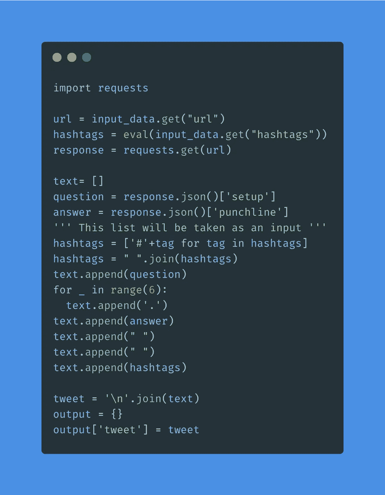

请记住，每当您想要运行代码时，请单击“测试和审查”或“重新测试操作”。下面是执行脚本的结果:

脚本的成功运行

如你所见，推文正在显示。这个输出字典将用于下一个操作，即“Twitter 应用程序”来发布笑话。

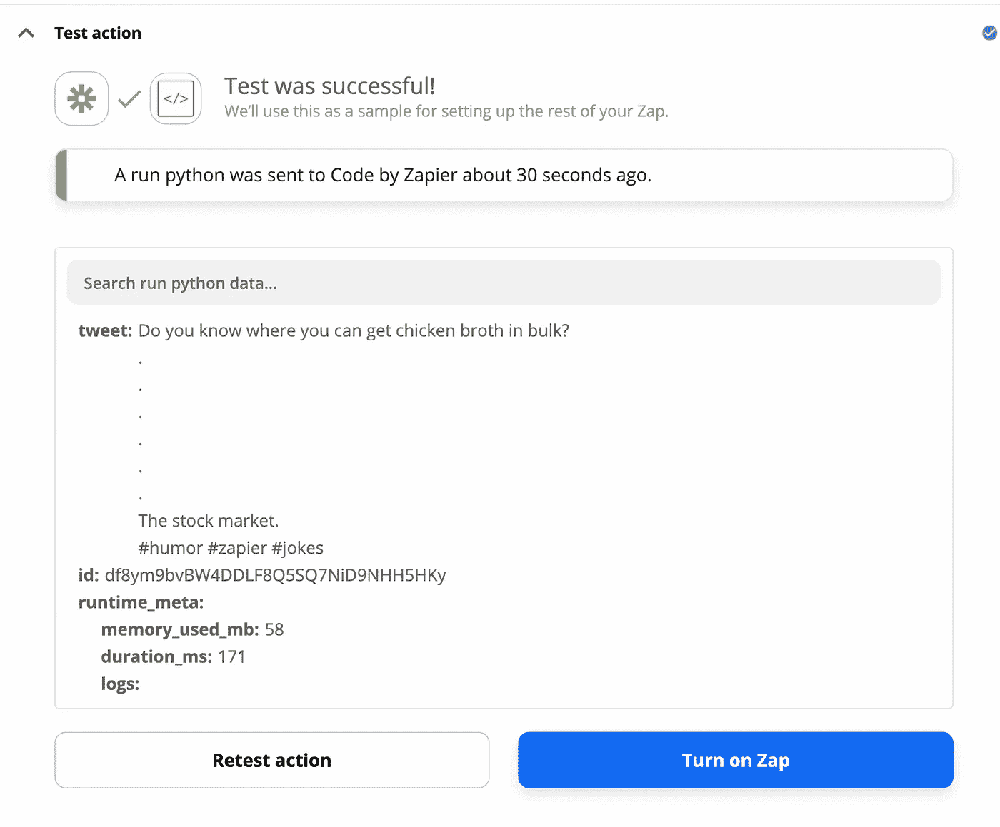

5.添加 Twitter 应用程序

单击“+”按钮并添加新操作:

## 选择 Twitter 应用程序

搜索“Twitter”并选择 Twitter 应用程序。

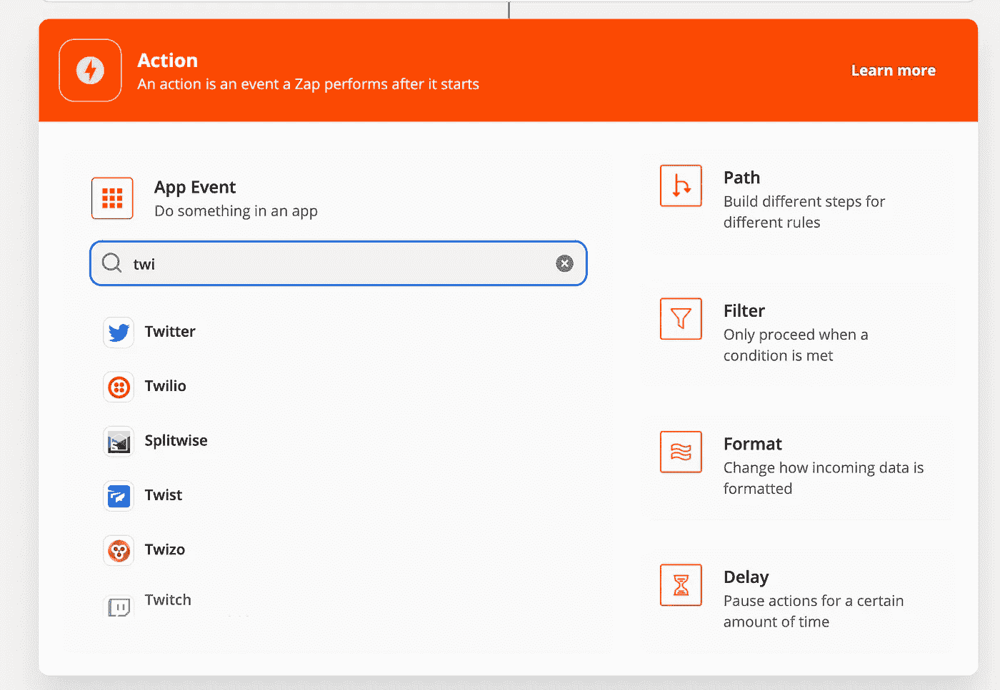

对于“行动事件”，选择“创建推文”:

Twitter 应用程序

你必须连接你的 Twitter 账户并授权给 Zapier。

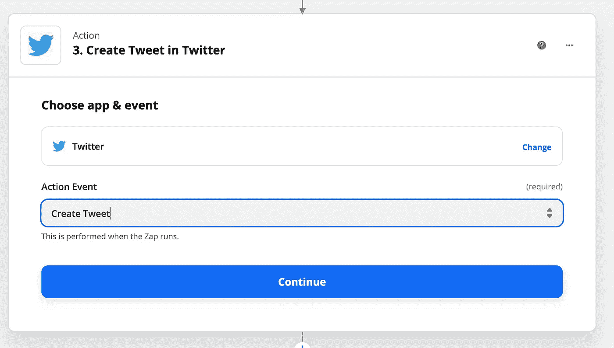

授权 Zapier 后，您应该会看到以下屏幕:

推特应用截图

选择“运行 Python”，然后选择“Tweet”这是我们在 Python 脚本中创建的 tweet 变量。

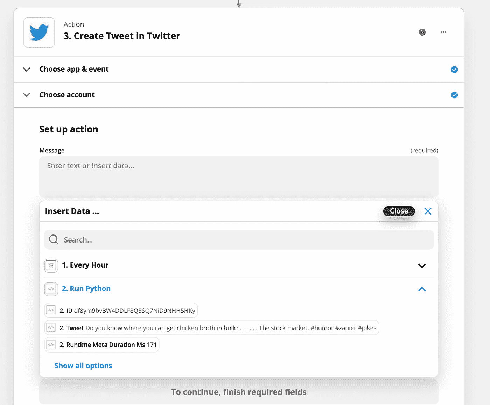

完成后，点击“继续”并测试操作:

应用程序的成功运行

如果你的测试成功了，你的推特账户应该会发一个笑话。

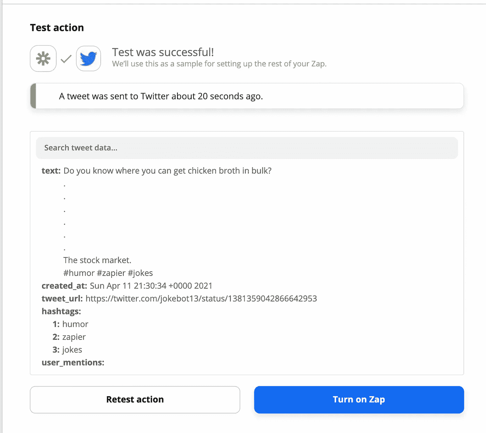

现在，你可以点击“打开 Zap ”,你的 Zap 应该正在运行。

结论

恭喜你！你的 Zap 现在正在运行，你的 Twitter 账户将每小时发一条笑话。

# 您还可以做其他一些事情:

不要使用 API，而是使用一些 RSS 提要。

建立一个刮刀，从一些网站上刮笑话。

*   添加一个检查，以确保推文不会超过 Twitter 的字数限制。
*   我最近开始了一个修改版的#100daysofcode 挑战。我的目标是每天写[与 Python、数据科学或编程相关的内容](https://medium.com/daily-programming-tips)。
*   *最初发表于*[T5【https://www.realpythonproject.com】](https://www.realpythonproject.com/how-to-create-a-twitter-bot-using-python-and-zapier/)*。*

I recently started a modified version of the #100daysofcode challenge. I aim to write [content related to Python, data science, or programming every day](https://medium.com/daily-programming-tips).

*Originally published at* [*https://www.realpythonproject.com*](https://www.realpythonproject.com/how-to-create-a-twitter-bot-using-python-and-zapier/)*.*