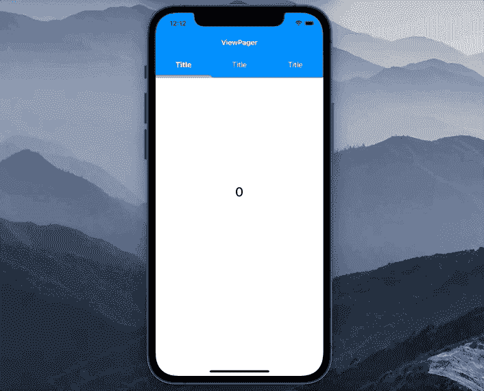
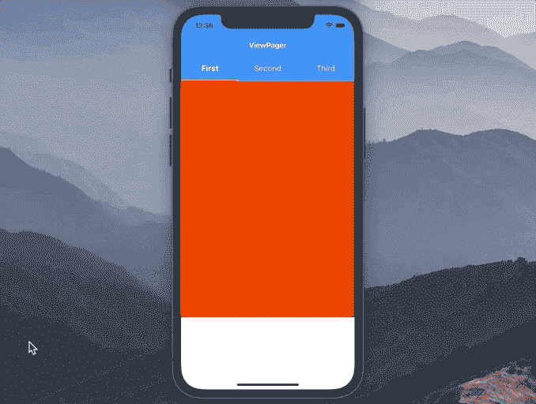

# 如何在 Swift 5 中创建视图页面

> 原文：<https://betterprogramming.pub/how-to-create-a-view-pager-in-swift-5-b8f35a03d968>

## 你不需要一个第三方库

照片由[米恰伊尔·萨皮顿](https://unsplash.com/@sapiton?utm_source=medium&utm_medium=referral)在 [Unsplash](https://unsplash.com?utm_source=medium&utm_medium=referral) 上拍摄

在本文中，我们将学习如何设计和实现一个视图分页器——一个许多应用程序都使用的 UI 元素。在本教程结束时，我们将会看到以下内容:

我们还将使其可重用和可组合，以便您可以在顶部使用或不使用选项卡式视图。

该项目的源代码可以在文章的底部找到。

# 我们开始吧

如果我们将`ViewPager`组件分解成更小的部分，我们会看到它由两部分组成:顶部的标签视图和下面的分页视图。理想情况下，我们要么同时使用这两个元素，要么只涉及分页视图组件。为此，我们将有三个主要类别:

*   `ViewPager`:将`TabbedView`和`PagedView`结合在一起，使它们一起工作
*   `TabbedView`:顶部元素，一次只允许选择一个标签。
*   `PagedView`:底部元素，有“页面”，我们可以滚动。

# 页面视图

我们从创建一个简单的`UIView`子类及其委托协议开始:

稍后，当用户从一个页面滚动到另一个页面时，我们将使用`PagedViewDelegate`向其他类发送通知。

在后台，`PagedView`将使用`UICollectionView`实现分页。因此，让我们创建`collectionView`属性，并遵循`UICollectionViewDelegateFlowLayout`和`UICollectionViewDataSource`协议:

在这里，我们准备做以下工作:

1.  在`numbersOfItemsInSection`方法中，我们将返回`PagedView`中的总页数。
2.  在`cellForItemAt`方法中，我们将返回一个代表特定页面的`UICollectionViewCell`。
3.  `sizeForItemAt`方法允许我们设置每个页面的大小。页面将覆盖所有可用空间。
4.  我们不需要页面之间的间距，所以我们在`minimumLineSpacingForSectionAt`布局委托方法中返回 0。

现在我们需要实现实际的`UICollectionView`并将其添加到视图层次结构中:

一步一步，我们实现了这一目标:

1.  用水平滚动方向初始化一个`UICollectionViewFlowLayout`。
2.  隐藏集合视图的水平滚动指示器并启用分页。
3.  链接集合视图的委托和数据源。
4.  将`translatesAutoresizingMaskIntoConstraints`设置为`false`，因为我们正在以编程方式创建 UI。
5.  在`setupUI()`方法中，我们将`collectionView`添加到屏幕上，并使其覆盖所有可用空间。我们也不要忘记在初始化器中调用这个方法。

现在让我们开始实现代表每个页面的`PageCollectionViewCell`:

1.  我们创建了一个代表页面内容的`view`属性。
2.  我们让`view`填充整个单元格。

现在让我们更新`PagedView.swift`文件:

我们调整了以下内容:

1.  将`pages`参数添加到初始化程序中。
2.  创建`pages`属性。设置后，重新加载集合视图。
3.  在集合视图中注册先前创建的`PageCollectionViewCell`。
4.  返回`numberOfItemsInSection`数据源方法中`pages`的计数。另外，初始化一个`PageCollectionViewCell`，给它提供一个页面，在`cellForItemAt`数据源方法内部返回。

我们几乎完成了`PagedView`组件。剩下的就是添加一个动作来以编程方式移动页面，并在页面移动时通知其委托。我们将通过添加`moveToPage(at index:)`和`scrollViewDidEndDecelerating`方法来实现这一点:

1.  当调用`moveToPage(at index:)`时，我们将集合视图滚动到目标页面。
2.  一旦用户完成了页面滚动，获取页面索引并通知`PagedView`的代理。如前所述，代理可以是另一个视图或视图控制器。当我们想单独使用`PagedView`时，我们通常会让视图控制器成为代理。当使用一个尚未创建的包含`PagedView`和标签视图的`ViewPager`时，`ViewPager`将作为`PagedView`的代理。

完成`PagedView`后，现在我们可以开始创建`TabbedView`组件，它包含选项卡，一次只能选择一个选项卡:

# 选项卡视图

我们首先创建一个`UIView`子类，如下所示:

在这里，我们实现了以下目标:

1.  我们添加了`TabbedViewDelegate`来在用户选择特定选项卡时发送通知。
2.  枚举`SizeConfiguration`可以指定标签的大小，或者让它们填满可用空间。当我们提供一个`.fillEqually` `SizeConfiguration`时，UI 会是这样的:

3.在初始化器中，我们设置了`sizeConfiguration`属性并启动了`setupUI()`方法。

4.属性将帮助我们跟踪所选择的选项卡。

5.就像我们在`PagedView`中做的一样，这里我们创建一个水平`UICollectionView`。

6.`setupUI()`方法将集合视图放在屏幕上，并使其填满可用空间。

下一个任务是实现一个代表选项卡的`UICollectionViewCell`。让我们创建一个新的`TabCollectionViewCell`类:

步骤如下:

1.  创建每个选项卡都需要符合的`TabItemProtocol`。当我们想要使用 TabbedView 时，我们必须为每个选项卡提供自定义视图。这个自定义视图需要实现`TabItemProtocol`的`onSelected()`和`onNotSelected()`方法。
2.  一旦设置了视图属性，我们就启动`setupUI()`方法。
3.  我们添加了一种为每个选项卡设置 insets 的方法。一旦设置了`contentInsets`属性，所有约束都会相应地更新。
4.  `setupUI()`方法将先前定义的`view`属性添加到屏幕上，并激活其约束。

太好了！现在我们需要通过实现`UICollectionViewDataSource`、`UICollectionViewDelegate`和`UICollectionViewDelegateFlowLayout`协议来更新`TabbedView.swift`文件:

变化如下:

1.  我们在初始化器中添加一个`[TabItemProtocol]`参数来设置标签。
2.  一旦设置了选项卡，我们就重新加载集合视图的数据，并根据`curentlySelectedIndex`属性选择一个选项卡。默认情况下，它等于 0，因此选择第一个选项卡。
3.  我们在集合视图中注册了`TabCollectionViewCell`。
4.  `moveToTab(at index:)`允许我们以编程方式选择一个期望的选项卡，并相应地更新状态。
5.  在布局的委托的`sizeForItemAt`方法中，我们查看提供的`sizeConfiguration`属性并设置每个选项卡的大小。
6.  `minimumLineSpacingForSectionAt`方法用于在我们需要的时候在每个标签之间放置间距。像以前一样，我们查看`sizeConfiguration`属性并返回必要的值。默认情况下，`spacing`等于 0。
7.  在`numberOfItemsInSection`方法中，我们简单地返回标签的数量。
8.  我们为每个`TabCollectionViewCell`提供了一个表示选项卡的视图。
9.  最后，我们通过`moveToTab(at index:)`方法调整状态变量来对选项卡上的点击做出反应。我们还通知代理用户移动到了特定的选项卡。

我们已经完成了`TabbedView`的实现。现在我们只需要让`PagedView`和`TabbedView`一起工作。为此，我们创建了一个新的类— `ViewPager`。

# 查看寻呼机

这个类看起来很简单，它的任务是让`PagedView`和`TabbedView`一起工作:

1.  我们提供了一个`TabbedView.SizeConfiguration`参数来为选项卡式视图注入大小配置。
2.  在`tabbedView`属性中，我们传递注入的大小配置。
3.  `setupUI()`方法将`TabbedView`放在上面，将`PagedView`放在下面。
4.  我们还遵循`TabbedViewDelegate`和`PagedViewDelegate`来接收任一组件被滚动时的通知。当用户选择一个选项卡时，我们以编程方式将`PagedView`移动到必要的页面。同样，当用户滚动页面时，我们选择相应的选项卡。

太好了！我们终于创造了一个可重复使用的`ViewPager`。现在是时候在视图控制器中使用它了。

# 用法示例

我们从一个空的`UIViewController`开始，上面显示一个“ViewPager”标题:

现在让我们创建一个`ViewPager`并将其添加到屏幕上，如下所示:

1.  我们用一个`.fillEqually`大小的配置初始化一个`ViewPager`。
2.  接下来，我们创建三个不同颜色的视图。它们代表我们的页面。
3.  我们添加了三个标签，标题分别为“第一”、“第二”和“第三”。我们还为视图页面提供了以前创建的页面。
4.  我们把`ViewPager`放在屏幕上，让它填充 70%的可用高度。

如果我们构建并运行该应用程序，我们将会看到我们想要实现的目标:

# 资源

源代码可在 [GitHub](https://github.com/zafarivaev/uikit-viewpager) 上获得。

# 包扎

希望这篇教程对你有用，感谢阅读！