# 如何使用“Make”和 AssemblyAI 创建语音控制的费用管理器

> 原文：<https://betterprogramming.pub/how-to-create-a-voice-controlled-expense-manager-using-make-and-assemblyai-c2b32bc76eef>

## 创建自己的简单费用管理器应用程序的简要指南


我一直在寻找一个简单的费用管理应用程序，我可以和我的妻子一起收集我们的日常开支。这个应用程序应该是一个语音应用程序，解析我的声音，并在电子表格或其他东西中添加一行。因为我永远找不到这样的东西，所以我决定开发一个自己的应用程序。

# 应用程序

我和我的妻子需要一个具有以下功能的应用程序:

*   输入必须是语音音频，像“30.4 面包和黄油”
*   必须向 Google Sheets 文件中添加一行

这些需求来自每天的匆忙，这使得我们无法在应用程序中输入文本。此外，我们需要一个共享工具，可以写入相同的 Google 工作表，我们稍后会将 Google Data Studio 仪表板附加到该工作表。

几周以来，我一直在 Android 应用商店上寻找这样一个应用程序，但我没有找到任何可以满足这些要求的免费应用程序。所以，我决定自己创建这样一个应用程序。

# 建筑

这个应用类似于我几周前谈到的语音日记，但是我已经决定不使用 Heroku 和 Python，而用 Make.com 的 T2 来代替。Make(以前称为 Integromat)是一个混合服务的无代码平台。

我总是说 Make.com 是 Zapier 应该成为的样子，也永远不会成为，因为它让你几乎不费吹灰之力就能创建复杂的应用程序，而且不用写一行代码。我已经用 Make 自动化了我老师工作中的几件事，我真的很满意。所以我要用它。

语音输入从一个电报机器人开始，转录由 [AssemblyAI](http://www.assemblyai.com) 完成，作为我的语音日记。AssemblyAI 是一个允许对音频文件做一些事情的平台，包括几种语言的语音转录。我已经用了几个月了，我可以说它非常有用，并且易于实现。最令人震惊的功能是它能够在转录的句子中添加标点符号，而且非常准确。我认为这是最有用的声音转录和音频解析工具之一。

完整的架构如下所示:

1.  用户向电报机器人发送格式为“ <amount><description>的语音消息</description></amount>
2.  Make 场景获取语音消息并将其发送给 AssemblyAI 进行转录
3.  Make webhook 接收转录，解析文本以提取交易金额和描述，并将它们添加为 Google Sheets 文件的新行

第三点是从 AssemblyAI 中快速获得转录结果的方法。根据他们的 [API 引用](https://www.assemblyai.com/docs/walkthroughs#getting-the-transcription-result)，你可以通过轮询一个端点或者使用 webhook 接收一个消息来获得转录。因此，有两个 Make 场景:一个获取语音消息，另一个获取转录。

现在让我们配置所有必要的工具。

# 电报机器人配置

首先，我们要创造一个新的电报机器人。我们首先需要打开与@botfather 用户的聊天，并发送`/newbot`命令。让我们给机器人一个友好的名称和用户名，并保存在此消息后返回的 API 密钥。


我们稍后在 Make.com 需要这把钥匙。

# 获取 AssemblyAI API 密钥

在[assemblyai.com](http://assemblyai.com/)上创建一个免费账户。然后登录，你会在“开发者”菜单下看到 API 键。

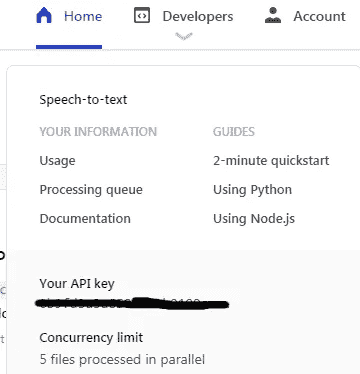

把这个 API 密匙保存在某个地方，因为以后会有用。

# 场景 1:电报机器人

现在有趣的部分来了。首先，让我们打开 Make.com 并创建一个新的场景。我称它为“通用汽车费用管理器电报机器人”，但你可以随便叫它什么。

让我们添加一个新的 Webhook 并复制它的 URL。

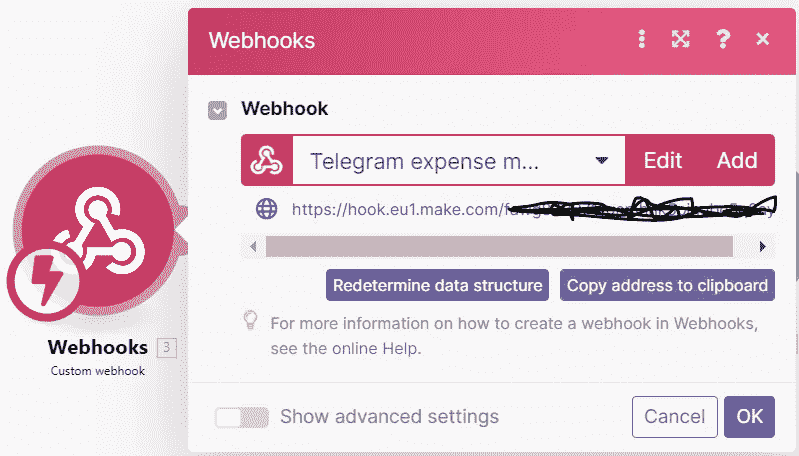

Make 通过第一次调用来确定 Webhook 的结构，所以我们必须将它添加到 Telegram 中。打开浏览器并键入以下内容:

```
https://api.telegram.org/bot<bot_token>/setWebhook?url=<webhook_url>
```

其中,`<bot_token>`是电报机器人令牌,`<webhook_url>`是网页挂钩 URL。

打开与机器人的聊天，然后点击“/开始。”不幸的是，这还不够，因为文本消息不包含处理语音消息的所有必要信息。你必须再次点击 Webhook 节点，然后点击“重新确定数据结构”然后去电报，给机器人发语音信息。这将有助于 webhook 识别 Telegram 发送的消息的 JSON 结构。

现在，我们必须检索语音消息文件的 URL。此 URL 将被发送到 AssemblyAI 进行转录。

让我们向场景中添加一个“Telegram Bot:Make a API call”节点，然后单击 add。让我们为到 bot 的连接键入一个名称，并添加 Botfather 给出的 Telegram bot API 密钥。

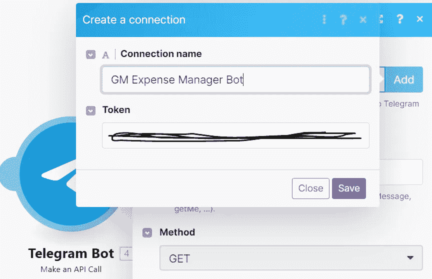

添加 bot 后，按以下方式设置头和 URL 方法:

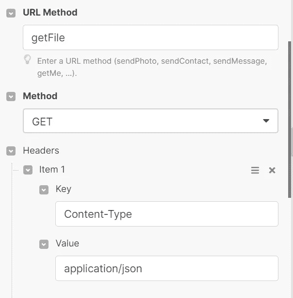

在同一窗口中，确保查询字符串如下所示:

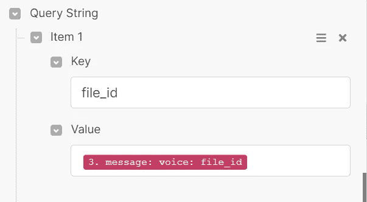

点击“运行一次”开始该场景，并从 Telegram 发送另一条语音消息。电报机器人节点将在此操作结束时进行配置。

现在让我们添加一个“Set Variable”节点来存储 bot 令牌，并添加另一个这种类型的节点来存储 AssemblyAI 令牌。

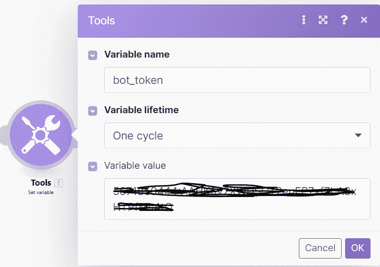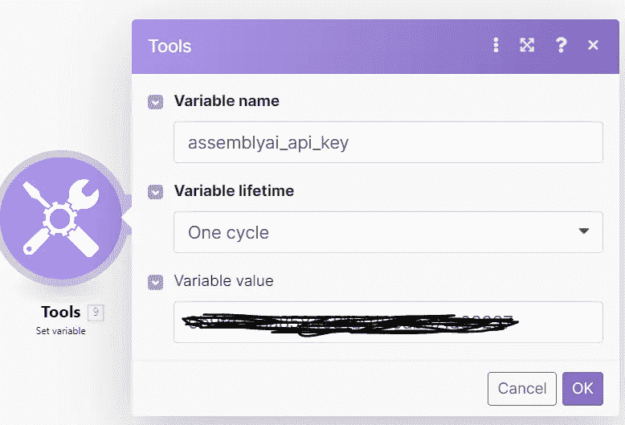

最后，让我们构建语音消息的 URL。

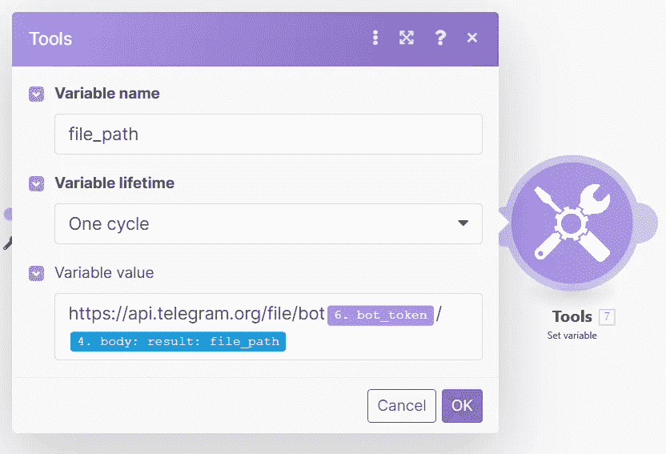

最后，我们需要用要转录的语音消息的 URL 调用 AssemblyAI API。在此之前，我们必须创建一个新的 Webhook，它将被 AssemblyAI 调用。因此，我们必须用新的 webhook 创建一个新的场景。让我们记下 Webhook URL，并在这个场景中添加一个最终的 HTTP 节点:

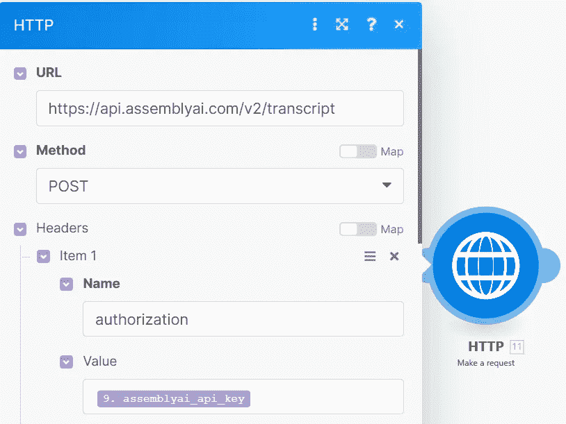

请求的主体包含音频 URL 和新 webhook 的 URL。我们添加一个`chat_id`参数，让第二个场景回复用户。

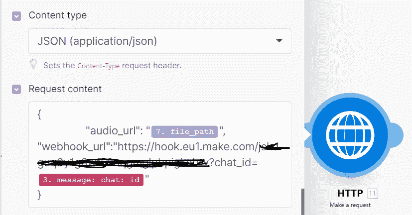

完整的工作流应该与此类似:


# 场景#2:响应 Webhook

在前一个场景中，我们使用了在第二个场景中创建的 Webhook 的 URL。一旦音频转录准备好，就调用这个 webhook。我们已经将`chat_id`参数添加到 GET 参数中，以使机器人回复我们，并接收结果转录的通知。

现在，我们必须获得转录的文本，并在 Google Sheets 中添加一行。

为了获取文本，我们需要用通过 Webhook 接收的`transcription_id`调用 AssemblyAI 的另一个端点。因此，我们添加了一个 HTTP 模块和 API 密钥作为授权头。不要忘记将“Parse response”设置为 Yes，以正确解析生成的 JSON。

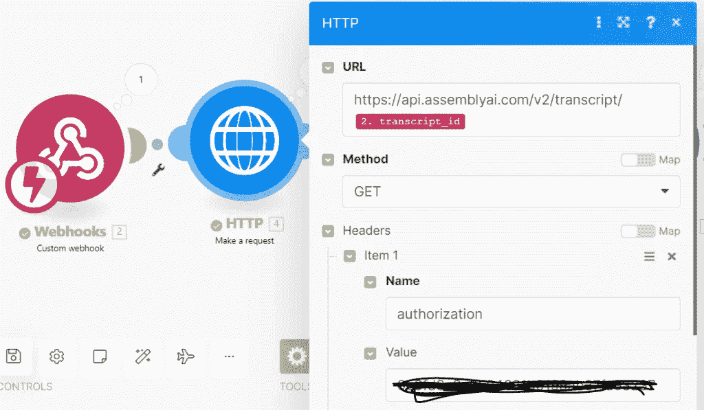

现在我们可以将交易文本的金额和描述从结果文本中分离出来。我们使用“设置多个变量”节点创建两个变量。第一个字是金额，正文的另一部分是描述。我们可以使用分隔第一个单词和文本下一部分的空格的位置来轻松执行这种拆分。

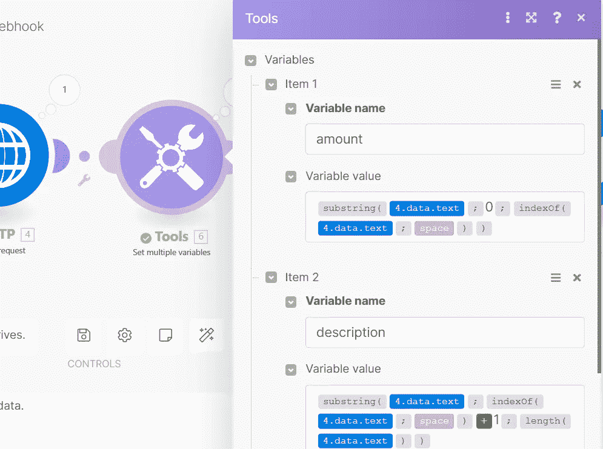

例如，现在我们可以创建一个名为“Expenses”的 Google 工作表，并创建列。

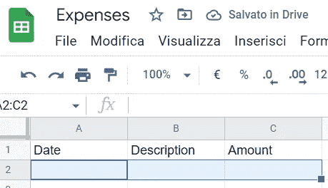

在我们[用 Google Sheets 连接](https://www.make.com/en/help/app/google-sheets) Make 之后，我们可以添加一个节点来添加一行并填充值。

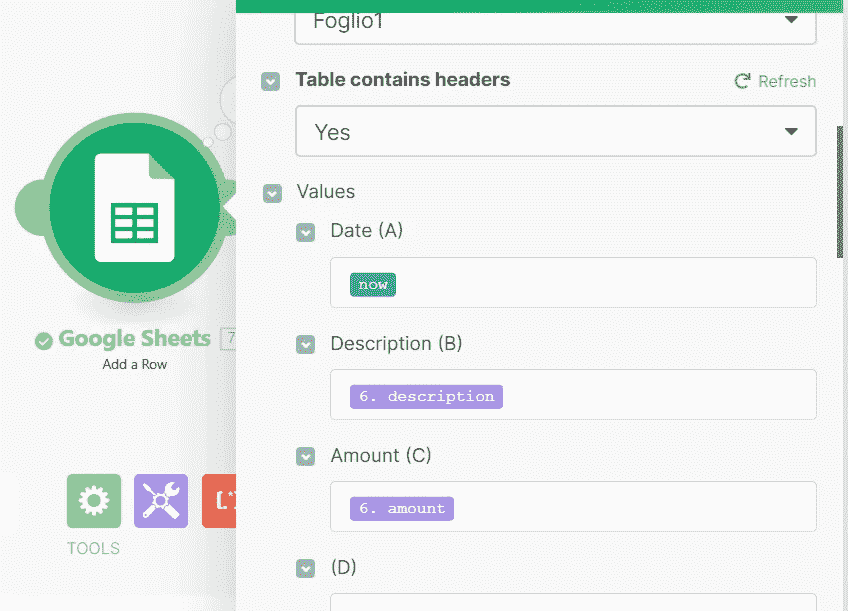

最后，让我们回到电报，发送一个确认文本。

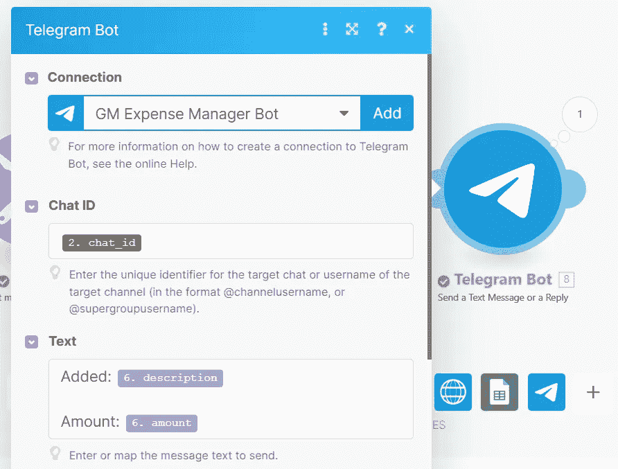

这是我们最终场景的样子:


让我们保存所有场景并激活它们。现在我们完成了！让我们试试我们的新工具！

# 我们试试吧！

我们现在可以向我们的电报机器人发送声音信息，就像“0.5 份报纸”几秒钟后，我们收到一条确认消息。

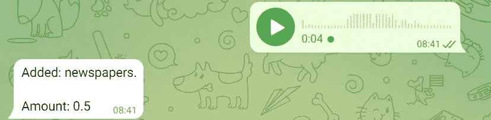

并且该行已经被正确地添加到我们的 Google 表单中。

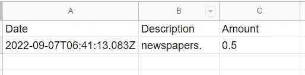

# 可能的改进

正如我们所见，这个机器人使用起来非常简单。一些可能的改进包括使用 Make 的更强的 API 键处理和一个过滤器，该过滤器仅在消息由特定用户发送时才使整个工作流工作。通过必要的改进，我们几乎不费吹灰之力就可以创建我们的个人语音费用管理器。

# 结论

这是一个如何使用 AssemblyAI 创建语音费用管理器的简单示例。这个过程是用 Make.com 无代码平台创建的，但是我们也可以用 PHP、Node.js 或 Python 中的定制代码来实现它。AssemblyAI 的功能及其灵活性允许任何用户从其特性中获益，而无需编写一行代码。

*原载于 2022 年 9 月 14 日*[*【https://www.yourdatateacher.com】*](https://www.yourdatateacher.com/2022/09/14/how-to-create-a-voice-expense-manager-using-make-and-assemblyai/)*。*