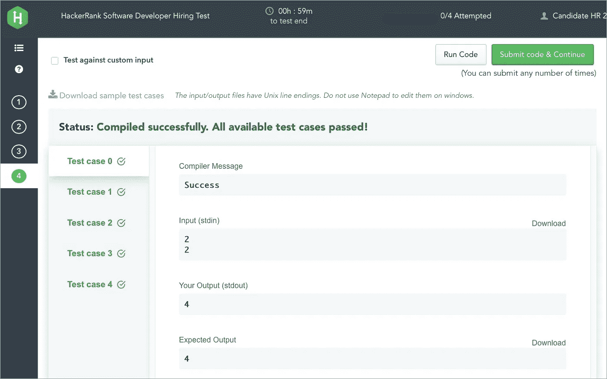
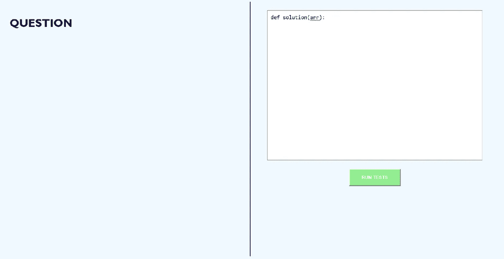
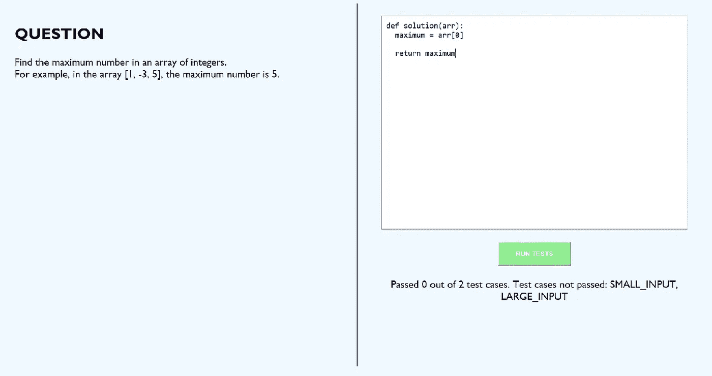
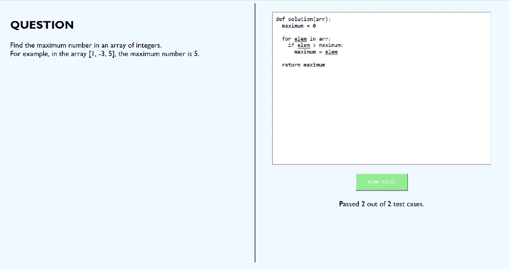

# 如何创建用于编码测试的 Web 应用程序

> 原文：<https://betterprogramming.pub/how-to-create-a-web-app-for-coding-tests-750ef97bf1e3>

## 如何用 Node.js 构建你自己的编码测试平台



黑客排名测试中候选人解决方案的示例结果。资料来源:hackerrank.com

如今，越来越多的公司在招聘软件开发人员时使用编码测试。像 [HackerRank](https://www.hackerrank.com) 、[codi ty](https://www.codility.com/)等网站。帮助公司管理这些测试，并根据他们的代码在一些测试案例中的表现给候选人打分。

在本文中，我将描述如何构建一个简单的 web 应用程序来管理编码测试。web 应用程序将向用户提出一个问题，允许用户提交他们的解决方案，在一些预定义的测试用例上运行解决方案，并向用户显示结果。

我们将使用 Express.js 作为 web 后端，而 Python 将是提交解决方案的语言。

# 搭建舞台

我们将从创建用户界面开始，它将由一个问题区域和一个编码区域组成。

为此，我们将首先为每个区域创建两个 div 元素。然后，我们将设计它们的样式:

```
**<div class="question">**
  <h2><strong>QUESTION</strong></h2>
  <span id="questionText"></span>
</div>**<div class="code-area">**
  <textarea rows="20" autofocus>def solution(arr):</textarea>
</div>
```

接下来，我们设计两个 div 的样式:

```
.question, .code-area {
  padding: 25px;
  **display: table-cell;**
  width: 50%;
}.question {
  text-align: left;
  position: absolute;
  top: 0vh;
}.code-area {
  border-left: 2px solid navy;
}
```

在上面的 CSS 中，我们制作了两个 div 的表格单元格(这样它们可以并排)。我们需要一张桌子来容纳它们。我们将为此创建一个包含 div:

```
**<div class="container">**
  <div class="question">
    ...
  </div>
  <div class="code-area">
    ...
  </div>
</div>
```

然后我们会设计它的样式:

```
.container {
  **display: table;**
  height: 95vh;
  width: 95vw;
}
```

我们还将为`body`元素添加一些样式来改变背景颜色和字体:

```
body {
  background-color: aliceblue;
  text-align: center;
  font-size: 16pt;
  font-family: 'Gill Sans', 'Gill Sans MT', Calibri, 'Trebuchet MS', sans-serif;
}
```

之前，我们创建了一个默认文本为`def solution(arr):`的`textarea`元素。让我们给这个`textarea`一个类和 ID:

```
<textarea rows="20" **class="input" id="code"** autofocus>def solution(arr):</textarea>
```

让我们也为运行测试创建一个`button`元素，为结果创建一个`span`元素:

```
...
<textarea rows="20" class="input" id="code" autofocus>def solution(arr):</textarea>
<br/><br/>
**<button>RUN TESTS</button>**
<br/><br/>
**<span id="results"></span>**
...
```

现在让我们给元素添加一些样式:

```
.input, #results {
  height: 60%;
}.input {
  border: 1px solid gray;
  width: 90%;
  font-family: monospace;
  font-size: 12pt;
  padding: 10px;
}button {
  width: 150px;
  height: 50px;
  cursor: pointer;
  background-color: lightgreen;
  color: white;
  font-weight: bolder;
}
```

这就结束了我们在用户界面设计上的工作。网页现在看起来像这样:



用户界面

# 准备后端

在 web 应用程序的另一端，我们将从导入所需的库开始:

```
const bodyParser = require(**'body-parser'**);
const cors = require(**'cors'**);
const execSync = require(**'child_process'**).execSync;
const express = require(**'express'**);
const fs = require(**'fs'**);
const path = require(**'path'**);
```

我们需要:

*   `body-parser`帮助我们处理帖子请求
*   `cors`对于跨来源请求
*   `child_process`、`fs`和`path`用于执行用户的代码解决方案
*   `express`，很明显。

接下来，我们将创建一个 Express 应用程序，并将其设置为使用我们需要的依赖项:

```
const app = express();
app.use(cors());
app.use(bodyParser.json());
app.use(bodyParser.urlencoded({ extended: true }));
```

最后，我们将设置端点，并让应用程序监听端口 5000:

```
**function testCode(req, res)** {
  return res.send("Success");
}**app.get('/', (req, res)** => {
  res.send("Hello world");
});**app.post('/test/', testCode);**app.listen(5000, () =>
  console.log(`Listening on port 5000.`),
);
```

我们上面有两个端点:

*   `/`:用于服务前端页面和
*   `/test/`:用于测试用户的代码。

当被访问时,`/test/`端点调用函数`testCode`。该函数将用户代码写入 Python 文件，然后运行另一个 Python 脚本来测试代码:

```
...const CODE_FOLDER = "code";function testCode(req, res) {
  let code = **req.body["code"]**;
  try {
    **fs.writeFileSync(path.join(__dirname, CODE_FOLDER, "input_code.py"), code);**
    **const proc = execSync("python3 " + path.join(CODE_FOLDER, "tests.py"));**
    const results = proc.toString();

    return res.send(results);
  } catch (error) {
    console.log("An error occurred");
    console.log(error);
    return res.send("An error occurred.");
  }
}
```

在上面的代码中，用户输入的代码——将作为名为`code`的请求参数从前端发送——将被保存到名为`input_code.py`的文件中，然后 Python 脚本`tests.py`将使用节点的`execSync`函数执行(该函数执行控制台命令，等待其输出，然后返回)。然后，脚本的输出将被发送到前端。

下面是`tests.py`脚本包含的内容:

```
**from input_code import solution**def **get_test_cases()**:
  passdef **get_expected_outputs()**:
  passdef **test_code()**:
  passif __name__ == '__main__':
  test_code()
```

它包含三个功能:

*   `get_test_cases()`:获取运行用户代码的测试用例
*   `get_expected_outputs()`:获取每个测试用例的预期输出
*   `test_code()`:根据测试用例测试用户的解决方案

让我们填充这些函数:

```
def get_test_cases():
  return {
    **"SMALL_INPUT"**: [1, 2, 3],
    **"LARGE_INPUT"**: [1, 2, 3] * 1000 + [4],
  }def get_expected_outputs():
  return {
    **"SMALL_INPUT"**: 3,
    **"LARGE_INPUT"**: 4,
  }
```

前两个函数为我们提供了一些样本测试用例的输入和输出。他们也标记测试用例`“SMALL_INPUT”`和`“LARGE_INPUT”`用于识别。

现在让我们在第三个函数中使用它们来测试用户代码:

```
def test_code():
  test_cases = get_test_cases()
  expected = get_expected_outputs()
  test_cases_count = len(test_cases)
  passed_test_cases = 0
  failed_test_cases = []

  for label in test_cases.keys():
    code_result = **solution(test_cases[label])**
    if code_result == expected[label]:
      passed_test_cases += 1
    else:
      failed_test_cases.append(label)

  print("Passed", passed_test_cases, "out of", test_cases_count, "test cases.")

  if len(failed_test_cases) > 0:
    print("Test cases not passed:", ", ".join(failed_test_cases))
```

使用上面的代码，我们遍历每个测试用例，在测试用例输入上调用用户的解决方案，并将用户的结果与预期的结果进行比较。

如果结果相同，我们将通过的测试用例数加 1；否则，我们将失败测试用例的标签添加到一个数组中。

最后，我们打印通过的测试用例的数量，如果有失败的，我们打印它们的标签。注意，用户代码必须包含一个名为`solution()`的函数，它将通过一个数组传递给每个测试用例，并且必须返回一个数字。

这样，后端就完成了。

# 连接两端

我们的下一个任务是连接前端和后端。

为此，我们将创建一个 JavaScript 函数，每当用户单击`RUN TESTS`按钮时都会调用该函数。这个函数会将用户的代码发送到后端，并显示用户的结果。

```
<script>
  function runTests() {
    document.getElementById("results").innerHTML = "Running...";
    **const code = document.getElementById("code").value;**
    let xhr = new XMLHttpRequest();

    xhr.onreadystatechange = () => {
      if (xhr.readyState == 4 && xhr.status == 200) {
        **document.getElementById("results").innerHTML = xhr.responseText;**
      }
    } **xhr.open("POST", "http://localhost:5000/test/");**
    xhr.setRequestHeader("Content-type", "application/x-www-form-urlencoded");
    **xhr.send("code=" + code);**
  }
</script>
```

该函数首先从 ID 为`code`的`textarea`获取用户代码，然后使用 [AJAX](https://en.wikipedia.org/wiki/Ajax_(programming)) 向后端的`/test/`端点发送请求。然后，当它收到响应时，它将结果设置在 ID 为`results`的`span`中。

让我们将这个事件处理程序添加到`RUN TESTS`按钮:

```
<button **onclick="runTests()"**>RUN TESTS</button>
```

# 测试应用程序

为了测试 web 应用程序，让我们向问题区域添加一个简单的问题:

```
<div class="question">
  <h2><strong>QUESTION</strong></h2>
  Find the maximum number in an array of integers.
  <br/> For example, in the array [1, -3, 5], the maximum number is 5.
</div>
```

这个问题只是要求用户找出数组中最大的数字。这里有一个解决问题的方法:

```
def solution(arr):
  maximum = arr[0] return maximum
```

解决方案返回数组中的第一个元素(这显然是错误的)。点击`RUN TESTS`按钮，我们会看到:



使用错误的解决方案进行测试

测试结果告诉我们这个解决方案是错误的，因为它没有通过任何测试。它还说明了测试用例的名称未能帮助用户适当地调整他们的代码。

现在让我们用下面的代码试一试:

```
def solution(arr):
  maximum = 0

  for elem in arr:
    if elem > maximum:
      maximum = elem return maximum
```

该解决方案遍历数组，通过将每个元素与先前已知的最大元素进行比较来检查哪个项目最大。这更可能是一个正确的解决方案，但让我们测试一下以确认:



使用正确的解决方案进行测试

代码通过了两个测试案例！我们的编码测试 web 应用程序像预期的那样工作。

谢谢你跟了这么远。您可以在 [my GitHub repository](https://github.com/eshiofune/100-days-of-code/tree/master/js/CodeTest) 中找到 web 应用程序的完整代码。