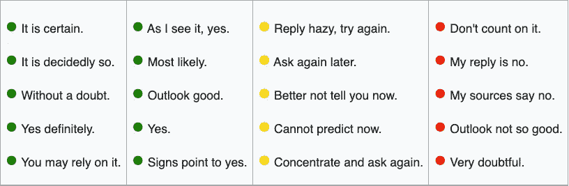
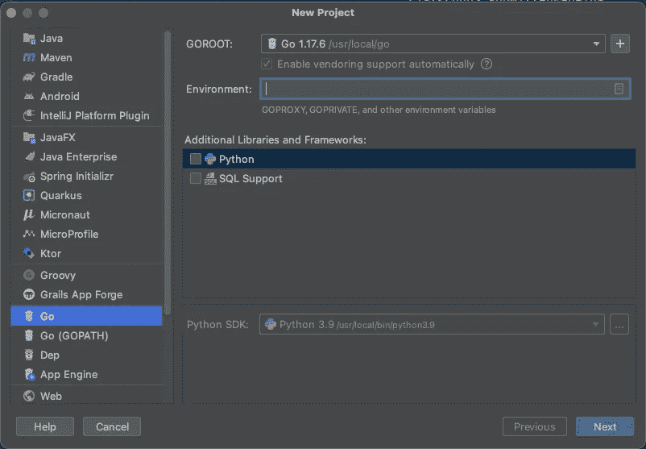
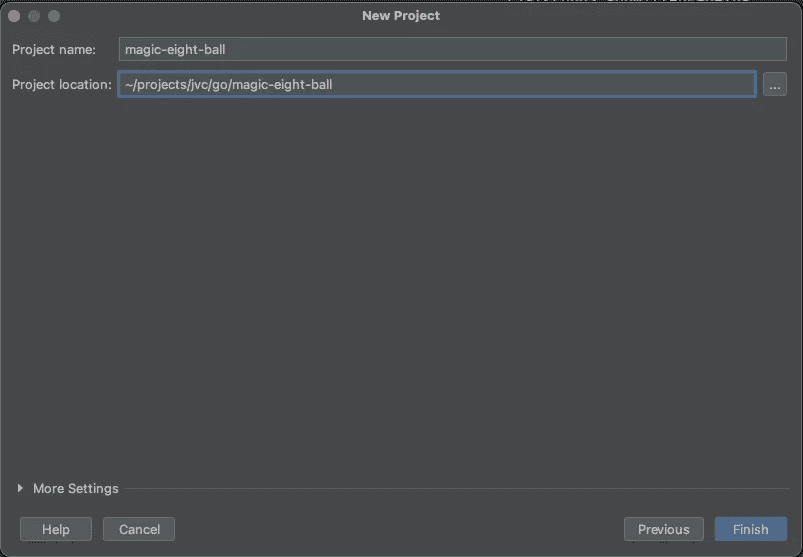
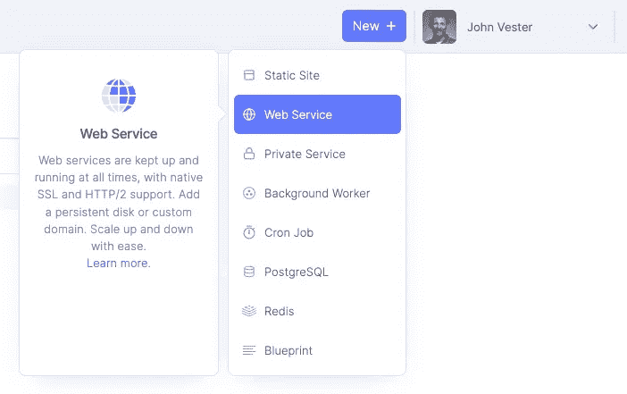
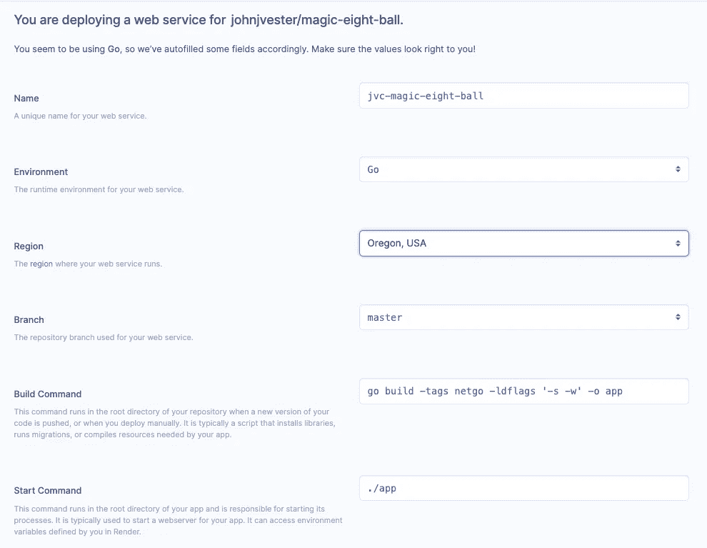
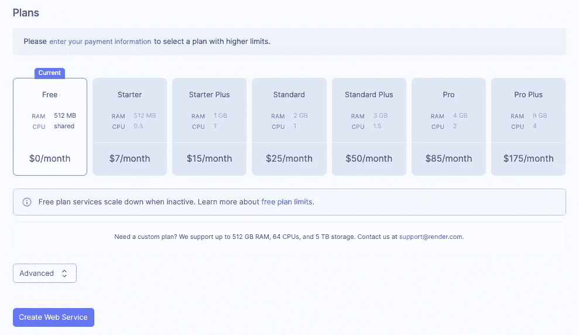
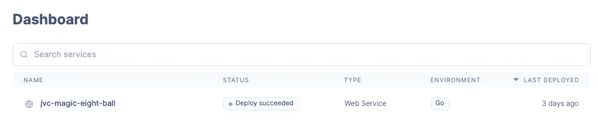

# 如何使用 Render and Go 创建 Web 服务

> 原文：<https://betterprogramming.pub/how-to-create-a-web-service-using-render-and-go-75d211421a00>

## Render 实现了零开发成本的承诺


我的记忆能力会让我妻子发疯。本周早些时候，在我给她讲完一个我从长期记忆中回忆起来的故事后，她问了我两个问题:

*   你是怎么记住这些事情的？
*   你为什么还记得那段记忆？

老实说，我不知道如何回答她的问题，只知道我在生活中较早地认识到了这种能力。我们都同意，如果有一个“无用的琐事秀”，我将是世界冠军…手到擒来。

我觉得我第一次经历的一些事件经常被编入我大脑的长期记忆库，后来成为我不得不与她分享的故事的来源。就职业影响而言，回忆我第一次使用编程语言或开始使用服务或框架并不需要太多努力。

读到 [Render](https://render.com/) 提供的服务——承诺“零开发成本”——让我想试驾一下。查看支持的语言列表，我发现有机会用一种对我来说很陌生的编程语言来创建服务。

因此，我决定尝试一下 [Go](https://go.dev/) 编程语言，希望能为我的长期记忆库增加一笔新的存款。

# 神奇的 8 球发球

为了让事情变得有趣，考虑一个例子，其中 [Mattel](https://en.wikipedia.org/wiki/Mattel) 要求创建一个 RESTful API，模仿 1946 年发明的 [Magic 8-Ball](https://en.wikipedia.org/wiki/Magic_8-ball) 玩具:


对于那些不知道的人来说，魔术 8 球是一个新奇的物品，它执行基本的算命任务。在 8 球图像朝上的情况下，拿着球的人问一个是-否的问题，然后将它翻过来给出答案。回复神奇地从玩具内部的深黑色海洋中浮出水面。


最初的设计包含 20 个唯一的答案，接受标准是在 RESTful API 中只允许这些答案:



10 个肯定回答用绿色项目符号表示，其余 10 个是未表态(黄色)和否定(红色)回答的均等组合。

API 的消费者只需要发出一个标准的 GET 请求，它将从可能的选项列表中返回一个随机的答案。出于验证目的，Mattel 还希望有第二个端点从这项新服务中检索所有可用答案的列表。

根据我的设计，我们可以通过以下终端满足这些要求:

*   GET `/answer` -随机返回 20 个可用答案中的一个
*   GET `/answers` -返回所有二十个可用答案的列表

# Go 入门

在访问 Go 网站上的[下载页面](https://go.dev/doc/install)时，我注意到安装过程与 Java 编程语言入门非常相似。安装程序使用了类似向导的设计，我基本上只需要点击按钮来浏览整个过程。完成后，我使用以下终端命令来验证安装是否成功:

```
╭─me@johnjvester ~ 
╰─$ go version
go version go1.17.6 darwin/amd64
```

使用 IntelliJ IDEA，我添加了 [Go 插件](https://plugins.jetbrains.com/plugin/9568-go)，并使用 **File | New | Project …** 命令启动了一个新项目:



这个项目的名字`magic-eight-ball`看起来很适合这个尝试:



经过一些研究，我发现 [Gin web framework](https://github.com/gin-gonic/gin) 提供了用 Go 编写的 RESTful API 所需的功能，所以我用下面的命令安装了它:

```
$ go get -u github.com/gin-gonic/gin
```

为了在我的源代码中引用 Gin，我只需要包含以下导入:

```
import "github.com/gin-gonic/gin"
```

现在我们准备开始构建神奇的 8 球 API。

# 创建神奇的 8 球 API

我想做的第一件事是建立 API 的数据端。对于本例，当提供答案时，下面的 JSON 结构将组成响应体:

```
{
  "id" : number,
  "response" : string
}
```

在 Go 中，这个 JSON 有效负载被定义(如下所示)并添加到`main.go`文件中:

```
type response struct {
 ID       int    `json:"id"`
 Response string `json:"response"`
}
```

因为所有的数据都是静态的，所以我将标准答案添加到了`main.go`文件中:

```
var responses = []response{
 {ID: 1, Response: "It is certain."},
 {ID: 2, Response: "It is decidedly so."},
 {ID: 3, Response: "Without a doubt."},
 {ID: 4, Response: "Yes definitely."},
 {ID: 5, Response: "You may rely on it."},
 {ID: 6, Response: "As I see it, yes."},
 {ID: 7, Response: "Most likely."},
 {ID: 8, Response: "Outlook good."},
 {ID: 9, Response: "Yes."},
 {ID: 10, Response: "Signs point to yes."},
 {ID: 11, Response: "Reply hazy, try again."},
 {ID: 12, Response: "Ask again later."},
 {ID: 13, Response: "Better not tell you now."},
 {ID: 14, Response: "Cannot predict now."},
 {ID: 15, Response: "Concentrate and ask again."},
 {ID: 16, Response: "Don't count on it."},
 {ID: 17, Response: "My reply is no."},
 {ID: 18, Response: "My sources say no."},
 {ID: 19, Response: "Outlook not so good."},
 {ID: 20, Response: "Very doubtful."},
}
```

为了利用 responses 变量，我向`main.go`文件添加了两个函数:

```
func getAllAnswers(c *gin.Context) {
 c.IndentedJSON(http.StatusOK, responses)
}func getRandomAnswer(c *gin.Context) {
 rand.Seed(time.Now().Unix())
 c.IndentedJSON(http.StatusOK, responses[rand.Intn(len(responses))])
}
```

`getAllAnswers()`函数只是以 JSON 格式返回响应列表，而`getRandomAnswer()` 函数随机选择 20 个选项中的一个，并以 JSON 格式返回值。

最后，`main()`函数设置服务使用的端点和端口:

```
func main() {
 router := gin.Default()
 router.GET("/answers", getAllAnswers)
 router.GET("/answer", getRandomAnswer)port := os.Getenv("PORT")
 if port == "" {
  port = "8080"
 }
 if err := router.Run(":" + port); err != nil {
  log.Panicf("error: %s", err)
 }
}
```

这就是满足 Mattel 制定的验收标准所需的全部内容。

要启动应用程序，我们从终端运行以下命令:

```
╭─me@johnjvester ~/projects/jvc/go/magic-eight-ball 
╰─$ go run .
```

显示的日志包括以下内容:

```
[GIN-debug] GET    /answers        --> main.getAllAnswers (3 handlers)
[GIN-debug] GET    /answer         --> main.getRandomAnswer (3 handlers)
[GIN-debug] Listening and serving HTTP on :8080
```

我可以通过使用以下命令发送 curl 请求来测试 API:

```
╭─me@johnjvester ~ 
╰─$ curl [http://localhost:8080/answer](http://localhost:8080/answer)
```

这是我收到的回复:

```
{
    "id": 6,
    "response": "As I see it, yes."
}%
```

Go 服务运行没有任何问题，我将代码作为一个新项目上传到 GitLab:

[https://gitlab.com/johnjvester/magic-eight-ball](https://gitlab.com/johnjvester/magic-eight-ball)

现在我准备好看看渲染是如何工作的了。

# 通过 GitLab 部署渲染

开始使用 Render 快速、简单且免费。我只是选择使用我的 GitLab 凭证，这使得选择要部署的项目变得很容易。

首先，我选择了渲染面板上的“新建”按钮，并选择了 Web 服务选项:



我在 GitLab 上选择了我的`magic-eight-ball`项目:


在渲染平台中，我决定调用我的服务`jvc-magic-eight-ball`,并保留所有其他选项的默认值:



向下滚动，我选择让这项服务按照免费计划运行:



然后，我单击创建 Web 服务按钮。几分钟后，[渲染面板](https://dashboard.render.com/)显示我的服务已经启动并运行:



我向我在 Render(【https://jvc-magic-eight-ball.onrender.com/answer】T4)上的服务的 URL 发送了一个请求，我收到了以下响应:

```
{
    "id": 5,
    "response": "You may rely on it."
}
```

只需点击几下鼠标，我就将我在 Go 中编写的第一个 RESTful API 部署到了渲染平台上——这没有产生任何成本。更重要的是，渲染方法不需要任何 DevOps 技能或知识来完成我的任务。

# 结论

这篇文章的引言谈到了我在若干年后(如果不是几十年的话)保留和回忆历史事件的能力。事实上，整个实验从开始到结束只花了我不到一个小时的时间，这当然值得成为另一个这样的事件。

从 2021 年开始，我一直努力按照以下使命宣言生活，我觉得这可以适用于任何 IT 专业人士:

> *“将您的时间集中在提供扩展您知识产权价值的特性/功能上。将框架、产品和服务用于其他一切。”*
> 
> *-j·维斯特*

在本文中，我不仅能够用很少的源代码快速生成一个功能 API，还能够通过执行一系列小步骤将项目部署到云提供商。零 DevOps 承诺，零 DevOps 兑现。这让我可以把时间集中在为客户提供功能上。

如果你对完整的源代码感兴趣，只需导航到 [GitLab](https://gitlab.com/johnjvester/magic-eight-ball) 。

知道我目前有 API 和应用程序在 Heroku 生态系统中运行，我计划在接下来的几周内开始研究从 Heroku 到 Render 的转换。到目前为止，我对 Render 所提供的东西印象深刻。

祝你今天过得愉快！