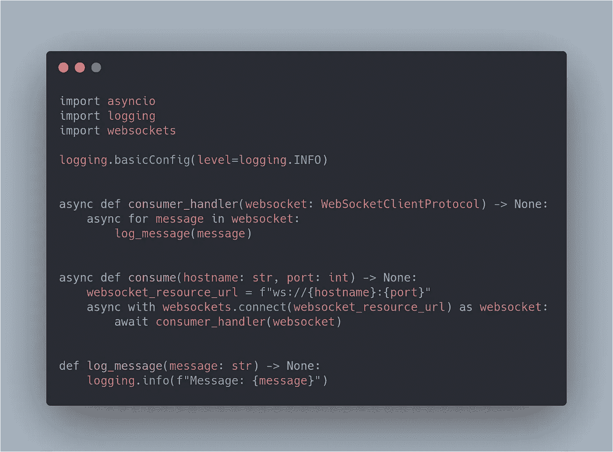
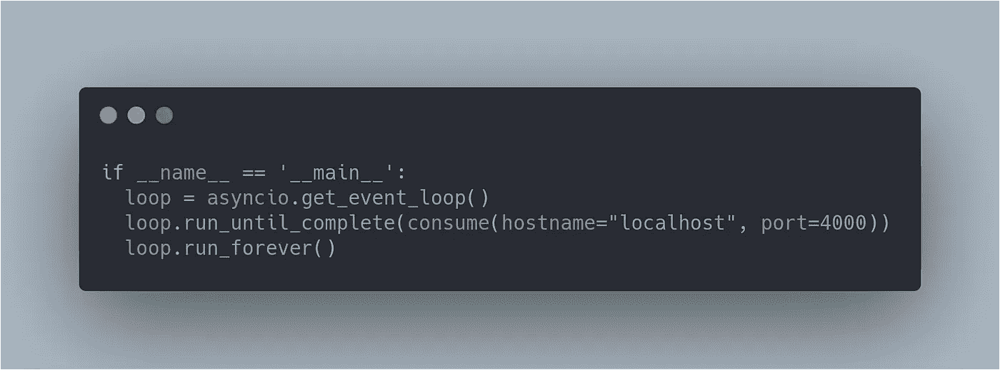
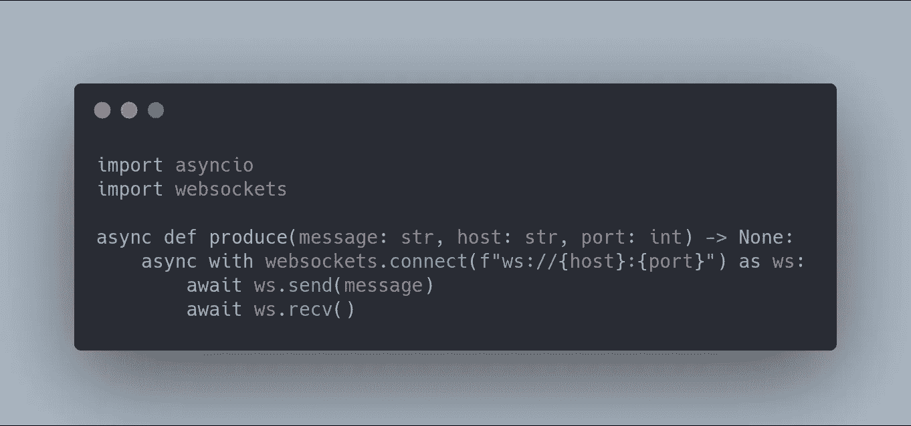
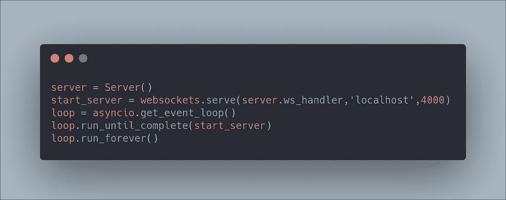
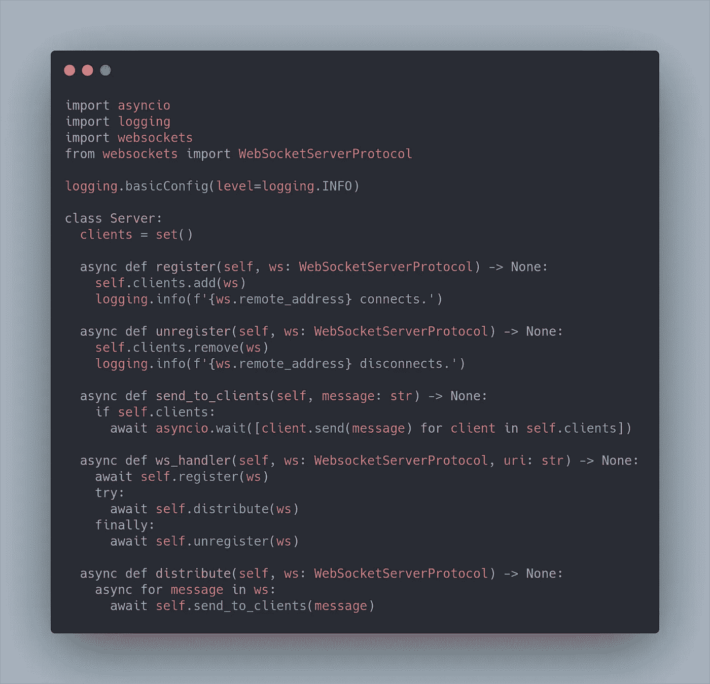
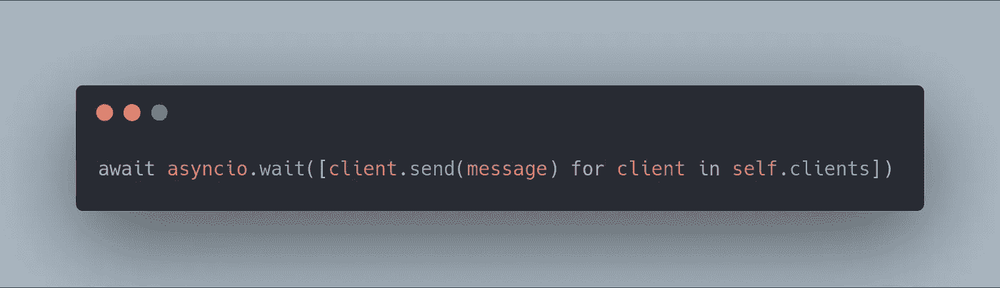

# 如何用 Python 创建 WebSocket

> 原文：<https://betterprogramming.pub/how-to-create-a-websocket-in-python-b68d65dbd549>

## WebSockets 简介


马里乌斯·马萨拉尔在 [Unsplash](https://unsplash.com?utm_source=medium&utm_medium=referral) 上的照片

> WebSocket 是一种计算机通信协议，通过单一 TCP 连接提供全双工通信通道— [维基百科](https://en.wikipedia.org/wiki/WebSocket)

在本文中，您将学习如何使用 [WebSockets](https://websockets.readthedocs.io/en/stable/api.html) API 在 [Python](https://docs.python.org/3/) 中设置 WebSocket。

Websocket API 使得客户端和服务器之间的双向交互通信会话成为可能。使用 API，您可以以事件驱动的方式发送和接收消息，而不必一直轮询服务器的数据。这导致了更少的开销，并允许来自和去往服务器的实时数据传输。

# 入门指南

WebSocket 要求 Python ≥ 3.6.1。

您可以使用以下命令在 Python 中简单地安装 WebSockets API:

```
pip install websockets
```

读完这篇文章，你就会明白 WebSocket 到底是什么了。我将给你一个中间的例子，其中服务器与它连接的客户机同步它得到的所有消息。

我不会涉及安全性之类的主题——我将展示的所有内容都是用 Python 编写的。对于至少对这门语言或一般编程有一点熟悉的人来说，这很容易理解。这样，您就可以更容易地用另一种语言或为前端应用程序编写消费者、生产者甚至服务器。

我希望你会发现提供的例子很有用，我鼓励每个开发人员在职业生涯中至少尝试一次 WebSocket 它太棒了。还有不止[休息](https://en.wikipedia.org/wiki/Representational_state_transfer)，你懂的！

# 一个简单的消息消费者



一个简单的消息消费者

首先，让我们从我上面提供的消费协程开始。我将解释上面的每一行代码，这样你就能很好地理解发生了什么。简单总结一下上面发生的事情:我们连接到由特定 WebSocket URL 指定的 WebSocket。WebSocket 服务器生成的每条消息都会被记录下来。

我现在将详细解释最重要的三行。如果你对语法不感兴趣，可以跳过这一步。

如果你以前从未见过关键词`async`或`await`，你可能会有点吃惊。`async/await`只是一种以舒适的方式处理承诺的特殊语法。承诺只不过是一个表示异步操作最终完成或失败的对象。

您可以将回调附加到此返回的对象，而不是作为将回调传递到函数中的替代方法。你会惊讶它是多么容易理解和使用。

在 Python 中，`async`确保函数返回一个承诺，并在其中包装非承诺。在`await`调用期间，其他不相关的代码可以执行。

```
websocket_resource_url = f"ws://{host}:{port}"
```

WebSocket 资源 URL 使用以`ws`(或`wss`为安全连接)开始的方案。其后是主机名和端口号(例如，ws://web socket . example . com:8400)。我在这里使用一个 f 字符串来构建资源 URL。语法与您习惯使用的`str.format()`类似，但是 f-string 是 Python 3.6 中添加的，它使得格式化字符串文字不那么冗长。

```
async with websockets.connect(websocket_resource_url) as ws:
```

我正在解释的下一行使用`websockets.connect`打开与 WebSocket 的连接。等待连接产生一个`WebSocketClientProtocol`，然后可以用它来发送和接收消息。这一行使用了`async with`，它与异步上下文管理器一起工作。退出上下文时，连接被关闭。

**注意:**我有时会使用 WebSocket (ws)的缩写，以使代码示例在介质上更易读，但在生产代码中总是要写全名。这增加了可读性。例如，你可以把它理解为*网站*或*网络服务器*，作为一个优秀的开发者，这是你应该避免的。毕竟，代码读起来应该像一本好书。

```
async for message in websocket:
```

你可能会想，“等等，`async for`是做什么的？”这就像一个同步 for 循环，但是它支持异步理解。

异步 IO 使我们能够迭代异步迭代器。这允许您在迭代的每个阶段调用异步代码，而常规的 for 循环不允许您这样做。您可以在这行代码中将 WebSocket 视为消息的生成器。



要运行这个简单的消费者，只需指定主机名和端口，并让它永远运行。就这么简单。如果没有事件循环也不用担心，`asyncio`会创建一个新的事件循环，并将其设置为当前事件循环。

很简单，对吧？此代码示例将开始使用来自 ws://localhost:4000 的消息。如果没有服务器运行，它将失败并抛出 404 未找到。

# 简单的生产者

我举一个只生产一种价值的生产者的例子。我将向您展示这甚至比编写消费者更容易。



简单的生产者

上面的代码不言自明。我们连接到 WebSocket，就像我们之前在消费者中所做的那样。我们向服务器发送一条消息，然后等待响应。当我们收到来自服务器的消息时，我们知道我们的消息已经被传递了。

现在，我们只需要一种方法来执行这个产品协程一次。

```
loop = asyncio.get_event_loop()
loop.run_until_complete(produce(message='hi', host='localhost', port=4000))
```

当然，我们给它命名，Python 也有答案。我们可以像对消费者那样简单地使用事件循环。唯一的区别是我们运行它，直到它完成。一旦我们收到服务器的响应，任务就完成了。

在 Python 3.7 中，它变得更好——我们现在可以使用 run 函数来执行协程。很漂亮，对吧？

```
asyncio.run(produce(message='hi', host='localhost', port=4000))
```

# 服务器:拼图的最后一块

在这种情况下，我编写了一个服务器类，将服务器的所有功能组合在一起。该服务器将生产者发送的消息分发给所有侦听的消费者。

服务器被实例化并定义了一个 WebSocket 处理程序协程。WebSocket 的`serve`函数是事件循环的`create_server()`方法的包装器。它用`create_server()`创建并启动一个服务器。它接受一个 WebSocket 处理程序作为参数。

每当客户端连接时，服务器接受连接，创建一个`WebSocketServerProtocol`，执行开始握手，并委托给由 [ws_handler](https://websockets.readthedocs.io/en/stable/api.html) 定义的连接处理程序。一旦该处理程序完成，无论是正常完成还是出现异常，服务器都会执行关闭握手并关闭连接。

这都是为你做的。因为我们指定服务器必须永远运行，所以每当我们的生产者生产一些东西时，它将只执行在服务器类中定义的协程`ws_handler`(下面解释)。然后它会向所有连接的客户端分发一条消息。



最后一段代码是最长的一段，但它是最后一部分，所以坚持住。



将消息同步到连接的客户端的服务器类

`ws_handler`注册一个客户端，将消息分发给连接的客户端，最后关闭连接。消费者将保持连接，而生产者，另一方面，注销自己。`distribute`协程将把 WebSocket 中的每条消息发送给我们连接的客户端集合中的所有客户端。

如果有任何连接的客户端，将执行下面这段代码。`asyncio.wait`确保我们只有在每个客户端都收到消息后才继续。



## 结论

总而言之，以下是 WebSockets 相对于 HTTP 长轮询的一些主要优势:

*   在 WebSocket 连接的生命周期中，可以随时以任何一种方式发送通信
*   客户端和服务器是持续连接的—数据可以随时发送到客户端，而无需请求它
*   在 Python 中使用 WebSockets 相当容易。这个消息同步示例无需编写大量代码就能实现。高效地对 HTTP 长轮询做同样的事情是一件相当复杂的事情。