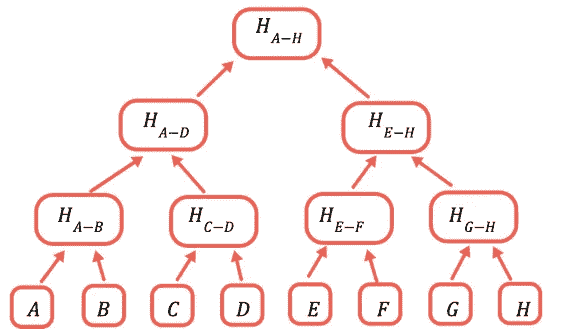

# 如何使用 Merkle 树创建白名单 NFT 集合

> 原文：<https://betterprogramming.pub/how-to-create-a-whitelist-nft-collection-using-the-merkle-tree-dc0b34c412f0>

## 以及如何实际使用 Merkle 树


这就是我们在本教程末尾将会看到的白名单过程

在本文中，我们将深入研究用 solidity 编写的白名单 NFT 智能合约。您将了解什么是白名单，Merkle 树的实际用法，以及当您有几千个白名单地址时，如何以最节能的方式创建白名单 ERC721。事不宜迟(我最喜欢的一句话来了)——让我们开始吧。

# 为什么要创建白名单？

白名单是允许特定地址做特定事情的过程。在加密空间中，你允许地址 x 做一些动作，在一个聚会中，你可以被列入白名单，由于这个原因，你可以进去。超级简单。每当有人提到白名单的时候，记住——这意味着只有特定的人被允许做特定的事情(造币，参加聚会等等)。).

在 NFT，白名单是一个受欢迎的过程。人们这样做是为了取消机器人的资格，并围绕一个项目大肆宣传。当有些东西不适合每个人时，它会让人发疯。🤯

# 如何以及为什么应该使用 Merkle 树来检查地址是否在白名单中

和往常一样，实现同一个目标有几种不同的方法。例如，您可以将白名单地址存储在映射或数组中。有一个但是。在区块链储存物品是最费油的行为，所以如果有更好的方法，为什么不试试呢？原来是有的。



Merkle 树

默克尔树就是答案。从技术上讲，这是一个散列树。因此，为了计算根哈希，也就是最高的节点，我们必须计算所有以前的哈希。哈希是单向操作，因此如果用于计算根哈希的任何哈希不正确，根哈希也将不正确。

> 如果我们使用我们想要列入白名单的地址来创建树叶(A、B、C …哈希),那么我们可以很容易地验证一个地址是否被列入白名单，而无需存储几千个哈希，并在此过程中节省大量的气体💸

# 怎么做？

该过程是离线和在线的。我们必须在智能契约中存储 Merkle 根，但是首先，我们需要知道一个。我们是怎么知道的？我们收集电子邮件、地址和任何我们想加入白名单的东西**离线，**，然后我们使用这些数据来计算 Merkle root，然后存储在智能合约中。映射成项目符号，看起来会是这样的:

1.  收集电子邮件、地址和任何你想加入白名单的东西。它可以是不和谐的，也可以是通过某种在线形式，
2.  得到所有你想加入白名单的东西，并为它们计算一个 Merkle 根，
3.  给智能合同注入一个 Merkle 根，
4.  您的智能合约现在支持白名单，
5.  你是一个快乐的开发者(可选)。

不多不少。现在我们要编码了。

# 链外代码

就是这样。现在让我们浏览一下代码。

让我们假设“白名单”是我们想要加入白名单的一组地址。你从你的不和谐服务器得到它，现在你从你的数据库加载它。加载后，你需要创建一个长度为 64 的字节数组，因为这是你需要传递的格式。从填充的字符串创建一个缓冲区，填充意味着添加一个字符，直到字符串达到给定的长度。

我们创建作为填充地址缓冲区的叶子，然后使用 keccak256 函数计算 MerkleTree。Keccak256 是一种广泛使用的哈希算法。我们还将排序选项设置为 true。最后一步是获取 Merkle 树的 HexRoot，我们将在我们的智能契约中使用它，以便能够验证想要创建的地址是否在白名单中。瞧。

当你在前端编写 minting 函数时，你需要用一个填充的发件人地址作为参数来获取 HexProof。

# 链上代码

在本文中，我不会讨论 ERC721 合同。相反，我们将关注白名单机制。有两个重要的操作。第一个是将我们在第一步中计算的 Merkle 根注入到构造函数中。第二个是传递从特定地址计算的 Merkle 证明。这里没有魔法。

# 测试脚本

既然我们在区块链宝贝，我们需要测试一切。那不是例外。我提供的测试是不言自明的，我们得到了一组假地址，其中一半被标记为白名单，另一半没有。然后，我们计算树的 Merkle 根，并在部署契约时将其作为构造函数参数传递。从适当的数组中准备 Merkle proof 和 invalidMerkleProof，并确保未列入白名单的地址确实不能制造 NFT。

# 摘要

那么什么是 Merkle 树呢？🌲

一种快速有效的方法来验证某个东西是否真的是某个大数据的一部分。在白名单示例中，它告诉我们一个地址是否属于白名单阵列，以及它是否能够铸造。

```
**Want to Connect?**[Interested in weekly articles about solidity & react? Let’s stay in loop 🔁](https://expert-speaker-6559.ck.page/5c59cac2ef)
```