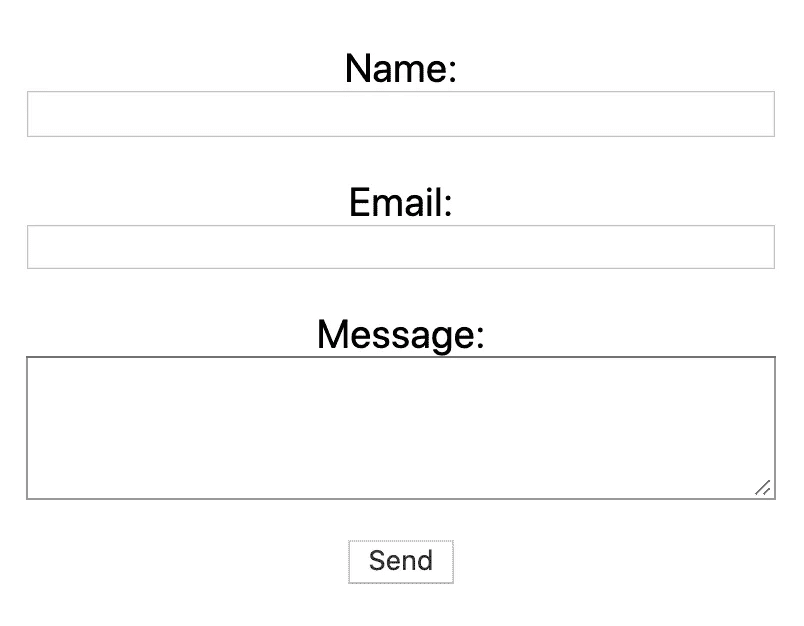
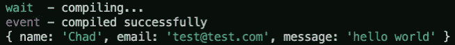
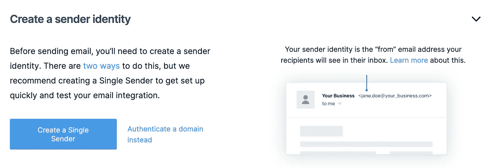
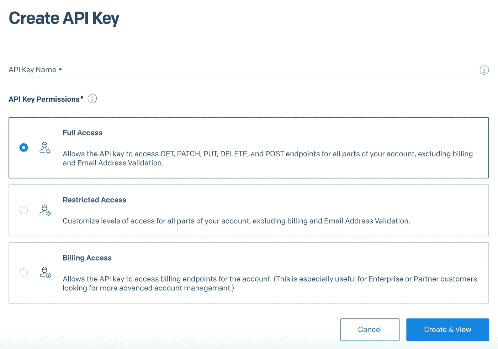
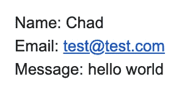

# 如何在 Next.js 中创建工作联系人表单

> 原文：<https://betterprogramming.pub/how-to-create-a-working-contact-form-in-next-js-459d1fc992ea>

## 使用 SendGrid 和 Next.js API 路由给自己发送一封电子邮件


照片由 [Thanhy Nguyen](https://unsplash.com/@thanhy_99?utm_source=medium&utm_medium=referral) 在 [Unsplash](https://unsplash.com?utm_source=medium&utm_medium=referral) 上拍摄。

能够与网站用户交流总是很重要的。可能是想雇用你的潜在客户，也可能只是对你有反馈或想给你留下好评论的用户。

当涉及到与用户交流时，您可以采取不同的选择。您可以尝试以下选项之一:

*   写下您的电子邮件地址，以便用户向您发送电子邮件。
*   创建一个打开电子邮件信使的表单。
*   创建一个将数据直接发送到您的电子邮件的表单。

在本文中，我们将研究如何实现第三种选择。

我们将创建一个联系表单，直接向您发送电子邮件。没有必要让用户复制你的邮件或者打开一个新的窗口给你发邮件。用户可以将数据直接输入到表单中，当邮件发出时，您会在电子邮件中收到该消息。

这个联系表单将使用 [Next.js](https://nextjs.org/) API routes 和 SendGrid 邮件服务 API 构建。

# 在 Next.js 中创建一个表单

首先，我们需要在 Next.js 中创建一个表单，在这个例子中，我将使用`create-next-app`来生成一个新项目。然后，我将在`index.js`文件中创建一个基本表单。

该表单将有三个输入:姓名、电子邮件和消息。还有一个提交表单的按钮。每个输入将是一个受控输入，使用 React 的`useState`钩子。



现在，我已经创建了`onSubmit`函数来将名称、电子邮件和消息作为对象记录到控制台。


我还添加了一些基本的样式，以增加每个输入之间的间距，并使表单在页面上居中。

如果您正在构建自己的表单，我相信您会想要添加更多的样式。我也建议添加一些类型的验证。如果你正在寻找一种处理表单数据的好方法，我会推荐使用 [React Hook Form](https://react-hook-form.com/) 。如果您想开始，请查看下面的文章:

[](https://blog.devgenius.io/the-easiest-way-to-deal-with-forms-in-react-ad6bc1250829) [## React 中处理表单的最简单方法

### 使用 React 钩子形式来提高应用程序的性能

blog.devgenius.io](https://blog.devgenius.io/the-easiest-way-to-deal-with-forms-in-react-ad6bc1250829) 

# 创建 API 路由

接下来，我们将使用 Next.js 提供的 API 路由来设置一个 API 端点。如果您不熟悉如何使用 Next.js API routes，请查看文档。

总而言之，`pages/api`文件夹中的任何文件都被视为 API 端点。

对于我们的例子，在`pages/api`文件夹中创建一个名为`contact.js`的新文件。在这个文件中，我们将设置一个基本的 API 端点。

首先，我们希望将 JSON 中的`req.body`解析成一个对象。然后，我们将发送`200`的回复。现在，我们将把`req.body`记录到控制台，以确保我们正确接收数据。

```
export default (req, res) => {
  const body = JSON.parse(req.body);
  console.log(body);
  res.status(200).json({ status: 'OK' });
};
```

回到`index.js`文件，我们将使用 Fetch API 向我们刚刚创建的 API 端点发出 POST 请求。

在`handleSubmit`函数中，添加以下 POST 请求。对于请求体，我们获取数据对象并将其转换为 JSON 字符串。

```
fetch('/api/contact', {
  method: 'post',
  body: JSON.stringify(data),
});
```

如果我们再次提交表单数据，我们将会看到和以前一样的数据——只是这一次，它被作为`req.body`记录在终端中。



# 设置 SendGrid 帐户

既然我们的表单和 API 端点已经设置好了，我们需要用 [SendGrid](https://sendgrid.com/) 创建一个帐户。访问他们的网站并注册一个新帐户。

对于我们的例子，我们将使用两个电子邮件地址。一个是我们将用作发送者的电子邮件地址，另一个是我们将用作接收者的电子邮件地址。使用您想要用作发件人的电子邮件地址创建一个新帐户。

创建帐户后，点击“创建单一发件人”按钮。如果您没有看到下面的按钮，您也可以在“设置”->“发件人身份验证”中找到它。



填写“创建发件人”表单中的必填字段。在“发件人电子邮件地址”和“回复”字段中，输入您注册时使用的同一封电子邮件(发件人电子邮件地址)。

然后访问您的电子邮件收件箱。您应该收到了来自 SendGrid 的电子邮件，要求您验证您的身份。

# 创建 API 密钥

接下来，我们需要一个 SendGrid API 密钥。访问设置-> API 密钥。一旦出现，点击【创建 API 密钥】按钮。



给你的 API 密匙取一个名字，然后选择“完全访问”您还可以在这里自定义权限，但是对于我们的示例，我们可以将其保留为“完全访问”

在下一个屏幕上，您将看到您的 API 密钥。请务必复制这一页，因为一旦你离开这一页，你就再也看不到它了。如果您意外关闭了此页面或丢失了副本，您将需要创建一个新的 API 密钥。

# 将 API 键作为环境变量添加

将您复制的 API 密钥添加到 Next.js 中。因为这是一个秘密密钥，所以我们希望将其添加为一个环境变量。Next.js 内置了对[环境变量](https://nextjs.org/docs/basic-features/environment-variables)的支持，所以不需要安装任何第三方包。

在项目的根目录下创建一个名为`.env.local`的新文件。在这个文件中，创建一个名为`SENDGRID_API_KEY`的变量，并将其设置为等于您的 API 键。

```
SENDGRID_API_KEY=YOUR-API-KEY
```

# 添加 SendGrid 邮件 API

最后，我们可以把所有的东西放在一起。我们将使用 [SendGrid 邮件服务](https://github.com/sendgrid/sendgrid-nodejs/tree/main/packages/mail)将 SendGrid 连接到我们的 POST 请求。

首先，将包安装到您的项目中。

```
npm install --save @sendgrid/mail// oryarn add @sendgrid/mail
```

在`contact.js`文件中添加`@sendgrid/mail`并设置 API 键。因为我们将 API 密钥存储在一个`.env.local`文件中，所以我们可以使用`process.env.SENDGRID_API_KEY`来访问它。

```
const mail = require('@sendgrid/mail');mail.setApiKey(process.env.SENDGRID_API_KEY);
```

然后，在我们创建的 API 端点中，我们将添加一些东西。

首先，我们将创建一个消息变量来显示从请求体收到的数据。

```
const message = `
  Name: ${body.name}\r\n
  Email: ${body.email}\r\n
  Message: ${body.message}
`;
```

接下来，我们将创建一个数据对象，并将其传递给 SendGrid。该对象将包括下列属性。

```
const data = {
  to: 'SENDER-EMAIL',
  from: 'RECEIVER-EMAIL',
  subject: `New message from ${body.name}`,
  text: message,
  html: message.replace(/\r\n/g, '<br />'),
};
```

在`to`属性中，添加您想要用来接收消息的电子邮件。在`from`属性中，添加您想要用来发送消息的电子邮件(与您使用 SendGrid 验证的电子邮件相同)。

最后，我们将把它变成一个异步函数，并使用 send 函数发送数据。

```
await mail.send(data);
```

最终的`contact.js`文件将如下所示。

现在，我们可以测试这个。如果我们从联系表单中提交相同的数据，我们应该会在收件箱中收到一封如下所示的电子邮件:



# 结论

感谢阅读！我希望这篇文章对您使用 SendGrid 和 Next.js 创建工作联系表单有所帮助。

以这种方式创建您的联系人表单可以改善用户体验，让用户更容易与您联系。

如果您想了解更多关于 Next.js 以及如何处理路由的信息，请查看下面的文章:

[](https://levelup.gitconnected.com/how-to-handle-routing-in-your-next-js-app-6ba71280b922) [## 如何在你的 Next.js 应用中处理路由

### 查看页面目录、动态路由、链接组件和用户外部挂钩

levelup.gitconnected.com](https://levelup.gitconnected.com/how-to-handle-routing-in-your-next-js-app-6ba71280b922) 

# **资源**

*   next . js—[https://nextjs.org/](https://nextjs.org/)
*   发送网格—[https://sendgrid.com/](https://sendgrid.com/)