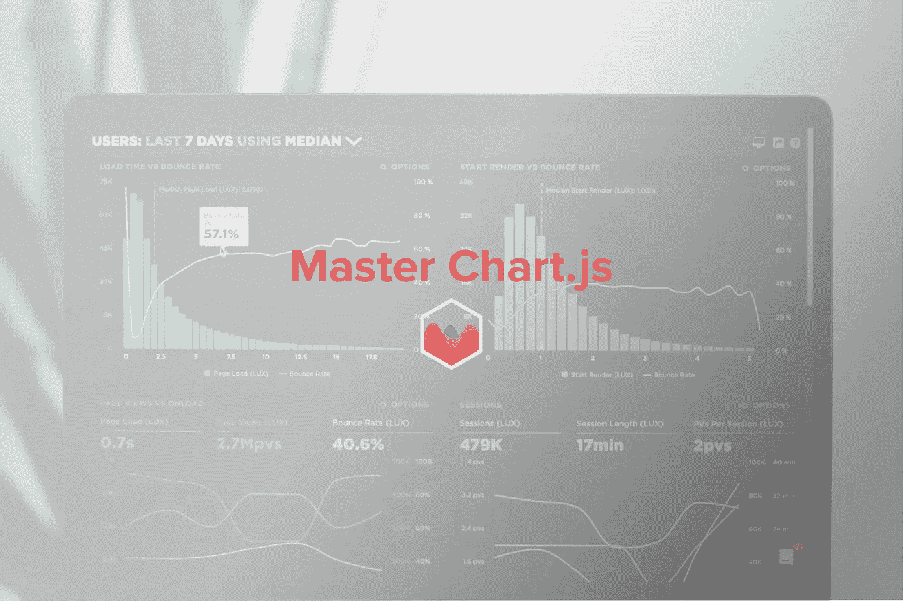
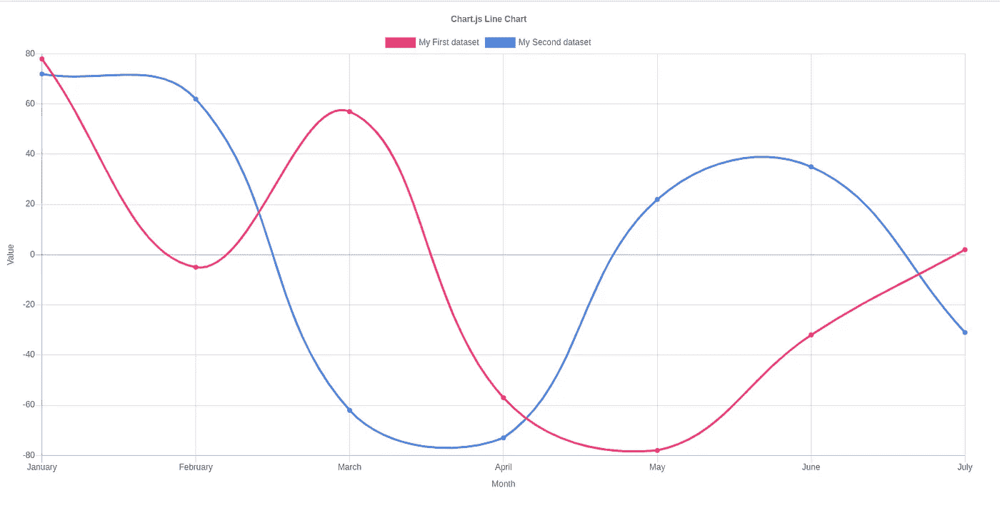
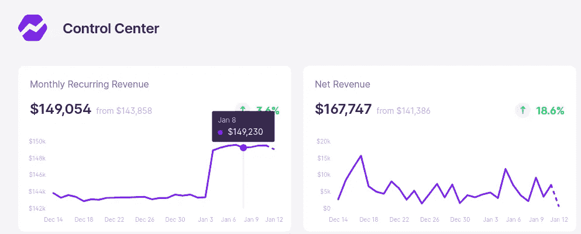
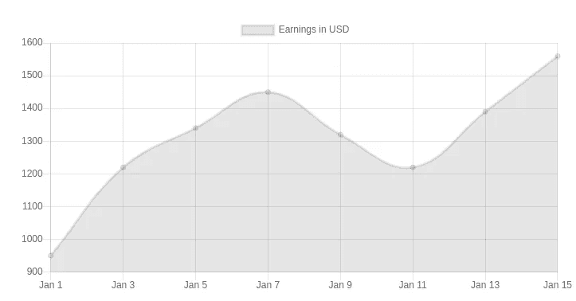
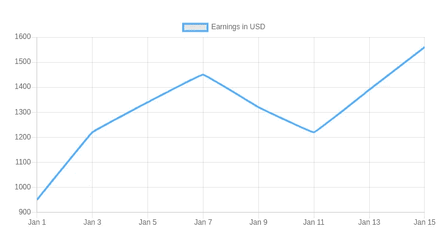
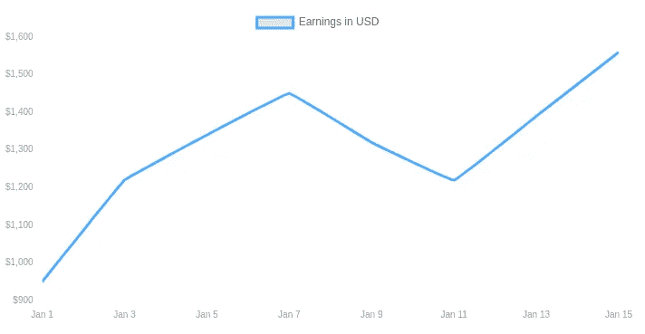

# 如何使用 Chart.js 创建美观的可视化效果

> 原文：<https://betterprogramming.pub/how-to-create-aesthetically-pleasing-visualizations-with-chart-js-4b3bb619c3ff>

## 使用开源软件升级你的图表游戏

[卢克·切瑟](https://unsplash.com/@lukechesser?utm_source=unsplash&utm_medium=referral&utm_content=creditCopyText)在 [Unsplash](https://unsplash.com/s/photos/charts?utm_source=unsplash&utm_medium=referral&utm_content=creditCopyText) 上的照片(作者编辑)。

前端开发人员发现处理前端图表很困难，这是因为他们通常不处理`canvas`或自定义`svg`元素。由于所有的图表库都使用这两种方法，所以不难理解为什么不容易。

[Chart.js](https://www.chartjs.org/) 是一个免费的开源库，可以取代购买 Highcharts 等库的昂贵许可证的需要。这些付费库通常非常强大，您不会在 Chart.js 中找到这么多功能，但是您仍然可以做很多事情——尤其是对于更简单的项目。

我发现 Chart.js 图表的默认外观充其量也就一般，所以我将解释如何使用该库创建漂亮的图表。

这是默认折线图的样子，但我绝不会在实际生产环境中使用这样的东西，因为它会破坏仪表板的整体外观:

为了简单起见，我将选择一个我喜欢的图表，并解释如何为您的图表创建完全相同的外观。我喜欢 bare metrics[上的图表，所以我将使用不同的颜色复制这种外观。](https://demo.baremetrics.com)

现在让我们从 Chart.js 中的一个基本折线图开始。

*注意:你可以跟着代码练习。文章的最后给出了完整的代码。*

这是一个简单的折线图，只有最基本的设置，看起来像这样:

# 设计线条本身

让我们看看如何设计这一行，使它看起来更像我们的例子。为了避免公然复制图表，我将在示例的其余部分使用蓝色( *#3ABEFF* ) ):

让我们解释一下我们正在做的事情的基本情况。我们原来的线太细，没有合适的颜色。更重要的是，它显示了图表中每个点的点，并且在线和 X 轴之间有一个填充。最后，我们的原始图表太弯曲了，而我们正在使用的例子没有那么弯曲。

*   通过设置`borderWidth`，我们使线条变得更粗。
*   通过将`fill`设置为`false`，我们消除了图表和 X 轴之间的填充。
*   属性为线条本身设置颜色。
*   使用`pointRadius`和`pointHoverRadius`，我们确保显示的点(或点)在任何时候都是隐藏的，包括在悬停时。
*   使用`lineTension`，我们降低了线条的弯曲度。

这是我们现在的图表:

# 改善电网

我们还有改进的空间，所以让我们隐藏网格线，使图表看起来更干净。

我们需要创建一个`options`对象，并将其传递给我们的`Chart`构造函数。如果您需要了解基本用法，请随意查阅 Chart.js 文档的[入门](https://www.chartjs.org/docs/latest/getting-started/)部分。

制作`display`和`drawBorder` `false`将确保隐藏所有网格线，包括 X 轴和 Y 轴的边界。您可能注意到了，`xAxes`和`yAxes`接受数组。这是针对有多个数据集的情况。我们这里只有一个，所以没什么可做的了。

# 自定义刻度

如果您不确定什么是刻度，它们是图表底部的小标签和图表左侧的值。我们也想定制它们，让它们看起来像我们想要的那样。

我在这里只显示了`yAxes`，但是你也可以将`fontColor`和`fontSize`传递给`xAxes`来改变颜色和字体大小。

`callback`方法允许我们以任何想要的方式定制字符串。在这种情况下，我们在前面加上一个货币符号，但也使用正则表达式规则在大数中包含逗号(例如，1000 显示为 1，000)。

让我们看看改进网格和刻度后我们有什么。看起来我们正在到达那里，不是吗？

# 创建自定义 HTML 工具提示

现在是最困难但也是最重要的事情:创建漂亮的定制 HTML 工具提示来替换 Chart.js 附带的通用工具提示。

创建自定义 HTML 工具提示允许您完全自定义它们，并获得美观的结果。

让我们看看如何使用 Chart.js 来实现这一点。在`options`中，您必须使用`tooltips`配置:

让我们一个接一个地看一下这些配置，这样您就能理解一切是如何工作的。

*   `enabled`:表示是否应该启用默认的 Chart.js 工具提示。我们必须将其设置为`false`来使用我们自己的自定义工具提示。
*   `custom`:每当工具提示必须显示时，我们可以设置一个自定义回调。在我们的例子中，我们将值设置为`processTooltipModel`，我们将在后面创建它。
*   `intersect`:当`intersect`设置为`true`时，默认情况下，只有当用户的光标与线上的点相交时，工具提示才会出现。我发现当用户水平移动时显示工具提示比 UX 方式好得多，即使没有交叉。
*   `mode` : 使用`index`模式，工具提示将出现在 X 方向最近的项目上。例如，如果我们使用`nearest`，它会找到两个方向上最近的项目，而`point`只会在我们与线上的实际点相交时显示工具提示。

现在让我们为工具提示创建 HTML 部分:

我们需要将图表包装在一个容器中，这样当我们定位工具提示时，它将相对于图表的容器。我们有两个空的部分:一个用于标签，另一个用于值，我们将在需要时动态更新。

现在让我们创建`processTooltipModel`函数来更新我们的工具提示:

我们来解释一下这是怎么回事。如果工具提示模型没有主体，这意味着我们没有什么可显示的，这就是为什么我们`return`。否则，我们使用工具提示模型中的值来动态更新工具提示。

*注意:如果你使用 Vue、React 或 Angular，你可以将工具提示模型或其属性作为道具来动态定位工具提示组件。*

`caretX`和`caretY`向我们显示了工具提示的 X 和 Y 位置，因此，我们使用它们来设置`left`和`top` CSS 属性。我们还将`display`设置为`block`以显示工具提示元素。最后，我们用实际值替换值和标签部分。

注意:我们根据工具提示的高度从顶部位置减去一个额外的位，以在工具提示和行之间创建一些空白。

为了完成这个例子，下面是容器的 CSS 和使一切工作的工具提示:

而这就是结果！这个例子中的工具提示非常简单，但是你可以用 CSS 对它进行任意的定制，以得到你想要的结果。

作者创作的演示 GIF

## *补充说明*

*   您在这条线上看到的点是通过在工具提示中添加一个`after`伪元素来模拟的。由于工具提示总是与线条保持一定的像素距离，因此很容易对齐模拟点。
*   示例图表显示了一条穿过该点并一直延伸到 X 轴的直线。这可以简单地用一个`before`伪元素来完成。
*   对于图表中更难的自定义元素，你必须学会如何在`canvas`中渲染，这样你才能真正掌握这个库。但是默认的功能通常已经足够了。

# 结论

js 是一个强大的图表库，适用于所有前端应用程序。如果你学会了我上面概述的基础知识，你就可以创建美观的图表。

现在，您应该能够定制您的线条、网格、记号，并创建定制的 HTML 工具提示。利用这些知识，您可以创建有用的图表，在您的应用程序中提供更多的可视化。

你可以在 [GitHub](https://gist.github.com/arisp8/4fac5b0eb30b4306c8b718778d43efab) 上找到完整功能代码的要点。