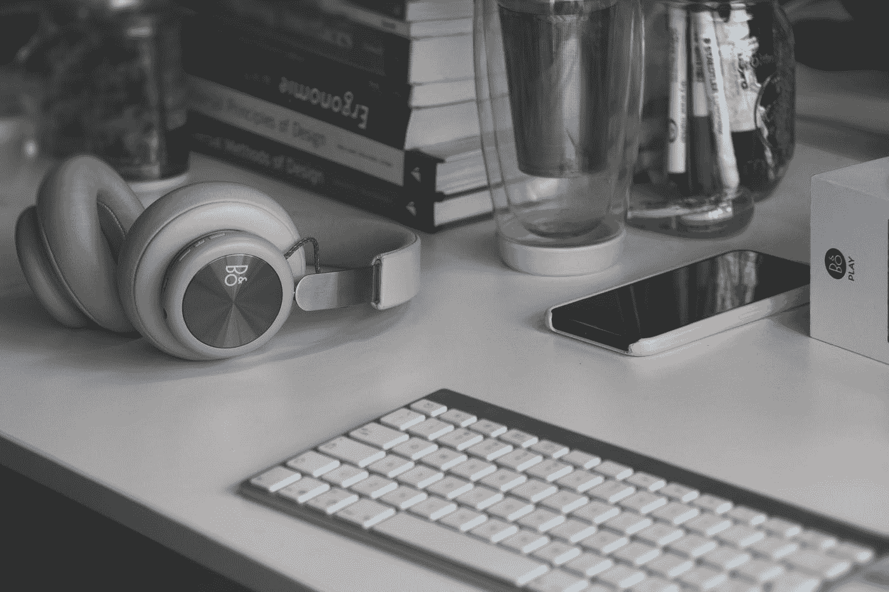
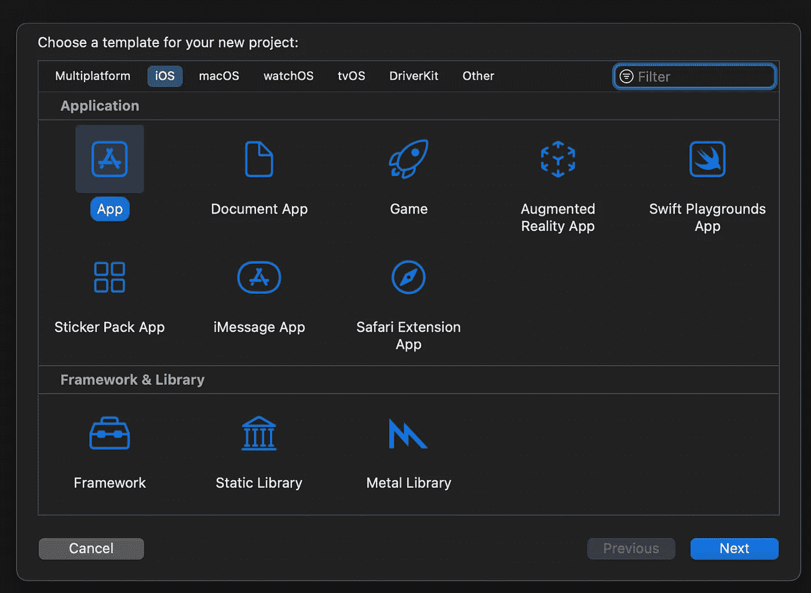
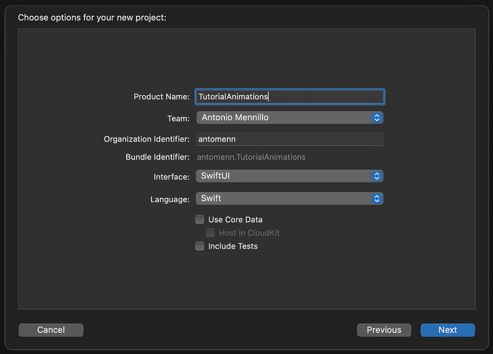
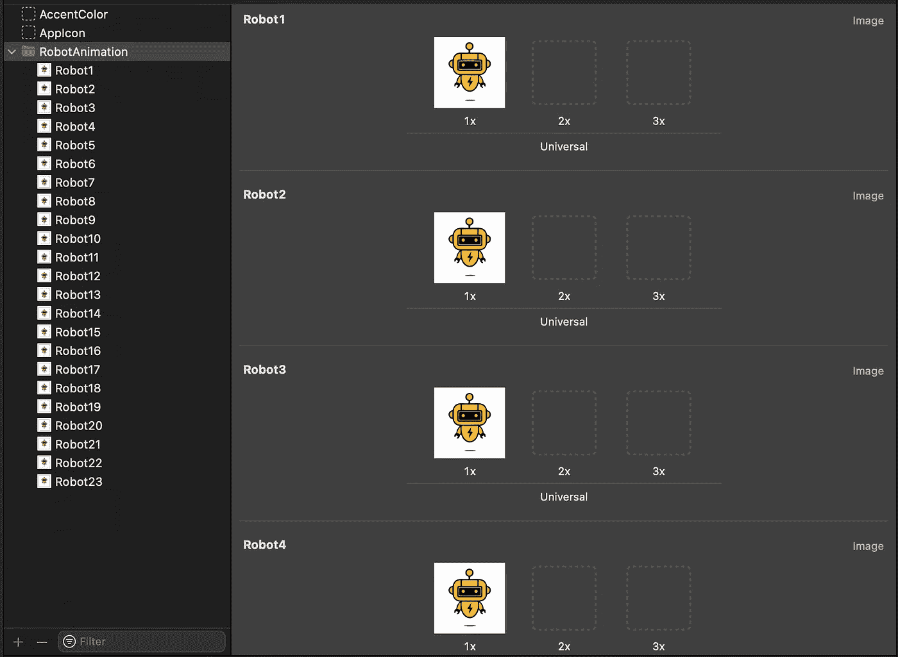
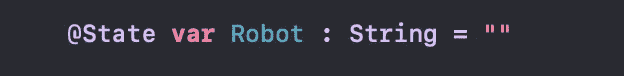
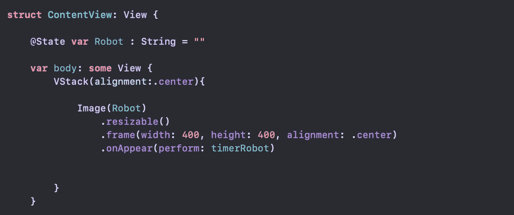
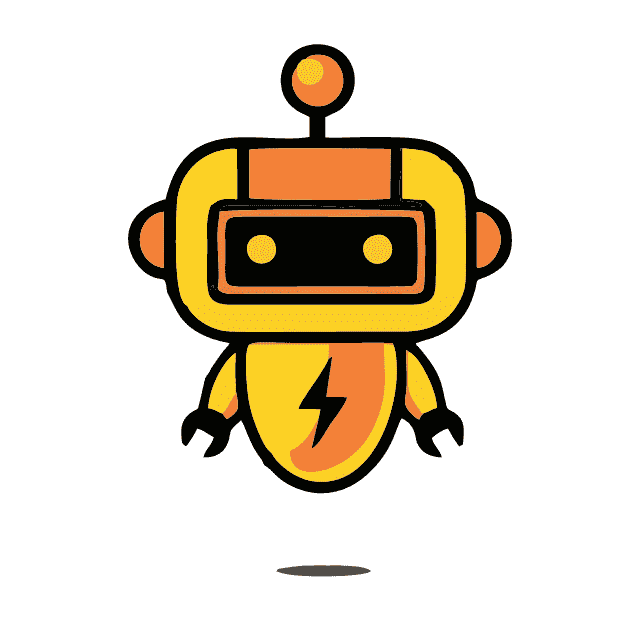

# 如何在 SwiftUI 中添加令人惊叹的逐帧动画

> 原文：<https://betterprogramming.pub/how-to-create-amazing-animations-in-swiftui-3c2970ee6e0>

## 在您的 iOS 应用程序中添加令人惊叹的动画

照片由[西格蒙德](https://unsplash.com/@sigmund?utm_source=medium&utm_medium=referral)在 [Unsplash](https://unsplash.com?utm_source=medium&utm_medium=referral) 上拍摄

在这里你会发现所有的步骤，将引导你在 SwiftUI 中创建复杂而美丽的逐帧动画，无需任何外部框架。

# **简介**

动画通常是使我们的应用程序更加漂亮和动态的关键，但是要插入它们，我们必须求助于外部框架/豆荚，比如 Lottie 或类似的东西。

在这篇文章中，你会发现一个非常简单的方法，可以让你不用任何外部工具 就可以制作任何类型的动画，甚至是最复杂的 ***！***

# *创建新的 Xcode 项目*

首先，我们去创建我们的项目，我们选择作为平台 iOS，我们去应用程序，然后我们写下项目的名称，并注意选择 SwiftUI 作为界面。

首选

第二选择

之后，我们将拥有默认的内容视图，并准备好实现我们的代码。

# *整理您的资产文件夹以简化代码*

在构建我们的代码之前，我们必须首先准备资产，这个功能对于项目的成功是必不可少的*。*

*你必须将动画的所有帧导入到*资产文件夹*中，但是要注意如何重命名这些文件。*

*遵循的格式是:"`animation_name`"加上"`number_of_frame`"在我们的例子中，例如我们将有"`Robot1`"、"`Robot2`"直到"`Robot23`"，这是我们动画的最后一帧，你将在下一步中发现为什么这个操作如此重要！*

**

*资产文件夹*

*在这一步结束时，您应该有一个类似于图中所示的资产文件夹。*

# *让我们开发我们的解决方案*

*在修复我们的资产后，我们可以最终开发我们的代码，它背后的逻辑非常简单，但它肯定能够满足您的期望。*

*首先，让我们定义一个`String`类型的`animation_name`变量，这将是我们项目的重点。*

**

*动画变量*

*完成后，让我们定义一个函数，该函数的任务是定义我们将使我们的创作“动画化”的速度，事实上，由于索引将从 1 滚动到我们动画的最后一帧，它将在某个时间间隔内改变我们字符串的值，当索引到达最后一帧时，有一个控件将它带回开头，因此动画将无限重复。*

*这样，我们从第一个到最后一个调用每个资产(这就是为什么我们这样重命名它们)。*

**

*定时器功能*

*正如你在我们的例子中看到的，计时器会改变字符串的名称，然后每 0.08 秒帧一次，这样我们会有一个非常流畅的动画。*

*最后，我们必须在内容视图中添加我们的动画，首先创建一个`VStack`来插入它，然后我们将一个`Image`重命名为之前定义的字符串，并添加一个`modifier.OnAppear`来帮助我们每 0.08 秒回忆一次每一帧，之后我们的机器人将作为一个美丽的动画出现在屏幕上！*

**

*内容视图已更新*

# *完整的代码和结果*

**

*决赛成绩🎉*