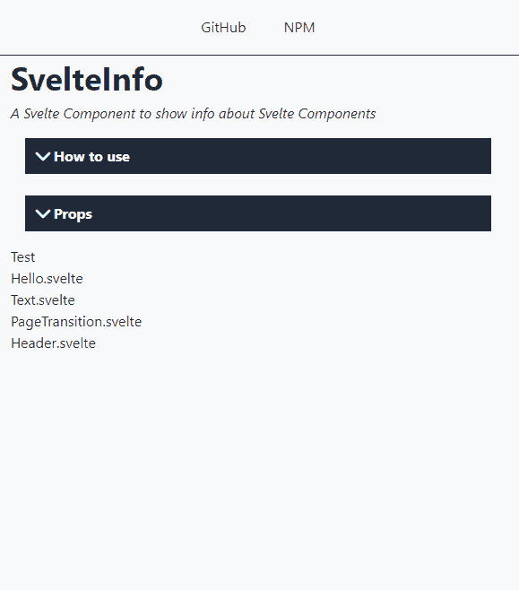
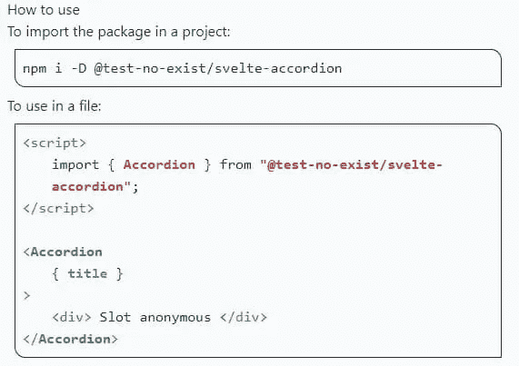
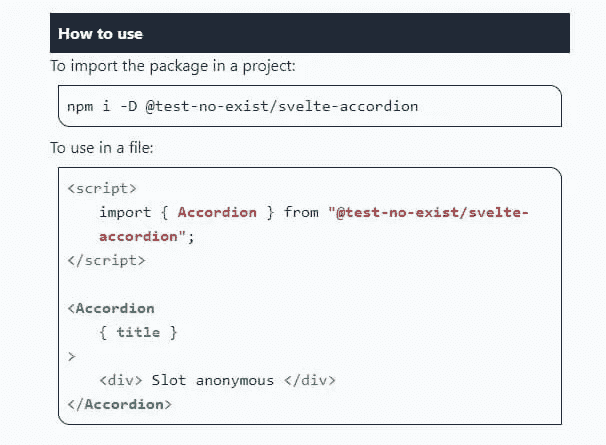
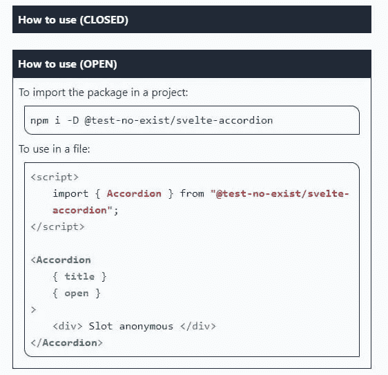
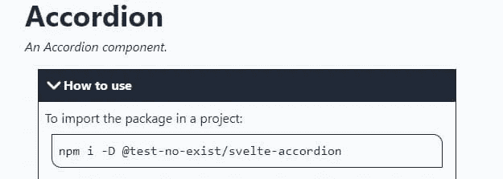
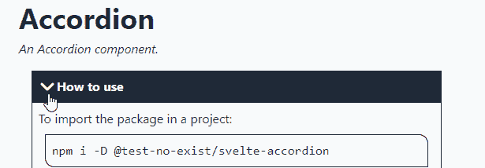
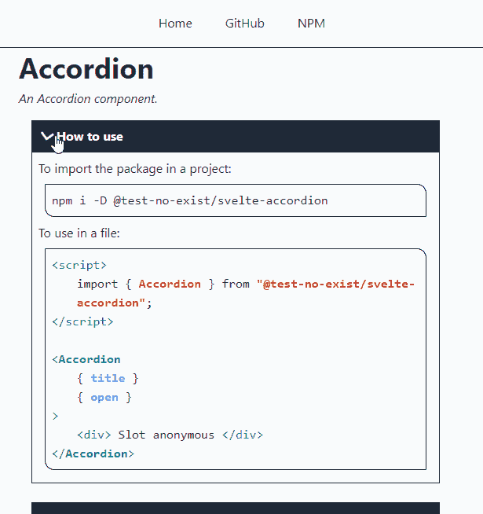
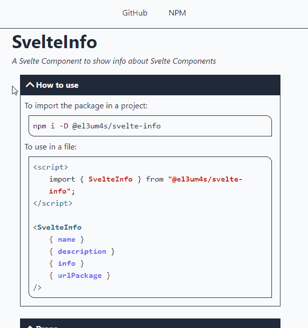

# 如何创建一个苗条和顺风的手风琴元素

> 原文：<https://betterprogramming.pub/how-to-create-an-accordion-element-with-svelte-and-tailwind-5266768bc126>

## 您可以使用 Svelte 和 TailwindCSS 来创建时尚和动态的 web 构建元素——就像手风琴一样

照片由 [Yan Krukov](https://www.pexels.com/@yankrukov?utm_content=attributionCopyText&utm_medium=referral&utm_source=pexels) 从 [Pexels](https://www.pexels.com/photo/close-up-shot-of-a-person-playing-accordion-8520247/?utm_content=attributionCopyText&utm_medium=referral&utm_source=pexels)

迟早我会找到时间来报告我在这几个月里学到的东西。例如，很难预测完成一项任务需要多长时间。

我的最后一个想法(创建一个自动系统来记录苗条的组件)比我预期的要长。这项技术并不复杂，但是有太多我没有预见到的细节。

此外，我想了解事物如何工作的愿望导致我花了很长时间来重新创建一些基本元素。按时间顺序排在最后的是手风琴:一个可以通过点击打开和关闭的元素。

# 我想建造什么

简单的东西，不依赖于其他库。一些非常轻，可定制的东西。[纤薄的](https://svelte.dev/)让它非常容易打造。并且 [TailwindCSS](https://tailwindcss.com/) 允许你管理 CSS 样式。

# 让我们从结构开始

基本结构非常简单，只有 2 个部分:

*   一个用作组件标题以插入部分标题；
*   另一个是简单的槽:你可以隐藏和显示内容。

当然，在没有添加任何 CSS 样式或动作的情况下，结果相当令人失望:

# 让我们添加一些样式

我添加了一些样式来突出元素的标题和它的边距。对于这个组件，我想使用单色风格。我被这种颜色的运用所吸引，但那是另一回事了。

所以我从给标题上色开始:

我不能给*槽*添加 css 样式。但是我可以将它放在一个 *div* 中，并将其样式化:

# 打开和关闭

Svelte 允许你以一种非常简单的方式隐藏和显示页面的一个元素。使用一个简单的与*道具*相关的`if...then...else`条件，我可以检查它的状态:

# 让我们添加一个旋转图标

我需要一种点击打开元素的方法。为此，我需要一个按钮和一个动画来突出点击。我找到了约翰尼·马格里皮斯的视频🍔):

推荐看视频。首先，我需要另一个组件， *Chevron.svelte* ，在其中插入一张`svg`图片:

我想添加一些样式来将其集成到主要组件的标题中:

这个图标的目的是作为一个按钮:当点击时，它打开或关闭折叠的基础部分。所以我把它放在一个`button`元素中，并添加了两个`props`:

我使用`open`道具作为 CSS 类。这样，当元素打开时，我可以改变图标。我想把它旋转 180 度。所以我添加了一些有用的 CSS 样式:

# 让我们向组件添加一个动作

现在图标完成了它的工作，我可以返回到主组件并插入一个动作:

通过点击图标，我终于可以打开和关闭手风琴了:

# 让我们添加一个转换

组件可以工作，但是看到页面的一部分突然出现又消失不是很好。为了解决这个问题，我可以使用 Svelte 的一个特性，即[过渡](https://svelte.dev/docs#svelte_transition):

这是最终的结果:

与往常一样，该代码可以从 GitHub 获得并下载:

 [## GitHub-El 3um 4s/Svelte-component-info:显示关于一个苗条身材的属性的信息…

### 显示苗条组件的属性信息。旨在简化文档的创建- WIP…

github.com](https://github.com/el3um4s/svelte-component-info) 

感谢阅读！敬请关注更多内容。

***不要错过我的下一篇文章—报名参加我的*** [***中邮件列表***](https://medium.com/subscribe/@el3um4s)

 [## 通过我的推荐链接加入 Medium—Samuele

### 阅读萨缪尔的每一个故事(以及媒体上成千上万的其他作家)。不是中等会员？在这里加入一块…

el3um4s.medium.com](https://el3um4s.medium.com/membership) 

*原载于 2021 年 11 月 28 日 https://blog.stranianelli.com**T21*[。](https://blog.stranianelli.com/how-to-create-an-accordion-element-english/)