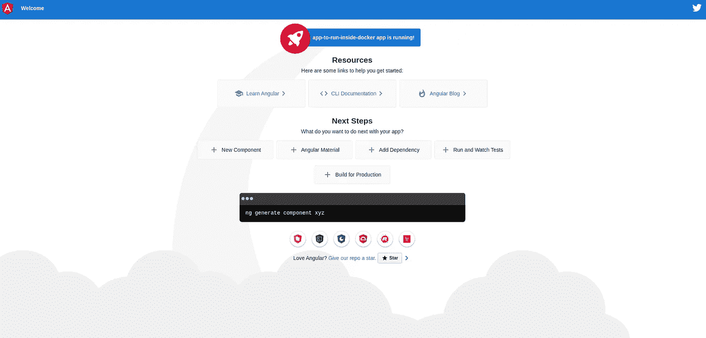

# 如何创建有角度的 Dockerfile 文件

> 原文：<https://betterprogramming.pub/how-to-create-an-angular-dockerfile-75c059e7f8e8>

## 创建角形容器的分步指南


照片由[贝内迪克特·盖耶](https://unsplash.com/@b_g?utm_source=medium&utm_medium=referral)在 [Unsplash](https://unsplash.com?utm_source=medium&utm_medium=referral) 拍摄

# 欢迎加入

在这篇文章中，你将学习如何创建一个有角度的 Docker 容器。最后，对于角度应用，您应该能够做到这一点。如果你没有任何角度的经验，不要害怕阅读这个。你不需要那个。

您将更深入地了解 docker 文件是如何为实际应用程序创建的。这会让你成为一个更好的开发者，或者理解 Docker 能为你的团队做什么。

现在，您可以将包装在 Docker 容器中的应用程序移交给任何其他开发人员(例如后端)。如果他们安装了 Docker，就不需要其他东西了。听起来甜得不像真的，对吧？

我会一步一步地告诉你怎么做。

这部作品分为四个部分:

*   创建一个小的示例应用程序
*   上`dist`文件夹。
*   建造/服务于多级码头建造
*   将应用程序添加到 Docker-Compose 文件

# 首先我们需要一份申请，对吗？

所以我假设你是一个 Angular 应用程序的开发人员，并且你已经有一些前端开发的知识。但是如果你不是，也继续读下去，因为每个人都应该可以理解这一点。

我会解释我所做的一切。首先，我们需要 npm(节点包管理器)。如果您还没有安装它，您可以使用[这个](https://www.npmjs.com/get-npm)链接来安装。您可以将 npm 视为 JavaScript 编程语言的包管理器。我们将使用 npm 来安装包或库。

首先，我将使用 Angular 命令行界面生成一个新的 Angular 项目，也称为 [Angular CLI](https://cli.angular.io/) 。如果您还没有安装它，请在命令行中全局安装它(带有`-g`标志):

```
npm install -g @angular/cli
```

现在，我们可以在命令行中创建一个角度应用程序。我们将创建一个新的应用程序——我已经选择了名字`app-to-run-inside-docker`。请随意为您的应用程序选择一个更现实的名称。

使用`ng new`命令，就像这样:

```
ng new app-to-run-inside-docker
```

在命令提示符下运行该命令时，需要回答一些问题。当他们要求你添加角度路由时，我已经答应了。对于样式表格式，我选择了 [SCSS](https://sass-lang.com/) ，但是其他的也可以。瞧，我们现在有一个应用程序了。不相信我？

好吧，那我们去看看。直接跳到新创建的文件夹中:

```
cd app-to-run-inside-docker
```

让我们使用`ng serve` 命令来构建新创建的 app，并在本地提供服务。这意味着您可以在浏览器中查看它:

```
ng serve
```

现在在你的浏览器中检查`[http://localhost:4200/](http://localhost:4200/)`。你会看到和我一样的东西。这意味着您的应用程序已经生成，并且正在本地运行:



欢迎使用您的角度应用

请随意使用以下命令运行测试:

```
ng test
```

我这边一切都是绿色的，我确信如果你按照我描述的步骤去做，同样的事情也会发生在你身上。我们现在有了一个可用的应用程序。你可以随意改变它。我能够并且将要给出的唯一建议是遵循[测试驱动开发](https://www.guru99.com/test-driven-development.html)方法。

# 创建 Dockerfile 文件

因为这篇文章是关于将应用程序投入生产的，所以我不会用我的实现细节来烦你。让我们按照基本步骤来完成它。首先要做的是构建应用程序。在 Angular 中，这与运行以下命令一样简单:

```
ng build --prod
```

如果你检查当前目录，你会注意到一个可分发的文件夹，`dist`，已经被创建。这都归结为一堆静态文件。这些文件是向外界展示您的应用程序所需的一切。

所以我们可以做的第一件事是将`dist`文件夹中的文件移动到 Docker 容器中。我们需要一个 web 服务器来显示应用程序。我将使用 [Nginx](https://hub.docker.com/_/nginx) (发音为 *engine x* )来显示`dist`文件夹的静态内容。

让我来引导您了解初始 Dockerfile 文件的内容。

```
FROM nginx:alpine
```

第一行没什么刺激的。我们正在重用 Alpine Linux Nginx Docker 映像。我推荐它，因为它会产生一个非常小的 Docker 图像，但它还有其他优点。点击阅读所有关于[的内容。](https://nickjanetakis.com/blog/the-3-biggest-wins-when-using-alpine-as-a-base-docker-image)

```
COPY /dist/app-to-run-inside-docker /usr/share/nginx/html
```

第二行将`dist`文件夹中的静态应用程序文件复制到 Nginx 将服务的 HTML 文件夹中。这两行是我们启动应用程序在其中运行的容器所需要的全部内容。出于文档的目的，我将再添加一行。

我决定添加下面一行:

```
EXPOSE 80
```

这是因为我想记录我打算随容器一起发布的端口。我们的应用程序将在端口`80`上运行，所以我保证每个人都能够在不了解 Nginx 的情况下解决这个问题。

因此，让我们构建并运行带有 Docker 标签`angular-app`的应用程序:

```
docker build -t angular-app .
docker run -it --rm -p 9000:80 angular-app
```

瞧，编译后的应用程序现在运行在端口`9000`上，映像只有 22.5MB。你现在可以访问`[http://localhost:9000/](http://localhost:4200/)`来查看应用程序。

如果你对 Docker 文件指令的语法有任何问题，请阅读 Docker [文档](https://docs.docker.com/engine/reference/builder/)或查看我写的一篇旧的[文章](https://medium.com/better-programming/what-goes-into-a-dockerfile-ff0ace591060?source=friends_link&sk=6a4bdaf97cb6e7e76afe8fc733a1023f)。作为这一部分的总结，我将在这里分享最初的 Dockerfile。

# 让我们更进一步

让我们面对现实吧。我以前说过，现在再说一遍。一个好的开发者是懒惰的。在上一节中，我需要每次都构建应用程序，然后使用 Dockerfile 文件构建图像。那太多了一步。

在任何时候，使用 Docker 文件构建 Docker 映像就足够了。这是可能的，我会告诉你怎么做。

```
FROM node:alpine
```

我将从使用 Node Alpine Ubuntu 图像开始。您需要知道的唯一一件事是，这个映像预装了 npm。在我撰写本文时，Node 运行的版本是 v13.7.0。

这是我们构建应用程序所需的一切。

```
WORKDIR /app
```

这个指令说要把所有东西打包到一个名为`app`的应用程序文件夹中。

```
COPY . .
```

让我们将本地应用程序文件夹中的每个文件复制到 Docker 容器中的这个`app`文件夹中。但是等等。我们不需要所有的文件。让我们通过将文件夹`dist`和`node_modules`放在一个`.dockerignore`文件中来防止它们被复制到 Docker 容器中。

```
RUN npm ci && npm run build
```

我要做的最后一件事是，确保我们得到一个干净的状态，并且安装`package-lock.json`文件中列出的确切依赖项，最后构建应用程序。如果我们使用 npm ci 而不是 npm install，我们将获得可靠的版本。

留给我们的唯一一步是如何将这个`dist`文件夹移向 Nginx Docker 容器。

我现在将向您展示完整的 docker 文件以及这些点是如何连接的。

我已经通过添加`AS my-app-build`改变了第一个`FROM`指令，它命名了这个 Docker 阶段。在第二阶段，我使用`COPY`指令将第一阶段的输出复制到第二阶段。

我在 Docker 中使用了一种叫做[的多级](https://docs.docker.com/develop/develop-images/multistage-build/)构建来完成这个任务。现在，您可以简单地构建 Docker 容器，并像步骤 1 中那样运行它。现在，应用程序将在执行 Docker 构建时构建。

请注意，该图像现在已经增长到 39.2MB，对于 Docker 图像来说是非常小的。完美。

```
docker build -t angular-app .
docker run -it --rm -p 9000:80 angular-app
```

# 还有一点

让我们面对现实吧。在实际情况中，您可能有一个或多个想要一起启动的应用程序正在运行。我还将包括如何从 Docker-Compose 文件启动它的要点。

`angular-docker`服务代表角度应用。请注意，您可以像在 run 命令中一样包含端口。要启动应用程序(在父文件夹中运行此命令)，现在可以运行以下命令:

```
docker-compose up -d
```

它将启动 Angular 应用程序，你可以通过执行`docker-compose` down 命令轻松地将它和其他应用程序一起拆除。

# 现在怎么办？

不要停在这里。开始使用 Docker 运行并与他人共享您的应用程序。通过做，你会更快地发现它。你可以自己尝试一下，我希望我的建议对你有用。