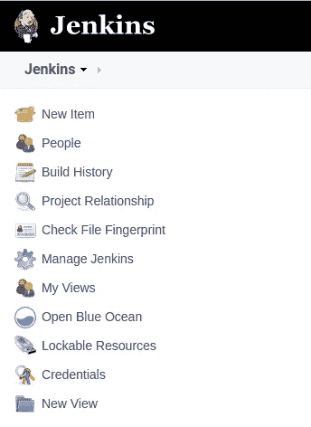
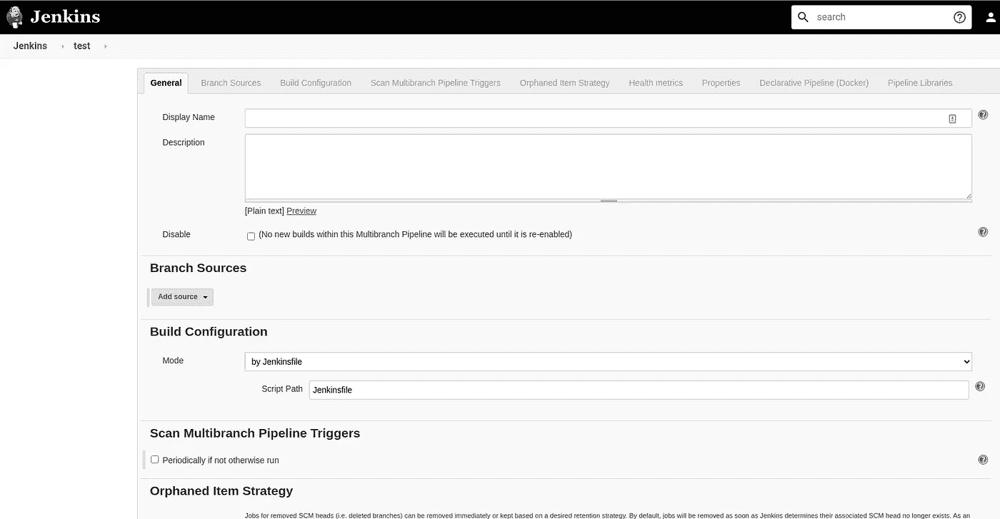
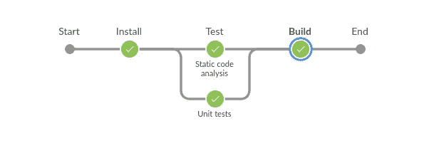

# 如何用 Jenkins 创建一个有角度的管道

> 原文：<https://betterprogramming.pub/how-to-create-an-angular-pipeline-with-jenkins-8040f1a0c0ee>

## 改善 CI 的逐步指南


[JJ 英](https://unsplash.com/@jjying?utm_source=medium&utm_medium=referral)在 [Unsplash](https://unsplash.com?utm_source=medium&utm_medium=referral) 上拍照。

在本文中，您将看到如何从头开始设置 Jenkins，并创建和运行 Angular pipeline——所有这一切只需大约五分钟。如果你不熟悉 Angular 也不用担心。同样的原则也适用于 Vue、React、Python、Java 和其他语言。所以放松点，因为我们就要开始了。

文章的结构如下:

*   陷害詹金斯
*   创建 Jenkinsfile
*   创建管道

# 陷害詹金斯

如果您已经熟悉 Jenkins，请随意跳过这一部分。

在这一节中，我们将按照[Jenkins 网站](https://www.jenkins.io/doc/book/installing/)上显示的步骤来安装 macOS 和 Linux。您还可以找到在 Windows 机器上开始使用的信息。

首先，让我们为 Jenkins 创建一个网络:

```
docker network create jenkins
```

添加两个卷以共享 Docker 客户端 TLS 证书并保存 Jenkins 数据。这样，当你关闭电脑或服务器时，数据不会丢失。请记住，如果删除这些卷，数据将永久丢失。

```
docker volume create jenkins-docker-certs
docker volume create jenkins-data
```

以下四个命令启动 Docker 容器:

```
docker image pull docker:dind
docker container run --name jenkins-docker \
  --restart unless-stopped \
  --detach \
  --privileged --network jenkins \
  --network-alias docker \
  --env DOCKER_TLS_CERTDIR=/certs \
  --volume jenkins-docker-certs:/certs/client \
  --volume jenkins-data:/var/jenkins_home \
  --publish 2376:2376\
  docker:dinddocker image pull jenkinsci/blueocean
docker container run --name jenkins-blueocean \
  --restart unless-stopped \
  --detach \
  --network jenkins \
  --env DOCKER_HOST=tcp://docker:2376 \
  --env DOCKER_CERT_PATH=/certs/client \
  --env DOCKER_TLS_VERIFY=1 \
  --volume jenkins-data:/var/jenkins_home \
  --volume jenkins-docker-certs:/certs/client:ro \
  --publish 8080:8080 \
  --publish 50000:50000 \
jenkinsci/blueocean
```

Jenkins 现在运行在 [http://localhost:8080，](http://HTTP://localhost:8080,)上，但是你必须做一个更棘手的步骤:你必须解锁 Jenkins。初始密码可以在 Jenkins CI blue ocean Docker 容器的一个文件夹中找到。我会告诉你如何取回这个。当你自己尝试的时候，确保你指定了正确的 docker [UUID](https://medium.com/better-programming/what-is-a-uuid-and-how-are-they-generated-17f0acbd7233) 。

```
**docker container ps** 4ec29afb280f        jenkinsci/blueocean
1ce11b131265        docker:dind
**docker container exec 4ec29afb280f cat /var/jenkins_home/secrets/initialAdminPassword****bd95aa5131a142b690795fa9427287a8**
```

在下一步中，您可以配置想要安装的插件。我将把那件事留给你。我安装了 Cobertura(用于 Java)和 Locale 插件，并去掉了 Subversion。安装后，您必须创建一个管理员用户。

在最后一步中，您必须设置一个 Jenkins URL(例如 [http://localhost:8080](http://localhost:8080/) )，但是我没有费心去更改它。最后，詹金斯重新启动，并完全安装。我们只花了几分钟。



詹金斯用户界面

# 创建 Jenkinsfile

让我们面对现实吧，定义一个好的管道有很多可能的方法。这只是一个简单的例子。如果您对改进渠道有任何建议，我们将非常乐意倾听。不要犹豫，在文末留下评论吧！

首先，指定一个基本 Docker 映像来运行我们的命令是很重要的。在撰写本文时，使用最新的 node Docker 映像似乎是一个不错的选择。

接下来，我们指定要检查的阶段。在这种配置中，指定了最容易识别的开发阶段:

*   Install —确保我们正确无误地安装了每个依赖项。
*   测试—列表、单元测试。为此，我们定义了两个可以并行运行的阶段。如果您有需要，可以随意添加集成或端到端测试。
*   构建——最后，我们的构建仍然有失败的可能。这是部署应用程序之前的最后一步。

请随意添加其他步骤。在这一点上，你有这么多的自由。自动部署或发布 Docker 映像，该映像可向有限数量的用户推广。这是你的选择。在结束这一部分之前，让我与您分享一下管道。将它放入项目根文件夹中的 Jenkinsfile(无扩展名)中:

詹金斯文件

# 创建管道

在 [http://localhost:8080](http://localhost:8080/) 上打开 Jenkins，创建一个新项目。实际上，这里不需要做太多。让我们创建一个“多分支管道”



创建管道菜单

将打开一个新菜单。在这里，您可以在许多其他内容中添加描述，但我们将只涵盖本文中最重要的部分。您应该查找名为“分支源代码”的部分，并选择 Git。接下来要做的事情是传递一个项目存储库(例如 https://github.com/user/project-name.git 的[)和你的凭证。这就足够了。](https://github.com/djFooFoo/dj-website.git)

我们再加一个东西，让它成为自动流水线。让我们轮询一下 GitHub 存储库的变化。启用“扫描多分支管道触发器”并传递一个合理的时间间隔。这将仅在存在源代码变更时触发构建(例如，每分钟)。这样，构件会自动触发。如果一分钟的时间太长，您可以降低时间间隔，以便稍后检查更改。

现在转到[http://localhost:8080/blue/organizations/Jenkins/pipelines](http://localhost:8080/blue/organizations/jenkins/pipelines)并运行您的第一个作业，如果它还没有运行的话。让我给你看看这个是什么样子的:



管道成功了！

# 结论

在本文中，Jenkins 管道在五分钟内创建完成，而且不费吹灰之力！为其他应用程序创建一个也不需要很多时间。请随意创建您自己的。我的结论是，对于很多开发者来说，Jenkins 已经足够了，而且非常稳定。

在云中做同样的事情不需要付出很多。你所需要的只是一些硬件，比如一台有几 GBs 内存的旧电脑和一台显示器，来创建一堵墙。

看完这篇文章你有什么想法？你打算试试吗？