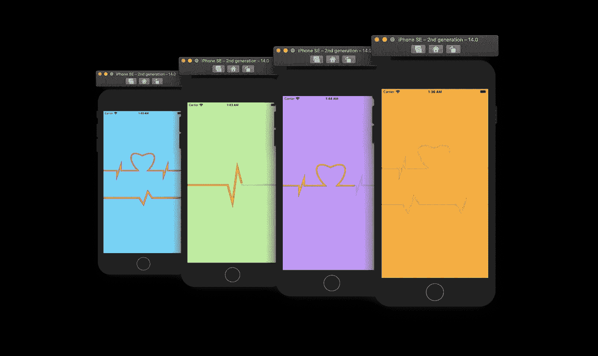
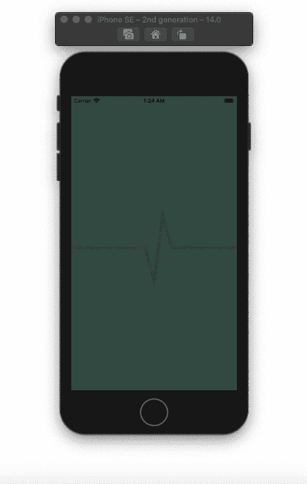
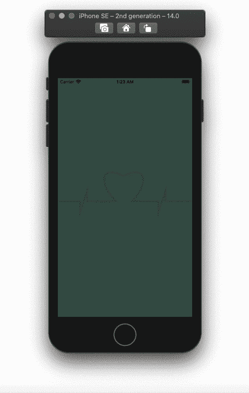

# 如何使用 SwiftUI 创建动画心跳形状

> 原文：<https://betterprogramming.pub/how-to-create-an-animated-heartbeat-shape-with-swiftui-a8c543cf31d2>

## 使用“路径”和“形状”修改器绘制心跳形状并制作动画

动画心跳形状与 SwiftUI。作者照片。

# 动画心跳(1)

## 心跳形状

创建单个心跳形状相对容易。决定你心跳的方向。从一条线开始，然后在你想要的心跳形状附近画第二条线。接下来，你需要添加两行不同的 y 值来创建节拍。最后，再添加两条线——一条回到矩形的中间，第二条线到达矩形/屏幕的末端。

在下面的例子中，您将看到我们如何利用矩形的`midX`、`midY`、`maxX`和`maxY`值来获得心跳形状:

## 心跳视图

创建一个新的结构视图，并将我们在上面创建的两个心跳形状堆叠在一个`ZStack`中。向第二个形状添加`trim`修改器，并向其传递两个值为`0`的状态变量。`trim`修改器将用于制作第二次心跳的动画。

## 动画

给`ZStack`添加一个高度为`300`的帧修改器和你喜欢的动画类型的动画。现在，在`body`变量之前定义一个计时器，然后将`onReceive`修饰符添加到`ZStack`。在`onReceive`修改器中，检查`trim`值，并根据你想要的动画风格在`0`和`1`之间改变它们。

# 动画心跳(2)

## 心形心跳

为了创建心形，我们需要确定位置，然后添加两条曲线。我们的第一条曲线将从`x`轴上靠近矩形中间的位置开始，其`y`值为-10。第二条曲线从最后一条曲线结束的地方开始，并以`y` =矩形的中点回到屏幕的中间。

## 心跳视图

对于我们在上面创建的同一个心跳视图，进行以下更改:

*   `Heartbeat shape`到`HeartShapeHeartbeat`。
*   从`8`到`6`的笔画线宽。
*   从`300`到`120`的框架高度。

最后，将`HeartbeatView`添加到`ContentView`中，并运行应用程序:

全部完成！感谢阅读。