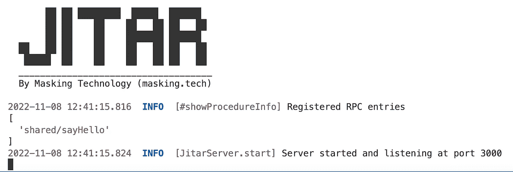
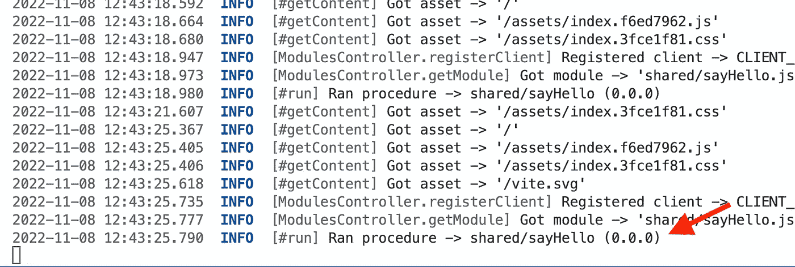
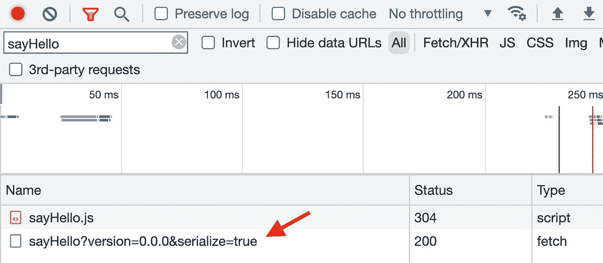

# 如何用 React 和 Jitar 创建一个无 API 的全栈 App

> 原文：<https://betterprogramming.pub/how-to-create-an-api-less-full-stack-application-with-react-and-jitar-602bcbabc66b>

## 了解如何使用 Jitar 来自动化全栈应用程序中的所有客户机-服务器通信


照片由[普拉蒂克·卡蒂亚尔](https://unsplash.com/@prateekkatyal?utm_source=medium&utm_medium=referral)在 [Unsplash](https://unsplash.com/?utm_source=medium&utm_medium=referral) 拍摄

在我的[上一篇文章](/how-i-speed-up-full-stack-development-by-not-building-apis-7f768335bec6)中，我写了通过不构建 API 来加速全栈应用程序的选项，以及我如何创建了 [Jitar](https://github.com/MaskingTechnology/jitar) 。

在本文中，我将深入研究如何在真实的全栈应用中使用我的。为此，我们将使用 [React](https://reactjs.org/) 和 Jitar 创建一个简单的应用程序。我喜欢类型安全，所以我将为这个应用程序使用 TypeScript。结果也可以在 [GitHub](https://github.com/petermasking/react-jitar) 上找到。

如果您已经阅读了本文，我假设您已经有了一些全栈经验。虽然本文使用 React 作为前端框架，但是也可以使用 Angular、Vue 等。

在我们开始之前，确保您的机器上安装了 [Node.js](https://nodejs.org) 版本 18.7 或更高版本。如果您还想使用 [TypeScript](https://www.typescriptlang.org/) ，请确保您安装了版本 4.4.2 或更高版本。准备，预备，开始！

# 步骤 1:设置一个 React 项目

为了创建 React 应用程序，我们将使用 [Vite](https://vitejs.dev/) 和 react-ts 模板。

```
npm create -y vite@latest react-jitar -- --template react-ts
cd react-jitar
npm install
npm run dev
```

在网络浏览器中打开`[http://localhost:5173/](http://localhost:5173/)`时，您应该会看到 Vite 和 React 标志。

接下来，我们将通过添加一个生成欢迎消息的简单函数来扩展我们的应用程序。为了稍后在应用程序中挂钩 Jitar，我们需要在`src`文件夹中创建一个共享文件夹。该文件夹包含客户端和服务器之间共享的所有组件。

```
cd src
mkdir shared
```

现在，我们可以添加第一个共享函数了。姑且称之为`sayHello`，并赋予其以下内容。

```
// src/shared/sayHello.ts
export async function sayHello(name: string): Promise<string>
{
    return `Hello, ${name}!`;
}
```

注意，这个函数是异步的。这是一个重要的附加功能，它使得该功能可以在网络中分布。

让我们用这个功能来欢迎我们。可以从任何 React 组件中直接调用该函数。我现在将使用 App 组件。我已经简化了本例中生成的组件，但是您可以随意制作自己的版本。

```
// src/App.tsx
import './App.css'
import { sayHello } from './shared/sayHello'

const message = await sayHello('React + Jitar')

function App()
{
    return (
        <div className="App">
        <h1>{message}</h1>
        </div>
    )
}

export default App
```

保存文件后，您应该会在浏览器中看到我们的新消息。为了简化，我通过在组件外部创建消息来避免使用 React 钩子。从钩子上调用这个函数也可以。

该函数目前在客户机上运行。接下来，我们将把它移到服务器上，而不动一行代码。

# 步骤 2:将 Jitar 添加到项目中

为了使用 Jitar 作为运行时，我们添加了它的 Node.js 服务器作为依赖项。

```
npm install jitar-nodejs-server
```

为了便于与 web 应用程序集成，提供了一个 Vite 插件。

```
npm install --save-dev jitar-vite-plugin
```

要启用该插件，需要将其添加到 Vite 配置文件中。

```
// vite.config.ts
import { defineConfig } from 'vite'
import react from '@vitejs/plugin-react'
import jitar from 'jitar-vite-plugin'

export default defineConfig({
  plugins: [
    react(),
    jitar('src', 'shared', 'http://localhost:3000') // Add this
  ]
})
```

这三个参数设置了`root source`文件夹、`shared components`文件夹(相对于根文件夹)和 Jitar 服务器的 URL。

Vite 现在已经设置好了，所以我们可以配置 Jitar 了。为此，我们需要两个 JSON 文件。首先是服务器配置。这个简单的例子不需要 Jitar 提供的[集群选项](https://docs.jitar.dev/03_runtime_services)，所以我们将创建一个简单的独立设置。让我们在项目根目录(在源根目录之外)创建一个新文件，文件名为`jitar.json`，内容如下:

```
{
    "url": "http://127.0.0.1:3000",
    "standalone":
    {
        "source": "./dist",
        "cache": "./cache",
        "index": "index.html",
        "assets": ["index.html", "main.js", "App.js", "vite.svg", "assets/**/*"]
    }
}
```

这个配置告诉 Jitar 从`dist`文件夹中读取编译后的 JavaScript，并将其缓存写入`cache`文件夹。当用网络浏览器访问时，它服务于`index.html`文件。`assets`将可从外界访问的文件列入白名单。默认情况下，其他文件将被隐藏。

第二种配置是[分段配置](https://docs.jitar.dev/04_basic_features#segmentation)。一个段定义了组成一个可部署包的组件。例如，我们只需要一个单独的段来将我们的功能放在服务器上。让我们在项目根目录下创建一个名为`server.segment.json`的新文件，内容如下。

```
{
    "./shared/sayHello.js": { "sayHello": { "access": "public" } }
}
```

段文件的结构与 JavaScript 模块系统非常相似。在这种情况下，我们从`./shared/sayHello.js`导入`sayHello`。此外，我们将访问权限设置为 public(默认为 private)。

请注意，文件路径是相对于应用程序的源根目录的，它导入编译后的 JavaScript 文件(以。js)。

差不多了。唯一缺少的是启动 Jitar 服务器的引导程序。我们需要向源根文件夹添加一个新的代码文件。看起来是这样的:

```
// src/jitar.ts
import { startServer } from 'jitar-nodejs-server';

const moduleImporter = async (specifier: string) => import(specifier);

startServer(moduleImporter);
```

随着服务器的启动，我们需要提供一个模块导入器，它从本地应用程序上下文而不是 Jitar 上下文中导入节点依赖关系。虽然这背后的理论很有趣，但我现在将细节放在一边。也许将来我会写一篇关于这个以及更多 Jitar 内部工作方式的文章。

# 步骤 3:构建并运行

设置好 Jitar 之后，我们就可以开始第一次运行了。为此，我们需要修改`tsconfig.js`文件，将所有编译好的 JavaScript 输出到`dist`文件夹。

```
/* tsconfig.json */
{
    "compilerOptions":
    {
        /* other properties */
        "noEmit": false, /* default true, change to false */
        "outDir": "dist", /* add this property */
    }
}
```

我们还需要修改`package.json`文件并颠倒构建脚本的顺序，以确保我们的共享组件在 Vite 构建过程之后可用。

```
"build": "vite build && tsc",
```

最后，我们可以添加以下脚本来启动 Jitar 服务器。

```
"jitar": "node --experimental-network-imports --experimental-fetch dist/jitar.js --config=jitar.json"
```

现在我们都做好了准备。我们可以使用以下命令测试这两个脚本:

```
npm run build
npm run jitar
```

启动 Jitar 后，您应该会看到类似这样的内容。



注意，我们的函数已经被 Jitar 成功注册了。这意味着它已经从客户端转移到了服务器。我们可以在 [http://localhost:3000/](http://localhost:3000/) 再次打开我们的应用程序来检查这一点。Jitar 日志应该表明它已经运行了我们的函数。



在检查浏览器的网络流量时(在开发者工具中)，我们还应该看到它已经向服务器发送了一个 API 请求。



恭喜你！您已经完成了完全自动化的 API。从这里开始，应用程序可以扩展更多的功能。

请注意，我们现在运行的是应用程序的可部署版本。也可以通过再次运行`npm run dev`在 dev 模式下启动 Vite。请记住，Jitar 需要在后台运行。否则，服务器功能将不可用。

# 结论

Jitar 与 Vite 插件的结合使全栈开发人员的生活变得更加轻松，减轻了他们构建 API 的负担。我对端到端的类型检查和智能感知非常满意。这是其他选项不足或需要额外工具的地方(如 [tRPC](https://trpc.io/) )。

对于我的喜好来说，设置一个应用程序仍然需要太多的努力。为了改善这一点，定制创建者必须设置基本配置。我还没有建立一个创造者的经验，但是我会研究这个。如果你有(一些)经验，想帮忙，请告诉我！Jitar 项目是开放的。

在我结束之前，我想感谢您阅读这篇文章。我总是在寻找反馈。发现错误？有没有提高我写作的小窍门？你对吉塔尔有什么看法？请留言让我知道你的想法，非常感谢！