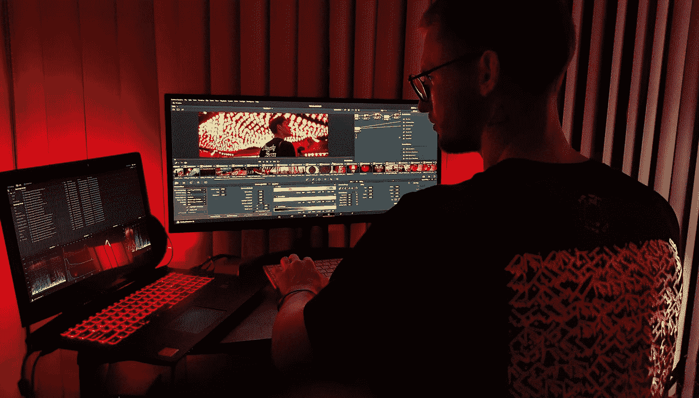
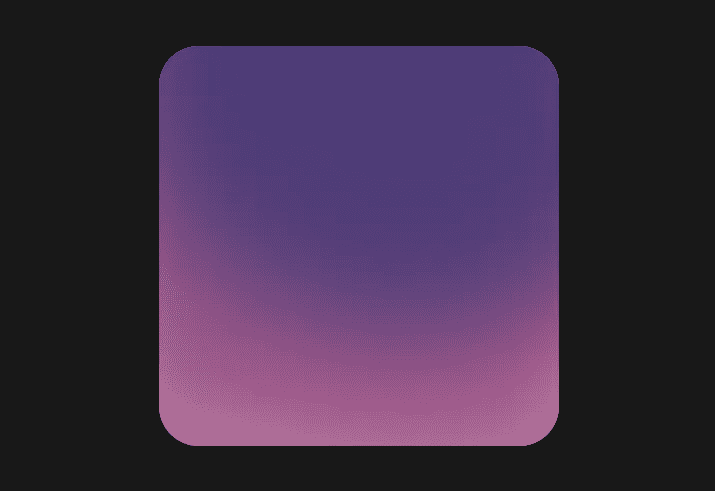
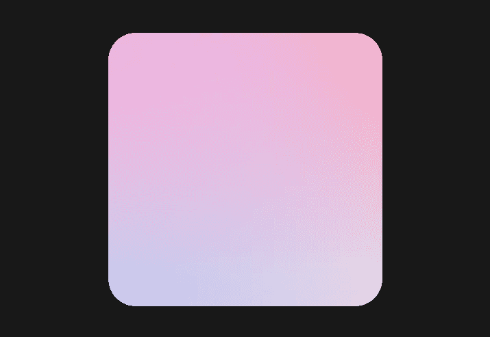
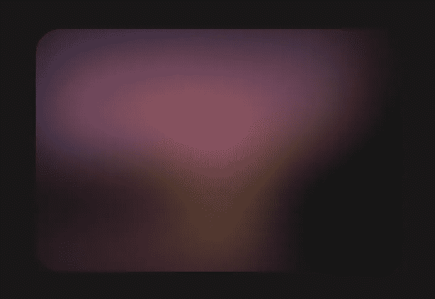
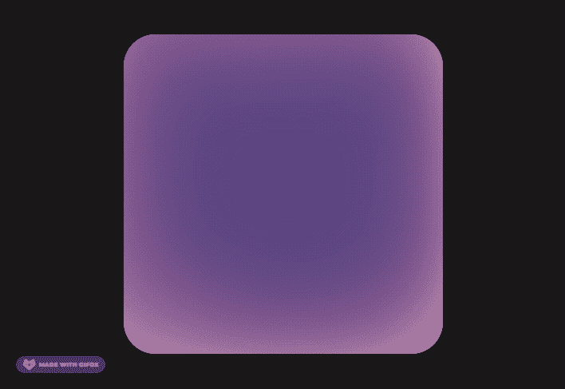

# 如何使用 CSS 创建一个 Aurora UI

> 原文：<https://betterprogramming.pub/how-to-create-an-aurora-ui-using-css-eb27d674b69>

## 从开发者的角度看新的 UI 设计趋势

[BRDNK Vision](https://unsplash.com/@brdnkvision?utm_source=medium&utm_medium=referral) 在 [Unsplash](https://unsplash.com?utm_source=medium&utm_medium=referral) 上拍照。

设计趋势就像 JavaScript 框架——每天都有新的出现。今天给大家介绍一个设计趋势，叫做极光 UI。我的朋友 Michal Malewicz 想出了这个名字，你应该看看他关于这个话题的文章。

我们来看看极光 UI。

# 极光趋势是什么？

这种趋势并不新鲜。例如，Stripe 已经在他们的标题中使用了很长时间。它在 Dribbble 和 Behance 等服务上越来越受欢迎。

[Stripe.com](https://stripe.com)头球。

其典型特征是:

*   模糊的形状
*   相似的颜色
*   颜色之间的平滑过渡

# 如何用 CSS 创建它

至少有三种方法可以产生这种效果:

*   模糊的形状
*   模糊的渐变
*   模糊的图像

## 模糊的形状

第一种方法是创建三个相互重叠的椭圆。创建大的，并像这样放置它们:

*   容器顶部的第一个
*   两个在底部角落

然后我们需要添加`filter: blur()`并稍微降低不透明度。

三个 div 创建一个极光背景

## 径向梯度

第二种方法是使用渐变颜色！代替纯色，我们可以用一个`radial-gradient`来创造我们的效果。

让我们添加三个`radial-gradients`，从纯色到透明:

*   左上角
*   右上方
*   左下角

用背景图像创建的极光背景

## 模糊图像

创造这种效果最简单的方法就是…选择一个好的图像，加上一些`filter: blur()`。

带有滤镜的图像:模糊()

# 动画背景

你也可以让你的背景看起来更好看！下面是一个旋转背景的小例子。

我使用`transform:rotate(1turn) translate(100px) rotate(-1turn);`在圆形路径上创建运动。

动画背景

你可以在 CodePen 上玩所有背景[。](https://codepen.io/walickialbert/pen/qBqQmNO)

就是这样！你可以把 Aurora 和 [glassmorphism](https://www.albertwalicki.com/glassmorphism-how-to-create) 结合起来，创建一个更好的 UI。

感谢阅读！