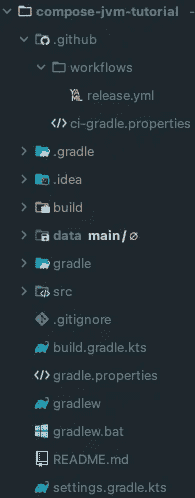

# 如何为桌面应用程序创建自动更新程序

> 原文：<https://betterprogramming.pub/how-to-create-an-auto-updater-for-desktop-application-jetpack-compose-d118db26d65f>

## 这没有你想象的那么难


为桌面撰写

之前，我一直致力于桌面应用程序的自动更新，发现谷歌上的信息并不多。所以我找了拿电子的更新器做参考。我将在教程中使用 Jetpack Compose(桌面)和 Go(服务器)。该逻辑适用于不同的框架/语言。

# 1.Jetpack 撰写

## 属国

## 创建存储库

`VersionRepo`将有两个功能

第一个是`checkForUpdate`，负责检查 GitHub 版本的更新。

第二个`downloadUpate`，负责从 GitHub release 的资产中下载更新，这个函数会将当前的下载进度发送到 UI，这样你可以做任何你想做的事情。

# 2.GitHub 发布

可能有另一种方法来发布你的包，但是对于本教程，我将使用 GitHub release 作为例子。

首先，您需要在项目根文件夹中创建一个名为`.github/workflows`的文件夹，然后在`workflows`中创建一个扩展名为`yml`的文件

项目文件夹将如下所示:



示例项目结构

## YAML 档案

*   `name` — GitHub 将在您的回购操作页面上显示该名称
*   `on` —触发工作流的 GitHub 事件的名称。它可以是一个数组、字符串等，但是我们将在推送任何新标签时触发我们的工作流
*   `defaults` —`jobs.run`的默认设置。默认情况下，我们使用`bash`来设置它
*   `jobs` —工作流运行由一个或多个作业组成。默认情况下，作业并行运行。
*   `jobs.<job_id>` —每个作业必须有一个`id`与该作业相关联。关键字`job_id`是一个字符串，其值是作业配置数据的映射。在这里我们将其命名为`release`
*   `jobs.<job_id>.strategy.matrix` —矩阵有键和值。矩阵重用作业的配置，并为您配置的每个矩阵创建一个作业，您将能够从`matrix`上下文中使用它。在这个例子中，我们想要在 macos 的最新版本上构建，所以我们使用`[macos-latest]`。如果你也想在 Ubuntu 和 Windows 上构建，你可以这样写:

```
jobs:
  release:
  strategy:
    matrix:
      os: [ macos-latest, windows-latest, ubuntu-latest ]
```

*   `jobs.<job_id>.strategy.fail-fast` —设置为`true`时，如果任何`matrix`作业失败，GitHub 将取消所有正在进行的作业。
*   `jobs.<job_id>.runs-on` —运行作业的机器类型。该机器可以是 GitHub 托管的运行程序，也可以是自托管的运行程序。我们用的是`${{ matrix.os }}`，就像`for loop`里的`i`
*   `jobs.<job_id>.if` —您可以使用`if`条件来阻止某个步骤运行，除非满足某个条件。[查看更多](https://docs.github.com/en/actions/reference/context-and-expression-syntax-for-github-actions)
*   `jobs.<job_id>.steps.name` —当前流量的名称
*   `jobs.<job_id>.steps.uses` —来自 GitHub 的可重用动作代码
*   `jobs.<job_id>.steps.run` —您可以在这里编写一个或多个命令行操作
*   `jobs.<job_id>.steps.with` —它是一个键值对，将参数传递给`action`

## 步骤说明:

1.  **签出** —该操作在`$GITHUB_WORKSPACE`下签出您的存储库，因此您的工作流可以访问它。
2.  **设置 Java**——我们将使用 JDK 15 来构建
3.  **验证 Gradle wrapper** —此操作验证源代码树中存在的 [Gradle Wrapper](https://docs.gradle.org/current/userguide/gradle_wrapper.html) JAR 文件的校验和，如果发现未知的 Gradle Wrapper JAR 文件，此操作将失败。
4.  **复制 CI gradle.properties** —将预定义的`gradle.properties`复制到`~/.gradle`目录
5.  **check out Gradle Build Cache**—此动作允许缓存依赖项和构建输出，以缩短工作流执行时间。
6.  **构建发布应用** —构建当前操作系统的发行版
7.  **归档工件** —我们将构建好的工件存储到 GitHub 上，以供下一步使用
8.  **释放** —释放工件

# 3.更新服务器(Golang)

## 开始一个新项目

首先，您需要创建一个目录。你想叫它什么都可以。

```
mkdir updater-server
cd updater-server
```

在添加任何代码之前，让我们使用下面的命令初始化我们的 Go 项目。你应该用你的 GitHub 的用户名替换用户名。对我来说，会是`OysterD3`。

```
go mod init github.com/USERNAME/updater-server
```

## 包封/包围（动词 envelop 的简写）

让我们在项目根文件夹中创建一个名为`main.go`的文件，现在就把它放在那里。之后，创建一个`.env`文件来存储我们的环境变量，如下所示:

之后，让我们创建`env/env.go`来读取和解析`.env`。我们需要两个依赖项；让我们现在安装它们:

```
go get github.com/caarlos0/env/v6 && go get github.com/joho/godotenv
```

`service`的用途是存储 GitHub 的 Open API 请求的逻辑。

首先，我们需要从您在`.env`中设置的存储库中检索所有的版本。默认的 HTTP 客户端`net/http`在我们的例子中已经足够好了。

如果你的库是公开的，你可以直接从 GitHub 的 API 下载文件。如果您的存储库是私有的，那么您需要代理来下载，因为 GitHub 需要一个用于私有回购的访问令牌，您可以在下面看到:

我们将把响应流式传输到我们的应用程序，这样应用程序就能够处理 UI 状态。查看[第一部分](https://oysterd3.medium.com/how-to-create-an-auto-update-for-desktop-application-619b2cea9c9)了解更多信息。

# 路由器

现在，让我们来研究路由器。

您可以使用任何支持 HTTP/2 的 HTTP web 框架。在这种情况下，我们将使用`echo`作为我们的 HTTP web 框架。要安装依赖项，请使用以下命令:

```
go get -u github.com/labstack/echo/v4
```

前端不必是 Jetpack Compose 可以是 Electron.js，还有，更新服务器不一定要 Go。可以用你喜欢的语言和框架来写。逻辑还是一样的。

你可能对这个感兴趣:

[](https://blog.oysterlee.dev/how-to-release-built-artifacts-from-one-to-another-repo-on-github-e6006b6764a8) [## 如何在 GitHub 上将构建好的工件从一个 repo 发布到另一个 repo？

### 保持您的源代码私有，并公开发布您的发行版

blog.oysterlee.dev](https://blog.oysterlee.dev/how-to-release-built-artifacts-from-one-to-another-repo-on-github-e6006b6764a8) 

# 参考

*   [https://blog.frankel.ch/state-jvm-desktop-frameworks/6/](https://blog.frankel.ch/state-jvm-desktop-frameworks/6/)
*   [https://docs . github . com/en/actions/reference/workflow-syntax-for-github-actions](https://docs.github.com/en/actions/reference/workflow-syntax-for-github-actions)
*   [https://docs . github . com/en/actions/reference/authentic ation-in-a-workflow](https://docs.github.com/en/actions/reference/authentication-in-a-workflow)