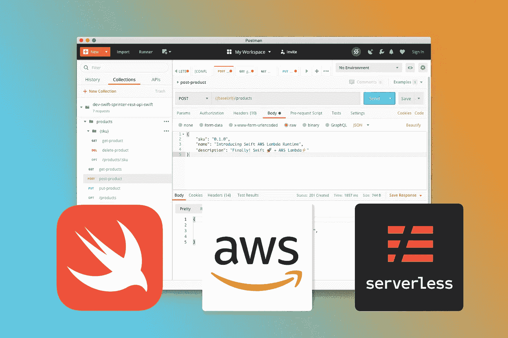
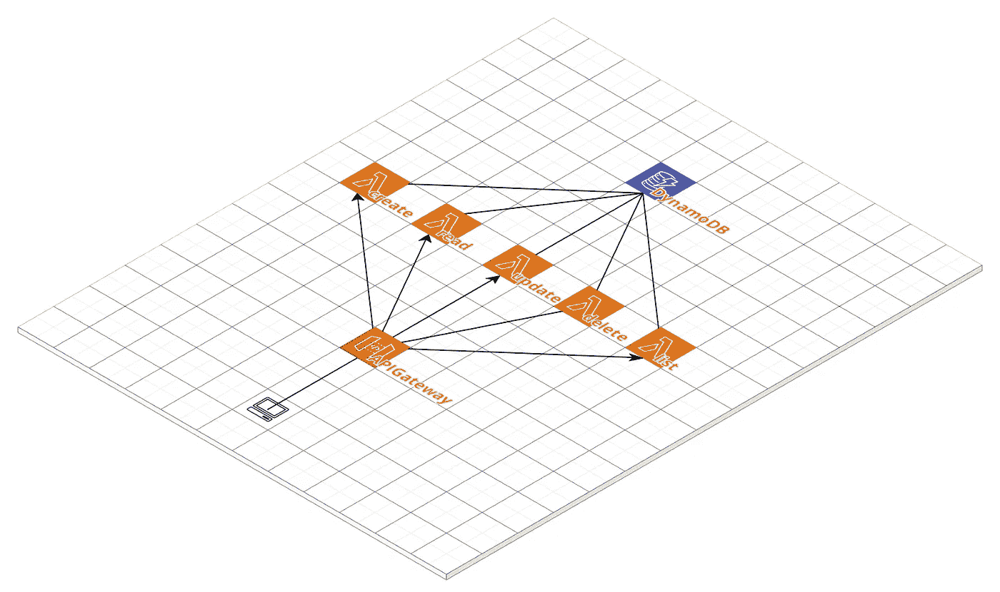
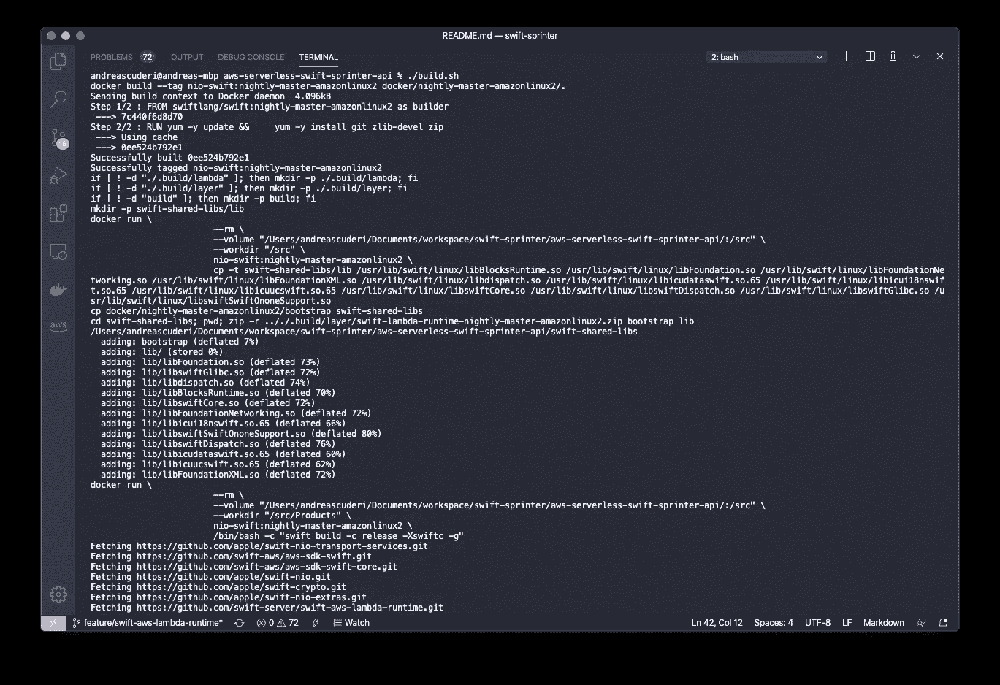
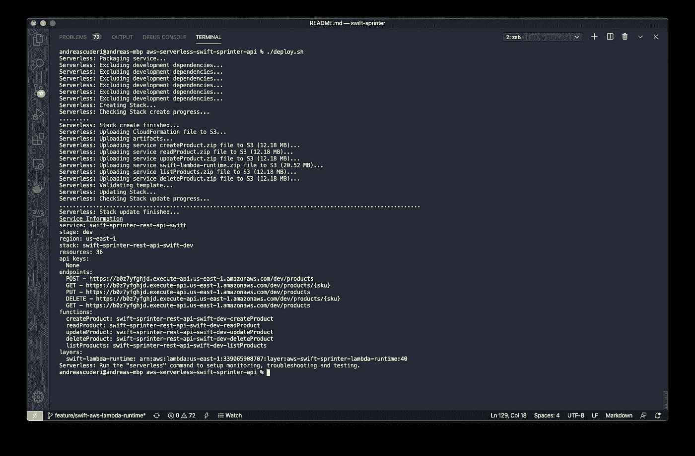
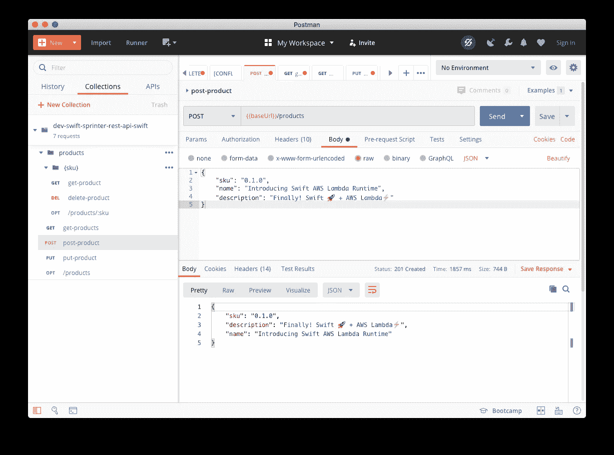
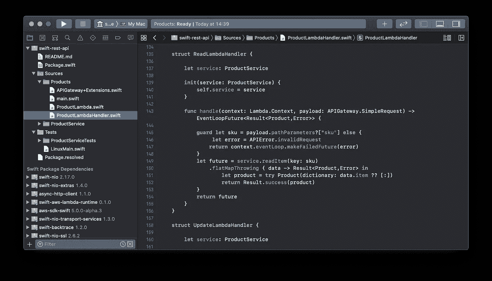
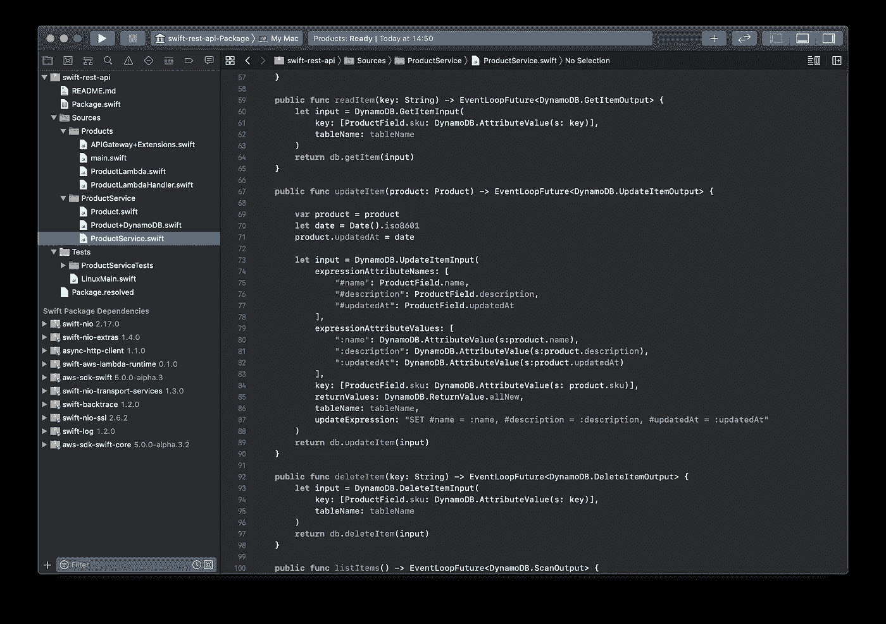

# 如何在 Swift 中创建 AWS 无服务器 REST API

> 原文：<https://betterprogramming.pub/how-to-create-an-aws-serverless-rest-api-in-swift-b8849352c52a>

## 使用 Apple Swift AWS Lambda 运行时构建 REST API



苹果 Swift AWS Lambda 运行时终于成为现实，它现在得到了官方支持(正如[5 月 29 日宣布的那样)。允许这样做的关键事实是对 Amazon Linux 2 的支持，它具有由](https://forums.swift.org/t/announcing-swift-aws-lambda-runtime/37009) [Swift](https://swift.org/download/#releases) 维护的自定义 Docker 映像。

本文将展示如何使用新的 Apple 运行时来实现一个基本的 REST API，以实现一个基于 API Gateway、Lambda 和 DynamoDB 的无服务器堆栈，并使用无服务器框架来部署它。

# 无服务器 API Rest 架构

该项目使用经典的无服务器架构，该架构基于:

*   `API Gateway`:充当`Lambda`的`proxy`，并将其公开给互联网
*   `Lambda`:无状态计算层。我们为每个 API 端点定义了一个 lambda。
*   `DynamoDB`:AWS`NoSQL`数据库提供数据持久性



REST API —无服务器架构

无服务器架构的优势:

*   按使用付费
*   没有固定成本
*   自动缩放
*   DevOps

部署文件`serverless.yml`包含使用[无服务器框架](https://www.serverless.com)部署示例所需的所有细节。

# 项目设置

我们假设您已经按照[自述文件](https://github.com/swift-sprinter/aws-serverless-swift-api-template)设置了所有要求:

*   使用您的 AWS 帐户配置的 AWS CLI
*   码头工人
*   无服务器
*   制造

# 入门指南

克隆模板项目:

```
git clone [https://github.com/swift-sprinter/aws-serverless-swift-api-template.git](https://github.com/swift-sprinter/aws-serverless-swift-api-template.git)cd [aws-serverless-swift-api-template.git](https://github.com/swift-sprinter/aws-serverless-swift-api-template.git)
```

然后，构建项目:

```
./build.sh
```



```
./deploy.sh
```



一旦项目部署到您的 AWS 帐户上，就创建了端点。

如果一切都正确，无服务器框架将输出 API 端点。

# 用 Postman 测试 API

记下端点的基本 URL:

```
https://<api_gtw_id>.execute-api.<aws_region>.amazonaws.com/dev
```

`<api_gtw_id>`是由区域`<aws_region>`中的脚本生成的 API 网关的标识符。

用 Postman 导入文件`swagger.json`，用从部署中获得的文件编辑变量`baseUrl`。



测试 API。

完成后，您可以通过启动以下命令来删除部署:

```
./remove.sh
```

# 代码审查

Swift [代码](https://github.com/swift-sprinter/aws-serverless-swift-api-template)使用苹果 [Swift AWS Lambda 定制运行时](https://github.com/swift-server/swift-aws-lambda-runtime)和 [AWS SDK Swift](https://github.com/swift-aws/aws-sdk-swift) 实现 lambdas。

*   `main.swift`运行拉姆达
*   `Product.swift`是定义数据模型的 Swift 结构:

```
public struct *Product*: Codable {
     public let sku: *String
*     public let name: *String
*     public let description: *String* public var createdAt: *String*?
     public var updatedAt: *String*?
}
```

*   `ProductLambda.swift`配置 DynamoDB 客户端，它与 Lambda 运行时共享`httpClient`实例
*   `ProductLambdaHandler`实现了 lambdas 所要求的代码。每个 lambda 只运行 lambda `Handler`指定的实现，将输入`APIGateway.SimpleRequest`转换为`APIGateway.Response`。



' ReadLambdaHandler '

*   lambda 处理程序(`Create`、`Read`、`Update`、`Delete List`)的实现是为了使用事件有效负载并返回包含所需响应(或错误)的结果
*   所有内部异步调用都是使用 NIO `[EventLoopFuture](https://apple.github.io/swift-nio/docs/current/NIO/Classes/EventLoopFuture.html)`定义的
*   `ProductService`抽象 lambda 与 DynamoDB API 交互的方式，隐藏与底层 API 相关的细节



'产品服务'

# 结论

我希望对服务器端 Swift 和无服务器产生一些好奇。如果你对 2018 年 12 月这项艰苦工作是如何开始的历史感兴趣，你可以看看 [Swift 论坛](https://forums.swift.org/t/aws-lambda-runtime-api/18498)。

检查一下 [GitHub](https://github.com/swift-sprinter/aws-serverless-swift-api-template) 库，并随意试验。我期待看到好的东西！

感谢阅读。