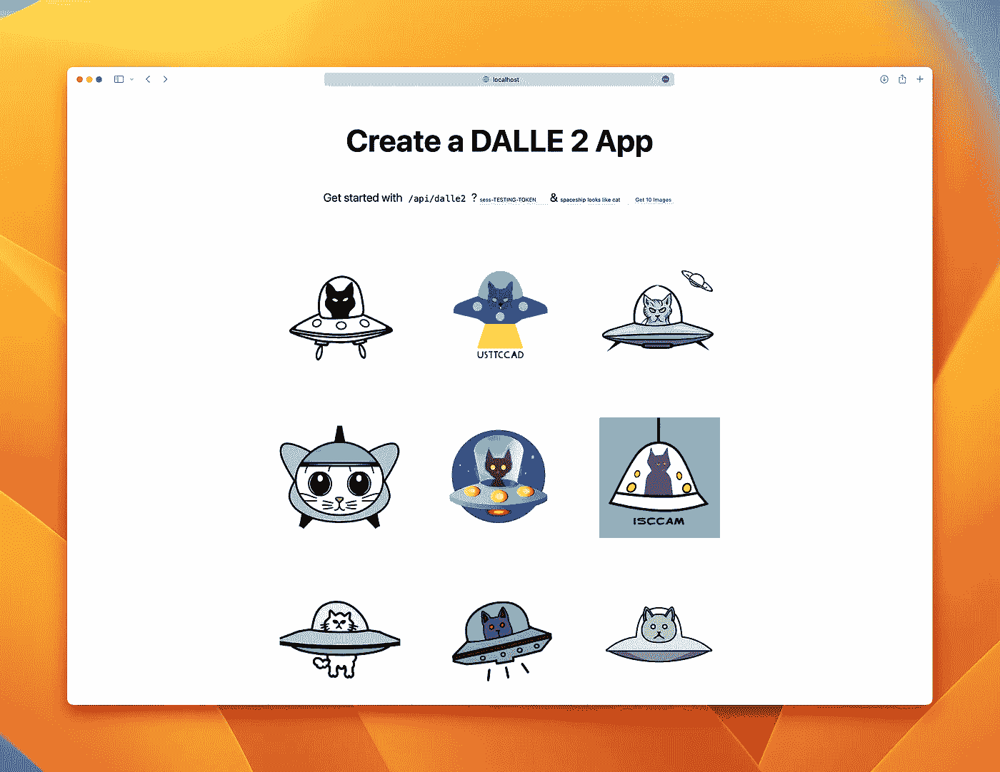
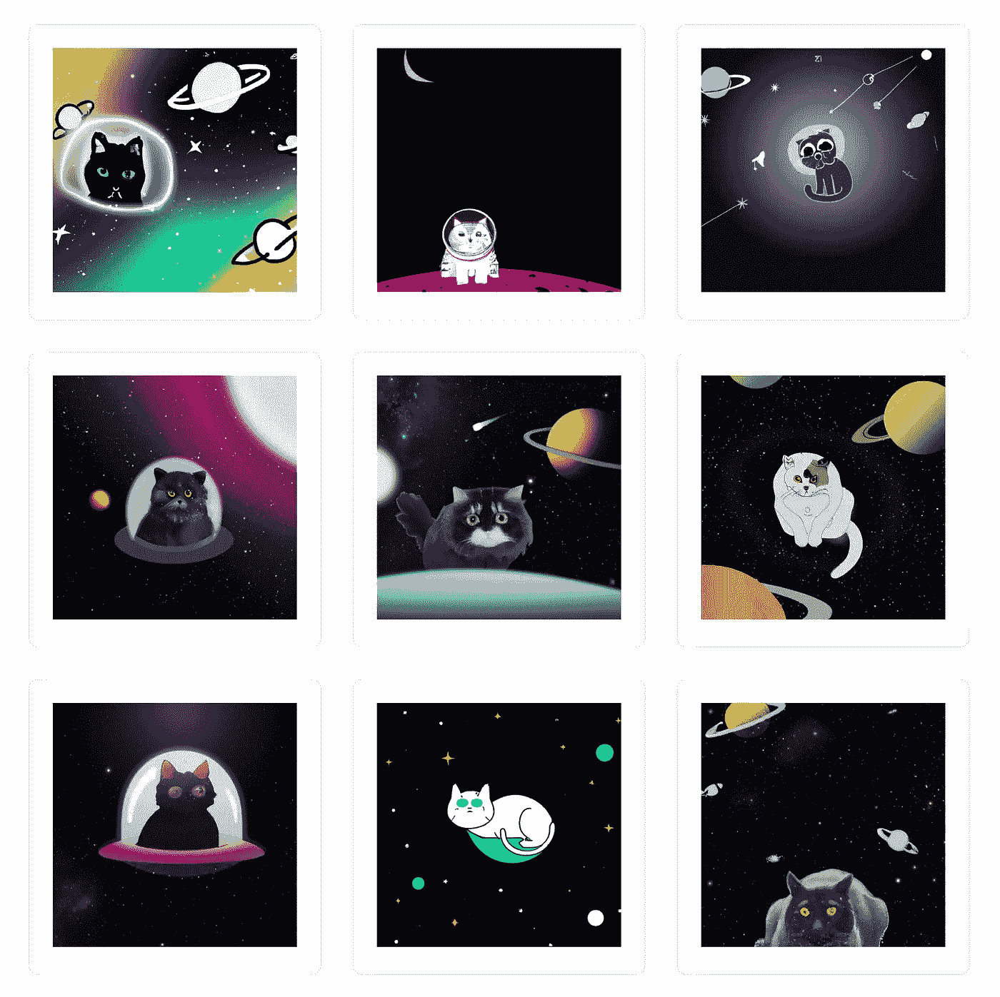

# 如何使用 Next.js 创建简单的 DALLE-2 应用程序

> 原文：<https://betterprogramming.pub/how-to-create-an-easy-dalle-2-app-with-nextjs-bca5242e8234>

## 从自然语言的描述中创建现实的图像和艺术



DALL E 2 是人们在社交媒体上讨论的最热门的人工智能话题之一。这款 [research](https://arxiv.org/abs/2204.06125) 产品可用于根据文本描述，结合概念、属性和风格，创建原创、逼真的图像和艺术。这里，我们将通过 OpenAI API 创建一个实验性的应用程序。

# 要求

*   你需要被邀请才能访问[https://labs.openai.com/](https://labs.openai.com/)
*   通过[https://labs.openai.com/api/labs/tasks](https://labs.openai.com/api/labs/tasks)获取不记名令牌

# 步伐

## 用手

1.  导航到您的 nextJS 项目根文件夹
2.  通过 NPM
    `npm i dalle-node`安装 dalle-node
3.  在 API 文件夹中创建 dalle2.js

4.通过函数获得结果

## 完整项目

你也可以在 Github 上找到完整的演示项目。

[](https://github.com/1998code/DALLE-2-App) [## GitHub-1998 code/DALLE-2-App:DALLE 2 on nextJS

### 克隆/下载这个项目安装:运行开发服务器:用浏览器打开 http://localhost:3000 查看…

github.com](https://github.com/1998code/DALLE-2-App) 

1.  克隆/下载/分叉:[https://github.com/1998code/DALLE-2-App](https://github.com/1998code/DALLE-2-App)
2.  使用`npm`或`yarn`安装
3.  运行开发服务器:
    `npm run dev`
    或
    `yarn dev`
4.  用浏览器打开 [http://localhost:3000](http://localhost:3000/) 查看结果。

# 使用

1.  输入令牌从`sess-`开始
2.  查询任何内容，例如`cat on space`:



```
**Want to Connect?**[https://twitter.com/1998design](https://twitter.com/1998design)
```