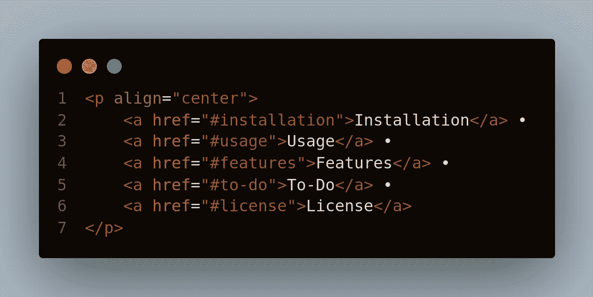
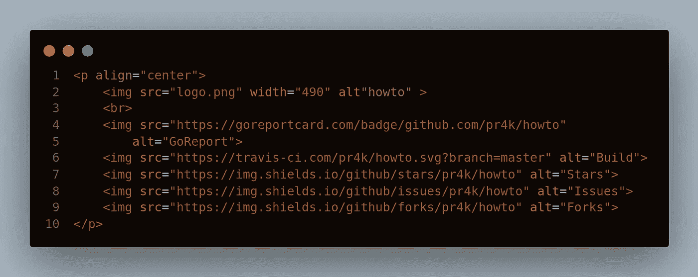
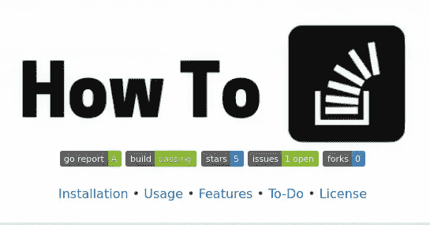
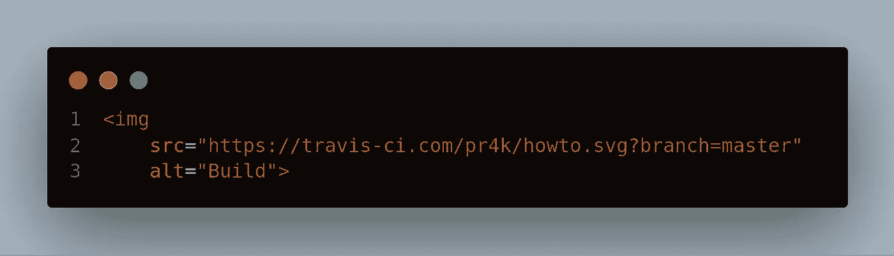
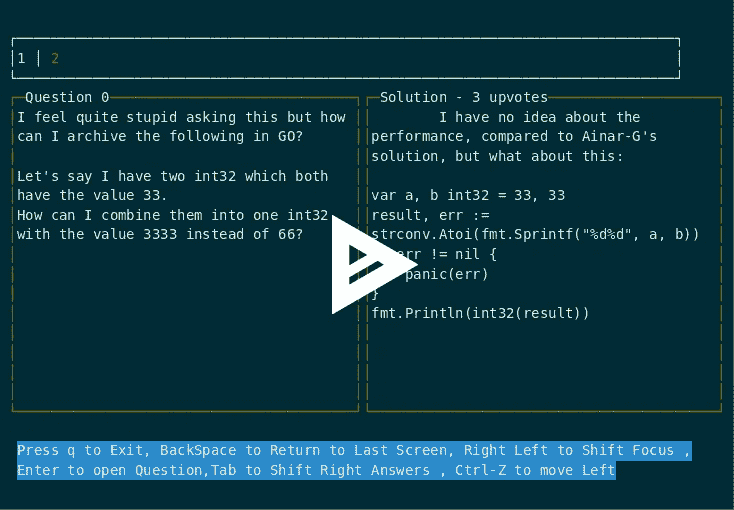

# 如何为您的项目创建有效的自述文件

> 原文：<https://betterprogramming.pub/how-to-create-an-effective-readme-file-for-your-project-6a2cdd09860c>

## 创建自述文件可能很耗时，但也可能与项目本身一样重要

正如哈维所说:

> 第一印象持续。

老实说，即使在尝试 GitHub 上的任何项目之前，我们做的第一件事就是检查它的自述文件。更好的自述文件不仅使您的项目看起来更好、更专业，而且框架良好的自述文件也使其他人更容易测试和使用您的项目。

有许多项目没有成为趋势，只是因为没有足够的指令来启动它。所以，今天，我会分享一些事情，可以让你的自述至少少一点 nooby，多一点专业。

# 使用 href 创建一个导航栏

是的，你没听错，在自述文件中添加一个导航栏不仅看起来很酷，而且如果你的自述文件很长的话，这也是一个很好的目的。

最终，你的自述文件被转换成一个 HTML 页面，你可以创建一个导航条类型的东西。

一个简单的导航条代码看起来像这样。

在 VS 代码中使用 CodeSnap 制作

只要把你所有的标题作为来源，瞧！

# 使用 p 标记将项目居中对齐

你尝试过多少次将图像居中？是的，GitHub 风格的 Markdown 没有办法将 README 居中(或者可能我找不到它)。因此，一个解决办法是引入一些 HTML 来集中所有内容。

这不仅使你的图像居中，而且你还可以控制图像的大小，这是一个优点。

代码:

在 VS 代码中使用 CodeSnap 制作

样本:

来自“如何阅读自述文件”

可以看到一切都是居中的！

# 使用徽章

好吧，光是这件事就能让你的自述从无足轻重变得有些专业。使用适当的徽章可以使您的自述文件更具描述性，还可以提供基本信息，如构建状态。

添加徽章非常简单，只需进入 [shields.io](https://shields.io/) 。输入您的 GitHub repo 链接，它会自动为您提供建议的徽章。

代码:

在 VS 代码上使用 CodeSnap 制作

样本:

# 使用图片和 gif 让它更有吸引力

最后一个也是最重要的一个，因为你的项目中除了 logo 之外的其他东西都只是文本，老实说，我们都知道没有人会读那么多，除非他们真的感兴趣。

因此，添加一些 GIF 和图像会让你的项目引人注目，如果你能添加一个关于这个项目如何工作的 GIF，它会变得更好。可以使用的一个非常好的工具是[asci NEMA](https://asciinema.org/)。

*   在 Asciinema 上创建一个帐户。
*   下载他们的客户端。
*   现在，如果你正在为你的终端创建一个屏幕截图，用 asciinema 可以很容易地完成。

遵循他们的官方指南，了解[的具体步骤](https://asciinema.org/docs/installation)。

样本:

就这些，现在你有一个好的自述了！是时候为它创建一个项目了。

要想看看上面提到的每一件事，请查看 [How To](https://github.com/pr4k/howto) 的自述文件。

编码快乐！