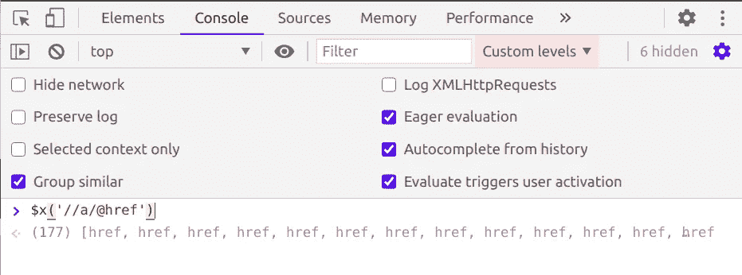

# 如何用 Python 和 Scrapy 创建电子邮件爬虫

> 原文：<https://betterprogramming.pub/how-to-create-an-email-crawler-with-python-and-scrapy-af275ae486e2>

## 从任何网站收集电子邮件


由 [Le Buzz](https://unsplash.com/@le_buzz?utm_source=unsplash&utm_medium=referral&utm_content=creditCopyText) 在 [Unsplash](https://unsplash.com/s/photos/website?utm_source=unsplash&utm_medium=referral&utm_content=creditCopyText) 上拍摄。

联系方式不容易得到。这就是为什么有无数的企业为企业和个人提供有针对性的联系方式，如 ZoomInfo、Uplead 和 LinkedIn Sales Navigator。

你可能有一个你想瞄准的领域列表。有一些解决方案，如 Hunter.io 或 FindThatLead，可以将域名转换为电子邮件和其他联系信息，但这些都是有成本的。

所以，如果你知道或者想学习 Python，为什么不自己做点什么呢？

诚然，它可能没有我概述的解决方案先进，但一个好的爬虫可以很好地获取公司网站上的联系信息，如电子邮件或电话号码。

我们将使用 Python (3.6+)和 scrapy 来构建这个小项目。

```
# If you need to install scrapy use: pip install scrapy
scrapy startproject contact_details 
cd contact_details
scrapy genspider gather_details example.com
```

我们首先创建一个名为`contact_details`的新 scrapy 项目，并在域名 example.com 下生成一个新的蜘蛛(我们稍后会更改)。

我们生成的蜘蛛看起来像这样:

在开始解析回调之前，我们需要添加一些东西:

我们添加了一些可配置的参数，并删除了`start_urls`和`allowed_domains`属性。我们删除它们的原因是，我们将使 crawler 可以使用目标域作为参数进行调用。

我们定义的其他一些属性是:

*   `greedy`:指示爬虫抓取主页后是否继续(设置`greedy`为 false 会减少邮件数量，但会加快进程)。
*   `email_regex`:这个正则表达式将获取 HTML 中的电子邮件。这将选取页面上的任何电子邮件，包括在`<script>`标签中定义的或在页面上不可见的邮件。
*   `forbidden_keys`:这将用于跳过包含这些关键字的特定 URL，例如图像、文档或电子邮件链接。

现在让我们开始解析页面。

我们创建了一个非常简单的`parse`方法，并尝试处理页面的 HTML 内容。在页面返回二进制结果的情况下，会导致一个`UnicodeDecodeError`，这反过来会停止解析过程。

使用我们预先编译的正则表达式，我们在网站的 HTML 内容中搜索电子邮件。然后，使用`tld`包，我们试图排除看起来像电子邮件但不是的文本(例如 image@home.png)。当然，。png 不是一个有效的 TLD，它将返回`None`，这是一个假值，在列表理解过程中会被过滤掉。

现在是时候让我们的爬虫，嗯，爬行了。这个过程的这一部分侧重于解析单个页面，但是如果`greedy`设置为`True`，我们将不得不遍历整个网站。

这一部分将找到页面中的所有链接，并使用 XPath 提取它们的`href`。如果您想知道如何使用和调试 XPath 命令，Google Chrome 允许您在控制台中测试 XPath 命令，同时为您带来结果。



作者展示谷歌 Chrome 开发工具的截图

然后，我们检查所有禁用的键，以确保跳过文档和图像:

最后，我们产生新的请求来抓取其他页面。Scrapy 将避免抓取同一个页面两次，也将避免在`allowed_domains`属性之外发出请求，所以我们不需要很多检查。

我们使用`try/except`块的原因是我们需要`scrapy.Request`用于绝对 URL，需要`response.follow`用于相对 URL。这种方法被称为请求原谅而不是许可( [EAFP](https://docs.python.org/3.4/glossary.html) )，在 Python 中比首先使用`if`语句更受欢迎，后者被称为三思而后行(LBYL)。

难题的最后一部分是让我们的爬虫可以用参数调用，我们现在就要做:

您可以使用以下格式将任何参数传递给 scrapy:

```
scrapy crawl gather_details -a domain=example.com -o emails.json
```

这将把一个域作为参数传递给`__init__`，我们将使用这个域进行请求。`-o`标志指示在哪里存储爬行过程的输出——即存储到一个名为`emails.json`的文件中。

现在我们准备好了。您可以使用上面的命令为任何域运行您的爬虫，并开始收集电子邮件！

# 结论

你可以在 GitHub 上找到完整的要点和更多的想法。如果我们要建造更先进的东西，我们可以做很多事情:

*   改进电子邮件正则表达式。
*   对电子邮件使用更智能的验证。
*   处理输出文件，按域对电子邮件进行分组。
*   用 scrapyd 设置项目，这样就可以将它作为 web 服务运行。

有很多想法可以让你更进一步。要了解更多，你可以开始阅读 [scrapy](https://scrapy.org/) 和 [scrapyd](https://scrapyd.readthedocs.io/en/stable/) 文档。