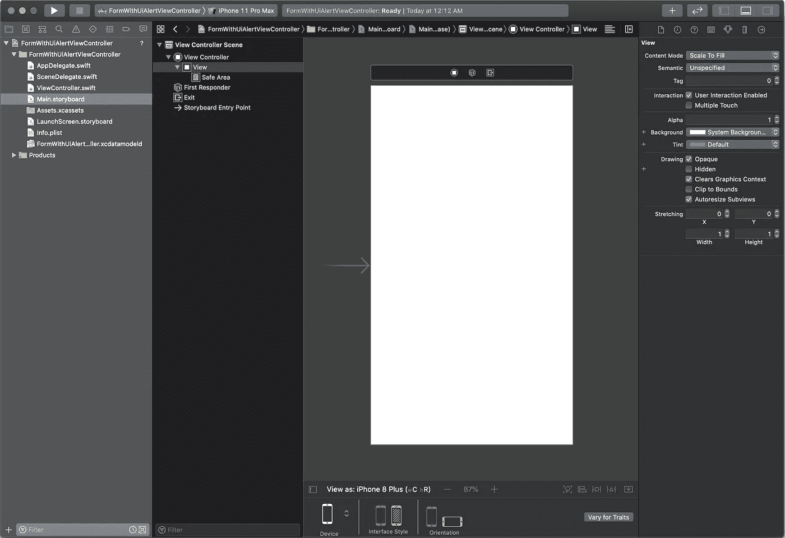
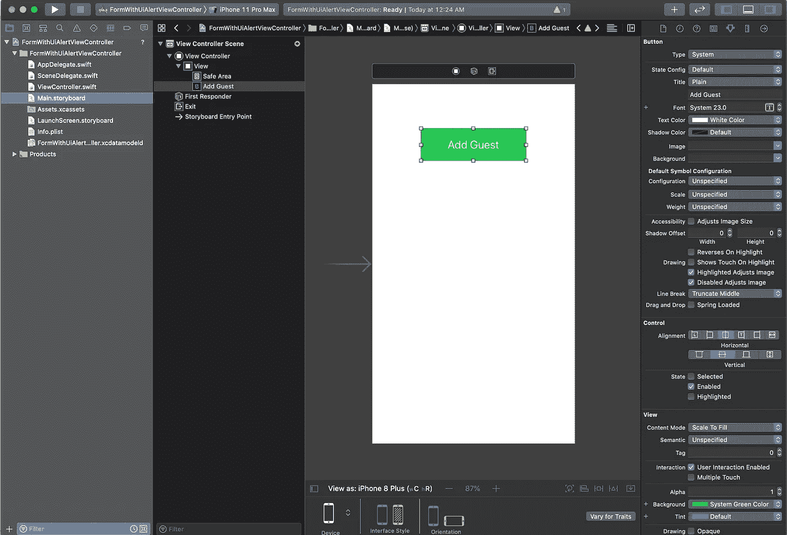
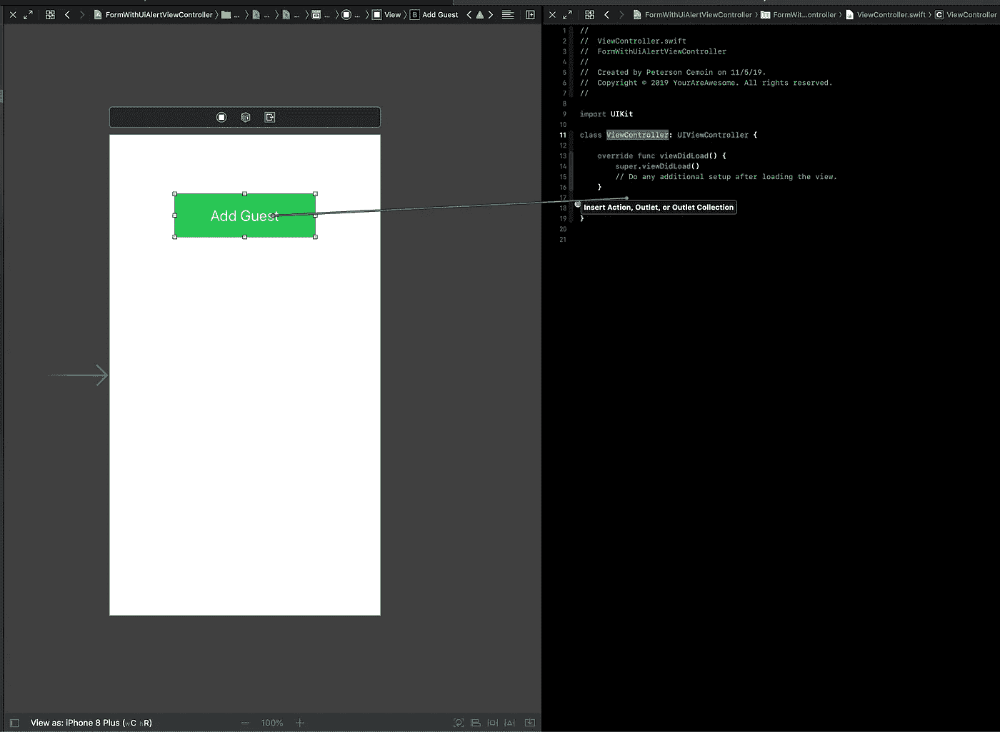
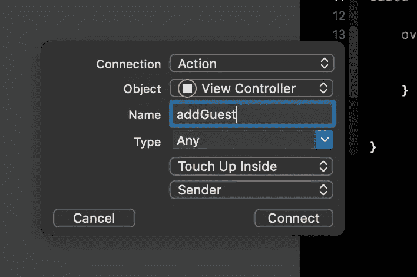
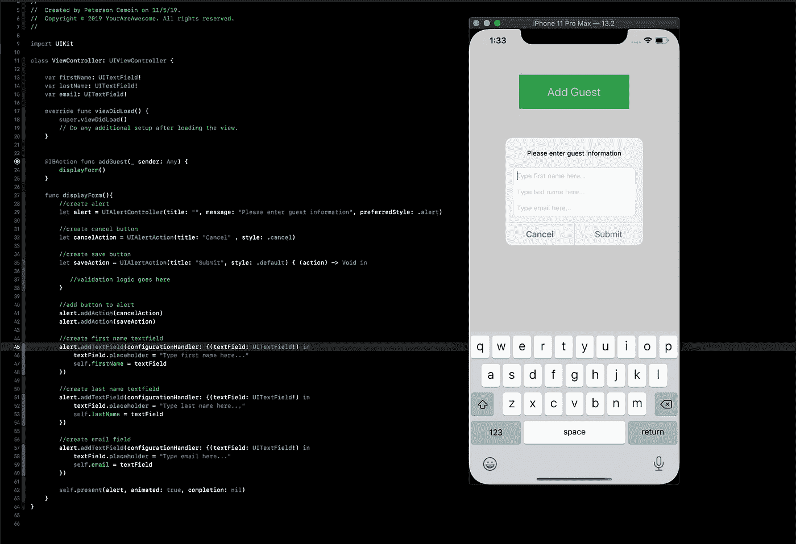

# 如何用 UIAlertController 创建表单

> 原文：<https://betterprogramming.pub/how-to-create-an-entry-form-with-uialertcontroller-e1ff3770804d>

## IOS 编程指南

## 有时候一个简单的提醒就足够了


马克·明特尔在 [Unsplash](https://unsplash.com/s/photos/computer-code?utm_source=unsplash&utm_medium=referral&utm_content=creditCopyText) 上的照片

当设计一个移动应用程序时，我尽量保持用户界面的整洁。我敢肯定，不同的开发者对干净的用户界面有不同的看法。

我最近开发的一个应用程序是宾客名单管理。在其中一个视图中，我需要一种快速的方法将客人添加到列表中，但是我不想设计另一个页面。

带有简单表单的弹出窗口非常适合这项工作。解决方案是使用 UIAlertViewController 并将文本字段嵌入其中，而不是创建另一个视图。我们将稍微简化一下表单，为了简洁起见，只设计了`FirstName`、`LastName`和`Email`。这个简单的概念可以应用于更复杂的 UI。这个简单表格的目的是为每个客人的输入收集和执行基本验证。

要继续学习，您需要熟悉 Swift 并知道如何使用 Xcode 编辑器。我将使用 Xcode 版本 11.2。既然你要和我在一起一段时间，那就让我们开心一下吧！

打开 Xcode >创建新的 Xcode 项目>单视图应用程序。我将我的项目命名为*formwithuiialertviewcontroller*，但是您可以选择任何名称。点击下一步>创建。现在你的屏幕应该看起来类似下面的截图。



首先，让我们在视图中添加一个按钮。在 Xcode 中按 Command + Shift + L，然后键入“uibutton”并将其拖动到视图上。

选择按钮，然后前往检查器，将文本设定为“添加客人”，背景设定为绿色，文本颜色设定为白色。



在右边添加另一个编辑器，打开右边的 ViewController。


点击按钮，按住命令，然后开始拖动，你应该会看到一个箭头指示。将它拖到文件底部最后一个花括号之前。



应该显示一个弹出窗口。为`Name`键入“addGuest ”,其他一切保持不变。



单击连接。我们准备好开始编码了。您现在可以关闭一个编辑器，从现在开始我们只需要一个编辑器。你的`ViewController`文件应该是这样的。

```
//
//  ViewController.swift
//  FormWithUiAlertViewController
//
//  Created by Petey on 11/5/19.
//  Copyright © 2019 YourAreAwesome. All rights reserved.
//

import UIKit

class ViewController: UIViewController {

    override func viewDidLoad() {
        super.viewDidLoad()
        // Do any additional setup after loading the view.
    }

    @IBAction func addGuest(_ sender: Any) {

    }
}
```

我们需要创建三个文本字段变量来传递我们从表单中的文本字段获取的任何信息。我更喜欢创建一个新方法来添加逻辑，然后让我们的动作方法调用它。

我们将这个方法命名为`displayForm` ***。*** 所以我们的`addGuest` *法*就叫我们的`displayForm` 法。Inside out 显示方法，我们将创建警报，然后添加 cancel 和 submit 按钮，然后添加三个文本字段来捕获用户输入。

```
//
//  ViewController.swift
//  FormWithUiAlertViewController
//
//  Created by Petey on 11/5/19.
//  Copyright © 2019 YourAreAwesome. All rights reserved.
//

import UIKit

class ViewController: UIViewController {

    var firstName: UITextField!
    var lastName: UITextField!
    var email: UITextField!

    override func viewDidLoad() {
        super.viewDidLoad()
        // Do any additional setup after loading the view.
    }

    @IBAction func addGuest(_ sender: Any) {
        displayForm(message: "Please enter guest information")
    }

    func displayForm(message:String){
        //create alert
        let alert = UIAlertController(title: "", message: message, preferredStyle: .alert)

        //create cancel button
        let cancelAction = UIAlertAction(title: "Cancel" , style: .cancel)

        //create save button
        let saveAction = UIAlertAction(title: "Submit", style: .default) { (action) -> Void in

           //validation logic goes here
        }

        //add button to alert
        alert.addAction(cancelAction)
        alert.addAction(saveAction)

        //create first name textfield
        alert.addTextField(configurationHandler: {(textField: UITextField!) in
            textField.placeholder = "Type first name here..."
            self.firstName = textField
        })

        //create last name textfield
        alert.addTextField(configurationHandler: {(textField: UITextField!) in
            textField.placeholder = "Type last name here..."
            self.lastName = textField
        })

        //create email field
        alert.addTextField(configurationHandler: {(textField: UITextField!) in
            textField.placeholder = "Type email here..."
            self.email = textField
        })

        self.present(alert, animated: true, completion: nil)
    }
}
```

如果你做的一切都正确，你应该能够构建(命令+ B)和运行(命令+ R)。结果应该与我的类似:



试一试——是你建造了它。Cancel 应该会关闭视图，而 submit 还不会做任何事情——我们一会儿会处理这个问题。

为了简单起见，我们只验证所有文本字段都有值。如果任何字段是空白的，有空格，或者是空的，我们将清除所有的字段，并传递一个无效的消息到同一个表单。这有点像递归。如果您愿意，您可以对验证进行各种想象，但是对于我们在这里尝试完成的任务来说，这已经足够好了。

```
//
//  ViewController.swift
//  FormWithUiAlertViewController
//
//  Created by Petey on 11/5/19.
//  Copyright © 2019 YourAreAwesome. All rights reserved.
//

import UIKit

class ViewController: UIViewController {

    var firstName: UITextField!
    var lastName: UITextField!
    var email: UITextField!

    override func viewDidLoad() {
        super.viewDidLoad()
        // Do any additional setup after loading the view.
    }

    @IBAction func addGuest(_ sender: Any) {
        displayForm(message: "Please enter guest information")
    }

    func displayForm(message:String){
        //create alert
        let alert = UIAlertController(title: "", message: message, preferredStyle: .alert)

        //create cancel button
        let cancelAction = UIAlertAction(title: "Cancel" , style: .cancel)

        //create save button
        let saveAction = UIAlertAction(title: "Submit", style: .default) { (action) -> Void in
           //validation logic goes here
            if((self.firstName.text?.trimmingCharacters(in: .whitespacesAndNewlines).isEmpty)!
                || (self.lastName.text?.trimmingCharacters(in: .whitespacesAndNewlines).isEmpty)!
                || (self.email.text?.trimmingCharacters(in: .whitespacesAndNewlines).isEmpty)! ){
                //if this code is run, that mean at least of the fields doesn't have value
                self.firstName.text = ""
                self.lastName.text = ""
                self.email.text = ""

                self.displayForm(message: "One of the values entered was invalid. Please enter guest information")
            }

            print("This entry was added for guest name: \(String(describing: self.firstName.text)) \(String(describing: self.lastName.text)), email : \(String(describing: self.email.text))")
        }

        //add button to alert
        alert.addAction(cancelAction)
        alert.addAction(saveAction)

        //create first name textfield
        alert.addTextField(configurationHandler: {(textField: UITextField!) in
            textField.placeholder = "Type first name here..."
            self.firstName = textField
        })

        //create last name textfield
        alert.addTextField(configurationHandler: {(textField: UITextField!) in
            textField.placeholder = "Type last name here..."
            self.lastName = textField
        })

        //create email field
        alert.addTextField(configurationHandler: {(textField: UITextField!) in
            textField.placeholder = "Type email here..."
            self.email = textField
        })

        self.present(alert, animated: true, completion: nil)
    }
}
```

构建并再次运行。如果一切正常，当输入的任何值无效时，您应该能够看到验证错误。

现在你有了一个创建简单表单的新方法，去创造吧！

谢谢你坚持到最后，记得继续学习。只会变得更好。