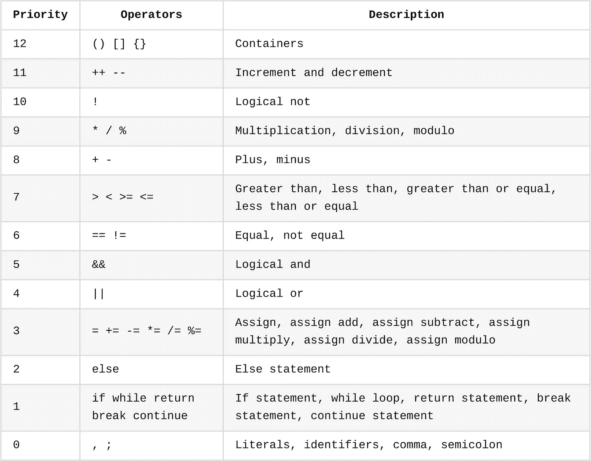

# 如何从头开始创建一门深奥的编程语言

> 原文：<https://betterprogramming.pub/how-to-create-an-esoteric-programming-language-from-the-scratch-b93433a3e798>

## 让我们从定义语言的基础开始


照片由[穆里扎尔·扎蒂瓦](https://unsplash.com/@mourimoto?utm_source=medium&utm_medium=referral)在 [Unsplash](https://unsplash.com?utm_source=medium&utm_medium=referral) 拍摄

我们都熟悉编程语言，但是深奥的编程语言和普通的编程语言有什么区别呢？[深奥](https://en.wiktionary.org/wiki/esoteric)意思是某件事理论性很强，没有任何明显的实际应用。这就是深奥的编程语言的情况，也称为 esolangs，它主要是作为概念证明或笑话而设计的，并不打算用于工业软件。

最著名的 esolangs 之一是 [Brainfuck](https://en.wikipedia.org/wiki/Brainfuck) ，这是一个极其简单的 8 个命令、一个数据指针和一个指令指针的集合。尽管它有明显的可用性限制，但它仍然是[图灵完备的](https://en.wikipedia.org/wiki/Turing_completeness)，这意味着它可以被用来寻找任何问题的解决方案，只要它可以通过算法来解决。


来自维基百科的脑残例子。

在本文中，我们将从头开始创建一个新的 esolang。在下面的文章中，我将展示如何通过为它编写解释器来用代码实现它。

## 如何创建一门深奥的编程语言

在跳到键盘上开始编程语言实现之前，您必须首先定义它应该是什么样子。创建编程语言有三个主要步骤:

*   定义语法和句法规则，或者如何在句子中使用标识符、运算符和其他[词汇](https://en.wikipedia.org/wiki/Lexeme)。
*   通过赋予诸如`if`、`while`之类的单词或诸如`+`和`-`之类的算术运算符特殊的含义来构建语言词典。
*   定义语言的行为方式。你可能也听说过[未定义行为](https://en.wikipedia.org/wiki/Undefined_behavior)，意思是[语言规范](https://en.wikipedia.org/wiki/Programming_language_specification)没有说明操作的结果会是什么。

既然我们已经记住了这三点，是时候开始创造我们新的 esolang 了。首先，我们来写一个编程语言中最标志性的语句的草图:变量声明和定义。

```
;39 = number
;"hello world" = string\\ In general, <value> = <identifier>
\\ This is a comment in reverse, btw
```

您可能认识到这种模式是您在大多数编程语言中会发现的，但是反过来了。我个人喜欢它，所以我们将坚持在每个语句的开头使用分号。为了简单起见，我还会保持它的动态类型。

## 算术和逻辑

每种编程语言都必须包含一些执行计算的方法。我是这样想的:

```
;a b +
;a b -
;a b *
;a b /
;a b %
;a ++
;b --
```

以下是布尔逻辑陈述:

```
;a b &&
;a b ||
;a !
```

比较运算符遵循相同的模式:

```
;a b <
;a b >
;a b ==
;a b !=
;a b <=
;a b >=
```

一般来说，算术运算符、逻辑运算符和比较运算符的操作数在左边，而赋值运算符则交换操作数。

## 函数定义和调用

函数是编程的主要部分，为什么不把它们加入我们的语言中呢？既然一切都已经乱了套，让我们来点更奇怪的:

```
{
  ;return result
  ;a b + c + = sum
  ;sum 3 / = result
} (a, b, c) average
```

函数开头的 Return 语句，太棒了！还有一个函数调用的例子:

```
;(4, 5, 6)average    \\ Returns 5
```

## 控制流

为了让一门语言有任何用处，有必要能够根据情况改变程序的行为。这就是控制流操作符派上用场的地方。与算术和逻辑运算符一样，控制流运算符的参数也在左边:

```
{
  \\ Code in the if body
} <condition> if
{
  \\ Code in the else body
} else
```

为了完整起见，我们还包括 while 循环，但不包括 for 循环:

```
{
  \\ Code in the while body
} <condition> while
```

## 原始数据类型

语言必须包括分类它们名字的方法。原始数据类型正是为此服务的。对于这个 esolang，我决定只提供一些基本类型:数字、字符串、布尔值、数组和 null。

数字、字符串和 null 不需要表示，因为它们和其他编程语言一样。数组会从 2 开始，而不是从 0 开始。为什么？它不应该有逻辑上的原因。

至于布尔值，为了增加一点变化，字面量`true`计算为`0`,`false`计算为`1`。

```
;0 = number;"hello world!" = string;[0, 1, 2, "hello"] = array
;array 2 [] \\ Access array element at index 2 (really 0);true = booleanTrue
;false = booleanFalse;null = nullVariable
```

## 运算符优先级

这是编程语言的一个关键方面。它意味着给某些操作比其他操作更高的优先级，就像乘法在加法之前执行一样。

因为这种语言已经相当混乱了，所以我将使用这种直观的类似 C 的优先级方案，首先计算优先级最高的操作符。



运算符优先级方案。

## 领域

大多数现代编程语言都有一个作用域系统。一个[作用域](https://en.wikipedia.org/wiki/Scope_(computer_science))是程序的一部分，其中一个名字，比如一个变量或者一个函数，是有效的并且可以被访问。

对于这个 esolang，我想借用函数式编程中的非全局范围系统。这里有一个简单的例子:

```
;3 = var
\\ "var" is valid in the global scope{
  \\ "var" is not valid anymore in this local scope

  \\ this "var" is the local variable
  ;2 = var
} () function\\ "var" is still 3 in the global scope
```

函数范围由花括号分隔。请注意，控制流操作符不会将新的范围推送到堆栈，因此下面的代码完全有效:

```
;0 = var
{
  ;1 += var
} var 0 == if
```

此外，花括号内声明的变量可以从 if 语句体外部访问，这与 Python 非常相似。

## 内置的

语言给使用者创造词汇和赋予词汇意义的自由。随着新东西的发明，新名字不断被创造出来。不过，你应该注意，不要覆盖语言内置词，如冠词和介词。

这同样适用于编程语言，除了它们被称为保留关键字和操作符。一些例子是`if`和`while`，但也有算术运算符，如`+`和`-`。

除此之外，语言规范还可以定义内置函数来与操作系统交互或执行常见操作，包括打印到控制台或类型转换。

```
\\ Print the value to the console.
;("hello ")print
;("world")println\\ Convert a string to a number, if possible.
;("673")toNumber\\ Convert a value to a string, if possible.
;(673)toString\\ Convert a value to a boolean, if possible.
;(1)toBoolean \\ returns false
;(0)toBoolean \\ returns true\\ Get the user input from the console as a string.
;()getInput\\ Get a random floating point number between 0 and 1.
;()getRandom\\ Terminate the program with the specified status code.
;(0)exit\\ Get the length of the given data structure, if possible.
;("hello world")getLength \\ Length is 11
;([5, 6, 3, 4])getLength \\ Length is 4\\ Sleep for the specified amount of seconds.
;(10.5)sleep\\ Get the current time in seconds since the epoch.
;()getTime\\ Get the type of the given data structure, if possible.
;("Hello")getType \\ STRING
;(123)getType \\ NUMBER
```

有关内置函数的完整文档，请查看这里的。

下面是递归斐波那契函数的一个例子:

```
{
  ;return number
  {
    ;(self, number 1 -)self (self, number 2 -)self + = number
  } number 1 > if
} (self, number) fib
```

遍历一个姓名数组，并为每个姓名及其数组索引向控制台打印一条问候语:

```
{
  ;return null
  ;2 = i
  ;(array)getLength 2 + = stop
  {
    ;(i)toString ": Hello " + array i [] + = string
    ;(string)println
    ;i ++
  } i stop < while
} (array) greetNames
```

## 结论

总结一下，我们已经定义了语法和句法规则，以及保留的关键字、操作符和一些基本行为。下一步是用代码实际实现它。在下一篇文章中，我将介绍解释器是如何工作的，因为这是执行用这种语言编写的程序的最简单的方法。

如果有人感兴趣，你可以在这里找到这个项目的 [GitHub 库](https://github.com/nic-obert/reverse-language)以及源代码和文档。

**感谢阅读！**