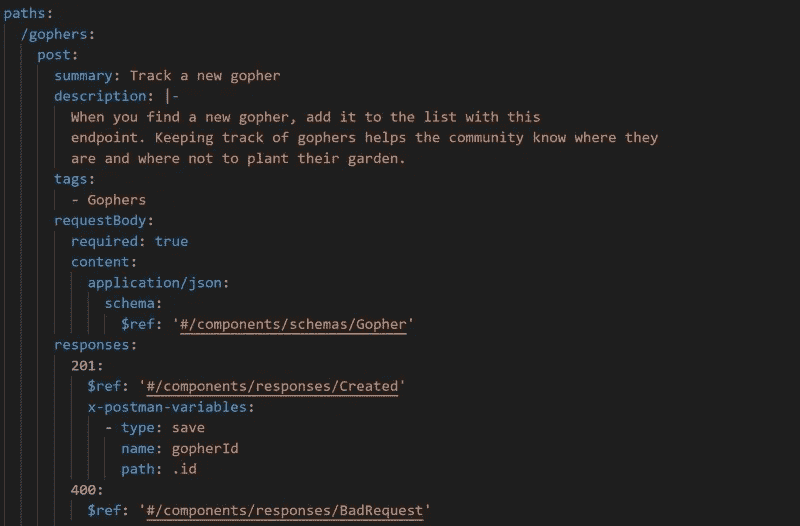
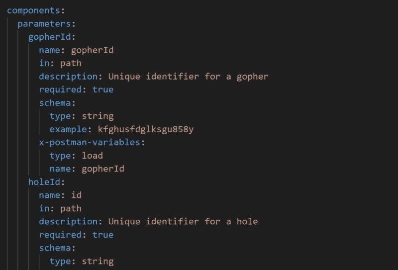
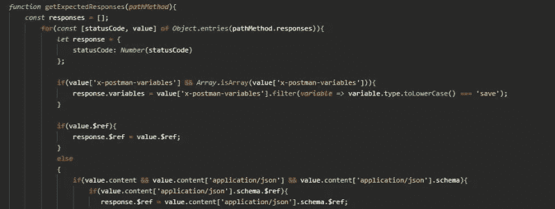
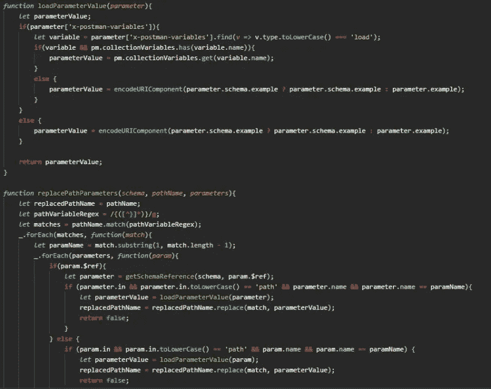

# 如何为您的开放 API 规范创建扩展

> 原文：<https://betterprogramming.pub/how-to-create-an-extension-for-your-open-api-specification-fc5f51c82bb8>

## 当你需要一些 OAS 不能处理的东西时，你会怎么做？当然是创建自己的扩展！


照片由[蒂姆·希尔](https://pixabay.com/users/timhill-5727184/?utm_source=link-attribution&amp;utm_medium=referral&amp;utm_campaign=image&amp;utm_content=5436525)从 [Pixabay](https://pixabay.com/?utm_source=link-attribution&amp;utm_medium=referral&amp;utm_campaign=image&amp;utm_content=5436525) 拍摄。

2021 年将是 API 年[。我们将专注于聚合一个标准(提供公共 API)并加快我们的创新速度。](https://medium.com/better-programming/its-2021-this-is-where-your-focus-should-be-in-tech-73deeb0b1eb)

随着我们对使用[开放 API 规范](https://www.openapis.org) (OAS)的 API 设计的关注，我们将遇到一些需要自动化但目前还不可能的场景。也许这种自动化对您和您的公司来说是定制的，或者也许它是您想要提供给任何地方的开发人员的一种服务。我们如何着手实现这种自动化？通过使用一个*延长件*。

[扩展](https://swagger.io/docs/specification/openapi-extensions/)是向 OAS 添加功能的简单方法。您向文件添加一些属性，实现一个处理程序来读取它并采取行动，并获得自动化的好处！

与其从概念上解释什么是扩展，今天我将带你创建一个全新的扩展。我们将做一个扩展来增强我们不久前做的[邮差合同测试生成器](https://medium.com/better-programming/dynamic-test-generation-with-open-api-spec-3-0-10dacd7866c2)。

测试生成器很棒，但是它依赖于种子数据才能正常工作。这意味着在执行之前，特定的数据必须在数据库中，以便测试可以使用它。

这造成了一点问题，因为它增加了进入的障碍。如果有一种方法可以在测试本身中使用测试生成的数据，那就太好了。这意味着当生成器执行`POST`来创建一个新实体时，它可以在对`GET`的后续请求中使用该实体的`id`或者用`PUT`进行更新。

让我们通过构建一个扩展来从头到尾解决这个问题。


*照片由* [*凯拉农*](https://unsplash.com/@imagesbykayla?utm_source=unsplash&utm_medium=referral&utm_content=creditCopyText) *上* [*下*](https://unsplash.com/s/photos/search?utm_source=unsplash&utm_medium=referral&utm_content=creditCopyText) *。*

# **识别业务问题**

在我们的例子中，我们希望能够在后续生成的测试中使用由生成的测试所创建的值。业务问题可以这样陈述:“我想在测试中使用动态变量，这样我就不必依赖于种子数据了。”

一旦您确定了业务问题，您就想要提出一个如何最好地解决它的计划。在我们的例子中，这涉及到在其他请求中使用由测试生成器创建的值。

为此，我们必须能够保存响应值并在其他请求中使用它们。记住这一点，我们应该能够开始下一步:定义模式。


*照片由* [*免费提供——照片由*](https://pixabay.com/photos/?utm_source=link-attribution&utm_medium=referral&utm_campaign=image&utm_content=1149962)[*Pixabay*](https://pixabay.com/?utm_source=link-attribution&utm_medium=referral&utm_campaign=image&utm_content=1149962)*提供* *。*

# **定义扩展模式**

要使用动态变量，我们需要知道什么时候*保存*和*消耗*它们。

## 保存动态变量

为了保存动态测试中的变量，我们需要知道何时何地从响应中获取值。在我们的例子中，特定端点上的某些响应代码将产生我们想要的值。

我们需要识别两部分数据:变量的名称和在哪里找到它。我们还需要让我们的处理程序知道我们想要保存一个变量。

考虑到这一点，以下模式支持我们的业务需求:

```
x-postman-variables: 
  - type: save 
    name: myVariable 
    path: .id
```

有了这个模式，`type`将告诉处理程序我们想要保存这个变量。`name`将是 Postman 中变量的名称。`path`将是响应中属性的 JSON 路径。您可以看到，我们还将扩展做成一个数组，以防我们需要存储来自单个响应的多个值。

现在，我们可以在特定端点的特定响应下将扩展添加到我们的开放 API 规范中。我们可以参考 [Gopher Holes Unlimited](https://github.com/allenheltondev/gopher-holes-unlimited/) 示例 API 规范。



*在 Gopher Holes Unlimited OAS 中使用扩展的示例*

## 消费动态变量

既然我们已经正确地保存了变量，那么接下来就是在后续的测试中使用它们了。使用开放 API 规范，我们能够定义请求中使用的参数。

因为我们希望在后续请求中使用变量，所以我们应该确保用扩展来丰富我们的 OAS `parameters`。每次我们使用参数时，测试生成器都会提取当前的 Postman 变量值，并在测试中使用它。

消费这些值要比保存它们容易得多，因为我们只需要知道变量名。这将我们引向以下模式:

```
x-postman-variables: 
  - type: load
    name: myVariable
```

有了这个模式，`type`表示我们正在加载值，`name`告诉我们的处理程序我们想要哪个变量。这样，我们就定义了扩展定义！

将该示例添加到我们的 OAS 中将如下所示:



*在 Gopher Holes 中无限制使用变量的示例*

# **实现处理程序**

定义了扩展的模式后，现在是时候编写解释这些值的代码了。毕竟，OAS 文档只是一个定义。它实际上不做任何事情。

我们的扩展专门用于 [Postman](https://www.postman.com/) ，所以我们的处理程序将从[契约测试生成器](https://github.com/allenheltondev/postman-contract-test-generator)集合中的预请求和测试脚本中编写。

## 保存扩展变量

契约测试生成器已经查看了每个端点上每个方法允许的响应。为了实现我们扩展的逻辑，我们将绑定到现有的功能中。

当我们保存每个方法的响应时，处理程序将寻找扩展并将变量保存到测试的一个`variables`属性中。



*“保存变量”处理程序逻辑从我们的扩展中读取*

您可以看到它正在保存定义了`save`类型的变量。

## 将响应值作为变量保存

现在是实际工作的时候了:在定义的路径上从响应中获取值，并将其保存到 Postman 集合变量中。

同样，这不是一个非常困难的代码片段。它只是使用我们在步骤 1 中保存的内容:


*将响应值保存到 Postman 变量中*

看看我们所做的，你会发现我们正一点一点地走向我们想要的财产。如果我们在响应中找到它，这个值将被保存到一个集合变量中。如果找不到值，断言就会失败，让我们的测试知道出错了。

# 使用响应值

我们拼图的最后一块是在需要的时候加载我们刚刚保存的值。测试生成器中已经存在一个函数，它用 OAS 提供的示例替换参数。

通过我们扩展，我们将修改逻辑，以便在必要时使用集合变量的值。如果我们在集合变量中找不到值，我们就回到这个例子。



*将持久变量加载到可用参数中*

您可以在这里看到，代码正在为任何保存类型为`load`的参数寻找我们的`x-postman-variables`扩展。如果有，它将使用集合变量。如果没有，它将从示例中提取。

针对查询参数和标题的代码也已更新。

# **试试看**

就是这样！有了处理程序的实现，一切都可以正常工作了。

为您的开放 API 规范构建一个扩展就是这么简单。只需三个简单的步骤:

1.  找出问题所在。
2.  定义模式。
3.  实现处理程序。

当然，如果您希望您的扩展被其他人使用，您将需要记录使用情况(就像我在这里所做的！).

我希望你受到启发，做出自己的扩展。可能性是无限的。处理程序甚至不需要在 Postman 中！它可以是你的 [CI 管道](https://medium.com/better-programming/how-to-build-a-ci-cd-pipeline-in-aws-in-5-minutes-and-58-seconds-4de156477042)中的一个脚本，你的 AWS CloudFormation 脚本中的一个定制资源，甚至是一个小小的按需桌面应用。

无论您采取哪种方式，都一定会让整个开发团队的生活变得更加轻松。

因此，走出去，建立一些扩展！如果你还没有，试试[测试生成器](https://github.com/allenheltondev/postman-contract-test-generator)。比以往任何时候都好！