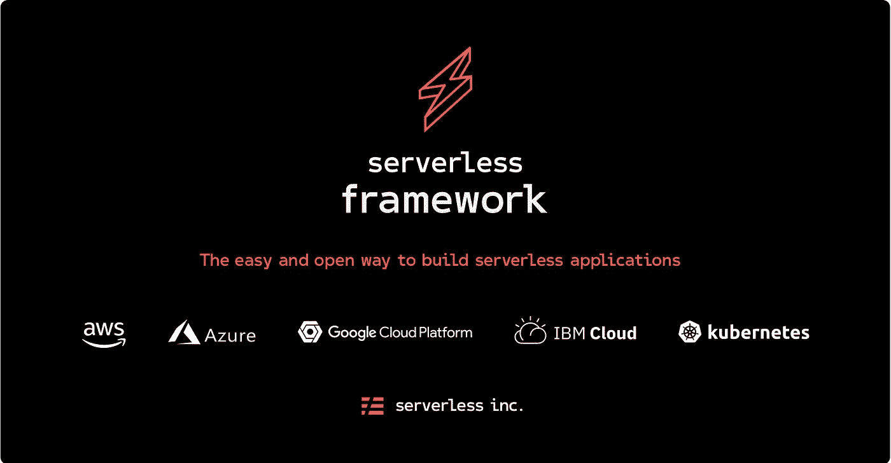

# 如何使用无服务器框架在 AWS 上创建 HTTP 端点

> 原文：<https://betterprogramming.pub/how-to-create-an-http-endpoint-on-aws-with-serverless-framework-9e5fd8eee2cb>

## 使用无服务器在 AWS 上托管 Python 函数并通过 HTTP 端点调用它的分步指南



[来源](https://github.com/serverless/serverless)

出于各种原因，你可能希望使用云提供商，如[亚马逊网络服务](https://aws.amazon.com) (AWS)、[谷歌云](https://cloud.google.com)或[微软 Azure](https://azure.microsoft.com/en-us/) 来托管你的代码。这篇文章将带您一步一步地了解使用[无服务器](https://serverless.com)在 AWS 上托管 Python 函数并使用 HTTP 端点调用它的过程。

如果这不完全符合你所寻找的不要担心！如果你想要不同的云提供商，无服务器支持许多不同的提供商。除了 HTTP 请求之外，还支持其他语言和触发器，这些语言和触发器的可用选项取决于您的特定提供程序。完成本教程后，您应该可以轻松地修改这些步骤来支持这些附加选项。

本文的一些先决条件:

*   确保安装了 Node.js 和 npm。如果没有，根据这些说明安装它们。
*   必须安装 Python 3
*   基本熟悉[虚拟环境](https://docs.python.org/3/library/venv.html)

# 步骤 1:设置无服务器

如果您不熟悉无服务器，这是一个帮助您轻松开发、部署和测试无服务器应用程序的框架。我一直认为 AWS 是一项复杂(但强大)的服务，而无服务器通过抽象掉一些复杂性，使得使用 AWS 变得更加容易。

首先，用`npm install -g serverless`在你的机器上安装 Serverless。

现在我们可以使用命令`serverless create --template aws-python3 --path aws-serverless-test`创建我们的无服务器项目。这里我们使用了`[create](https://serverless.com/framework/docs/providers/aws/cli-reference/create/)`命令在当前工作目录中创建新服务。注意，使用`--template`标志，我们指定 AWS 作为提供者，Python 3 作为运行时，使用`--path`标志，我们将项目命名为`aws-serverless-test`。

如果您想使用不同的提供商或不同的语言，请确保使用不同的模板。你可以在这里找到流行模板的列表[，或者运行`serverless create --help`查看所有模板的列表。(注意，每当我们调用`serverless`命令时，为了简洁起见，您可以使用`sls`。)](https://serverless.com/framework/docs/providers/aws/cli-reference/create/)

我们的新项目将有三个文件(如果使用不同的提供者或语言，这些文件可能会稍有不同):

*   `.gitignore` —这是根据我们选择的模板生成的，我们可以根据需要进行更新
*   `handler.py` —这个文件是我们指定应该为每个端点运行的函数的地方
*   `serverless.yml` —在这里，我们可以为 AWS 的无服务器部署配置设置

# 步骤 2:创建我们的函数

设置好模板后，让我们创建函数并为部署做准备。

首先，我们将创建一个虚拟环境。确保将您的终端切换到项目的文件夹，然后运行`python3 -m venv venv`创建一个虚拟环境，并使用源`./venv/bin/activate`激活它。确保将`venv`添加到您的`.gitignore`中，这样您就不会不小心提交了。此时，您可以随意使用`pip`来安装您喜欢的任何 linters 或 formatters。

对于本教程，我们现在将在根目录中创建一个名为`functions.py`的文件，它将包含我们要部署的函数。如果您没有自己的函数来测试这一点，这里有一个简单的 Python 函数可以使用:

我们的函数完成后，让我们配置 API 来返回这个消息。在`handler.py`中，您将看到一个名为`hello`的函数，它接受[的两个输入](https://docs.aws.amazon.com/lambda/latest/dg/python-programming-model-handler-types.html) — `event`是一个包含所有传入请求数据的`dict`，比如头和查询字符串参数，`[context](https://docs.aws.amazon.com/lambda/latest/dg/python-context-object.html)`提供方法和属性，这些方法和属性提供关于调用、函数和执行环境的信息

我们不需要 return 语句下面的所有内容，所以让我们删除这一部分。更新主体中的消息，以返回上面定义的自定义消息(或者您想要返回的任何内容)。我们的`handler.py`函数现在应该是这样的:

请注意，我们还添加了对 URL 查询字符串参数的支持，因此当我们发出 GET 请求时，我们可以通过将`?first_name=Matt`追加到我们的查询中来为此函数提供一个名称。下面的示例代码更详细地介绍了如何解析 POST 和 GET 参数:

# 步骤 3:更新无服务器设置

现在让我们准备部署。打开`serverless.yml`并更新它，使它看起来像下面的代码片段。请随意留下所有默认评论，以供将来参考。在这段代码中，我删除了那些注释，并替换成其他注释，以便清楚地说明您在更改什么以及为什么更改。

这个文件的最后两行谈到跨来源的资源共享( [CORS](https://developer.mozilla.org/en-US/docs/Web/HTTP/CORS) )。如果你不熟悉 CORS，只需知道“当一个 web 应用程序请求一个不同来源(域、协议或端口)的资源时，它会执行一个跨来源的 HTTP 请求。”因为我们不会将我们的函数托管在与我们的 web 应用程序相同的域中，也不会托管在调用该函数的任何地方，所以我们需要启用 CORS。

无服务器团队有一篇关于处理 CORS 的很棒的博客文章，他们推荐 JavaScript 函数使用 middy，Python 函数使用 lambda-decorator。所以我们现在也要遵循`lambda-decorators`指令来确保我们的函数提供 CORS 支持。

首先，我们安装[无服务器 python 需求](https://github.com/UnitedIncome/serverless-python-requirements)。这个插件扩展了 Serverless 的功能，使得在部署时包含我们的`requirements.txt`文件的依赖项变得容易。这是通过运行`sls plugin install -n serverless-python-requirements`安装的。您会注意到这会创建一个`package.json`文件，并为您更新您的`serverless.yml`文件。如果你有兴趣了解更多关于无服务器插件的知识，请看这里。

之后，我们可以用`pip install lambda_decorators`安装`lambda-decorators`包。为了使用它，我们将更新我们的`handler.py`文件以包含`from lambda_decorators import cors_headers`，并更新我们的函数以使用我们刚刚导入的装饰器。更新后的文件如下所示:

# 步骤 4:打包更新

因为您可能没有使用与 AWS 相同的操作系统，所以您安装的依赖项不会在它们的服务器上运行。为了解决这个问题，我们使用 [Docker](https://www.docker.com) 。如果你不熟悉 Docker，没关系，只要按照这些安装说明并确保 Docker 在你的电脑上运行。

我们已经安装了`serverless-python-requirements`包，其中包括一个`dockerizePip`选项来促进这一点。要使用它，只需将以下内容添加到`serverless.yml`的底部

关于这个命令的更多细节，你可以在这里看到[这里看到](https://serverless.com/blog/serverless-python-packaging/)和[这里看到](https://github.com/UnitedIncome/serverless-python-requirements)。

# 步骤 5:部署我们的功能

我们现在准备好部署我们的功能了！首先，我们需要通过运行`pip freeze > requirements.txt`来创建我们的`requirements.txt`文件。

接下来，让我们配置我们的 AWS 凭证。您可以按照此处的步骤[进行操作。当您到达](https://serverless.com/framework/docs/providers/aws/guide/credentials/) [*使用 AWS 访问键*](https://serverless.com/framework/docs/providers/aws/guide/credentials#using-aws-access-keys) 部分时，遵循名为 [*使用 AWS 概要文件*](https://serverless.com/framework/docs/providers/aws/guide/credentials#using-aws-profiles)*的小节，并创建一个名为`aws-serverless-tutorial`的概要文件。如果需要，您可以直接编辑机器上的`~/.aws/credentials`文件来配置您的配置文件。样本配置文件可能如下所示:*

```
*[default]
aws_access_key_id = YOUR_ACCESS_KEY_ID
aws_secret_access_key = YOUR_SECRET_ACCESS_KEY
region=us-east-1[aws-serverless-tutorial]
aws_access_key_id=YOUR_ACCESS_KEY_ID
aws_secret_access_key=YOUR_SECRET_ACCESS_KEY
region=us-east-1*
```

*我们现在可以使用`sls deploy -v --aws-profile aws-serverless-tutorial`来部署我们的功能。在该命令中，`-v`标志是可选的，用于指定*详细*模式，即终端的额外记录。注意，我们还指定了我们想要部署的 AWS 概要文件。为不同的项目创建不同的概要文件是一个很好的实践。*

*请耐心等待，因为这需要几分钟时间。每次更改`serverless.yml`文件时，必须运行该命令。如果您只编辑了正在部署的函数，那么您可以通过运行`sls deploy -v --aws-profile aws-serverless-tutorial --function get-custom-greeting`来加速部署。(当然，一定要把`get-custom-greeting`换成你的函数名。)*

# *步骤 6:测试我们的功能*

*一旦部署完成，查找控制台的*堆栈输出*部分，并注意*服务端点*的值。这应该是类似`https://kr3c39wj4o.execute-api.us-east-1.amazonaws.com/dev`的东西。这是我们函数的根 URL。您的确切网址会有所不同。*

*如果再往上看一点，在*服务信息*部分，您会看到我们刚刚创建的特定端点，类似于下面的代码片段:*

```
*endpoints:
  GET - https://kr3c39wj4o.execute-api.us-east-1.amazonaws.com/dev/get-custom-greeting*
```

*请记住，这个函数需要一个 name 参数，所以要看到它在实践中的工作，请将`?first_name=yourName`附加到上面的 URL——例如`https://kr3c39wj4o.execute-api.us-east-1.amazonaws.com/dev/get-custom-greeting?first_name=Matt`——并在您的浏览器中打开该 URL。您的函数响应现在应该显示出来了！*

*但是，它可能不会…*

# *步骤 7:故障排除*

*如果令您失望的是，您没有看到您的结果，而是看到了`{“message”: “Internal server error”}`，不要担心——我们只需要快速排除故障。*

*这个错误消息是非常无用的。要获得更有用的版本，请按照以下步骤操作:*

1.  *登录您的 AWS 帐户*
2.  *导航至*服务* > *云观察**
3.  *在左侧的导航工具条中，点击*日志**
4.  *选择适当的日志组，例如`[https://kr3c39wj4o.execute-api.us-east-1.amazonaws.com/dev/get-custom-greeting](https://kr3c39wj4o.execute-api.us-east-1.amazonaws.com/dev/get-custom-greeting)`*
5.  *从该组中选择特定日志流以查看错误消息*

*或者，您可以使用无服务器直接查看日志，如这里的[和这里的](https://serverless.com/framework/docs/providers/aws/guide/workflow/)和[所述。](https://serverless.com/framework/docs/providers/aws/cli-reference/logs/)*

*您很可能会看到以下错误:*

```
*DistributionNotFound: The 'jsonschema' distribution was not found and is required by the application*
```

*这是[由于](https://stackoverflow.com/a/54900374/10152004)与 AWS 和`requirements.txt`中列出的`jsonschema`包不兼容。为了解决这个问题，我们将使用以下步骤强制将`jsonschema`包升级到 2.6.0:*

1.  *打开`requirements.txt`并将相应的行更新为`jsonschema==2.6.0`*
2.  *使用`pip install -r requirements.txt`基于这个文件重新安装我们的依赖项*
3.  *通过运行`pip freeze > requirements.txt`确保没有其他变化。在每次部署之前运行这个是一个很好的实践。*
4.  *使用上面的命令重新部署我们的服务。由于我们在这个项目中可能有多个功能，为了简单起见，我们将部署完整的服务。但是，请注意，当您重新部署一个功能时，依赖关系会更新。*

*刷新浏览器页面，这次您应该会看到您的消息！*

*在`handler.py`中，我们将输入——我们的`event`参数——作为响应的输出。因此，您看到的响应可能看起来有点混乱。如果您不需要这个输出，请随意删除它，然后重新部署您的功能。*

*至此，您已经完成了，如果您准备深入研究，您可以查看[的无服务器文档](https://serverless.com/framework/docs/)！*