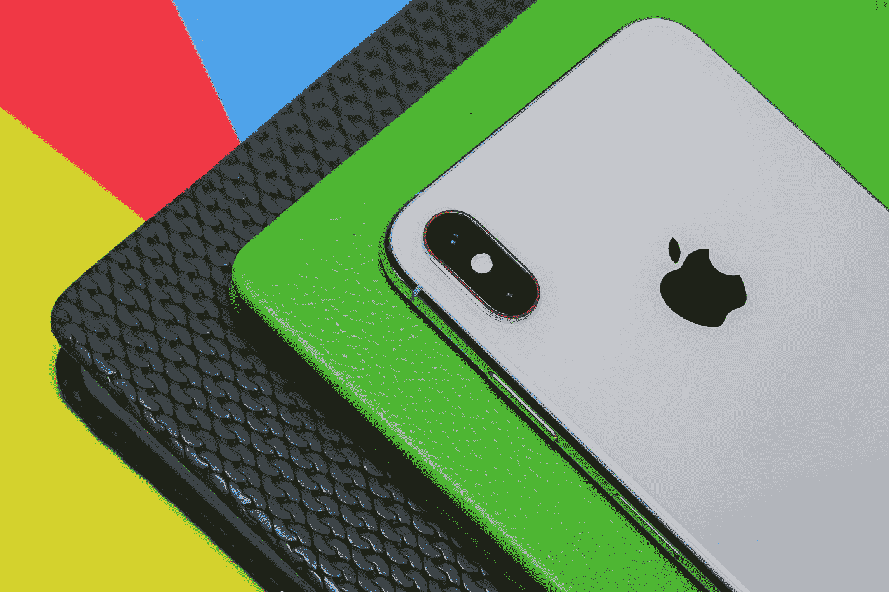
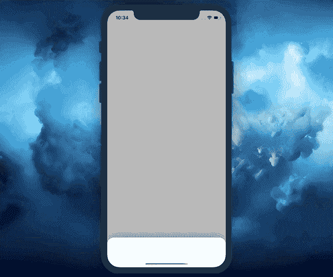

# 如何在 Swift 5 中创建交互式底部表单

> 原文：<https://betterprogramming.pub/how-to-create-an-interactive-bottom-sheet-in-swift-5-adadaad79e72>

## 使用容器和子视图控制器

阿米尔马赫迪·卡泽姆内贾德在 [Unsplash](https://unsplash.com?utm_source=medium&utm_medium=referral) 上的照片

在本文中，我们将学习如何创建一个可重用的 UI 元素——底层表单。

在本教程结束时，您将有一个完成的组件，您可以轻松地复制并粘贴到您的应用程序中，并根据您的需要使用。

这是我们将要建造的:

简而言之，完成本教程后，您将掌握以下内容:

*   容器和子视图控制器——离遵循可伸缩的 MVC 架构方法更近了一步
*   `UIPanGestureRecognizer` —使用方便的手势并利用其`velocity`和`translation`属性
*   约束动画-平滑移动任何 UI 元素

您将在文章末尾找到该项目的完整源代码。

# 我们开始吧

首先，我们需要创建一个通用的`BottomSheetContainerViewController`，它将包含一个内容视图控制器和一个底部表单视图控制器作为子控件:

正如我们所见，`Content`和`BottomSheet`类型都必须是`UIViewController` s，这意味着我们将能够指定任何自定义`UIViewController`为`Content`或`BottomSheet`。当我们在一个例子中开始使用`BottomSheetContainerViewController`时，您将会看到这一点。

现在我们已经将`Content`和`BottomSheet`视图控制器作为子视图，让我们添加一些必需的属性。在这一步中，我们将创建两个:

*   一个`BottomSheetConfiguration`结构，它将表示底部工作表的总高度和初始偏移量
*   一个`BottomSheetState`枚举，用于管理底部工作表的状态。它有`.initial`和`.full`两种情况:

注意，我们更新了初始化器，将`BottomSheetConfiguration`作为参数包含进来。

现在，让我们转到处理交互和动画的属性。添加`panGesture`和`topConstraint`属性如下:

底部的工作表视图控制器将在屏幕上移动，所以我们需要得到它的视图的顶部约束。由于这个原因，我们有了`topConstraint`属性，我们将重复地改变它并相应地制作动画。

请注意，我们将`BottomSheetContainerViewController`与`UIGestureRecognizerDelegate`保持一致。这允许我们添加方法`gestureRecognizer(_:shouldRecognizeSimultaneouslyWith:)`，在其中我们返回`true`。

这在您有一个`UITableView`或任何其他滚动视图放在底部表单内的情况下很有用。如果我们没有添加这个方法，我们的`UIPanGestureRecognizer`会在`UIScrollView`子类上执行手势时停止工作。

现在让我们将子视图控制器添加到容器中:

以下是所有步骤的明细:

1.  使用`addChild()`方法将`contentViewController`和`bottomSheetViewController`添加到容器中。
2.  将`contentViewController`和`bottomSheetViewController`的根视图添加到容器的根视图。
3.  将`panGesture`添加到`bottomSheetViewController`的根视图中。
4.  应用`translatesAutoresizingMaskIntoConstraint = false`。这是必需的，因为我们使用约束以编程方式创建 UI。
5.  为`contentViewController`的视图设置约束。
6.  调用`didMove(to:)`方法通知`contentViewController`它已经被添加到父对象中。父级是`BottomSheetContainerViewController`。
7.  将底部板材的顶部约束设置为与容器视图的`bottomAnchor`对齐。我们还添加了一个`BottomSheetConfiguration`的偏移量，让底部的工作表在屏幕底部看得见一点。
8.  设置所有底部图纸的约束并激活它们。
9.  调用`bottomSheetViewController`上的`didMove(to:)`方法，通知它已被添加到`BottomSheetContainerViewController`中。

最后，我们完成了容器及其子容器的设置。现在让我们使用`panGesture`来处理交互性。

让我们将`panGesture`与其动作联系起来:

现在，我们将添加两个方法:

*   `showBottomSheet(animated:)` —将底部料板移动到其最大高度，并将`BottomSheetState`设置为`.full`。如果`animated`设置为`true`，则动画执行动作。
*   `hideBottomSheet(animated:)` —同样，该方法将底部板材移动到其初始点，并将`BottomSheetState`设置为`.initial`。如果设置动画，它会执行一个很好的弹簧动画。

上面的代码显示了如何动画约束。这些是步骤:

*   改变约束的`constant`。
*   在动画块中运行`self.view.layoutIfNeeded()`。请注意，您必须调用您想要制作动画的视图的*超级视图*上的`layoutIfNeeded()`。在我们的例子中，这个超级视图是`BottomSheetContainerViewController`的根视图。

太好了！现在，我们可以通过编程来移动和隐藏底部的工作表。是时候直接用`UIPanGestureRecognizer`的动作工作了。

这是我们想要实现的行为:

*   用手指上下移动底板。
*   当我们停止移动它时，考虑当前`BottomSheetState`、`translation`和`velocity`在`y`方向上的移动。如果`state`是`.full`，检查底部料板是否平移了其高度的至少一半。如果这是`true`，我们运行`hideBottomSheet(animated:)`方法。否则，我们把它恢复到最大高度。此外，我们需要检查`velocity`的大小是否大于 1000。如果这给我们`true`，隐藏底部表。在其他情况下，将其恢复到最大高度。同样，如果`state`是`.initial`，检查`translation`和`velocity`的大小并做出相应反应。

我保证，一切都会变得更有意义。让我们从获得`y`方向的`translation`大小和`velocity`开始:

现在让我们为手势的当前状态创建一个`switch`:

正如我们所看到的，我们处理`UIGestureRecognizer`的`.began`、`.changed`、`.ended`和`.failed`状态。在它们中的每一个(我们将`.began` 和`.changed`分组)中，我们提供了一个基于当前`BottomSheetState`的`if else`语句。

让我们现在处理每一个案例。首先，我们从分组的`.began`和`.failed`案例开始:

下面是上述步骤的分解。如果`BottomSheetState`是`.full`:

1.  断言用户向下滚动。底部板材已经处于其最大高度；不允许向上滚动。
2.  改变`topConstraint`的`constant`以匹配用户手指的当前位置。例如，如果底部工作表的总高度是 500 点，用户滚动了 100 点，我们从 500 减去 100，得到 400 点。所以我们将常量设置为-400 *，*，因为这是从容器视图底部的偏移量。
3.  更新根视图以显示约束的更改。

当`BottomSheetState`为`.initial`时:

4.使用`BottomSheetConfiguration`的`initialOffset`和`translation`的大小计算新的常数。例如，如果初始偏移量是 80 点，而用户滚动了 200 点，则我们获得 280 点。这意味着我们需要将底板放置在距离容器底部 280 度的地方。

5.断言用户向上滚动。因为底部的工作表位于其初始点，所以不允许向下滚动。

6.断言`newConstant`的大小小于底板的全高。这是为了防止底板移动超过其最大高度点。

7.设置结果常数。

8.更新根视图以显示约束的更改。

`.began`和`.changed`状态完成后，现在我们需要处理`.ended`情况:

如果`BottomSheetState`是`.full`当用户停止移动底部板材时:

1.  检查用户是否试图向上移动底部纸张。如果这是真的，底部表应该保持显示。
2.  如果用户移动底层超过其最大高度的一半，或者`y`速度高于 1000，那么我们隐藏底层。
3.  在所有其他情况下，保留显示的工作表。

另一方面，如果`BottomSheetState`是`.initial`:

4.检查用户是否移动了底板至少其最大高度的一半，或者`y`速度小于-1000。

5.如果这是真的，显示底部的工作表。

6.否则，隐藏底部工作表。

我们需要处理最后一种情况，`.failed`，如果`UIPanGestureRecognizer`在此过程中失败:

这一次的逻辑非常简单。如果最新的`BottomSheetState`是`.full`，将料板返回到其最大高度点。否则，隐藏底部工作表。

太好了！我们终于实现了一个可重用的类。我们现在能够随时有效地使用它。让我们快速地在一个简单的例子中使用它。

# 用法示例

创建名为`WelcomeContainerViewController`的`BottomSheetContainerViewController`的子类:

这就是我们拥有一个显示内容视图控制器和底部表单视图控制器的全功能容器所需要的。

正如我们所看到的，我们有作为内容视图控制器的`HelloViewController`和作为底部表单视图控制器的`MyCustomViewController`。

`HelloViewController`仅显示灰色视图:

`MyCustomViewController`有一个白色背景、圆角和阴影的视图:

这就是我们如何初始化`AppDelegate.swift`文件中的`WelcomeContainerViewController`:

就是这样！我们仅用 200 行代码就成功实现了一个通用的底部表单容器视图控制器:

您已经看到了使用容器和子视图控制器使它们尽可能薄是多么方便。

您也已经掌握了`UIGestureRecognizer`，现在您可以使用这些知识来实现更复杂的 UI 元素和交互。

# 资源

包含实现和示例的项目源代码可以在 GitHub 上找到: [zafarivaev/BottomSheet](https://github.com/zafarivaev/BottomSheet) 。

# 包扎

对其他 UI 相关的文章感兴趣？看看下面这些故事:

*   [Swift 中的 UIBezierPath 是什么？](https://medium.com/better-programming/what-is-a-uibezierpath-in-swift-3e024af92e3d?source=friends_link&sk=93481485f5e05bd4e630d56a0072e4d6)
*   [Swift 5 中有哪些关键帧动画？](https://medium.com/better-programming/what-are-keyframe-animations-in-swift-5-55eaf04f7637?source=friends_link&sk=d8bf73274bcc78ca2847dbd519a9bcf1)
*   [Swift 中的@IBDesignable 和@IBInspectable 是什么？](https://medium.com/better-programming/what-are-ibdesignable-and-ibinspectable-in-swift-1e3440797d9?source=friends_link&sk=4968a3a7927984811c1048b0b38f3501)

感谢阅读！