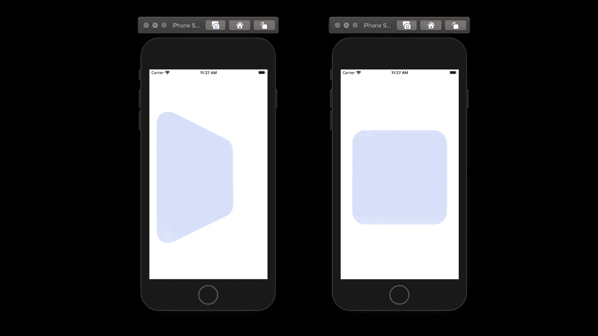
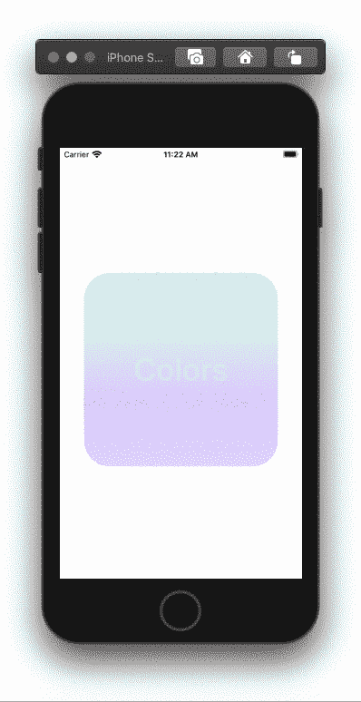

# 如何在 SwiftUI 中创建虹彩视图

> 原文：<https://betterprogramming.pub/how-to-create-an-iridescent-view-in-swiftui-c2c9178490d1>

## 旋转视图和移动渐变颜色

SwiftUI 中的虹彩视图(作者供图)。

# 变量

为了创建一个彩虹色的视图，我们需要声明一个`x` 变量来激活渐变的端点，并声明一个`degree` 变量来激活视图的旋转。让我们用一个计时器每五秒钟为视图制作一次动画:

对于渐变色，我选择了下面看起来像典型的彩虹色的颜色。您可以将颜色更改为您选择的颜色。

# 视角

为了创建视图，我们将使用一个包含一个`RoundedRectangle`形状和一个`Text`视图的`ZStack`:

# 动画

我们有两个值来激活*。*使用`AnimatablePair`激活`x`和`degree` 变量:

在`RoundedRectangle`上增加`.onReceive`。使用我们的计时器，将我们的`degree`变量的值从 0 更改为 45，将我们的`x`变量的值从 0 更改为 1，反之亦然:

最后，我们需要在 y 轴上旋转`ZStack`。为此，我们需要使用`rotation3DEffect`:

彩虹色的景色

现在你也可以建造这个了！感谢阅读。