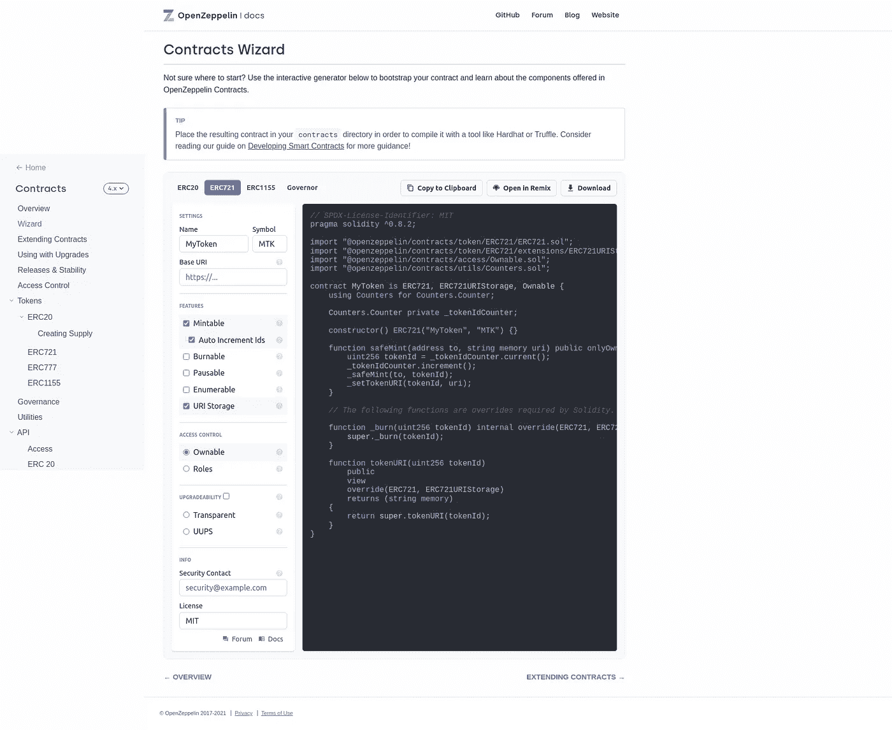
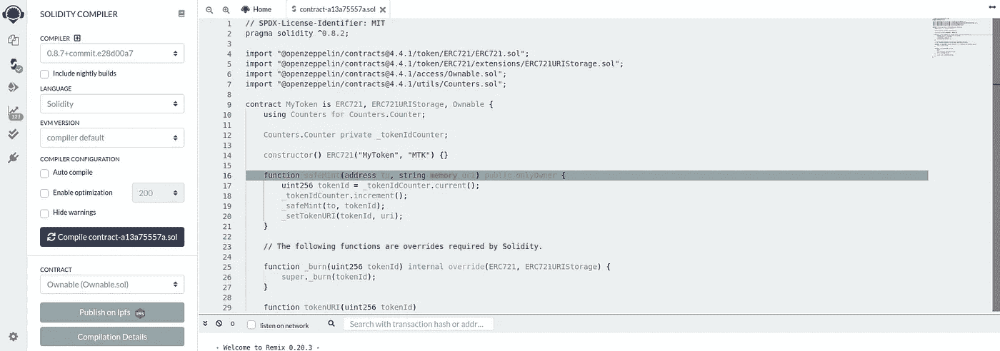
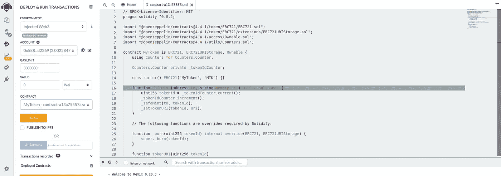
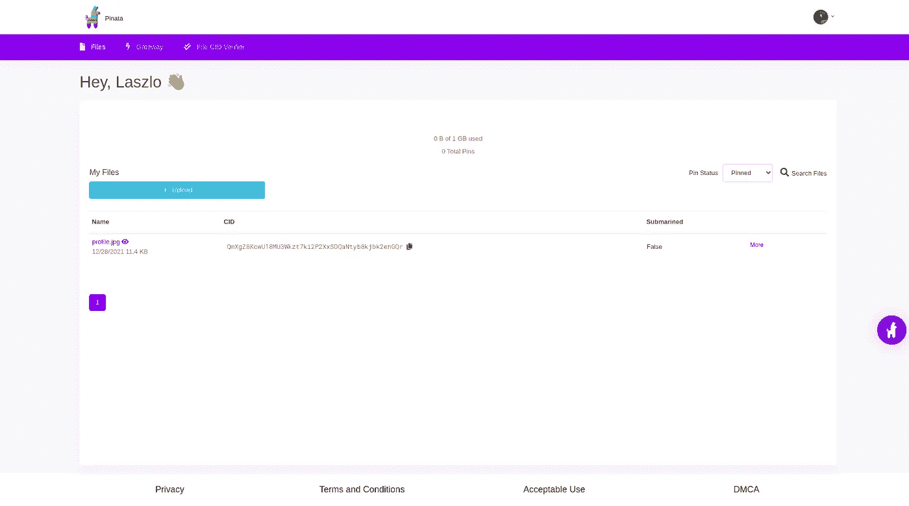
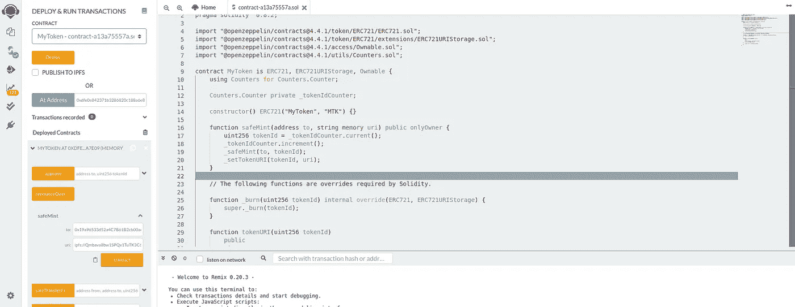
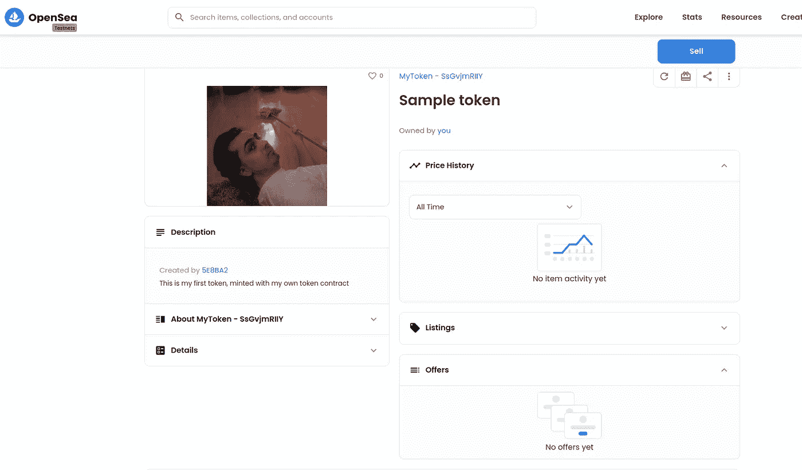

# 如何创建 NFT 合同(没有编码技能)

> 原文：<https://betterprogramming.pub/how-to-create-an-nft-contract-without-coding-skills-968d3fc37f5e>

## 在任何以太坊兼容链上创建自己的 NFT，例如 Mainnet、Polygon、xDai 等


NFT 是区块链新的超级明星。NFT 可以代表一幅画(或任何一件艺术品)，虚拟或现实世界中的一个物体，或任何其他不可替代的东西。

在本文中，我将向您展示如何创建您自己的 NFT 契约，并在任何以太坊兼容链(如 Mainnet、Polygon、xDai 等)上创建您自己的 NFT。

OpenZeppelin 是一个智能合约框架，有许多智能合约模板和库。对于聪明的合同开发者来说，这就像一把瑞士军刀。它还有一个[在线向导](https://docs.openzeppelin.com/contracts/4.x/wizard)，可以让你在一分钟内创建简单的智能合同。让我们看看，我们怎样才能用它创建一个 NFT 契约。



[ERC721](https://eips.ethereum.org/EIPS/eip-721) 是 NFT 标准，所以在标签栏上选择它，然后检查**可制造**、**自动增量 id**和 **URI 存储**。您将在右侧看到自动生成的代码。在**设置**块上，您可以设置您的令牌名称和符号。通过这几个步骤，您已经配置了一个功能齐全的 NFT 合同。将它部署到区块链也同样简单。

点击“在混音中打开”按钮，将为您打开一个新的混音页面。第一步是用第二个菜单项(Solidity compiler)编译合同。



使用“编译合同”按钮编译合同，并选择第三个菜单项(部署和运行事务)来部署合同。



在这个页面上，选择注入的 web3 环境以将 Metamask 连接到 Remix，选择令牌契约，然后按 Deploy 按钮。如果一切顺利，Metamask 会弹出一个确认对话框。确认交易，稍微等一下矿工，就……搞定了。恭喜你，你有自己的部署 NFT 合同！

您将在左侧底部看到您部署的合同。如果将鼠标指针移到令牌名称上，可以复制其合同地址。把它记在某个地方，因为以后会很重要。

让我们用我们全新的代币合同铸造我们的第一个 NFT！当您创建一个 NFT 时，您必须给出一个指向 NFT 元数据的 URI。该元数据描述了 NFT 所代表的内容。从技术上讲，这个元数据是一个简单的 JSON 文件。JSON 文件的基本格式是在 ERC-721 中定义的，但是可以自由扩展。基本字段是名称、描述和图像，因此 JSON 文件如下所示:

```
{
  "name": "Sample token",
  "description": "This is my first token",
  "image": “...image url..”
}
```

该标准没有定义元数据应该放在哪里，但是不可变的存储，像 [IPFS](https://ipfs.io/) 是 NFT 元数据的理想存储。Pinata 是一个简单的服务，用于上传你的 NFT 数据并发布到 IPFS。它有一个免费计划，提供 1Gb 的存储空间，这对我们来说绰绰有余，所以选择你最喜欢的图像并上传到 Pinata。



上传后，您将看到生成的图像的 CID。这是它在 IPFS 上的唯一标识符。你可以通过[https://ipfs.io/ipfs/{cid}](https://ipfs.io/ipfs/%7Bcid%7D)网址上的公共 IPFS 网关查看你的文件。

现在我们有了图像 CID，所以我们可以很容易地创建元数据 JSON。我的 JSON 是这样的:

```
{
  "name": "Sample token",
  "description": "This is my first token",
  "image": "ipfs://QmXgZ8KcwU18MU3Wkzt7ki2P2XxSDQaNtyb8kjbk2enGQr"
}
```

我们可以使用元数据 JSON CID 来重新混合和铸造我们的第一个 NFT 令牌。为此，请打开左侧底部的令牌合同，然后打开 safeMint。`safeMint`函数有两个参数。NFT 所有者的以太坊地址(必须不同于合同创建者)和元数据 URI。URI 将是 ipfs://{ metadata JSON 的 CID }。



按下 transact 按钮，在 MetaMask 中确认交易，瞧，你已经创造了一个新的 NFT 令牌，可以在 [OpenSea](https://opensea.io/) 上查看。OpenSea 是 NFT 的一个市场，在这里你可以出售或购买许多以太坊兼容链上的 NFT。

你的令牌在 OpenSea 上的网址是`[https://opensea.io/assets/](https://opensea.io/assets/){contract address}/{NFT id}`。OpenSea 有一个测试接口，您可以使用它来显示来自 testnet 的 NFT。我在 Rinkeby 上创建了我的 NFT 合同，所以我将使用这个替代 URL，其中主机部分是 [testnets.opensea.io](http://testnets.opensea.io) 。

我现在的网址是`[https://testnets.opensea.io/assets/0xdfe0e842371b3286820c188a6e855fd7f1da7e09/0](https://testnets.opensea.io/assets/0xdfe0e842371b3286820c188a6e855fd7f1da7e09/0)`，因为我的代币合同地址是`0xdfe0e842371b3286820c188a6e855fd7f1da7e09`，第一个 NFT 的索引是 0。



你可以在右边的 meta 中看到名称，在左边看到带有描述的图片。这台 NFT 功能齐全。我可以卖掉它，或者做任何我能对其他 NFT 人做的事。

如你所见，使用 OpenZeppelin、Remix 或 MetaMask 等优秀工具，创建 NFT 合同和铸造 NFT 非常简单。即使你没有任何编程经验。

玩得开心，做 NFT。

*本文原载* [*这里*](https://hackernoon.com/how-to-create-your-own-nft-contract-without-programming-skills) *。*