# 如何在 SwiftUI 中创建和激活复选框

> 原文：<https://betterprogramming.pub/how-to-create-and-animate-checkboxes-in-swiftui-e428fe7cc9c1>

## 使用形状和动画数据构建不同的动画复选框

格伦·卡斯滕斯-彼得斯在 [Unsplash](https://unsplash.com?utm_source=medium&utm_medium=referral) 上拍摄的照片。

# 圆形矩形复选框

对于第一个复选框，首先创建一个新的 struct 视图，并向其中添加一个`RoundedRectangle`。使用`stroke`功能，给它一个`StrokeStyle`，其线宽由你选择:

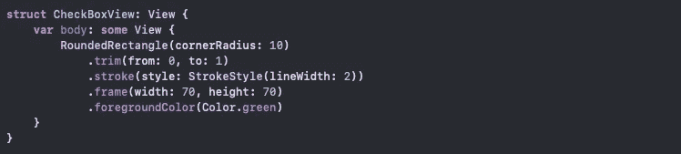

将`RoundedRectangle`嵌入`ZStack`中，并添加另一个`RoundedRectangle`，填充您选择的颜色。确保第二个`RoundedRectangle`比第一个小:

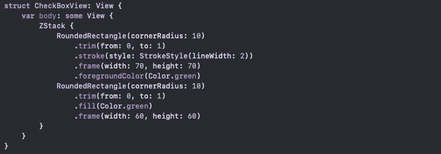

在 struct 视图的顶部声明一个名为`checked`的绑定布尔变量。在条件括号内的第二个`RoundedRectangle`下方添加一个复选标记图像，如下所示:

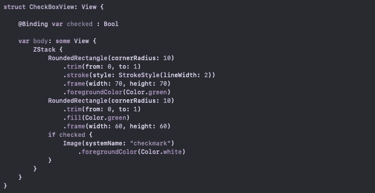

现在使用同样的`checked` 变量来控制矩形的颜色:

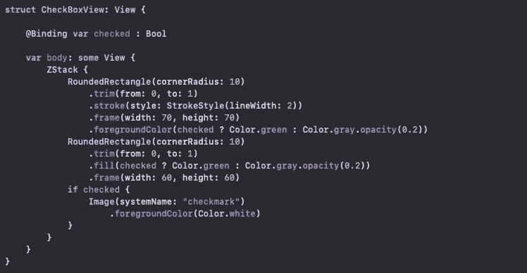

声明另一个变量来控制第一个`RoundedRectangle`的`trim`函数值。该值将被动画化。在`animatableData`变量中有这个值:

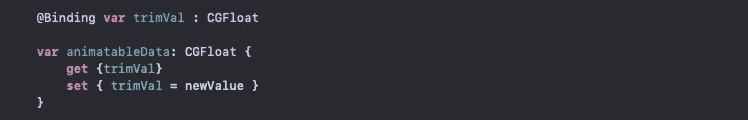

将`trim`函数的`to:`值更改为新变量`trimVal`:

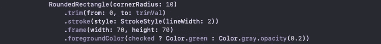

你已经完成了`CheckBoxView`。在您的`ContentView`中，添加您的`CheckBoxView`作为按钮，并传递两个状态变量(`checked`和`trimVal`):

你需要更换按钮内的`checked`和`trimVal`。在`withAnimation`内部，将`trimVal`赋值为 1，并使用`toggle()`改变`checked`布尔值。您也可以添加一个`else`语句来反转动画:

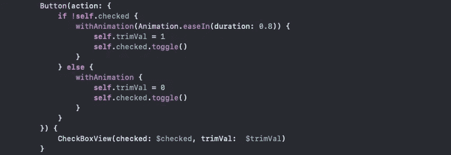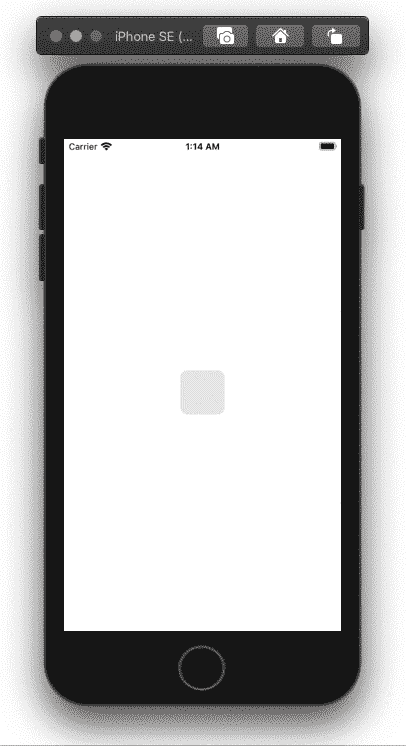

代码结果:按钮内的复选框

可以用`onTapGesture`代替按钮。这将消除按钮的闪烁:

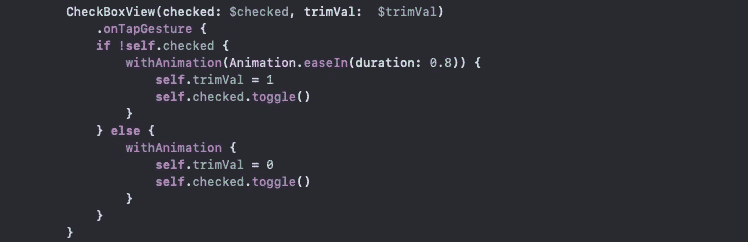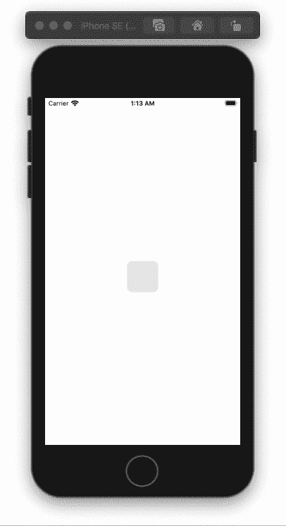

代码结果:带有点击手势的复选框

# 圆形复选框

你可以回到你的`CheckBoxView`，把形状改成圆形，如下图:

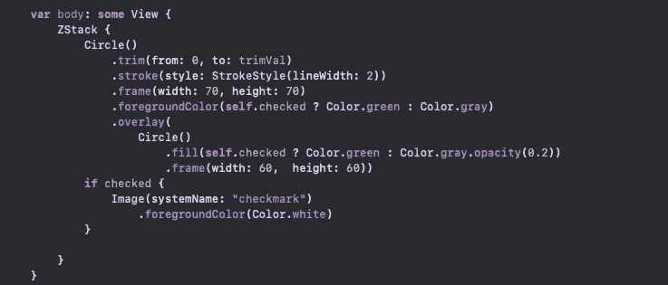

代码结果:循环复选框

# 胶囊复选框

我有两个胶囊，一个在另一个上面。让我们添加两个变量:`width`和`removeText`。*`width`变量将用于胶囊的框架。为了确保第二个胶囊比第一个小，从宽度中减去 10。最后，在`if`语句中添加一个文本视图，如下所示:*

*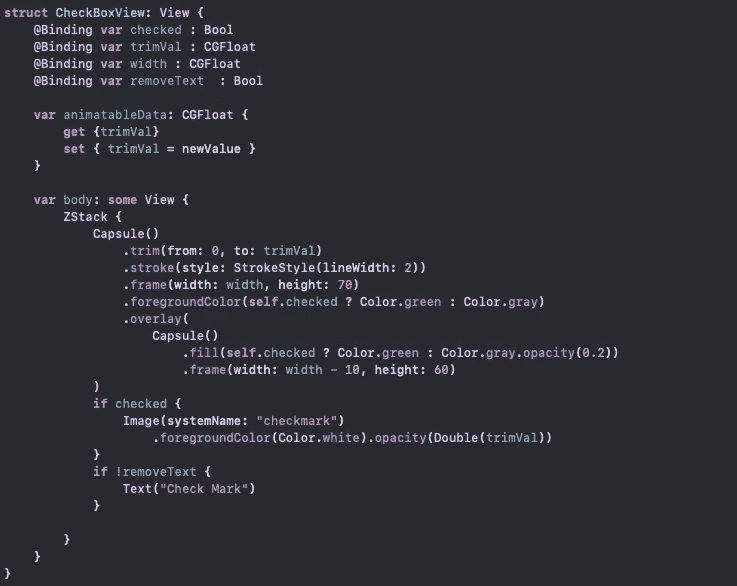*

*在您的`ContentView`中，添加`removeText`和`width`变量，并将`onTapGesture`代码更改为以下代码:*

*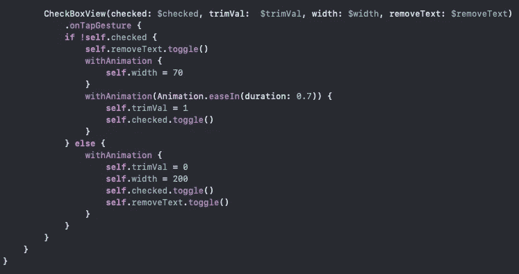**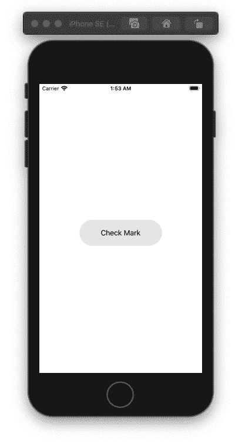*

*代码结果:胶囊复选框*

*全部完成！感谢阅读！*