# 如何创建和配置 Firebase 和 Angular 项目

> 原文：<https://betterprogramming.pub/how-to-create-and-configure-a-firebase-and-angular-project-9305c40ee308>

## 设置火焰基、角度火焰和角度项目


雅各布·基索在 [Unsplash](https://unsplash.com?utm_source=medium&utm_medium=referral) 上的照片

# 介绍

Firebase 是一个由 Google 支持的应用开发平台，它为开发者提供了一系列构建应用的工具。Firebase 提供的一些关键服务包括:

*   证明
*   实时数据库
*   云 Firestore
*   云存储
*   云函数
*   主办；主持

本教程将向您展示如何创建和配置一个新的 Firebase 项目，以及如何向 Firebase 项目添加一个 web 应用程序。您还将学习如何将身份验证和 noSQL 数据库(称为 Cloud Firestore)添加到项目中。我们将看到如何用 AngularFire 原理图创建和设置一个角度项目。最后，但同样重要的是，本教程将向您展示如何安装 Firebase CLI，它为我们提供了一套非常方便的工具来管理 Firebase 项目。

## 索引

*   设置 Firebase 项目
*   添加身份验证(可选)
*   添加 Firestore(可选)
*   安装 Firebase CLI
*   设置角度项目

# 设置 Firebase 项目

要创建一个新的 Firebase 项目，我们需要登录到 [Firebase 控制台。](https://console.firebase.google.com/)完成后，我们可以点击 Add Project 创建一个新项目:

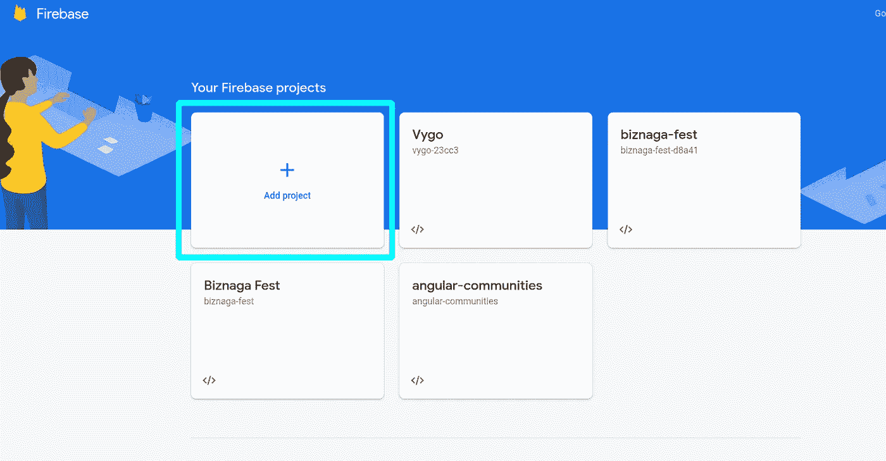

Firebase —创建新项目

我们需要为我们的项目选择一个名称:

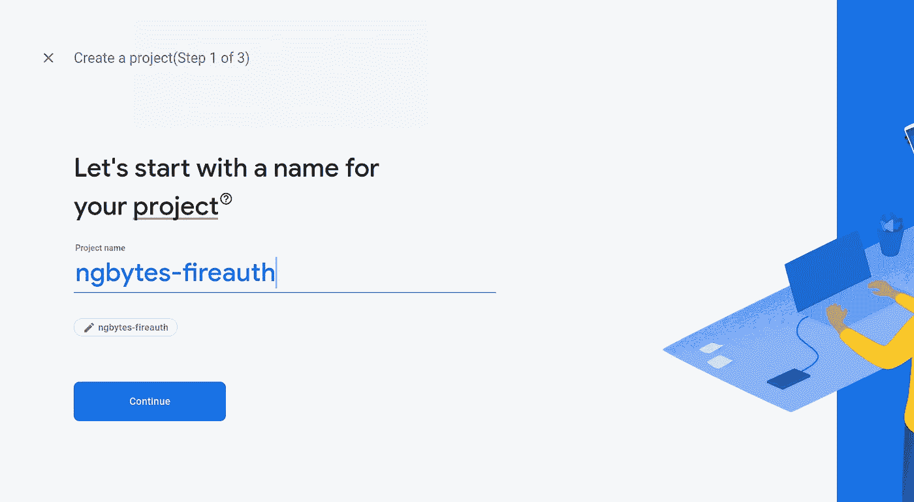

Firebase —选择名称

决定我们是否希望谷歌分析在我们的项目中(你的选择，我会选择否):

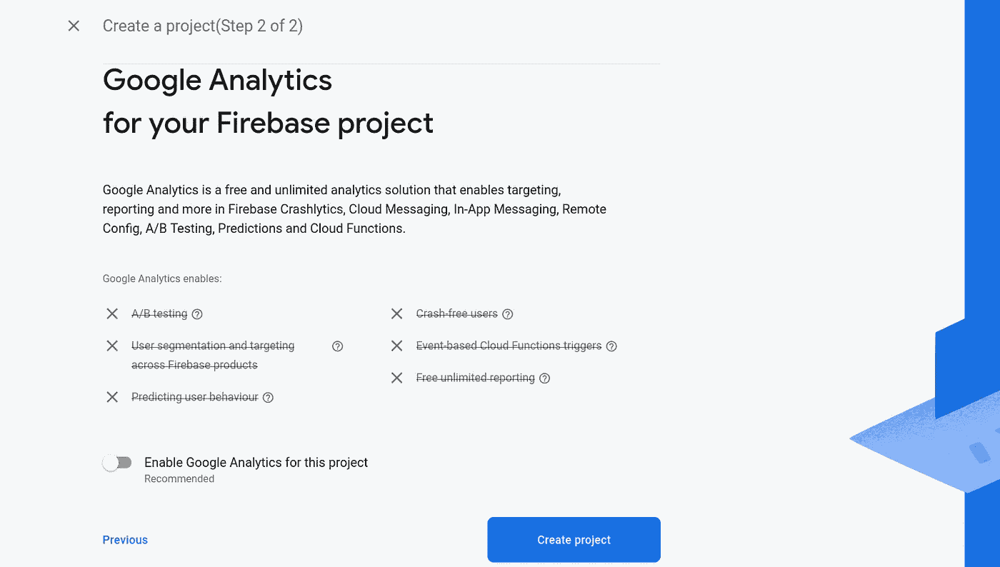

firebase——支持谷歌分析

我们完了！我们现在有一个可爱的新的 Firebase 项目。

## 将 Firebase 添加到 Web 应用程序

现在我们需要将 Firebase 添加到我们的 Angular 应用程序中。为此，我们需要在控制面板中点击 Web app 按钮:

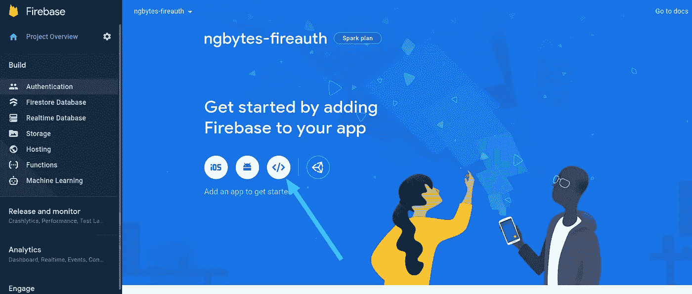

Firebase —添加 web 应用程序

然后我们需要选择一个名称:

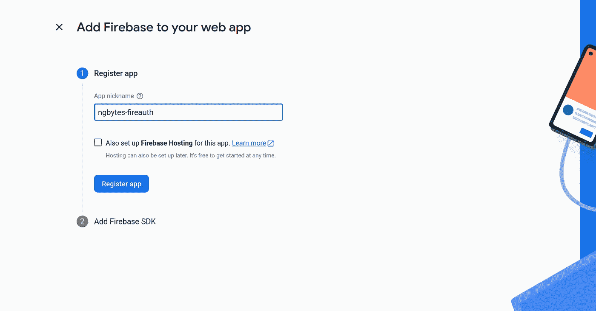

最后，我们现在有了稍后将用于向我们的 Angular 应用程序添加 Firebase 的配置:

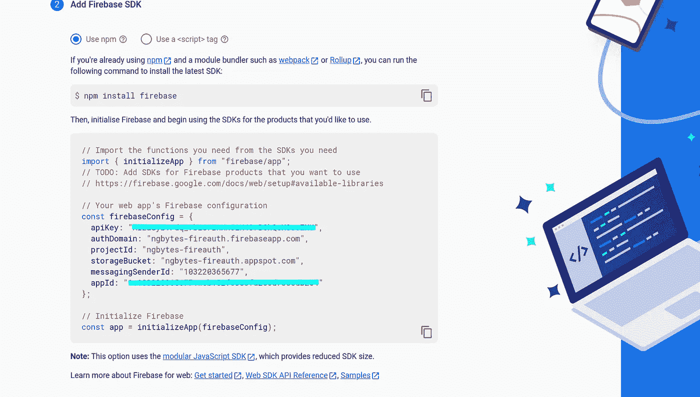

# 添加身份验证(可选)

*注意:这一步和下一步(添加 Firestore)是可选的。如果您不需要添加身份验证或 Firestore，请随意跳过这些部分，并开始阅读如何配置 Angular 和 AngularFire。*

是时候添加身份验证并选择我们想要实现的登录方法了。在本教程中，我们将添加一个 Google 社交登录和一个传统的电子邮件/密码登录。转到身份验证页面，单击“开始”按钮:

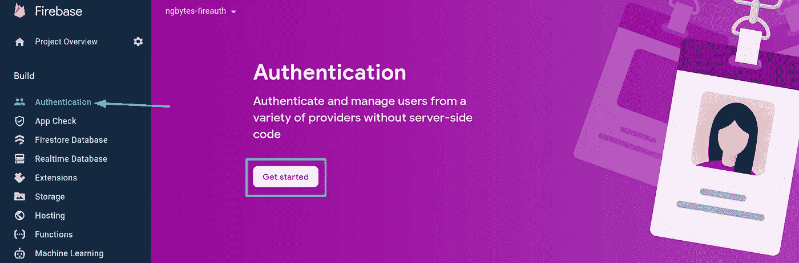

Firebase —添加身份验证

我们要做的下一件事是选择提供商:

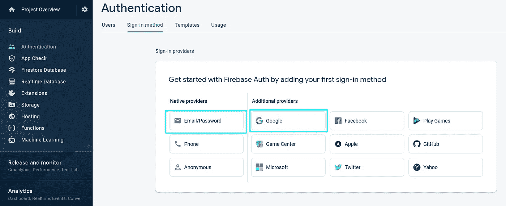

Firebase —选择登录方法

一旦我们启用了这两种登录方法，我们的身份验证控制面板应该如下所示:

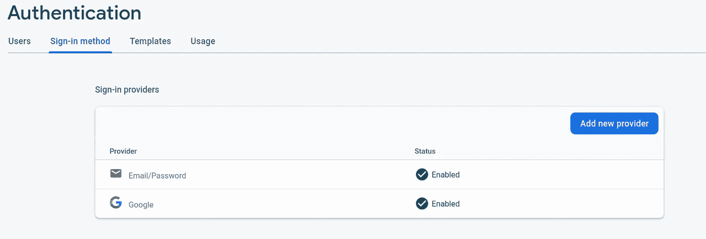

启用 Firebase 的登录方法

仅此而已！我们已经成功地在 Firebase 应用程序中启用了身份验证！

# 添加 Firestore(可选)

是时候将 Firestore 添加到我们的项目中了！cloud Firestore 是一个用于移动、web 和服务器开发的 NoSQL 云数据库。它通过实时监听器使我们的数据在客户端应用程序之间保持同步，并为移动和网络提供离线支持，因此我们可以构建即使没有互联网连接也能工作的应用程序。

转到 Firestore 数据库页面，点击*创建数据库*按钮:


Firebase —创建数据库

您必须选择是从生产模式还是测试模式开始。非常小心你的选择，因为以测试模式开始将**允许每个人访问你的数据。只有当你知道自己在做什么时，才选择这个选项。** [你可以在这里阅读更多关于 Firebase 安全规则的内容。](https://firebase.google.com/docs/rules)

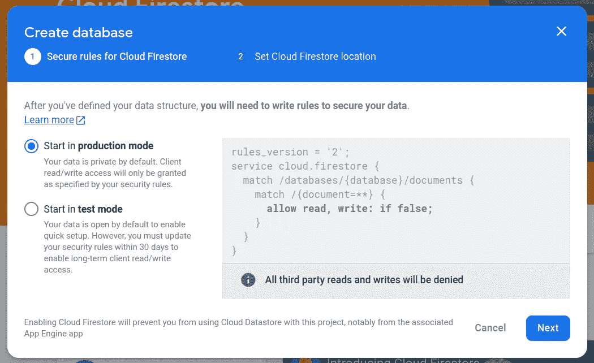

Firebase —选择安全规则

您需要选择的最后一件事是 Firestore 数据的位置。正如警告消息所示，请明智地选择，因为您以后将无法更改此位置。一旦你选择了位置，点击*启用*按钮，你的 Firestore 就创建好了:

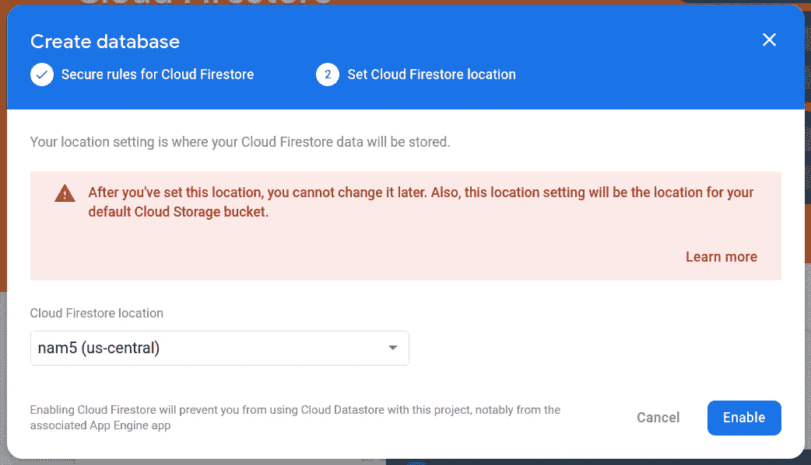

Firebase —选择 Firestore 数据位置

您的 Firestore 数据库页面现在应该包含您新创建的云 Firestore 数据库:

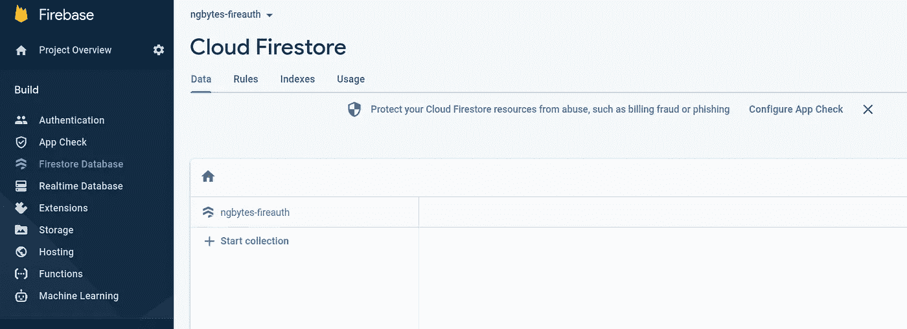

Firebase —新创建的云 Firestore

厉害！我们的 Firebase 应用程序已经完全设置好了。

# 安装 Firebase CLI

Firebase CLI 为我们提供了几个管理、查看和部署 Firebase 项目的工具。我们可以使用 npm 来安装 CLI:

```
npm i -g firebase-tools
```

*注意:如果您不是 Node.js 用户，您可以按照这些说明*[](https://firebase.google.com/docs/cli#windows-standalone-binary)**下载 CLI 的独立二进制文件。**

*成功安装 CLI 后，我们可以使用它登录。为此，请使用以下命令:*

```
*firebase login*
```

**注意:不要忘记使用创建 Firebase 项目时使用的同一帐户登录。**

*要检查您是否已成功登录，您可以运行以下命令:*

```
*firebase projects:list*
```

*恭喜你！现在，您应该会看到您的帐户中所有 Firebase 项目的列表。是时候开始使用我们的 Angular 应用程序了。*

# *设置角度项目*

*我们要做的第一件事是用 Angular CLI 创建一个新项目。*

*提示:如果您尚未安装 Angular CLI，可以通过运行以下命令来安装:*

```
*npm i -g @angular/cli*
```

*要创建新的角度项目，我们可以运行以下命令:*

```
*ng new ngbytes-fireauth*
```

*注意:当你被问及是否要在你的新应用中添加路线时，不要忘记回答是！*

*一旦 CLI 发挥了它的魔力，我们就可以用我们最喜欢的 IDE 打开新创建的项目(我建议使用 [VSCode](https://code.visualstudio.com/) ，这是我通常使用的一个)。*

## *添加火基和角火*

*让我们将 Firebase 和 Angularfire 添加到我们的项目中。为此，我们将使用 AngularFire 原理图，它将负责为我们设置一切。让我们运行以下命令:*

```
*ng add @angular/fire*
```

*我们会被问一系列问题，比如我们想要设置哪些 Firebase 特性。如果您想添加身份验证和/或 Firestore，请立即选择它们:*

*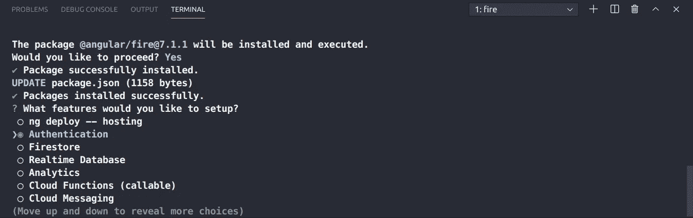*

*然后我们会被问到我们想要使用的 Firebase 帐户，以及我们想要设置哪个项目。选择我们之前创建的项目，然后选择我们之前创建的应用程序。*

*一旦我们完成了所有这些，您将会看到原理图已经为我们处理了所有的 Firebase 配置。厉害！现在是时候开始构建您的应用程序了！*

*如果你想实现一个认证系统，[看看我的 Angular 13 认证教程，包括社交和传统的电子邮件/密码登录。](/angular-13-firebase-authentication-tutorial-with-angularfire-7-23dc8cee42c4)*

# *结论*

*那都是乡亲们！希望你学会了如何配置角度和火力基地。您的项目现在已经为您想要构建的任何东西做好了准备，想象力是您唯一的限制！*

*我希望这个教程对你有用。非常感谢您的阅读。*