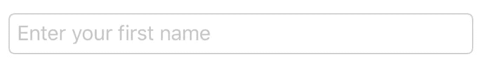
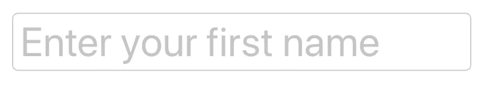
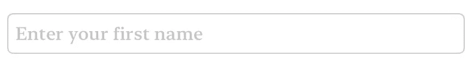
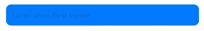
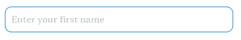
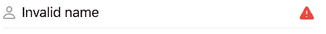
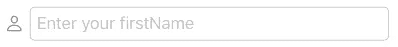
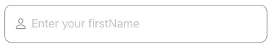

# 如何在 SwiftUI 中创建和自定义文本字段

> 原文：<https://betterprogramming.pub/how-to-create-and-customize-a-textfield-in-swiftui-9e0d2a320416>

## 进化的 UITextField


Jelleke Vanooteghem 在 [Unsplash](https://unsplash.com/s/photos/words?utm_source=unsplash&utm_medium=referral&utm_content=creditCopyText) 上拍摄的照片

`TextField`又称`UITextField`，是 UIKit 中最常用的组件之一。没有`TextField`，你不能输入你的电子邮件、密码或信息。

没有这些，你就无法从你的客户那里获得信息。如你所知，有了 SwiftUI，有很多方法可以定制它，这比 UIKit 简单多了。

> *“显示可编辑文本界面的控件。”—苹果文档*

在本教程中，您将学习如何在 SwiftUI 中构建一个`TextField`。你将学习如何建造一个`List`。

# 先决条件

要跟随本教程，您需要一些基本知识:

*   对 Swift 的基本熟悉。
*   至少 Xcode 11。

# 基本文本字段

要构建第一个文本字段，只需键入以下代码:

```
TextField("Enter your first name", text: $firstName).textFieldStyle(RoundedBorderTextFieldStyle())
```



记住用下面的代码创建一个变量来绑定文本字段。现在，您可以通过使用下面提供的变量来访问输出。

```
@State private var firstName = ""
```

# 文本字段占位符字体

也许默认字体不符合您的设计要求。不要担心。您可以对其进行定制，以满足您的设计要求，并给设计师团队留下深刻印象。下面的代码使用*标题*作为字体。

```
TextField("Enter your first name", text: $firstName)
  .font(.largeTitle)
  .textFieldStyle(RoundedBorderTextFieldStyle())
```



现在设计师越来越挑剔了。他们的选择不在苹果的默认设计中，他们特别要求字体大小为 15，中等粗细和衬线设计。

```
TextField("Enter your first name", text: $firstName)
  .font(Font.system(size: 15, weight: .medium, design: .serif))
  .textFieldStyle(RoundedBorderTextFieldStyle())
```

接招吧，设计师！



# 文本字段半径

要自定义拐角半径，您将不会使用默认的`RoundedBorderTextFieldStyle`。

你必须创建自己的自定义背景，将采取任何数量的半径。通过使用`.background`，你在文本域后面放置了一个层。

```
TextField("Enter your first name", text: $firstName)
  .padding(10)
  .font(Font.system(size: 15, weight: .medium, design: .serif))
  .background(RoundedRectangle(cornerRadius: 10))
  .foregroundColor(Color.blue)
```



# 文本字段边框

为了定制`TextField`的边框，您将使用`.overlay`，它将在文本字段前面添加一个层。

```
TextField("Enter your first name", text: $firstName)
  .padding(10)
  .font(Font.system(size: 15, weight: .medium, design: .serif))
  .overlay(RoundedRectangle(cornerRadius: 10).stroke(Color.blue, lineWidth: 1))
```



# 带有图像的文本字段

您可以在两面都有图像，并删除默认样式，用您自己的样式进行配置。下面使用的样式只是一个分割线。



使用默认样式和一个图像也可以。不利的一面是图像在外面。

```
HStack {
  Image(systemName: "person").foregroundColor(.gray)
  TextField("Enter your firstName", text: $firstName)
    .textFieldStyle(RoundedBorderTextFieldStyle())
  }
```



但是，如果您希望图像在边框内，也可以这样做。



今天到此为止。感谢阅读！