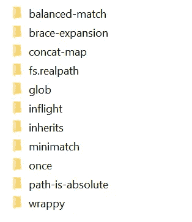
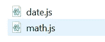
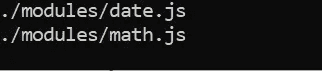

# 如何在 Node.js 中动态创建和加载定制模块

> 原文：<https://betterprogramming.pub/how-to-create-and-load-custom-modules-dynamically-in-node-js-9f1174a39341>

## 使用 glob 搜索并加载所有的模块


[Pankaj Patel](https://unsplash.com/@pankajpatel?utm_source=unsplash&utm_medium=referral&utm_content=creditCopyText) 在 [Unsplash](https://unsplash.com/@pankajpatel?utm_source=unsplash&utm_medium=referral&utm_content=creditCopyText) 上拍摄的照片

通过阅读这篇文章，你将学会创建你自己的定制模块并在`Node.js`中一次性加载它们。在本教程中，我将使用 [node-glob](https://github.com/isaacs/node-glob) ，它是`JavaScript`中的一个 glob 实现。它使用`minimatch`库进行匹配。本文分为五个部分:

1.  设置
2.  自定义模块
3.  Node.js 服务器
4.  用 Glob 动态加载
5.  结论

让我们继续下一部分，开始安装必要的模块。

# 1.设置

确保您的系统中安装了`npm`。你安装`Node.js`的时候就应该有了。如果您对此不确定，请使用以下代码进行检查。

```
npm --version
```

准备就绪后，通过运行以下命令安装`glob`。

```
npm install glob
```

如果你在一个新的目录下安装，它会自动为你创建一个名为`node_modules`的新文件夹。您可以在其中找到以下文件。



让我们继续下一节，开始编写 Javascript 代码。

# 2.自定义模块

自定义模块只是另一个 Javascript 文件，它导出并公开其功能以供另一个文件调用。在根目录下创建一个名为`modules`的新文件夹。然后，以`date.js`的名称创建一个新文件。

在`date.js`内添加以下代码。当你调用这个函数时，它将返回一个内置的`Date`对象。

```
exports.myDateTime = function () {
  return Date();
};
```

在同一个目录中，创建另一个名为`math.js`的`Javascript`文件。与第一个模块不同，我们将在其中实现一些功能。

让我们从返回两个输入变量之和的函数开始。

```
exports.addition = function (a, b) {
  return a + b;
};
```

接下来，继续添加减法逻辑:

```
exports.subtraction = function (a, b) {
  return a - b;
};
```

以下面的乘法代码结束:

```
exports.multiplication = function (a, b) {
  return a * b;
};
```

在 `modules`文件夹中应该有以下文件。基于您自己的用例，可以随意添加更多的定制模块。



回到根目录，我们将实现`Node.js`服务器。

# 3.Node.js 服务器

确保您位于根目录中，并且有以下文件夹:

*   模块
*   节点 _ 模块
*   package_lock.json(与 node_modules 一起自动创建)

创建一个名为`index.js`的新文件。我们将使用这个文件作为应用程序的基本 Node.js 服务器。添加以下代码来加载`http`模块。

```
var http = require('http');
```

继续在文件中追加以下代码:

```
http.createServer(function (req, res) {
  res.writeHead(200, {'Content-Type': 'text/html;'});
  res.write("Hello world!");
  res.end();
}).listen(8080);
```

保存它并在终端中运行以下命令:

```
npm index.js
```

打开浏览器，转到以下 URL:

```
localhost:8080/
```

你应该在浏览器上看到`Hello world!`。

现在让我们尝试手动加载定制模块。在`http`导入的正下方添加以下代码。它将加载我们之前定义的两个模块。

```
var date = require("./modules/date.js");
var math = require("./modules/math.js");
```

您可以通过引用模块来调用函数，如下所示:

```
date.myDateTime();
```

对于带参数的函数，语法如下:

```
math.addition(4, 5);
```

将`createServer`函数修改为以下代码:

```
http.createServer(function (req, res) {
  res.writeHead(200, {'Content-Type': 'text/html;'});
  res.write("Hello world!");
  res.write("<br>");
  res.write(date.myDateTime());
  res.write("<br>");
  res.write(math.addition(2, 5).toString());
  res.end();
}).listen(8080);
```

重新运行服务器并刷新浏览器中的 URL。您应该会看到以下输出。


您可以在下面的要点中找到手动加载定制模块的完整代码。

在下一节中，我们将使用`glob`模块来动态加载它们。

# 4.用 Glob 动态加载

手动加载每个模块可能会很累，因为每次添加新模块时都需要添加一行额外的代码。一个好的替代方法是利用`glob`模块搜索一个目录中的所有`js`文件并自动加载它们。结果将存储在一个`JavaScript`对象中，使用模块名可以很容易地引用该对象。

用以下代码替换`date`和`math`导入语句:

```
var glob = require( 'glob' );
```

创建一个名为`module_dict`的新 JavaScript 对象:

```
var module_dict = {};
```

接下来，我们将搜索`module`文件夹并获取所有文件的路径，以扩展名`js`结尾。您可以通过添加一个`console.log`语句来测试它，打印出所有`js`文件的路径。

```
glob.sync( './modules/*.js' ).forEach( function( file ) {
  console.log(file);
});
```

您应该在终端看到以下输出。



下一步是提取文件名，而不提取文件夹名和扩展名。我将保持它的简单，并使用`split`函数提取它。请注意，如果您更改了项目的结构，此代码将不起作用。根据您的用例对其进行相应的修改。

用以下代码替换`console.log`语句:

```
let dash = file.split("/");
  if(dash.length == 3) {
   let dot = dash[2].split(".");
    if(dot.length == 2) {
      let key = dot[0];
      //reserve for assignment
    }
  }
```

用下面的代码替换保留注释，该代码加载模块并将其作为属性添加到对象中。

```
module_dict[key] = require(file);
```

然后，您可以使用以下语法轻松调用该模块:

```
module_dict["math"].addition(8, 10);
```

密钥与您放在 modules 文件夹中的文件的名称相关联。当您添加一个新模块时，您可以简单地引用它，而不需要导入它。

但是，一个主要的缺点是您可能输入了错误的键名称，并且将显示以下错误:

```
Cannot read property 'key' of undefined
```

您可以在通过`hasOwnProperty`函数调用函数之前进行属性检查:

```
if(module_dict.hasOwnProperty("date")) {
  //implementation here
}
```

动态加载的完整代码如下:

# 5.结论

让我们回顾一下今天所学的内容。

我们开始通过`npm`安装`glob`模块。

之后，我们继续创建我们自己的定制模块，`date`和`math`。`date`模块有一个返回表示当前日期/时间的 Date 对象的函数，而`math`模块包含一些代数函数。

我们创建了一个简单的`Node.js`服务器，并成功地手动加载了我们的定制模块。

最后，我们尝试使用`glob`模块动态加载模块。然后，该模块被存储在一个 JavaScript 对象中，可以使用文件名来引用该对象。

感谢阅读，希望下一篇能再见到你！

# 参考

1.  [Javascript Github 中的 Glob 实现](https://github.com/isaacs/node-glob)