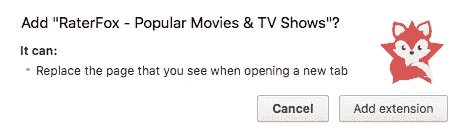
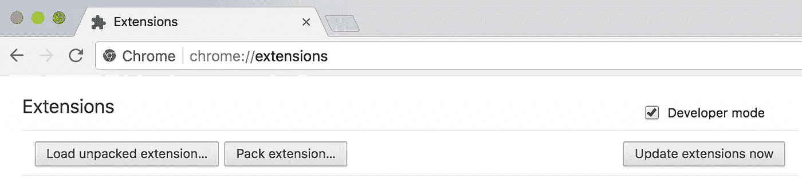
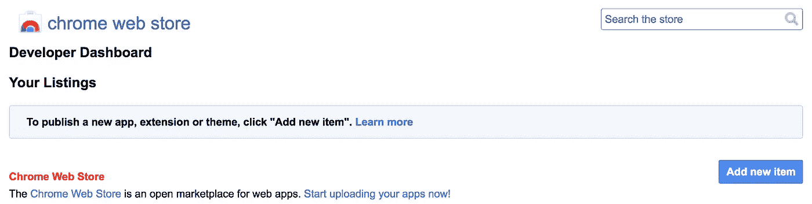

# 在 20 分钟内创建并发布一个 Chrome 扩展

> 原文：<https://betterprogramming.pub/how-to-create-and-publish-a-chrome-extension-in-20-minutes-6dc8395d7153>

## 创建 Chrome 扩展从未如此简单


照片由 Mikes Photos:[https://www . pexels . com/photo/acoustic-amplifier-artist-audio-114820/](https://www.pexels.com/photo/acoustic-amplifier-artist-audio-114820/)

有没有想过创建一个 Chrome 扩展会是什么样子？我是来告诉你很简单的！

遵循这些步骤，将你的想法变成现实。你很快就会在 [Chrome 网上商店](https://chrome.google.com/webstore/category/extensions)发布一个真正的扩展。

# 什么是 Chrome 扩展？

Chrome extensions 可以让你在 Chrome 浏览器中添加功能，而无需深究其原生代码。这太棒了，因为你可以用 web 开发人员非常熟悉的核心技术——HTML、CSS 和 JavaScript——为 Chrome 创建新的扩展。如果你曾经建过网页，你创建扩展的速度会比你吃午饭的速度还快。你唯一需要学习的就是如何通过 Chrome 公开的一些 JavaScript APIs 给 Chrome 添加一些功能。

如果你还没有构建网页的经验，我建议你先去一些免费资源中学习如何编码，比如 [freeCodeCamp](https://www.freecodecamp.org/) 。

# 你想建什么？

在你开始之前，你应该有一个大概的想法。它不需要是一个突破性的新想法，你可以只是为了好玩而做。在这篇文章中，我将告诉你我的想法，以及我是如何实现它来扩展 Chrome 的。

# 这个计划

我使用 [Unsplash](https://chrome.google.com/webstore/detail/unsplash-instant/pejkokffkapolfffcgbmdmhdelanoaih) Chrome 扩展已经有一段时间了。它允许我在默认标签中有来自 [Unsplash](https://unsplash.com/) 的漂亮背景图片。后来我用 muz Li Chrome 扩展替换了它，将默认标签变成了来自网络的设计新闻和图片。

让我们使用这两个扩展作为灵感来构建一些新的东西——这次是为电影爱好者。我的想法是每次你打开一个新标签页时显示一个电影的随机背景图像。在滚动时，它变成了流行电影和电视节目的一个很好的提要。让我们开始吧。

# **第一步:设置好东西**

第一步是创建一个清单文件`manifest.json`。这是一个 JSON 格式的元数据文件，包含扩展的名称、描述、版本号等属性。在这个文件中，我们告诉 Chrome 这个扩展要做什么，以及它需要什么权限。

对于电影扩展，我们需要控制`activeTab`的权限，所以我们的`manifest.json`文件看起来像这样:

```
{
 "manifest_version": 2,
 "name": "Cool name",
 "description": "Super cool extension",
 "version": "1",
 "author": "Your name", "browser_action": {
   "default_icon": "tab-icon.png",
   "default_title": "Have a good day"
 }, "chrome_url_overrides" : {
  "newtab": "newtab.html"
 }, "permissions": ["activeTab"]
}
```

如您所见，`newtab.html`是每次打开新标签页时都应该呈现的 HTML 文件。要做到这一点，我们需要控制`activeTab`的权限，所以当用户试图安装扩展时，他们会被警告该扩展需要的所有权限。



`manifest.json`中另一个有趣的事情是浏览器的动作。在这个例子中，我们用它来设置标题，但也有其他选项。例如，要在你点击地址栏内的应用图标时显示一个弹出窗口，你需要做的就是这样:

```
"browser_action": {
  "default_popup": "popup.html",
 },
```

现在，`popup.html`将呈现在弹出窗口中，该窗口是为响应用户单击浏览器动作而创建的。这是一个标准的 HTML 文件，因此您可以自由控制弹出窗口显示的内容。只需将您的一些魔法放在一个名为`popup.html`的文件中。

# 第二步:测试它是否有效

下一步是创建`newtab.html`文件并放入一个“`Hello world`”:

```
<!doctype html>
<html>
  <head>
    <title>Test</title>
  </head>
  <body>
    <h1>Hello World!</h1>
  </body>
</html>
```

要测试它，请在您的浏览器中访问`chrome://extensions`,并确保右上角的“开发者模式”复选框被选中。



Chrome 开发者模式

点击“加载解压后的扩展名”，选择您的扩展名文件所在的目录。如果扩展是有效的，它将立即被激活，所以你可以打开一个新的标签来查看你的“Hello world”

# **第三步:让事情变得美好**

现在我们有了第一个功能，是时候让它看起来更好了。我们可以简单地通过在我们的扩展目录中创建一个`main.css`文件并将其加载到我们的`newtab.html`文件中来设计我们的新标签。对于您想要包含的任何活动功能，包含 JavaScript 文件也是如此。假设您之前已经创建了一个网页，现在您可以使用您的魔法向您的用户展示您想要的任何内容。

## **完成计划**

我进一步完成电影扩展所需要的是 HTML、CSS 和 JavaScript，所以我认为深入研究代码并不重要，但我想快速浏览一遍。

我是这么做的。对于我的想法，我需要一些漂亮的背景图像，因此，在 JavaScript 文件中，我使用 [TMDb API](https://www.themoviedb.org/) 来获取一些流行的电影，获取它们的背景图像，并将它们放在一个数组中。现在，每当页面加载时，它都会从数组中随机选取一个图像，并将其设置为页面的背景。为了让这个页面更有趣，我还在右上角添加了当前日期。更多信息，它允许用户点击背景，链接到电影的 [IMDb](http://www.imdb.com/) 页面。

当用户试图向下滚动时，我用一个不错的流行电影提要替换了屏幕。我使用相同的 API 来构建带有图像、标题、评级和投票数的电影卡片。点击其中一张卡片，它会显示概览，并带有一个观看预告片的按钮。

## **结果**

现在，有了那个小小的`manifest.json`文件和一些 HTML、CSS 和 JavaScript，你打开的每个新标签看起来都有趣多了:


点击查看最终结果[。](https://chrome.google.com/webstore/detail/raterfox-popular-movies-t/pbmdibcifmempicdafabdakcoamfobik)

# 步骤 4:发布您的扩展

当你的第一个 Chrome 扩展看起来不错，并且工作正常时，就该把它发布到 Chrome 商店了。

只需点击[此链接](https://chrome.google.com/webstore/developer/dashboard)即可进入你的 Chrome 网络商店仪表盘(如果你还没有登录谷歌账户，系统会要求你登录)。然后点击“添加新项目”按钮，接受条款，您将转到可以上传扩展的页面。压缩包含您的项目的文件夹，并上传该 ZIP 文件。



Chrome 网络商店

成功上传文件后，您将看到一个表单，您应该在其中添加一些关于您的扩展名的信息。可以添加图标，详细描述，上传一些截图等等。

确保你提供一些漂亮的图片来展示你的项目。商店可以利用这些图片来宣传你的开创性项目。您提供的图像越多，您的扩展功能就越突出。您可以通过单击“预览更改”按钮来预览您的扩展在 web 商店中的外观。当你对结果满意时，点击“发布更改”就这样，你就大功告成了！

进入 Chrome 网上商店，按标题搜索你的扩展(可能需要一段时间才会出现)。如果你有兴趣，你可以在这里找到我的。

剩下唯一要做的就是获得一些用户。所以，在社交媒体上分享一篇关于你改变生活的 Chrome 扩展的帖子，告诉你的朋友来看看，将它添加到 [ProductHunt](https://www.producthunt.com/posts/raterfox) ，不要忘记在评论中分享你的项目——我迫不及待地想看看你的想法！

# **结论**

作为一名 web 开发人员，很容易快速创建一个 Chrome 扩展。你所需要的只是一些 HTML、CSS、JavaScript，以及如何通过 Chrome 公开的一些 JavaScript APIs 添加功能的基本知识。你的初始设置可以在 20 分钟内发布到 Chrome 网上商店。构建一个新的、有价值的或者看起来不错的扩展将会花费更多的时间。但这一切都取决于你！

发挥你的创造力，想出一些有趣的东西，如果你陷入困境，优秀的 Chrome extension [文档](https://developer.chrome.com/extensions)可能会帮你解决问题。

你还在等什么？是时候开始开发你自己的 Chrome 扩展并将你的想法变成现实了。

不要忘记在评论和任何问题或反馈中分享你的项目。