# 如何在 MavenCentral 中创建和发布 Android 库

> 原文：<https://betterprogramming.pub/how-to-create-and-publish-an-android-library-in-mavencentral-92397df94103>

## 一步一步的教程来创建这个优秀的资源


蒂姆·范德奎普在 [Unsplash](https://unsplash.com?utm_source=medium&utm_medium=referral) 上拍摄的照片

```
Table of ContentsIntroduction to Android library
[My Experience with Android Libraries](#2cdb)
[Prerequisites](#df6d)
[Create an Android library](#baf2)
[Upload the Code to Github or Bitbucket Repository](#dd17)
[Create a Sonatype Account](#b368)
[Generating a GPG key pair](#3c26)
[Setup Publication Details in the Project](#b8ea)
[Library or Module Level Gradle Setup](#5f3f)
[Sonatype Staging Profile Id Setup](#2324)
[First Release](#4393)
[Automate Creating and Release a Library version](#172c)
[How to Use the Published Library](#d00b)
```

# Android 库简介

> Android 库在结构上与 Android 应用程序相同，包含资源文件、源代码、清单文件等等。然而，Android 库不是编译成 APK，而是编译成 Android Archive (AAR)文件，您可以将其用作依赖项，这样我们就不需要再次创建或编写相同的代码。

如果你是一名 Android 开发人员，你一定至少用过一个库(可能是 androidX 库)。如果你看到任何 git 站点，他们有许多开放源码库，比如日期选择器、图像加载等等。所有这些存储库的核心意图是重用代码。

通常，库文件是以 JAR 格式创建的。我们可以在 Android 的情况下使用这一点，但唯一的问题是 JAR 格式不能在 Android 项目结构中捆绑源代码。然而，不是创建一个 JAR 文件，而是由一个 Android 库将它编译成一个 Android Archive (AAR)文件，您可以在任何 Android 项目中将其用作一个依赖项。

与 JAR 不同，Android Archive (AAR)文件可以捆绑 Android 资源和一个清单文件，允许我们共享资源，如布局文件、活动、绘图等。

# 我对 Android 库的体验

我从 2019 年开始从事 Android 库开发，创建 Android 库以在公司之间共享功能，并发布库以访问一个公司内几个应用程序之间的通用功能。不管是什么目的，设计一个 Android 库并发布它的过程还是一样的。

我通过创建 AAR 文件并与主机应用程序团队手动共享它们，开始了我的 Android 库之旅。这种方法的一个主要缺点是 AAR 文件不包含第三方库。因此，库开发人员必须通知主机应用团队所需的所有第三方库，并要求他们手动将依赖项包含在项目中。

对于简单的集成来说，这是大量的手工工作，而且每个版本都有大量的工作要做。然后我寻找避免手工工作的替代方法，发现了两种方法:在 JitPack 或 Maven Central 中托管库。

这将生成 POM 文件，负责下载所需的第三方库，而且，只需增加主机应用程序的版本，就可以导入新版本的库。

要了解更多关于在 Jitpack 中发布 Android 库的信息，请阅读以下文章:

[](https://sgkantamani.medium.com/how-to-create-and-publish-an-android-library-f37bf715932) [## 如何创建和发布 Android 库

### 编写一次并在每个项目中使用——使用 GitHub 和 JetPack

sgkantamani.medium.com](https://sgkantamani.medium.com/how-to-create-and-publish-an-android-library-f37bf715932) 

# 先决条件

以下是我们在发布 Android 库的过程中使用的工具:

*   命令行`gpg`工具 macOS 的 [GPG 套件](https://gpgtools.org/)或者 Windows 的 [Gpg4win](https://www.gpg4win.org/download.html) 都是不错的选择。不同平台有多种选择[这里](https://gnupg.org/download/)。
*   BitBucket 来托管库的代码。

我还假设你熟悉基本的 Android 开发。

# 创建一个 Android 库

让我们从创建一个新的 Android 项目开始。成功创建项目后，导航如下所示:

文件>新建>新建模块> Android 库

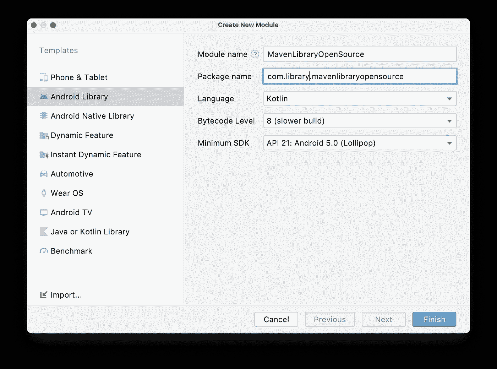

填写详细信息，然后单击 finish。这将创建一个库模块，它本质上是我们将在 maven central 上托管的库。现在，您可以在左侧面板中看到应用程序旁边的模块。

我们刚刚创建了子模块。现在，我们必须将它链接到 app 模块，以使用根项目中的代码。为此，通过导航打开项目结构，如下所示:

文件>项目结构

现在，选择左侧面板中的依赖项选项，然后选择模块部分下的应用程序。最后，单击 declared dependencies 部分下的加号选项，然后选择 Module dependency 选项。下面是它的样子:

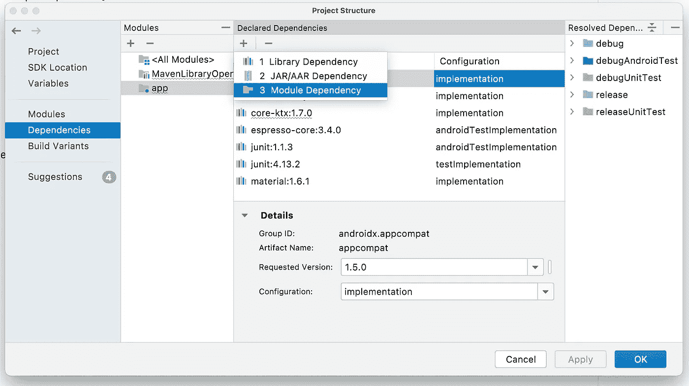

将弹出一个新窗口，其中包含导入您创建的模块的选项。选择您的模块，并按下`ok`按钮完成该过程。

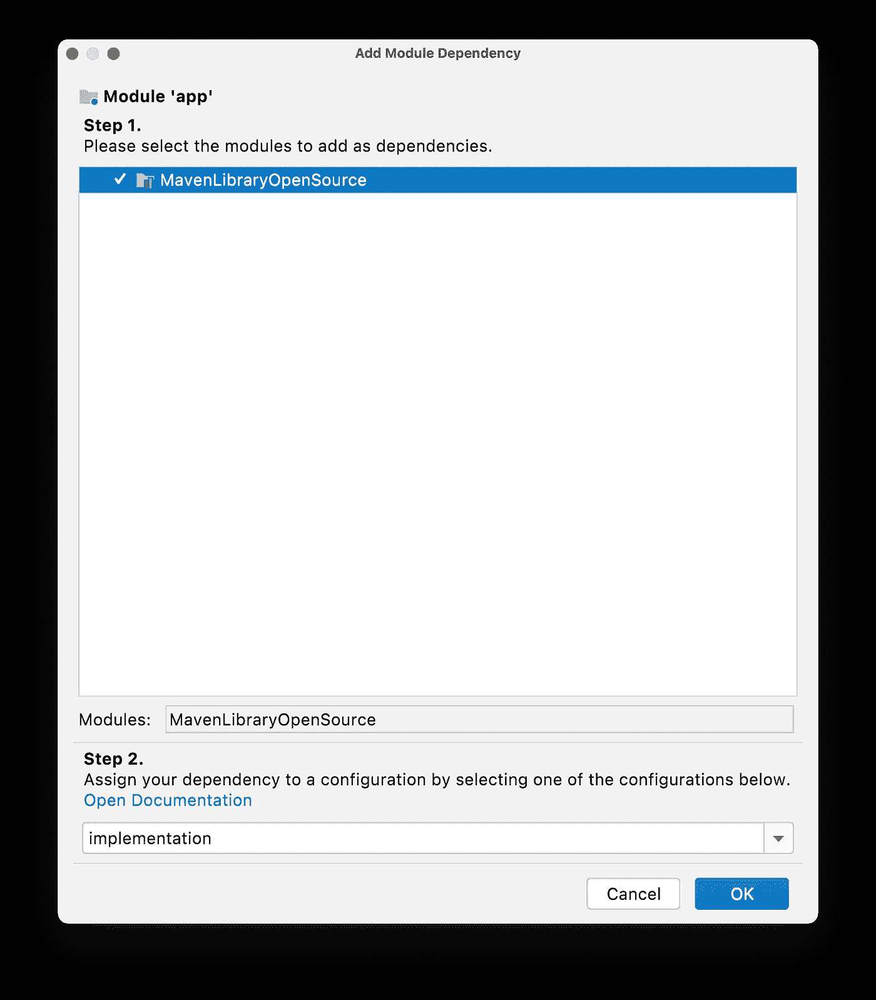

这将在应用程序级构建 gradle 文件中添加以下行:

```
implementation project(path: ':MavenLibraryOpenSource')
```

# 将代码上传到 GitHub 或 Bitbucket 存储库

这里我们使用 [Bitbucket](https://bitbucket.org/product) 来托管库和根项目代码。前往 [Bitbucket](https://bitbucket.org/product) 并登录，然后创建一个空的存储库。

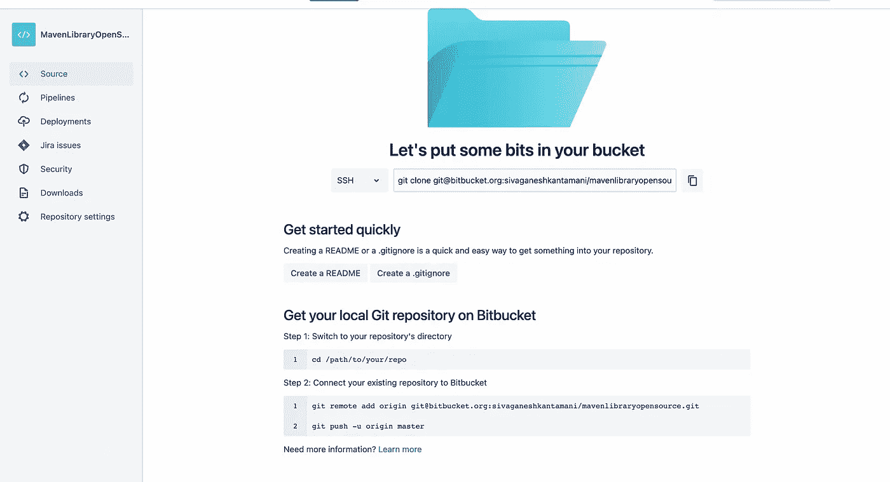

现在，导航到子模块目录，并将子模块上传到创建的存储库中。这里我们创建了一个单独的 git 子模块，而不是将根项目和子模块保存在同一个存储库中。要了解有关 git 子模块的更多信息，请阅读以下文章:

[](https://sgkantamani.medium.com/maintaining-remote-git-sub-modules-in-android-apps-92d9155603ae) [## 维护 Android 应用中的远程 Git 子模块

### 从这篇文章中吸取教训

sgkantamani.medium.com](https://sgkantamani.medium.com/maintaining-remote-git-sub-modules-in-android-apps-92d9155603ae) 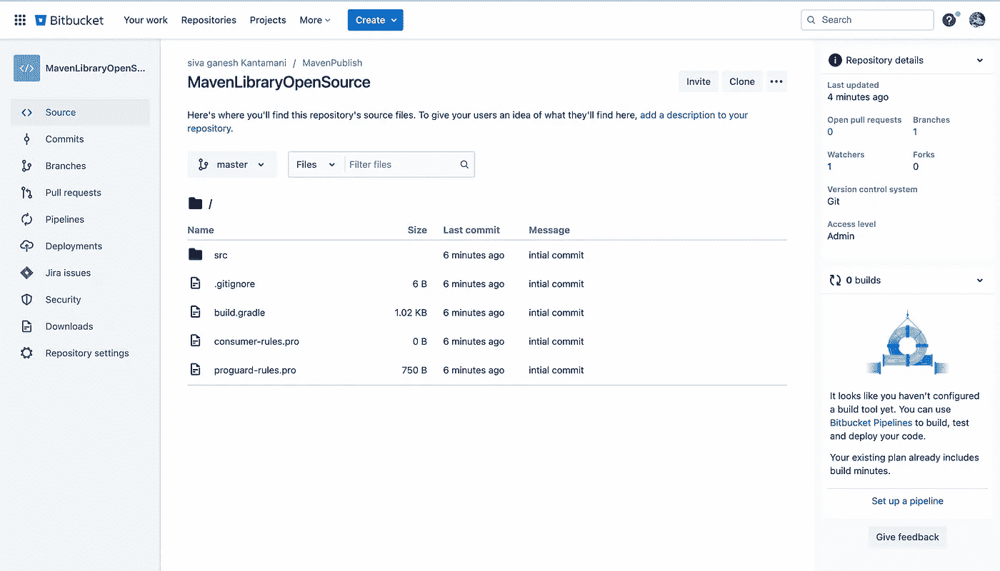

# 创建一个 Sonatype 帐户

现在我们已经完成了库的创建并将其托管在 Bitbucket 上，下一步是在 [Sonatype 吉拉](https://issues.sonatype.org/secure/Dashboard.jspa)中创建一个帐户。导航到该 URL 并使用您的电子邮件、全名、用户名和密码进行注册。完成后，使用相同的凭证登录。

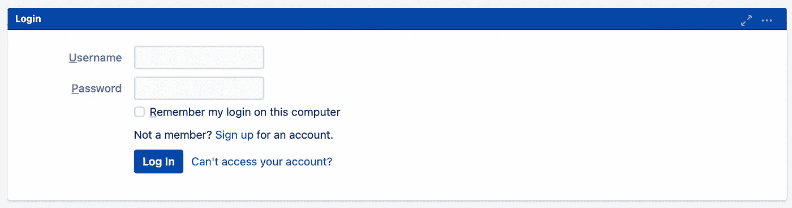

> 这个过程非常简单，但是要确保在用户名部分只使用字母数字，否则在发布库时会遇到问题。

## 制造一个问题

选择语言和头像后，您将进入登录页面，点击“创建问题”:

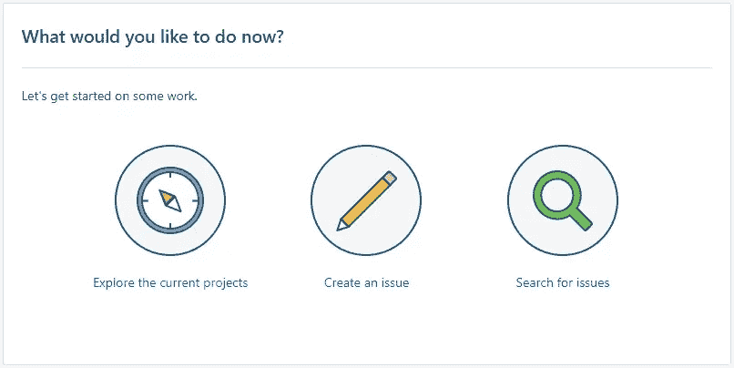

我们需要创建一个问题，请求访问我们想要发布库的组 ID。基于用例，我们可以使用自定义域名，如果我们拥有一个(需要验证)。如果没有，我们可以使用基于位桶的组 ID(类似于:io.bitbucket.bitbucketUsername)。

选择“创建问题”选项后，您将进入带有两个选项的页面:

1.  项目:选择“社区支持—开源项目存储库托管”
2.  问题类型:选择“新项目”

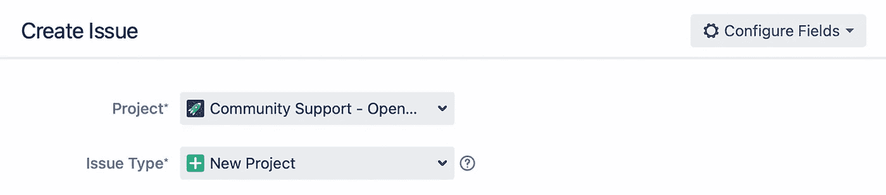

然后单击下一步。这将带您进入创建问题的下一步，您需要提供详细信息，如摘要、描述、组 id 等。让我们一个一个地看一下:

*   摘要:在此为您的. group.id 创建一个存储库
*   描述:关于项目内容的可选摘要。
*   组 ID:您的组 Id，如上所述。
*   项目 URL:我们可以传递库的 Bitbucket 存储库 URL。
*   SCM URL:我们可以传递库的 Bitbucket 存储库 URL。
*   用户名:如果你想要更多的用户，我们可以在这里提到他们的用户名。
*   已经同步到中央:在我们的情况下，我们只是刚刚开始，所以没有。

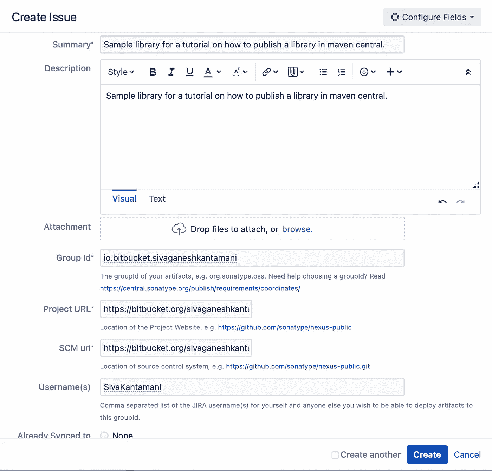

完成详细信息后，单击“创建”按钮。将问题分配给某人并解决它可能需要一些时间。看看这个问题:

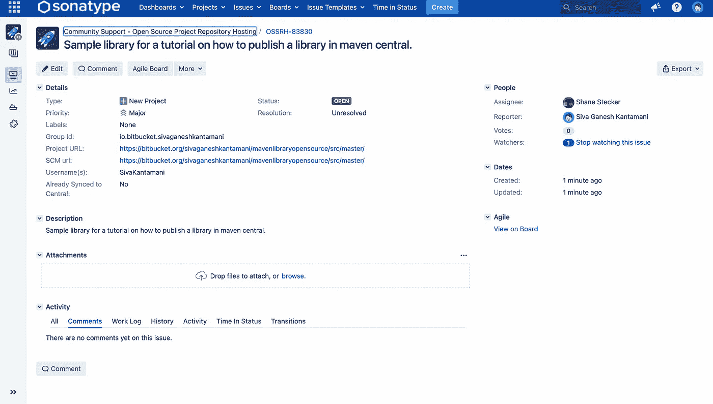

希望在一段合理的时间内(不超过 15 到 30 分钟)，您会收到一条验证域名 Id 的评论。因为我们使用基于位存储桶的组 ID，所以我们必须通过创建一个示例存储库来验证它。看看它是什么样子的:


一旦您验证了组 ID，您将会收到另一个注释，提供绿色信号，继续在 maven central 中托管库。看一看:

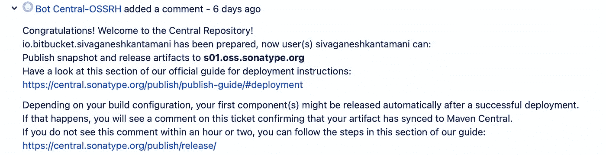

# 生成 GPG 密钥对

在 MavenCentral 上发布的工件必须由它们的发布者签署。我们需要一把 GPG 钥匙。该零件需要访问`gpg`命令。通过软件包管理器有很多方法来安装这个，在 gnupg.org[的不同平台上有很多发行版。](https://gnupg.org/download/)

下载 GPG 钥匙串后，进入命令行，执行以下命令创建一个新的钥匙:

```
gpg --full-gen-key
```

这将提示您填写以下详细信息:

*   种类键:接受默认值，即`(1) RSA and RSA`。
*   关键尺寸:`4096`。
*   Expiration:输入`0`创建一个永不过期的密钥。
*   实名，邮箱:输入你的邮箱。
*   备注:可选。你可以让它空着。

最后，系统会提示您输入密码，如果您不想输入密码，可以按 enter 键。仅此而已；你完了。要查看生成的密钥列表，请执行以下命令:

```
gpg --list-keys
```

确保复制密钥的最后八位数字。在接下来的部分中，您会用到它。

既然我们已经创建了公钥和私钥对，我们需要将公钥上传到服务器，以便任何人都可以检查它是否属于您，这可以通过运行以下命令来完成:

```
gpg --keyserver keyserver.ubuntu.com --send-keys 9AQF901D
```

`9AQF901D` —密钥的最后八位数字。

现在来看私有密钥，我们需要获得密钥的 base 64 导出来对工件进行签名。我们可以通过执行以下命令获得 base64 格式:

```
gpg --export-secret-keys 9AQF901D | base64
```

输入您之前创建的密码，如果没有密码，请按 Enter 键。然后将生成的 base64 字符串复制到一个临时文件中；在接下来的部分中，我们需要这一点。

# 在项目中设置发布详细信息

让我们从根项目开始配置。我们必须将`gradle-nexus.publish-plugin`添加到插件块下的`build.gradle`文件中。这个插件很容易在以后自动发布。看一看:

```
plugins {
    id("io.github.gradle-nexus.publish-plugin") version "1.1.0"
}
```

我们需要创建一个 gradle 文件来保存发布库所需的全局配置。让我们在根目录下创建一个名为`scripts`的子包，然后在其中创建`publish-root.gradle`。看一看:

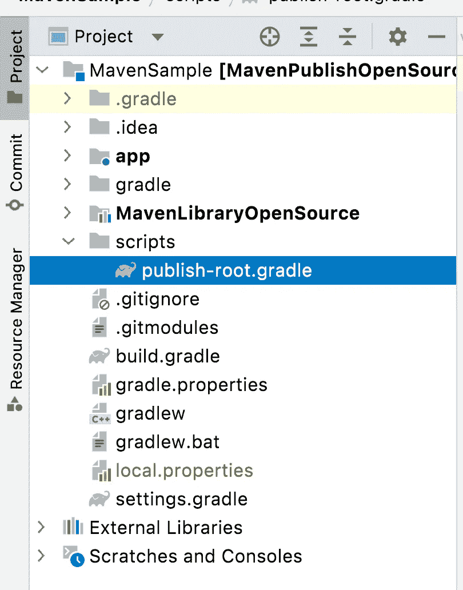

让我们从添加一些签名和发布工件所需的配置属性开始。让我们用空值初始化属性，这样构建将会同步而不会出错。稍后，我们可以从本地存储中获取这些值。

在`publish-root.gradle`中添加以下代码:

```
// Create variables with empty default values
ext["signing.keyId"] = ''
ext["signing.password"] = ''
ext["signing.key"] = ''
ext["ossrhUsername"] = ''
ext["ossrhPassword"] = ''
ext["sonatypeStagingProfileId"] = ''
```

*   `keyId`:我们之前生成的 GPG 密钥的最后八位数字。
*   `password`:密钥对的通行短语。
*   `key`:私钥的 base64 编码格式。
*   `ossrhUsername`和`ossrhPassword`:在 JIRA Sonatype 注册时提交的详细信息。

这就给我们留下了`sonatypeStagingProfileId`，我们将在接下来的章节中讨论它。

既然我们已经创建了具有空值的属性，那么是时候分配数据了。我们可以通过两种方式来实现:一，我们可以将它们存储在`local.properties`中并提取它们，或者我们可以从环境变量中获取它们。看一看:

现在，让我们在`local.properties`中添加细节，如下所示:

该文件的最后一步是定义 MavenCentral (Sonatype)存储库来上传工件。这基于在上述步骤中提取的字段。看一看:

你可以从[这个要点](https://gist.github.com/SG-K/0e80b36f96e97c121abdc5875e507cb7)中得到整个代码添加到`publish-root.gradle`中。

最后一步，在根项目的`build.gradle`中添加下面一行来应用脚本。

```
apply from: 'scripts/publish-root.gradle'
```

仅此而已。这就完成了根项目配置的一部分，然后是模块或库级别的配置。

# 库或模块级梯度设置

来到模块级配置，让我们从创建一个新文件`publish-remote.gradle`开始，定义库模块下工件的发布和签名配置。看一看:


让我们从添加发布和签署工件所需的插件开始。看一看:

```
apply plugin: 'maven-publish'
apply plugin: 'signing'
```

接下来，我们需要声明源代码，以确保正确的源文件中包含可执行的编译代码。看一看:

接下来，我们需要设置工件的两个属性:`groupdID`和`version`。我们将从模块级 gradle 中获取这些属性的值，我们将在接下来的小节中实现它。

```
group = PUBLISH_GROUP_ID
version = PUBLISH_VERSION
```

最后一步是提供要发布的库的元数据:

最后一步是从根项目中获取签名细节，并对工件进行签名。看一看:

```
signing **{** useInMemoryPgpKeys(
            rootProject.ext["signing.keyId"],
            rootProject.ext["signing.key"],
            rootProject.ext["signing.password"]
    )
    sign publishing.publications
**}**
```

你可以从[这个要点中得到整个代码添加到`publish-remote.gradle`中。](https://gist.github.com/SG-K/040669346f4e645e1e03f572ea407d42)

这就完成了`publish-remote.gradle.`中的配置设置，下一步是在模块级 gradle 文件中发布详细信息，如组 id、版本和工件 id。然后，应该如下所示应用脚本本身:

```
ext **{** PUBLISH_GROUP_ID = 'io.bitbucket.username'
    PUBLISH_VERSION = '0.1'
    PUBLISH_ARTIFACT_ID = 'MavenLibraryOpenSource'
**}**apply from: 'publish-remote.gradle'
```

# Sonatype 暂存配置文件 ID 设置

现在回到在`local.properties`文件中声明为空的`sonatypeStagingProfileId`。这是 Sonatype 分配给你的 ID，通过这个 ID，插件确保将工件上传到正确的位置。

要获得`sonatypeStagingProfileId`，前往[https://s01.oss.sonatype.org](https://s01.oss.sonatype.org/#stagingProfiles)并使用 Sonatype 凭证登录。现在点击左侧面板中的 StagingProfiles，选择您的个人资料，然后在 URL 中查找 ID。看一看:

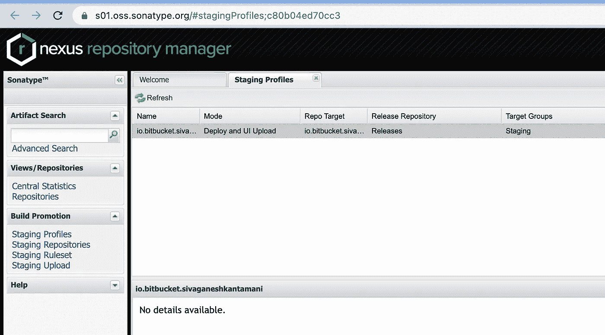

现在将配置文件 id 分配给`local.properties`中的相应属性。

# 首次发布

在发布库的第一个版本之前，让我们创建一个名为`SimpleCalculator`的 Kotlin 文件，并包含两个简单的函数，以便在将库导入任何 Android 项目时访问它们。

```
fun add( a : Int, b : Int ) : Int {
    return a + b
}fun multiply( a : Int, b : Int ) : Int {
    return a * b
}
```

现在来看发布，我们可以通过在命令行中从根项目目录执行以下命令来触发发布。

```
./gradlew MavenLibraryOpenSource:publishReleasePublicationToSonatypeRepository
```

这将创建一个临时存储库，我们可以通过单击左侧面板中的“临时存储库”选项看到它。看一看:

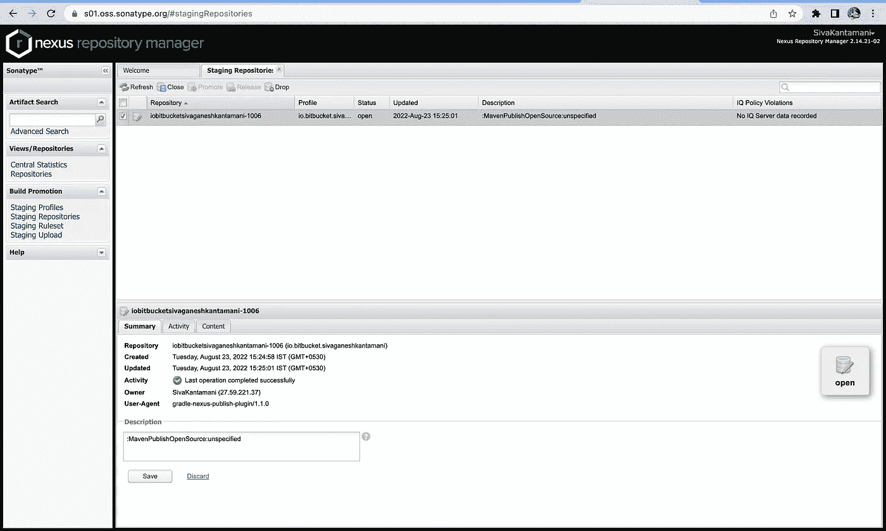

要查看所有上传的文件，请单击底部面板中的内容选项卡，并浏览组 id 路径。如果您准备好继续，请单击顶部栏中的存储库和关闭按钮。这可能需要一些时间。您可以在底部面板的“活动”选项卡中看到进度。一旦关闭，您将看到存储库关闭活动。

一旦存储库关闭，您将有两个选择，丢弃和释放。删除是取消发布并删除整个存储库。这个版本是为了发布新版本的库。

如果一切都很好，你已经开始发布了，一旦完成，可能需要一些时间来反思。我们可以通过导航到[https://repo 1 . maven . org/maven 2/io/bit bucket/user _ name/MavenLibraryOpenSource/](https://repo1.maven.org/maven2/io/bitbucket/sivaganeshkantamani/MavenLibraryOpenSource/)来检查该库是否处于活动状态。如果尚未发布，将显示 404。确保在 URL 中更改组 id 和工件名称。

# 自动创建和发布新版本

当我说自动化时，它不是指管道或 CICD。这只是一种避免访问 maven UI 来手动关闭和释放存储库的方法。通过使用下面的命令，我们可以上传和发布工件。

```
./gradlew MavenLibraryOpenSource:publishReleasePublicationToSonatypeRepository closeAndReleaseSonatypeStagingRepository
```

这只不过是组合两个命令并立即执行它们，以避免任何手动工作。

# 如何使用已发布的库

一旦该库发布，我们可以将其集成到任何 Android 应用程序中，并使用我们在其中创建的功能。在我们的例子中，它是`SampleCalculator`。库的集成 URL 的格式:

```
group_id:artifact_name:version
```

在我们的例子中，如下所示:

```
implementation "io.bitbucket.username:MavenLibraryOpenSource:0.1"
```

仅此而已。您已经创建了您的第一个 Android 库，并将其发布在 MavenCentral 上！

# 奖金

如果您对 Android 库开发感兴趣，请阅读以下文章:

*   [如何创建一个 Android Archive (AAR)库](https://sgkantamani.medium.com/how-to-create-an-android-archive-aar-library-f940cbf5280)
*   [在 Android 库中实现手动依赖注入](/implementing-manual-dependency-injection-in-android-libraries-6149bb7c477d)
*   [如何在你的 Android 库中使用 dagger 2](/how-to-use-dagger2-in-your-android-library-bc6741dfbba4)

目前就这些。希望你学到了有用的东西。

感谢阅读。