# 如何使用演示和自动构建创建和发布 React TypeScript npm 包

> 原文：<https://betterprogramming.pub/how-to-create-and-publish-react-typescript-npm-package-with-demo-and-automated-build-80c40ec28aca>

## 学习从零开始创造惊人的项目

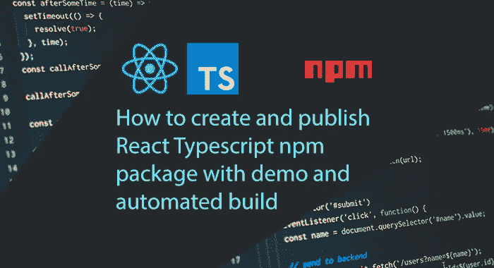

# 介绍

为什么我决定再写一篇关于发布 npm 包的文章？当我需要自己创建这样一个包时，我发现网上的大多数说明要么已经过时，要么非常短，在生产中毫无用处。

我将尽可能清晰地描述所有步骤，以便您可以从头开始创建自己的项目。我们开始吧！

我建议创建一个简单的 React 应用程序，它将由两个增加或减少计数器值的按钮组成。

这是我们的应用程序的外观:

演示:[https://gapon2401.github.io/my-react-typescript-package/](https://gapon2401.github.io/my-react-typescript-package/)
回购:[https://github.com/gapon2401/my-react-typescript-package](https://github.com/gapon2401/my-react-typescript-package)

我们有 14 个步骤来处理所有事情:

1.  [准备项目](#a15d)
2.  [创建您的 react 应用程序](#48c1)
3.  [配置 git](#bf2d)
4.  [配置 ESLint](#0e1f)
5.  [配置更漂亮](#4760)
6.  [用 Jest 添加测试](#7b1c)
7.  [配置 package.json，准备发布](#12f8)
8.  [提交并推送您的代码](#8cf2)
9.  [出版到 NPM](#b9e9)
10.  [创建示例文件夹](#38de)
11.  [设置自动构建](#b8a5)
12.  [演示页面](#a5ea)
13.  [README.md 文件和 shields.io](#8891)
14.  [制作发布](#2a4f)

# **步骤一。准备项目**

*   在项目的命令行中，执行:

```
npm init -y
```

它将使用默认值创建`package.json`文件，稍后我们将对其进行修改。

*   创建文件夹`src`

在这里，我们将保存所有项目文件。

*   将 React 和 TypeScript 添加到项目中(如果您不介意，我将使用`yarn`)

```
yarn add -D react react-dom typescript @types/react
```

现在我们有了`node_modules`文件夹和一个`yarn.lock`——不错！

*   为了编译 TypeScript，在项目根目录下创建一个包含以下内容的`tsconfig.json`文件:

tsconfig.json

你可以在这里看看所有可能的房产:【https://www.typescriptlang.org/tsconfig 

从主要:

- `rootDir` —源文件中的根文件夹

-`include`-指定要包含在 TypeScript 项目中的文件

- `exclude` —指定要从 TypeScript 项目中排除的文件。我们不想包含`dist`文件夹和所有的`node_modules`

- `outDir` —这是编译输出的位置

*   创建空的`README.md`和`LICENSE`文件

使用什么许可证由你决定。我会用麻省理工。您可以检查该文件的内容。

看一看我们应该有的结构:

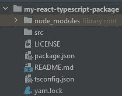

步骤 1 后的项目结构

# 第二步。创建您的 React 应用程序

在`src`中创建文件夹`components`。在那里，您可以保存项目的所有组件。在本文中，我们将只创建一个文件`App.tsx`，其内容如下:

src/components/App.tsx

这是我们的 React 应用程序。

现在，在`src`文件夹中创建一个文件`index.ts`。导出模块。

src/索引. ts

是时候编译项目了！

让我们改变我们的`package.json`并替换`scripts`部分:

package.json

在终端中运行以下命令:

```
yarn build
```

文件夹`dist`应显示所有编译的代码。

恭喜你！我们已经创建了应用程序，并对其进行了编译。再走几步就完事了！(不是。)

在步骤 2 之后比较您的项目结构:

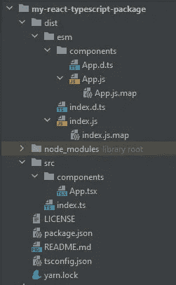

步骤 2 后的项目结构

# **第三步。配置 git**

我们很快创建了项目；现在是吃 git 的时候了。

使用以下命令初始化项目根目录中的`git`:

```
git init
```

在项目根目录下创建`.gitignore`文件，内容如下:

```
node_modules
.idea
dist
yarn-error.log
```

我加了`.idea`，因为我是借助 Jetbrains IDE 开发的。

在`.gitignore`中，我们列出了那些我们不想包含在存储库中的文件和目录。

在 GitHub 上创建一个 git repo。稍后，我们将创建一个初始提交，并将远程 git 与本地 git 连接起来。

# **第四步。配置 ESLint**

ESLint 静态分析你的代码，快速发现问题。我们只在发展中需要它。

使用以下代码添加 eslint 和所有必要的组件:

```
yarn add -D eslint eslint-plugin-react eslint-plugin-react-hooks @typescript-eslint/eslint-plugin @typescript-eslint/parser
```

你可以随意配置；有一个大用户指南:[https://eslint.org/docs/user-guide/configuring/](https://eslint.org/docs/user-guide/configuring/)

我建议您在项目的根目录下创建一个`.eslintrc`文件:

。eslintrc

添加`.eslintignore`:

```
node_modules
dist
```

我们将忽略检查`dist`文件夹中的编译文件和`node_modules`。

更改`package.json`，添加到`scripts`部分:

```
"lint": "eslint \"{**/*,*}.{js,ts,jsx,tsx}\""
```

下面是我的`package.json`:

package.json

现在，运行以下命令:

```
yarn lint
```

你不应该有任何错误。

在步骤 4 之后比较您的项目结构:

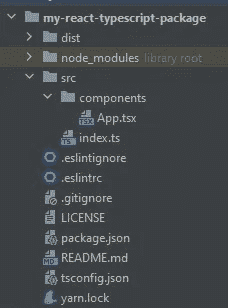

步骤 4 后的项目结构

# **第五步。配置更漂亮**

漂亮是一个代码格式化程序。在团队工作时使用它很方便，这样每个人的代码都符合相同的标准。

在终端中，运行以下命令:

```
yarn add -D eslint-config-prettier eslint-plugin-prettier prettier
```

在项目根中，创建`.prettierrc.json`:

`.prettierrc.json`

阅读更多关于所有选项的信息:[https://prettier.io/docs/en/options.html](https://prettier.io/docs/en/options.html)。

给`.eslintrc`添加一个更漂亮的插件:

。eslintrc

我们已经完成了更漂亮的设置；现在尝试运行`yarn lint`来检查格式错误。如果你没有，你就没有通过人体测试😆。

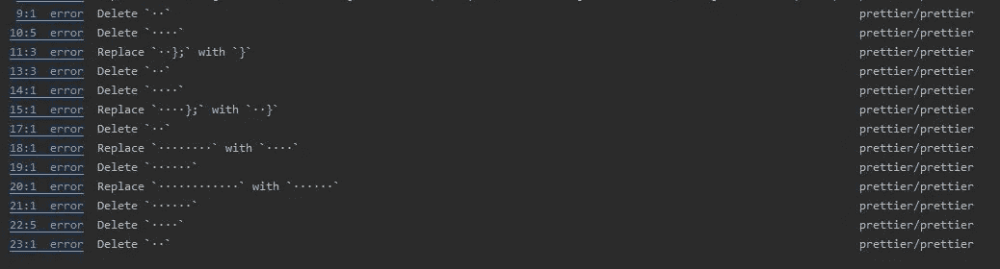

Eslint 更漂亮的错误

是时候修复它们了！将以下内容添加到`package.json`中的`scripts`:

```
"prettier": "prettier --write \"{src,tests,example/src}/**/*.{js,ts,jsx,tsx}\""
```

好的，运行`yarn prettier`，你将得到类似于:

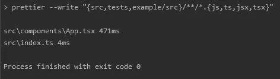

纱线更漂亮

现在，在`yarn lint`之后，你应该不会有任何错误。检查文件`src/components/App.tsx`和`src/index.ts`，它们已经改变。

`package.json`中我的`scripts`部分:

```
"scripts": {
  "build": "tsc",
  "lint": "eslint \"{**/*,*}.{js,ts,jsx,tsx}\"",
  "prettier": "prettier --write \"{src,tests,example/src}/**/*.{js,ts,jsx,tsx}\""
}
```

在步骤 5 之后比较您的项目结构:

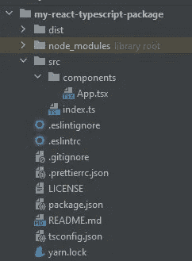

步骤 5 后的项目结构

# **第六步。用 Jest 添加测试**

为了创建测试，我使用了 [Jest](https://jestjs.io/) 库。这是一个非常有用和强大的测试框架。当然，测试的难度取决于你。

将`jest`添加到您的项目:

```
yarn add -D jest jest-canvas-mock jest-environment-jsdom ts-jest @types/jest @testing-library/react
```

创建项目根文件`jestconfig.json`:

`jestconfig.json`

创建文件夹`tests`。

是时候编写我们的第一个测试了。我们将编写一个非常简单的测试，它将检查我们的渲染是否成功通过。

在`tests`文件夹中，创建文件`common.test.tsx`:

测试/ `common.test.tsx`

更改`package.json`中的`scripts`部分:

```
"test": "jest --config jestconfig.json"
```

`package.json`

运行`yarn test`。你应该通过测试:

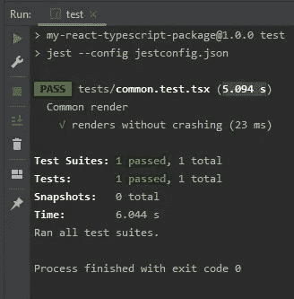

测试通过

在步骤 6 之后比较您的项目结构:

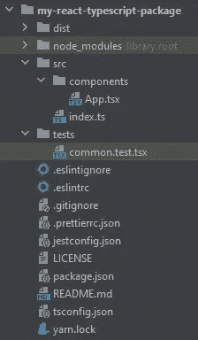

步骤 6 后的项目结构

# 第七步。配置 package.json 并准备发布

我建议拆分我们的`build`。我们不仅要编译 ECMAScript 模块，还要编译 CommonJs 模块，以使我们的包尽可能易于访问。

在`package.json`中，更换:

```
"build": "tsc",
```

使用以下代码:

```
"build": "yarn build:esm && yarn build:cjs",
"build:esm": "tsc",
"build:cjs": "tsc --module commonjs --outDir dist/cjs",
```

我们添加了`build:esm`和`build:cjs`并将它们合并在一个命令中。

运行`yarn build`你会看到，我们的`dist/`现在也有了一个`cjs`文件夹。

更进一步。

在`package.json`中，我们可以使用神奇的脚本，这些脚本会在软件包发布时自动调用。他们将帮助我们检查我们的包中的各种错误，而不是意外地上传一个会导致成百上千个使用我们的包的项目崩溃的更新！

*   `prepare` —在打包和发布包之前运行。在本地 npm 安装上运行，不带任何参数，
*   `prepublishOnly` —在包准备和打包之前运行，仅在 npm 发布时运行。这是我们的测试。

将以下内容添加到`scripts`部分:

```
"prepare": "npm run build",
"prepublishOnly": "npm test && npm run prettier && npm run lint"
```

更换`version`、`description`。

告诉 npm 它可以从哪里导入我们项目的主文件，以及所有类型的位置:

替换:

```
"main": "index.js",
```

使用:

```
"main": "./dist/cjs/index.js",
"module": "./dist/esm/index.js",
"types": "./dist/esm/index.d.ts",
```

添加关于远程 git 存储库的信息(在步骤 3 中指定您的 git URL):

```
"repository": {
  "type": "git",
  "url": "git+https://github.com/gapon2401/my-react-typescript-package.git"
},
```

指定将使用我们的包的项目必须具有至少> =16 的 react 版本:

```
"peerDependencies": {
  "react": ">=16"
},
```

为了确保您的包没有任何冗余文件，请仅使用将被添加到包中的允许的文件和文件夹:

```
"files": [
  "dist",
  "LICENSE",
  "README.md"
],
```

添加关键词，以便每个人都可以找到您的项目:

```
"keywords": [
  "react",
  "typescript",
  "awesome-project"
],
```

指定您的许可证:

```
"license": "MIT",
```

不要忘记更改`author`:

```
"author": "Igor Gaponov (gapon2401)",
```

我想这就够了。

向您的`README.md`文件添加描述。

目前，我在那里只有一排。这是 h1:

```
# my-react-typescript-package
```

看看`package.json`的最终版本:

package.json

# 第八步。提交并推送您的代码

首先，让我们连接远程和本地存储库，并推动我们的项目。

运行以下代码:

```
git add .
git commit -m "Initial commit"
git remote add origin <Repository Url>
git push -u origin master
```

别忘了换上你的`<Repository Url>` 。可以是`https`网址，也可以是`ssh`。你可以在你的知识库中找到这个 URL。

让我们来看一些例子。

*   HTTPS 存储库 URL(您需要授权)

```
git remote add origin https://github.com/gapon2401/my-react-typescript-package.git
```

*   SSH 存储库 URL(您需要配置与 ssh 连接的

```
git remote add origin git@github.com:gapon2401/my-react-typescript-package.git
```

我使用了第二种解决方案。

# **第九步。发布到 NPM**

*   选择包名

我们必须检查我们的包的名称是否可以自由使用。进入 https://www.npmjs.com/网站[并使用搜索工具。](https://www.npmjs.com/)

您可以在`package.json`中找到并更改项目的默认名称:

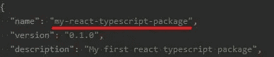

包名

我的情况是`my-react-typescript-package`。目前还没有这样的套餐。

我更喜欢这样检查:直接把名字插入链接，如下图:

```
https://www.npmjs.com/package/<Your package name>
```

不要用`<Your package name>`，用你的项目名。

我得到以下网址:

```
[https://www.npmjs.com/package/my-react-typescript-package](https://www.npmjs.com/package/my-react-typescript-package)
```

如果名字是免费的，你会看到一个 404 页面:

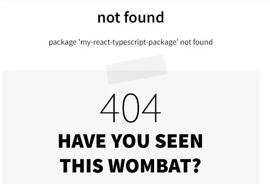

包名是免费的

*   注册/登录 NPM

为了发布项目，您需要在[https://www.npmjs.com/](https://www.npmjs.com/)获得授权。

如果你还没有账户，去注册[https://www.npmjs.com/signup](https://www.npmjs.com/signup)或者使用命令行:

```
npm adduser
```

您将被要求输入`username`、`password`和`email`。

如果您已经有一个帐户，请运行:

```
npm login
```

并完成授权。

*   出版

在发布之前，我建议您检查一下，您的包中只有必要的文件，没有错误，并且所有内容的格式都正确。为此，您可以运行以下命令:

```
npm publish --dry-run
```

包不会发布，放心。

您将看到“神奇脚本”`prepublishOnly`将被调用，测试和代码格式化将运行。

然后，您将获得所有文件的列表，这些文件将包含在项目中:

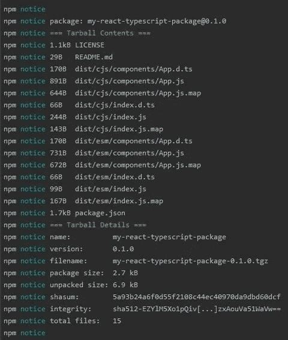

所有包文件的列表

在`Tarball Contents`中，我们有在`package.json`中指定的文件和文件夹:

```
"files": [
   "dist",
   "LICENSE",
   "README.md"
 ],
```

一切都好；让我们发布这个包！

运行以下命令:

```
npm publish
```

当我运行这个命令时，我总是担心。

我附上命令调用的完整结果:

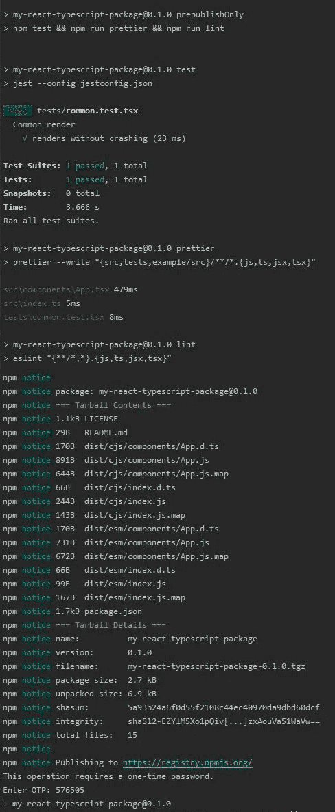

国家预防机制结果公布

现在，我可以恭喜你了！包已发布；它是公共的，任何人都可以使用它！这并不难。

让我们看看 NPM 上的包裹。

打开我们之前打开的链接。

```
https://www.npmjs.com/package/<Your package name>
```

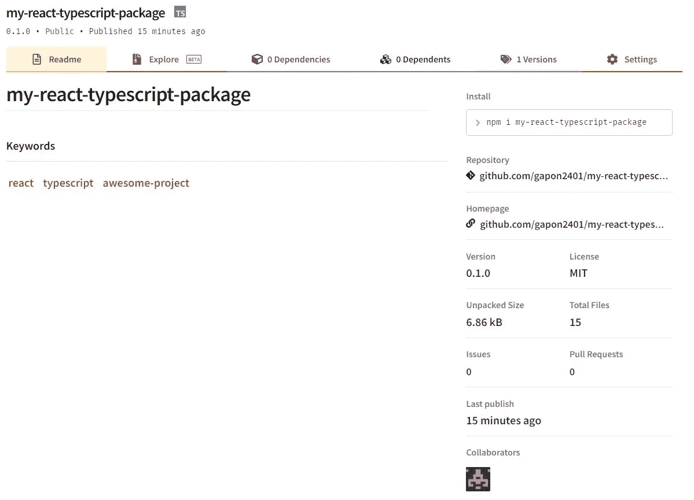

包装的 NPM 页

看起来棒极了！

# **第十步。创建示例文件夹**

让我们继续把我们的包装做得越来越好。在这一步中，我们将创建一个示例文件夹，在其中我们将展示如何使用我们的包。在这个文件夹中，您可以快速启动服务器并使用代码。
为了快速启动应用程序，我们将使用[https://parceljs.org/](https://parceljs.org/)。

创建一个文件夹`example`。

在该文件夹中，创建一个空的`src`文件夹和文件:

*   `.gitignore`:

```
node_modules
yarn.lock
.parcel-cache
dist
yarn-error.log
```

*   `package.json`:

示例/package.json

*   `README.md`:

example/README.md

现在，注意了！在命令行中，从项目的根目录移动到`example`文件夹:

```
cd example
```

然后运行:

```
yarn add -D parcel my-react-typescript-package react react-dom @types/react-dom @types/react
```

在`src`文件夹中，创建文件`index.html`:

example/src/index.html

现在，我们需要导入我们的包并创建一个如何使用它的例子。

在`src`文件夹中，创建`index.tsx`文件:

example/src/index.tsx

该运行服务器了！使用命令:

```
yarn start
```

成功启动服务器后，您将收到以下消息:

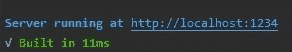

包裹服务器已启动

打开链接`[http://localhost:1234](http://localhost:1234)`观看示例:

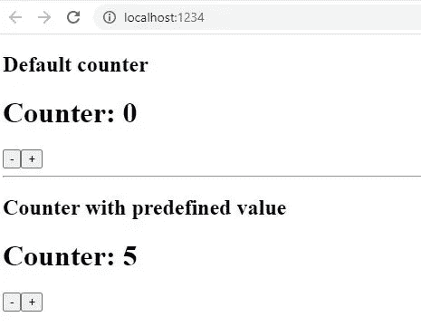

包装使用示例

比较所有安装和服务器运行后的示例文件夹结构。它应该是这样的:

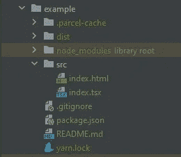

示例文件夹结构

# **第十一步。设置自动构建**

让我们进入自动化构建。当你不得不在每一个版本中向 git 和 npm 推送改变时，这是相当不方便的。我们将通过 GitHub 动作来自动化这个过程。

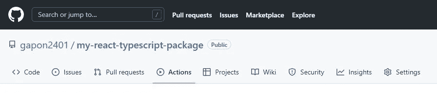

Github 操作

在项目结构的根目录下创建文件夹`.github`。

在里面创建文件夹`workflows`。

在`workflows`里面创建文件`publish.yml`:

`.github/workflows/publish.yml`

文件中的要点已被注释。

当我们将它发布到 GitHub 时，我们的包将被自动构建并推送到 NPM。

我要你看下面一行:

```
*# We need this to our NPM account* NODE_AUTH_TOKEN: ${{ secrets.NPM_TOKEN }}
```

这是我们连接 GitHub 和 NPM 的方式。

在浏览器中，在[https://www.npmjs.com/](https://www.npmjs.com/)上打开您的帐户，然后转到带有代币的页面:

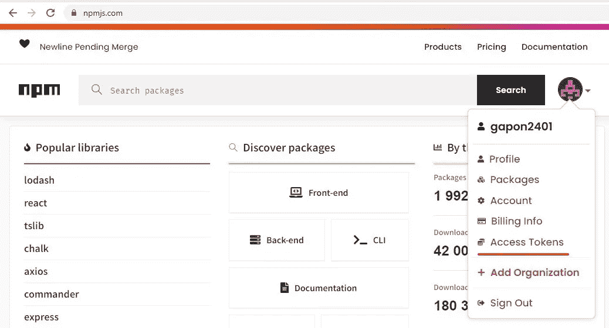

NPM 接入令牌链接

生成新令牌:

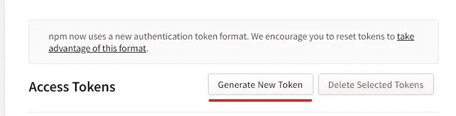

生成新的 NPM 令牌

系统将提示您输入其名称并选择类型。`Automation`适合 github-actions:

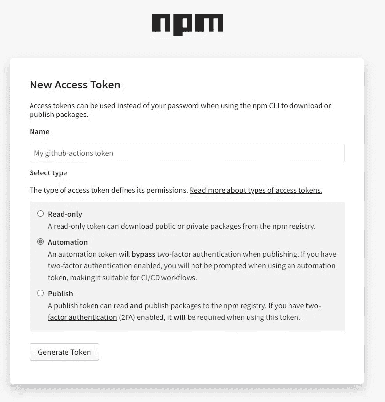

新访问令牌

复制您的令牌并打开 github repo。

转到选项卡`Settings`，打开`Secrets — Actions`，并创建一个新的存储库机密变量。给它命名为`NPM_TOKEN`,并将来自 NPM 的令牌值粘贴进去:

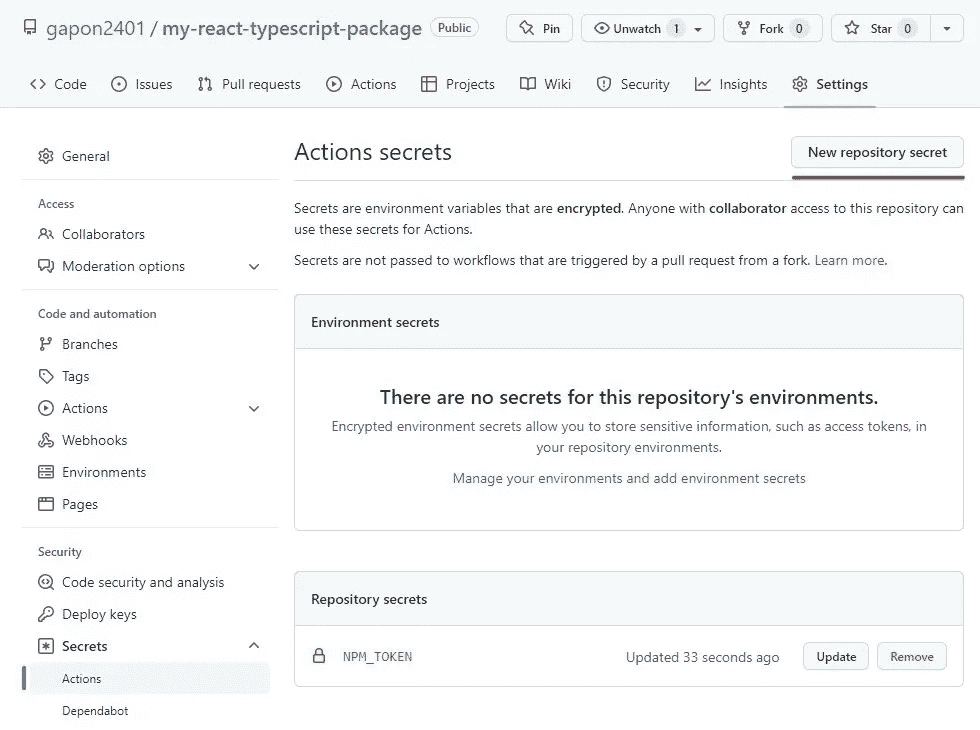

创建新的存储库机密变量

干得好！现在剩下的就是创建项目的新版本，并将其推送到 GitHub。

在提交任何更改之前，不要忘记运行以下命令:

```
yarn prepublishOnly
```

只是为了确保您的代码将是漂亮和干净的。

推送项目后，转到 Actions 选项卡，在这里您会看到 GitHub 已经检测到您有工作流操作。但是它还没有推出任何东西，因为我们还没有发布。)

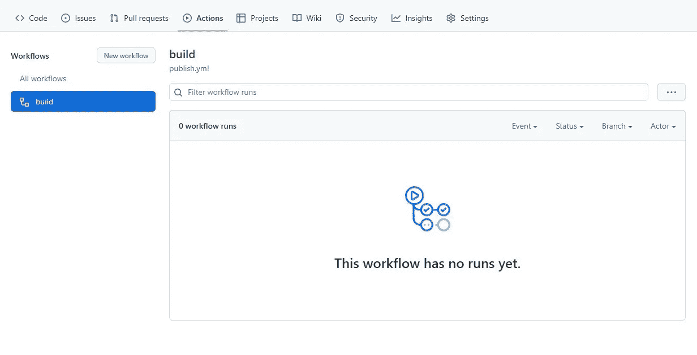

Github 操作工作流程

# **第十二步。演示页面**

我们已经有了一个使用我们的包的例子的文件夹，但我们想创建一个单独的页面，以便用户可以快速地看到运行中的包，而不必克隆整个项目。让我们继续这一页吧！

我们将使用 github-pages 来创建演示。

创建新的 git 分支:

```
git checkout -b gh-pages
```

现在删除项目中的所有文件！

不要担心，所有以前的文件将安全地保存在另一个`master`分支中。分支`gh-pages`将仅用于演示。所以我们需要删除所有文件。快点，删了一切！

然后在命令行中运行:

```
npm init -y
```

该命令将创建文件`package.json`。这次就不详细配置了。

对于演示页面，我建议使用我们熟悉的`parcel`([步骤 10](#38de) )

运行:

```
yarn add -D parcel my-react-typescript-package react react-dom @types/react-dom @types/react typescript
```

创建文件`.gitignore`:

```
node_modules
yarn.lock
.parcel-cache
dist
yarn-error.log
```

创建包含以下内容的文件`tsconfig.json`:

tsconfig.json

按照[步骤 4](#0e1f) 配置 Eslint。

创建空文件夹`src`。在其中，创建包含以下内容的文件`index.html`:

src/index.html

创造`index.tsx`:

src/index.tsx

添加到`scripts`部分内的`package.json`:

```
"start": "parcel src/index.html",
"build": "parcel build src/index.html --dist-dir docs --public-url .",
```

看看我的`package.json`:

package.json

运行服务器以确保一切正常:

```
yarn start 
```

现在，使用以下命令运行代码来检查错误:

```
yarn lint
```

没有错误！太好了！是时候构建页面了。

```
yarn build
```

您应该看到文件夹`docs`中包含了演示项目的所有文件。

下面是分支`gh-pages`的结构:

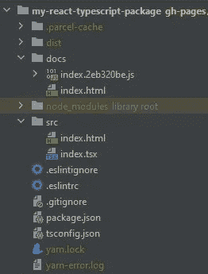

gh-pages 分部的结构

现在，让我们将所有的更改推送到 git。运行:

```
git add .
git commit -m "Initial pages commit"
git push -u origin gh-pages
```

打开你的 GitHub 库，进入`Settings — Pages`。在`source`中选择`/docs`并按下`Save:`

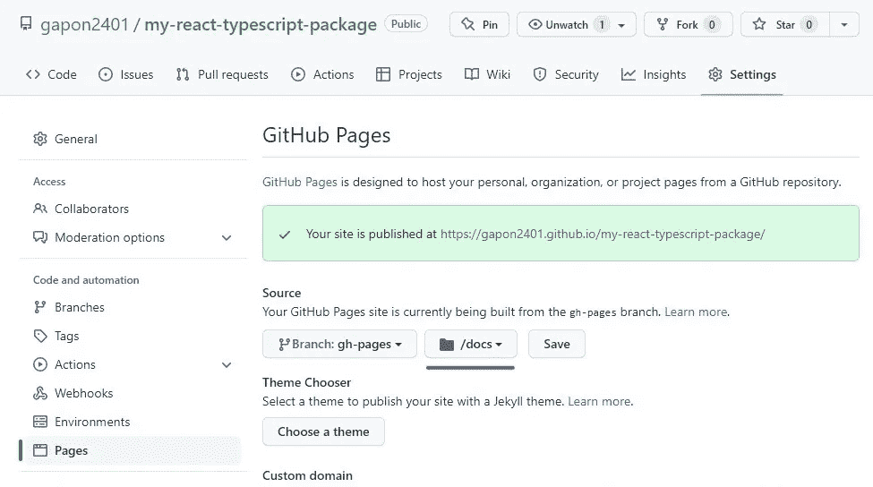

Github 页面

等待大约 3-5 分钟，您的网站将在指定的 URL 上可用，该 URL 显示在您的页面上:

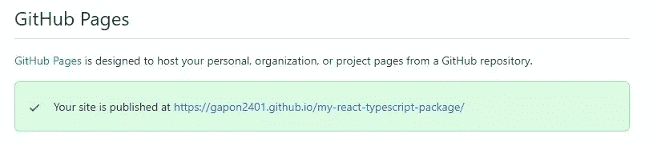

链接到演示页面

我们已经完成了演示页面。如你所见，你可以随心所欲地定制它，创建任何复杂程度的网页或网站。

结果如下:[https://gapon2401.github.io/my-react-typescript-package/](https://gapon2401.github.io/my-react-typescript-package/)

# **第十三步。README.md 文件和 shields.io**

现在我们已经完成了代码，我们可以转到包的描述文件了。

切换到 git 中的`master`分支，打开`README.md`。

用以下代码替换内容:

README.md

对于描述文件，我们使用[降价](https://github.com/adam-p/markdown-here/wiki/Markdown-Here-Cheatsheet)。

在`README.md`中，我添加了包的简短描述、演示页面的链接和用法部分。

在自述文件的开头，我有一些可爱的小图标。这是 https://shields.io/。有它们很方便。我只添加了几个作为例子，你可以想用多少就用多少。

将 `shields.io`添加到您的 GitHub 应用程序中。

看一下文件的结尾；我用图像和链接创建了变量。Markdown 允许我们制作这样的变量，所以描述文件看起来更准确。不要忘记更改 repo 的路径和包名。

在`package.json`中更改版本，提交并将文件推送到存储库。什么都自己做。我们已经在前面的步骤中做到了。

# **第 14 步。发布**

这是最后一步。它会很短。

我们已经完成了所有计划！现在我们可以在 GitHub 上发布一个官方版本，并检查自动化构建是如何工作的。

进入存储库主页，点击`Create a new release`:

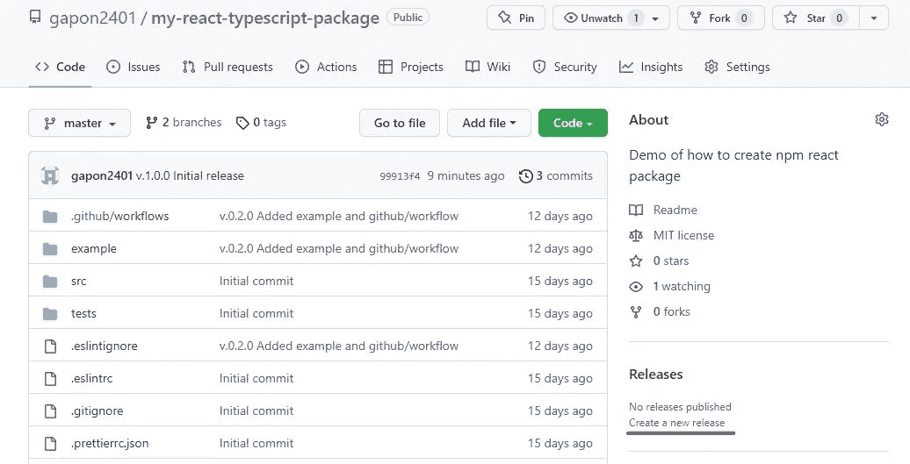

`Create a new release`

将您的当前版本指定为标签。它将在发布时自动创建。打印发布标题和描述，点击`Publish release`。


发布版本

现在，打开标签`Actions`，确保你的构建成功。

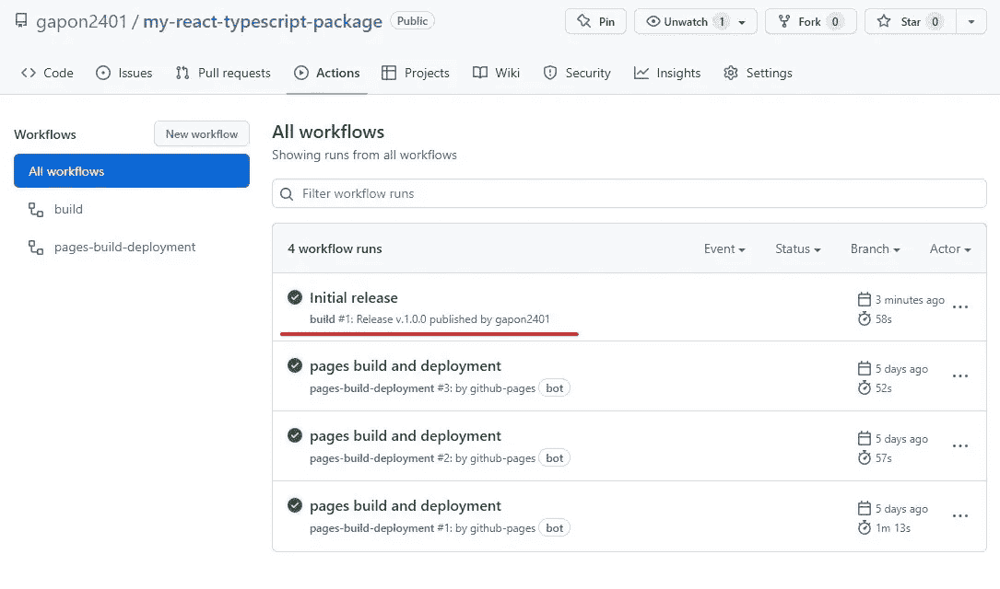

基于 github 动作的自动化构建

让我们检查一下包是否在 NPM 更新了。

打开包链接:

```
https://www.npmjs.com/package/<Your package name>
```

我会打开我的:

```
[https://www.npmjs.com/package/my-react-typescript-package](https://www.npmjs.com/package/my-react-typescript-package)
```

您应该会看到带有新描述的新版本:

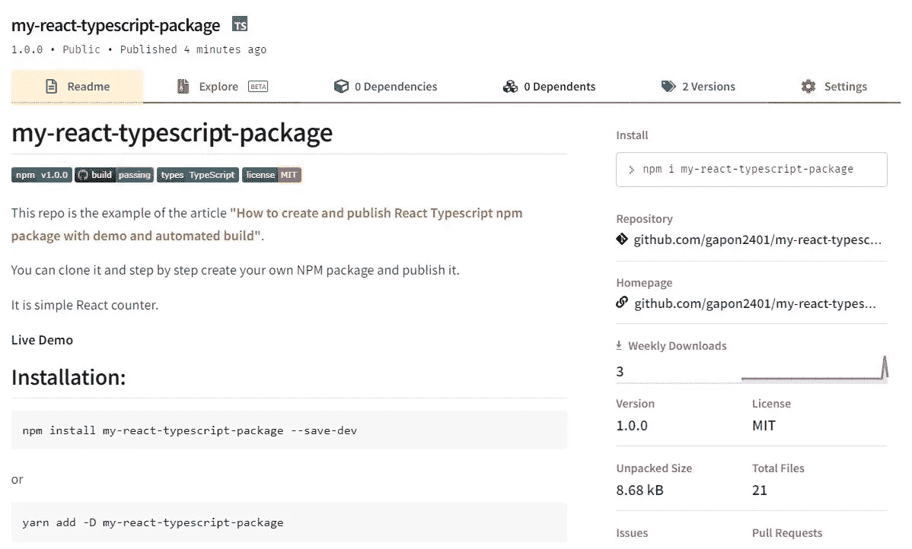

NPM 更新包

这是一次长途旅行，但我希望非常有用。我试图描述我第一次发布我的包时遇到的所有困难，并一条一条地收集这些信息。

感谢您的阅读！❤