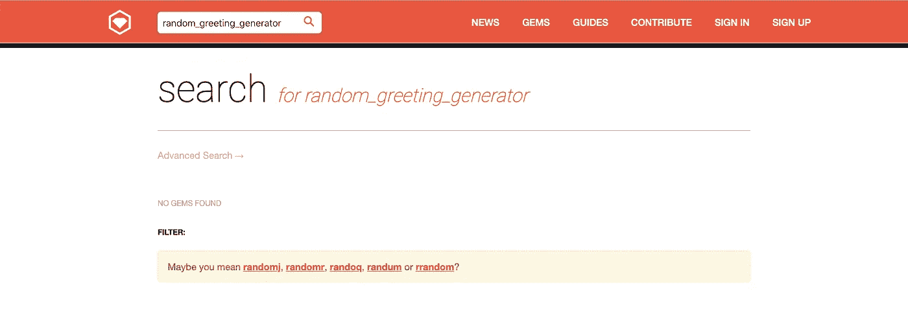
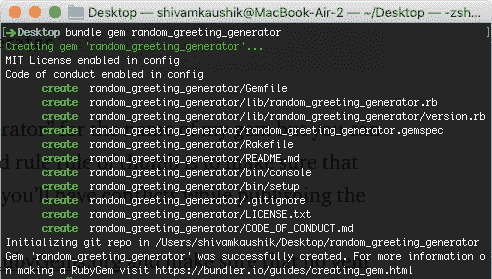
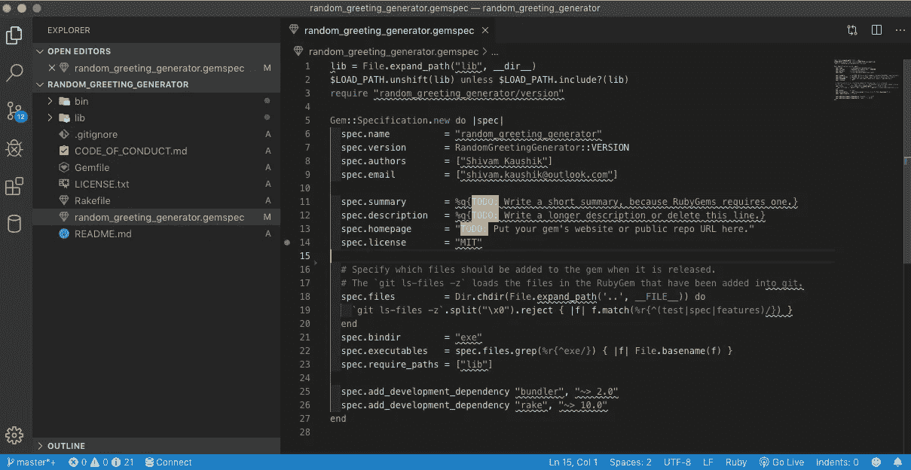
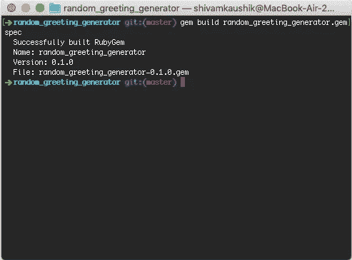
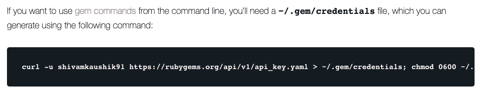
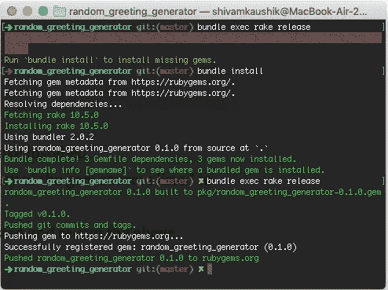
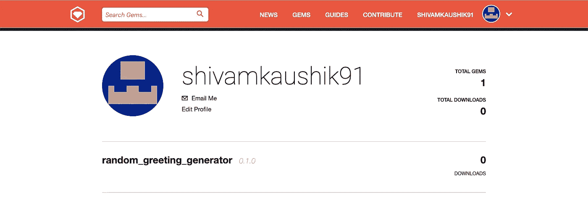

# 如何从头开始创建和发布自己的 Ruby Gem

> 原文：<https://betterprogramming.pub/how-to-create-and-publish-your-own-ruby-gem-from-scratch-92ec8419c104>

## 建造一个能产生随机文本的宝石


今天，我将向您展示如何创建和发布您自己的 Ruby gem。

我们将构建一个 gem，生成一个随机的问候文本和用户名(例如“Bonjour，John”)。

您可以在 Rails 应用程序的任何地方使用它。

gem 的功能非常简单。这只是一个指南；一步一步的过程，如果你愿意的话。一旦你完成了这个过程，你就可以创造任何你喜欢的东西了！

让我们开始吧。

# 设置文件

*本教程假设您的系统上已经安装了* [*捆绑器*](https://github.com/bundler/bundler) *。如果不请* [*安装好*](https://github.com/bundler/bundler) *再继续。*

导航到要在其中创建 gem 的本地目录。

在终端中运行以下命令，创建创建 gem 所需的所有文件:

```
bundle gem random_greeting_generator
```

我选择了`random_greeting_generator`作为我的宝石的名字，但是你可以(也应该)给它起任何你喜欢的名字。一个好的经验法则是确保名称是唯一的，否则在发布 gem 时会有冲突。

你可以去 RubyGems.org 的查看名字的可用性，确保没有同名的宝石存在:



搜索“随机问候生成器”没有结果

最后，运行 bundle 命令为我们开始构建 gem 创建必要的文件:



运行“捆绑 gem 随机 _ 问候 _ 生成器”后生成的文件

# 让我们开始建设吧！

让我们导航到生成目录的根目录并打开`random_greeting_generator.gemspec`文件。



gem 生成器已经为您预先配置了许多设置，但是正如屏幕截图中突出显示的，您需要完成一些待办事项才能正确编译。

这些非常简单明了:

*   摘要
*   描述
*   主页

现在，导航到`lib/random_greeting_generator` 目录并创建一个`generator.rb`文件。这个文件将包含我们的 gem 的逻辑:

```
module RandomGreetingGenerator
  class Generator
    def self.random_greeting name 
      greetings = ["Hello","Bonjour","Hola","Guten tag",
        "Hej","Salve","Nǐ Hǎo","Xin chào","Hei","Ahoj"
      ]
      # Creates a random greeting string
      "#{greetings.sample}, #{name}"
    end
  end
end
```

将此代码添加到`lib/random_greeting_generator/generator.rb`。

接下来，我们将这个模块导入到`lib`目录下的`random_greeting_generator.rb` 文件中:

```
require "random_greeting_generator/version"
require "random_greeting_generator/generator"

module RandomGreetingGenerator

end
```

现在，您需要编辑`.gitignore` 文件，并添加所有应该忽略的带有`.gem`扩展名的文件。

```
/.bundle/
/.yardoc
/_yardoc/
/coverage/
/doc/
/pkg/
/spec/reports/
/tmp/

# Ignore all files with the .gem extension
*.gem
```

更新您的`README.md` ，并添加适当的描述和使用说明。

最后，在 [Github](https://github.com/) 上创建一个存储库，并远程推送您的本地回购。

# 生成宝石！

最后，让我们运行生成宝石的命令！

导航到您的根目录，并在终端中运行以下命令:

```
gem build random_greeting_generator.gemspec
```

如果一切顺利，您将在终端上看到打印出来的结果:



# 向 RubyGems.org 发布我们的宝石！

前往[RubyGems.org](https://rubygems.org/)创建您的账户。登录后，转到[编辑配置文件](https://rubygems.org/profile/edit)页面，您将在 API 访问部分找到 curl 命令:



复制 curl 命令并在终端中运行它，以获得发布 gem 所需的所有有用命令。如果系统提示您输入密码，请输入。

安装完成后，导航到 gem 的根目录并运行以下命令:

```
bundle exec rake release
```

如果没有安装 rake，可能会出现错误:`Could not find gem ‘rake (~> 10.0)’ in any of the gem sources listed in your Gemfile.`

在这种情况下，按照提示运行`bundle install` ，然后重新运行上述命令:



成功创建 Gem 并推向 RubyGems.org

如果一切顺利，您将会看到上面截图中的成功消息。

前往你的[RubyGems.org](https://rubygems.org)个人资料页面，你会看到你新创建的宝石文件！



恭喜你！现在，您已经发布了您的新宝石，供全世界观看和使用。如果你有任何错误，请评论这篇文章，我会尽力帮你改正。

# 资源

在此处找到本指南[的回购。](https://github.com/KaushikShivam/random_greeting_generator)