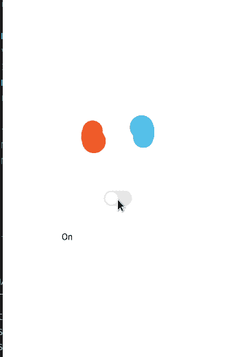
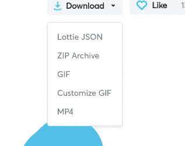
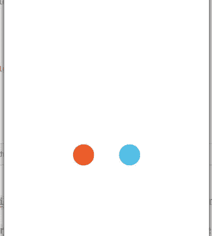
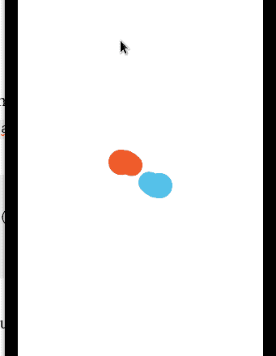
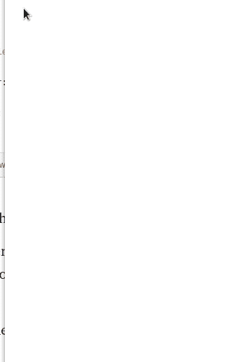
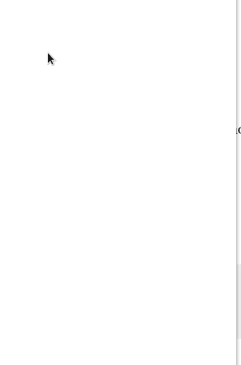
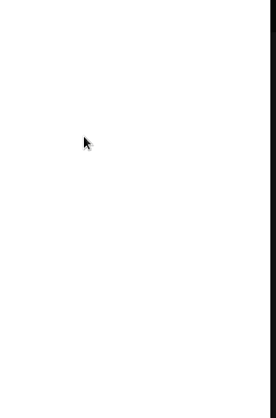
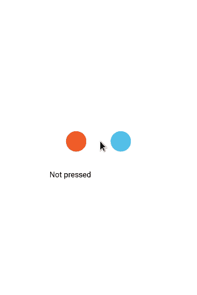
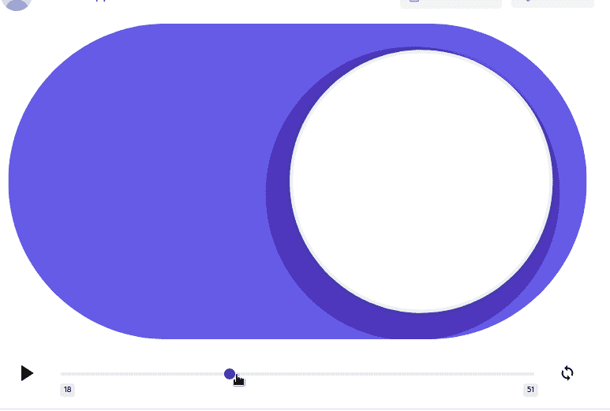
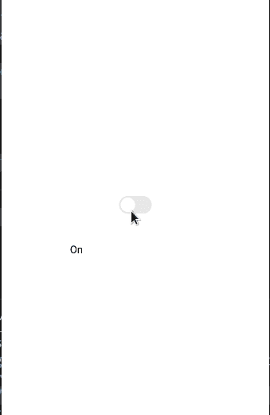

# 如何用 Lottie-React-Native 创建动画

> 原文：<https://betterprogramming.pub/how-to-create-animations-with-lottie-react-native-788a87cf8d94>

## 在 React 本地应用中显示漂亮的动画


照片由 [Ishan @seefromthesky](https://unsplash.com/@seefromthesky?utm_source=medium&utm_medium=referral) 在 [Unsplash](https://unsplash.com?utm_source=medium&utm_medium=referral) 拍摄。

因此，你已经建立了一个惊人的动画使用后的效果，你想炫耀给世界。一种方法是将它用作应用程序中的闪屏或加载组件。但是有一个小问题:Adobe 不允许你这样做。

这就是洛蒂反应原生型的用武之地。这个库允许你在你的 [React Native](https://reactnative.dev/) 应用中渲染你的动画。最精彩的部分？它只需要很少的代码就可以帮助您启动并运行。

在本文中，您将学习如何将 lottie-react-native 库集成到您的项目中。这将是结果:



本文的结果

既然说了它的优点，那就开始吧！

# 入门指南

## 项目初始化

在本文中，我们将在我们的项目中使用 Expo。要初始化 React 本机应用程序，请运行以下终端命令:

```
expo init lottie-tutorial
```

## 依赖项的安装

我们需要以下模块:

*   创造我们的动画。
*   `lottie-ios` —对等依赖，帮助在 iOS 上渲染图形。

```
npm install lottie-react-native lottie-ios@3.18
```

完成后，我们会得到我们需要的资产。

## 资产文件

您可以通过使用 [Bodymovin](https://exchange.adobe.com/creativecloud.details.12557.bodymovin.html) 插件导出动画来使用自己的动画。但是对于本指南，我们将使用[洛蒂文件](https://lottiefiles.com/)目录。它包括大量的免费动画，您可以将它们导入到您的项目中。现在，我们将使用[熔岩预加载器](https://lottiefiles.com/67313-lava-preloader)和[开关切换](https://lottiefiles.com/67255-switch-toggle)动画。

要获得这些资产，请下载 JSON 格式的所需文件:



下载为“洛蒂 JSON”

接下来，将这些 JSON 文件拖到您的`assets`文件夹中。

# 洛蒂:基本用法

在本节中，您将学习这项技术的基础知识。

## 简单动画

创建一个名为`SimpleAnimation.js`的文件。在这里，编写以下代码:

*   第 9 行:`LottieView`组件将呈现动画。
*   第 10 行:`source` prop 告诉 Lottie 我们需要渲染的资产的位置。
*   第 18-19 行:我们的动画将会有一个`height`和`100`单位的`width`。

剩下的工作就是在屏幕上显示这个组件。为此，在`App.js`中编写以下代码:

这将是我们代码的输出:



代码的输出

该对象没有动画，因为我们没有指定它运行。我们可以通过`autoPlay`道具让它像这样玩:

```
<LottieView
  source={require("./assets/67313-lava-preloader.json")}
  autoPlay
/* further code.. */
```

这将是输出:



代码的输出

那非常容易！

## 加载程序动画

在本节中，我们将使用 [Coffee API](https://sampleapis.com/api-list/coffee) 在屏幕上呈现数据。加载数据时，React Native 将渲染动画。

创建一个名为`LoadingAnimation.js`的文件。这里，从编写以下代码开始:

*   第 4-8 行:从 API 获取数据，并将其存储在`data`钩子中。
*   第 14-18 行:`Item`组件将负责呈现列表中的每一项。

接下来，将以下代码添加到同一个文件中:

*   第 3 行:检查数据是否已经加载(数据的值不是`null`)。
*   第 4-8 行:使用`FlatList`元素呈现`data`数组。如果你想了解更多关于使用`FlatList`的知识，[斯潘塞·卡利](https://medium.com/u/1ec17560bf99?source=post_page-----788a87cf8d94--------------------------------) [已经写了一篇关于它的文章](https://medium.com/react-native-development/how-to-use-the-flatlist-component-react-native-basics-92c482816fe6)。
*   第 10-15 行:否则，如果数据正在加载，显示我们的加载动画。

这将是输出:



代码的输出

太好了！我们的代码有效。在下一节中，您将学习如何控制动画的其他属性。

## 控制速度

要改变速度，使用`speed`支柱。

```
<LottieView
  speed={3}
//further code..
```

这将使动画速度提高三倍。



代码的输出

您可以通过设置负值来反转它，如下所示:

```
<LottieView
  speed={-1}
//further code..
```



代码的输出

## 动画结束时的处理

洛蒂包括一个叫做`onAnimationFinish`的道具。在这里，您可以编写一个回调函数，在动画结束时运行。

*   第 11 行:当动画结束时，调用`handleFinish`方法。这将把`finish`吊钩设置为`true`。
*   第 13 行:将`loop`道具设置到`false`。这将告诉 Lottie 只运行动画一次。
*   第 16 行:使用条件渲染来表示动画已经完成。


代码的输出

# 与动画互动

在本节中，您将了解 Lottie 的命令式 API。这允许对资产进行更精细的控制。

## 播放和暂停

在这里，我们将告诉洛蒂运行图形，如果用户已经按下它们。否则，如果用户抬起手指，动画将会暂停。

创建一个名为`InteractiveAnimation.js`的文件。在这里，编写以下代码:

让我们仔细分析这段代码。

*   第 7 行:创建一个`useRef`实例。我们将用它来指挥我们的动画。要了解更多关于`useRef`钩子的知识，请查看这篇由[颜后君·加西亚·加西亚](https://medium.com/u/85c2933da91c?source=post_page-----788a87cf8d94--------------------------------)撰写的文章。
*   第 11 行:呈现一个`Pressable`组件。这将检测用户的交互。
*   第 12-15 行:如果用户的手指在屏幕上(`onPressIn`)，恢复动画。
*   第 16-19 行:如果用户举起了手指(`onPressOut`)，暂停动画。
*   第 22 行:链接我们的`animation`钩子和这个`LottieView`实例。

这将是代码的输出:



代码的输出

## 开关

这里，我们将使用开关动画在“开”和“关”状态之间切换。

在继续之前，请看一下文件。注意，图形在`Frame 27`处转到“开”的位置，在`Frame 51`处回到“关”的位置。



看框架

我们的计划是根据状态在这些帧之间切换。

创建一个名为`SwitchAnimation.js`的文件。在这里，编写以下代码:

*   第 6 行:创建`animation`钩子来访问动画操作函数。
*   第 10 行:如果`on`状态为假，播放动画直到`Frame 27`。这将把开关设置为“关”
*   第 12 行:否则，播放从`Frame 27`到`Frame 51`的动画。这将把开关状态翻转到“开”

完成后，添加以下代码:

*   第 3 行:点击时，反转`on`钩子的值。

这将是输出:



我们完事了。

# 额外资源

[GitHub 上的代码](https://github.com/HussainArif12/lottie-tutorial)。

*   [洛蒂框架指南](https://medium.muz.li/a-guide-to-lottie-framework-5-steps-to-create-an-animation-6ccc446d7b13)作者[谢尔盖·格拉德基](https://medium.com/u/7e26e5ac328a?source=post_page-----788a87cf8d94--------------------------------)
*   [喜欢 React Native School 与洛蒂的动画](https://www.youtube.com/watch?v=FySemYmSPHg)
*   [Andrew boni facio 在 5 分钟内对洛蒂做出反应](https://www.youtube.com/watch?v=LIoRZZ_va_o)

# 结论

如果你正在寻找一个使用起来毫不费力的动画库，那么 Lottie 非常适合你的应用程序。最令人印象深刻的是，你不需要通过代码来重建你的动画，从而让你专注于项目中更关键的部分。

非常感谢您的阅读！