# 如何用深度学习创造艺术杰作

> 原文：<https://betterprogramming.pub/how-to-create-artistic-masterpieces-with-deep-learning-24c86417fc74>

## 神经转移真的很神奇

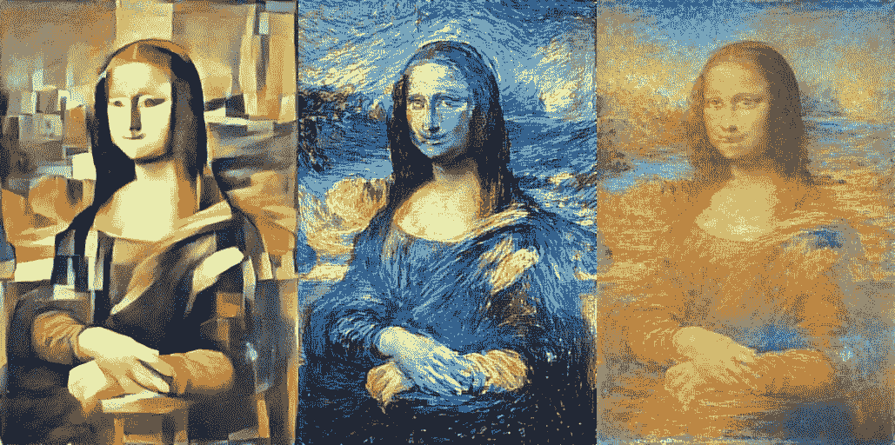

神经转移的能力

我个人觉得我在艺术部门有点经验。我演奏/创作音乐(主要是钢琴和吉他)的时间比我能系好鞋带的时间还要长。我特别喜欢创作多媒体视觉艺术，这是我在初中和高中时经常做的事情。以下是我的一些创作。

回顾过去，他们并没有我记忆中的那么伟大。但是我仍然有从事这些工作的美好回忆。

我有更多的创作，所以我会把它们留在作品的最后。

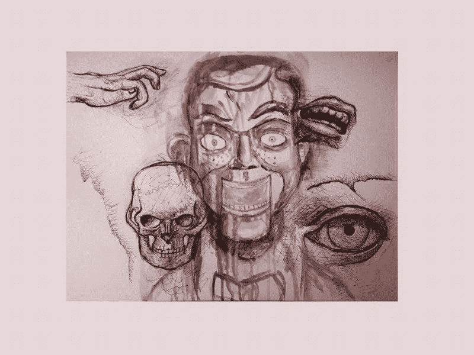

可怕的

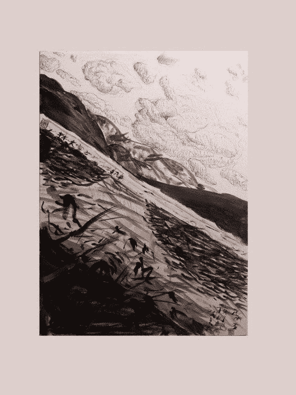

逃跑

混乱

在任何艺术领域，脱颖而出最重要的一个方面就是风格。达芬奇有他独特的风格。毕加索和梵高也是，甚至波洛克也是。风格在艺术上相当于食物的味道。熟悉和异国之间的正确平衡，人们可以完全被吹走。

这里有一个问题:如果有一种方法可以将风格从一件艺术品转移到另一件艺术品上，那不是很棒吗？如果我们能把《星夜》的风格放到《最后的晚餐》上，或者把印象派绘画的风格放到著名的照片上，会怎么样？这将为已经令人惊叹的创意世界增添一层全新的不可思议。

我有好消息告诉你。*有可能*！通过一个叫做*神经转移*的神奇过程，这很容易实现。看看它能做什么(对着我的脸)！

原象

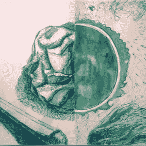

风格图像

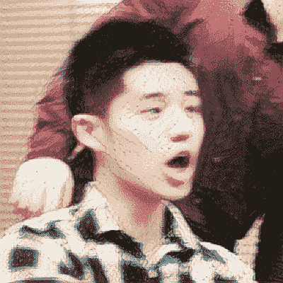

Tada！

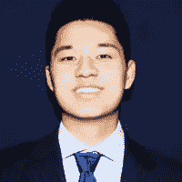

原象

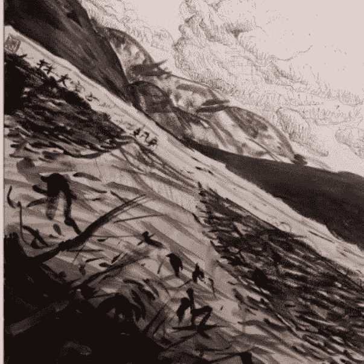

风格图像

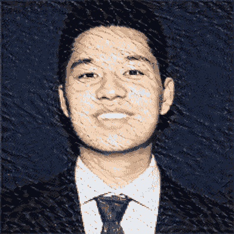

Tada！

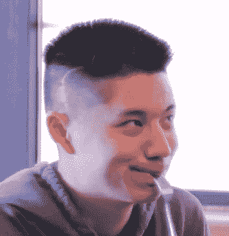

原象

风格图像

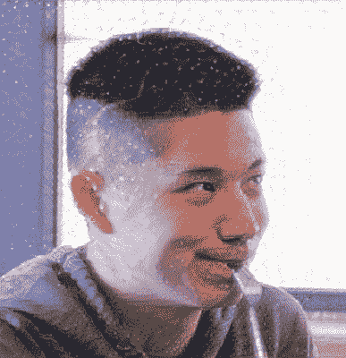

Tada！

# 议程

1.  高级概要
2.  什么是深度学习？
3.  神经网络直觉
4.  什么是卷积神经网络？
5.  编码神经传递
6.  需要改进的地方

*如果你想更深入地了解这个项目，或者如果你想添加代码，可以查看一下* [*GitHub 库*](https://github.com/jerrytigerxu/Neural-Transfer) *。*

# 高级概要

在最基本的层面上，什么是*神经传递*？*神经转移*是一种机器学习技术，专门使用神经网络将一幅图像的风格转移到另一幅图像上，同时仍然保持原始图像的本质。如果我们想使用更多的技术术语，这意味着最小化图像的*风格损失*，同时最小化图像的*内容损失*。稍后我会解释这些术语的含义。

如果你对我滔滔不绝的胡言乱语不感兴趣，想直接跳到有趣的地方，不要犹豫。我将花大量的时间深入研究神经转移实际工作原理背后的理论和直觉。

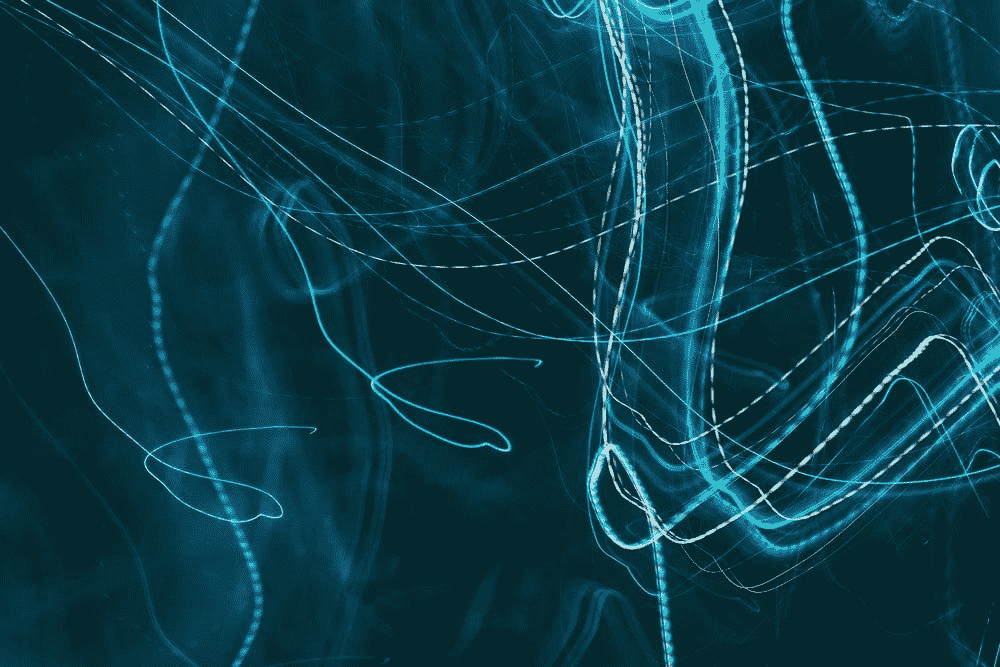

郑重声明，这不是神经网络的真实样子

为了理解神经传递，你需要掌握一系列的观点。首先，你需要了解深度学习的一般概念，深度学习是机器学习/人工智能的更深层形式。然后，你需要了解一个神经网络，机器学习的一个组成部分，实际上是如何运作的。在你确定了神经网络之后，你可以学习卷积神经网络是如何工作的。所有这些都将使神经转移的过程更容易理解。

# 什么是深度学习？

让我们从简单的开始。什么是深度学习？让我们从简单的开始。什么是机器学习？

机器学习就是研究/使用算法和统计方法，让计算机在没有明确编程的情况下执行任务。换句话说，它**学习**如何执行任务。

一个简单的例子是训练计算机识别图像。如果我不给计算机如何识别一个非常复杂的数据形式的确切指令，我会得到一堆错误信息。记住，电脑是很笨的。他们只会用 0 和 1 说话，我们怎么能指望他们像人类一样看东西呢？

然而，我能做的是提供一个框架，通过这个框架，计算机可以计算出区分不同类型的类的重要特征和参数。比如狗和香蕉就不一样，因为狗有耳朵，香蕉没有。香蕉是黄色的，而(大部分)狗不是。

我绝对认识到这只狗非常可爱

显然，这不足以教会计算机识别图像，但你得到了大致的想法。顺便说一下，我将使用的这个假设框架被称为*机器学习算法*。

这个[视频](https://www.youtube.com/watch?v=f_uwKZIAeM0)提供了对机器学习概念的(更)牢固的把握。

典型的机器学习算法，如朴素贝叶斯、K-最近邻、支持向量机或回归，通常对于识别图像或音频等任务来说不够好。他们太肤浅了。正因为如此，我们有了*深度学习* **，**这是复杂得多的机器学习形式。深度学习的一个重要组成部分是神经网络。

# 神经网络直觉

这是一张非常基本的神经网络的图片。

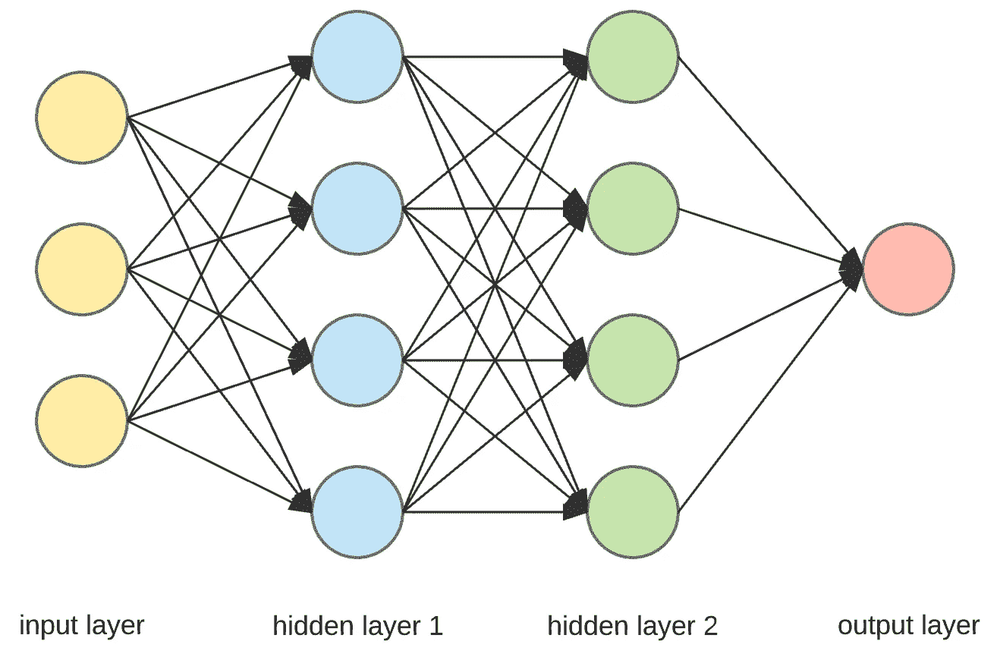

非常简单的神经网络

一个神经网络由一个输入层、一个输出层和位于它们之间的层组成，这些层可以被称为*隐藏层*。就像在机器学习中一样，期望是你可以输入一堆输入，然后得到某种答案或分类作为输出。

让我们继续我们的图像分类例子。如果我想让计算机识别手写数字，输入和输出应该是什么？由于计算机是哑的，它只能理解数字，所以仅仅给出图像本身是没有意义的。我们需要输入图像中的每一个像素，并将其转换成计算机可以理解的东西。神经网络中的神经元可以接收 0 到 1 之间的值。在这里，我们将值作为像素的亮度，0 表示暗，1 表示完全亮。输出应该是网络认为正确的任何数字。嘣！我们馈入一个图像，分解成像素，转换成神经元值，通过网络，得到答案！简单吧？

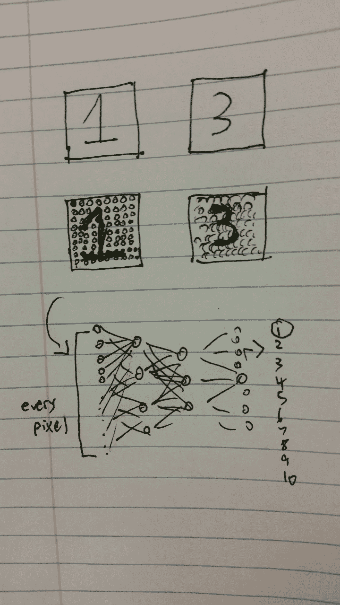

数字识别神经网络的输入和输出

没那么快。网络到底是如何区分 1 和 3 的？此时此刻，它仍然不知道什么是 1 和 3，更不知道如何对它们进行分类。这就是我们需要谈论网络实际上是如何学习的— *梯度下降*。

## 梯度下降

所以我们有很多层，每层都有很多神经元。现在怎么办？我们可以有哪些参数，让我们有不同的输出结果？我不打算太深入地研究数学，但直觉是绝对必要的。

网络第二层中的一个神经元将来自前一层的所有神经元的**作为输入，并输出一个介于 0 和 1 之间的新数字。这个新值成为下一层的神经元，然后输入到下一层。**

这个过程一直持续到我们得到网络的最终输出层。当第二层中的神经元接受来自前一层的神经元时，它将神经元激活函数的值与某些*权重* 进行点积。这将输出一个很大的数字，该数字将被放入另一个函数中，该函数将输出限制在 0 到 1 之间。正是这些权重是使神经网络工作的关键。

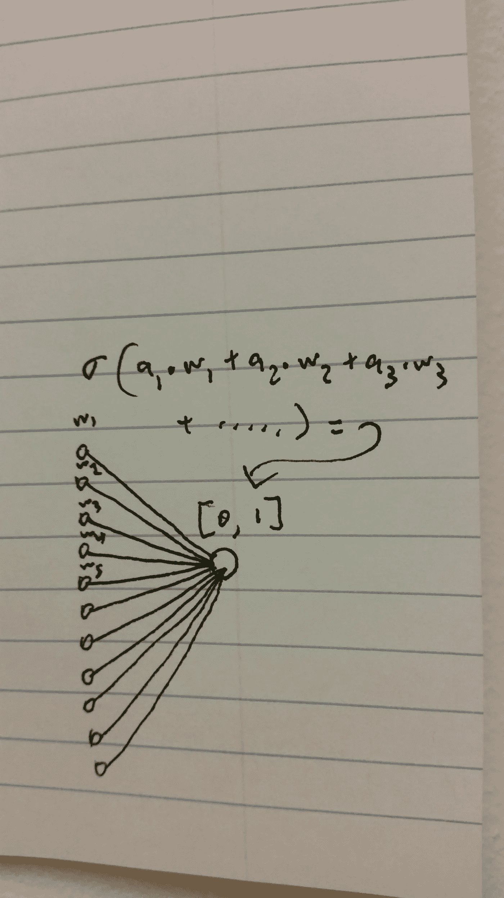

单个神经元计算的图示

现在我们需要考虑如何帮助我们的神经网络改善。当我们第一次初始化网络时，权重是完全随机的，所以我们将在输出层得到绝对的垃圾。我们将放入一个 5 的图像，得到一个 2 或 9 的输出，因为计算机不知道它的估计是对还是错。

为了处理这个问题，我们需要使用一个叫做*均方误差*的指标。我们将估计的输出与我们实际想要的进行比较，然后计算差值的平方和。我们也可以称 MSE 为*损失函数* **，**，它测量网络与正确预测的偏离程度。如果我们能够成功地将损失函数降低到尽可能低的值，我们将拥有一个能够做出准确预测的网络！

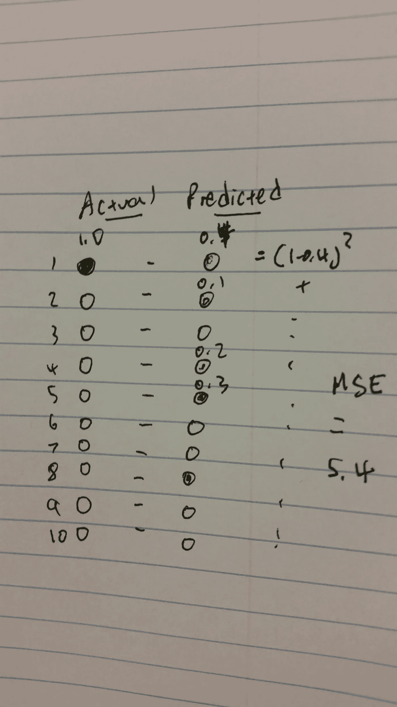

如何计算均方误差或损失函数

梯度下降中的术语*梯度*来自多变量微积分。这就是最急剧变化/上升的方向。如果你有一条曲线，把梯度想象成曲线的斜率，除了这里我们谈论的不仅仅是一个或两个维度(成千上万！).基于损失函数得到的梯度将告诉我们需要调整网络中的哪些参数才能使损失函数最小。

为了使损失函数最小化，有一些技术涉及大量的多变量微积分和线性代数，然后通过网络反向进行，调整和微调神经元激活函数的权重。这叫做*反向传播*，我绝对不想破坏你的大脑和我试图解释它的大脑。您所需要知道的是，这就是代码将为您做的事情！

结果呢？一个训练有素的神经网络，可以接受大量的输入，并给出相当准确的预测！

现在你已经对神经网络有了大致的了解，让我们进入下一个层次。如果你仍然感到困惑，在这个视频播放列表中没有人比格兰特更好地解释了神经网络。

# 什么是卷积神经网络？

传统神经网络的一个问题是它们可能非常不灵活。回到我们的数字例子，如果我把一个放在图片的角落而不是中心，我们的整个网络就被打乱了。为什么？因为网络被训练来寻找**特定的**像素值。它实际上并不识别图像本身的组成部分。

如果我们想成功制作神经转移艺术，我们需要更好的东西。*卷积神经网络* 的伟大之处在于，它们拥有卷积，而不是用常规数字作为神经元激活函数的权重。什么是卷积？

如果你曾经使用过 PhotoShop 或任何照片编辑软件，你会知道像*模糊*或*锐化*这样的工具。他们所做的是以设定的大小(如 30 x 30 像素)接受一些像素值，然后对这些值执行操作以稍微改变它们，这就创建了图像效果。网络中的卷积将对输入图像执行这些图像效果。这使得计算机很容易分辨出该特定类别图像所特有的重要特征和元素。

这解决了我们传统神经网络的问题——我们不必担心像素的特定位置，因为网络现在可以区分特定的模式和形状。除了卷积方面，卷积神经网络非常类似于传统的神经网络，只是可能有更多的层。

如果你更困惑，我能找到的关于卷积神经网络的最好解释是在这个由计算机爱好者制作的[视频中。](https://www.youtube.com/watch?v=py5byOOHZM8)

# 编码神经传递

这是真正有趣的开始部分！如果你没有完全理解每一行代码，也不要难过(因为我也不理解)。最重要的是，你得到了令人敬畏的结果，并且你从学习深度学习中获得了乐趣。如果你不在乎理解代码，只想做一些很酷的艺术，去[我的 GitHub 库](https://github.com/jerrytigerxu/Neural-Transfer)。

首先，让我们导入所有必需的库。

现在我们将声明一些变量，这些变量在以后会很重要。我们有两个图像:基础图像和样式图像。*迭代*变量就是程序在停止之前在神经网络中运行的次数。

接下来我们有权重变量。这些对于计算内容、风格和总变化的损失是非常重要的，它对整个图像生成过程有直接影响。请随意更改这些数字，看看是否会得到不同的结果。

最后，我们有维度变量，这是不言自明的。

对于其余的代码，我将偏离我在 GitHub 上的交互式笔记本中的代码块顺序。为什么？因为尽管首先定义变量和函数是很好的实践，但是当代码很长时，很难弄清楚一个变量的意思和它的使用位置以及哪个类定义了什么。这篇文章主要是关于*帮助你理解*，而不仅仅是让代码看起来漂亮。

## 代码概要

对于那些没有经验/不精通代码的人来说，你将会看到很多疯狂的事情。下面是正在发生的事情的概要:

1.  加载图像并对其进行预处理(将它们转换为神经网络可用的形式)。
2.  为最终生成的图像创建一个占位符(使用新的图像尺寸)。
3.  将基础图像、样式图像和占位符放入单个张量(基本上是一个 3D 向量)。
4.  把这个张量放入预先训练好的神经网络(称为 VGG19)。
5.  定义内容、风格和总变差的损失函数。
6.  定义总损失函数。
7.  定义梯度(用于梯度下降和反向传播)。
8.  创建一个求值器对象来加速优化过程。
9.  对评估器进行优化(使用 scipy.fmin_l_bfgs_b ),使总损耗最小。
10.  等了很久…
11.  获得令人惊叹的结果！(去过程图像。)

Dang，连轮廓都复杂！我们来看一下代码，好吗？

## 加载图像并进行预处理

这里，我们定义了一个函数来预处理我们的基础图像和风格图像。

## 为最终生成的图像创建一个占位符

记住`K` 只是我们正在使用的深度学习框架 Keras 的后端。

## 将基础图像、样式图像和占位符放入单个张量中

## 把这个张量放入预先训练好的神经网络

如果你还不知道，VGG19 是一个卷积神经网络(19 层深)，在巨大的 Imagenet 数据库上训练，以识别无数不同的对象。

## 定义内容、风格和总变差的损失函数

这就是事情变得复杂的地方。我们需要定义一个度量标准，通过它我们可以调整我们的神经网络，以便它可以更好地完成它的工作。这个度量，即损失函数，由三个部分组成:内容损失、风格损失和总变差损失。

内容流失很简单。它只是生成的图像与基础图像的偏差程度。

总变差损失也比较简单。它测量生成的图像本身的变化。因此，变化损失越高，图像就会显得越笨重和粗糙。我们想要一个低变化损失，所以最终的图像看起来相对平滑。

风格流失不是那么简单的。你如何量化风格？这是我也不完全理解的一部分，但是请耐心听我解释。

首先，我们需要定义一个创建 gram 矩阵的函数，这是一个奇特的线性代数术语。我们需要计算张量每一层的风格损失，然后将其缩小到重要的特征层。这给了我们总的风格损失。

## 定义总损失函数

总损失函数考虑了内容、风格和总变化的权重和损失，并输出一个数字，我们稍后将尝试最小化该数字。

## 定义渐变

请记住，梯度为我们提供了损失函数的最陡变化方向，这为我们提供了调整网络权重以减少损失的最佳数字。我们还将定义一个输出损失值和梯度值的函数。

## 创建一个求值器对象来加速优化过程

因为我们正在沿着多个度量标准(不同的损失函数)进行优化，所以我们可以通过创建一个 evaluator 对象来加速这个过程。

## 对评估器进行优化，以最小化总损失

现在，我们将优化评估器，它使用梯度下降来调整权重，以最小化损失函数。这将在我们之前定义的迭代次数内完成。我们还需要定义一个*保存*函数以及一个*取消处理*函数。每次迭代后，我们得到的图像都比前一次更好。

我们完成了所有代码！恭喜你走到这一步！

# 需要改进的地方

感谢您花时间通读这篇文章！

## 1.尝试不同的图像

你绝不能使用我提供的图片！你可以随意在任何你想要的**图像上尝试神经传输程序！打开可能性，让每个人都看到你创造的美丽艺术！**

## 2.尝试不同的网络

我特别使用了 VGG19 网络，但是您不仅限于使用这个。有许多其他好的预训练网络是开源的，随时可以使用。如果你感觉真的很好，你可以试着建立自己的关系网！

## 3.调整超参数

在网络本身中，虽然大多数参数都是由网络优化的，但也有一些您可以完全控制的参数可以获得最佳结果。一定要解释代码的文档，以便更好地理解可以改进的地方。

# 其他艺术品

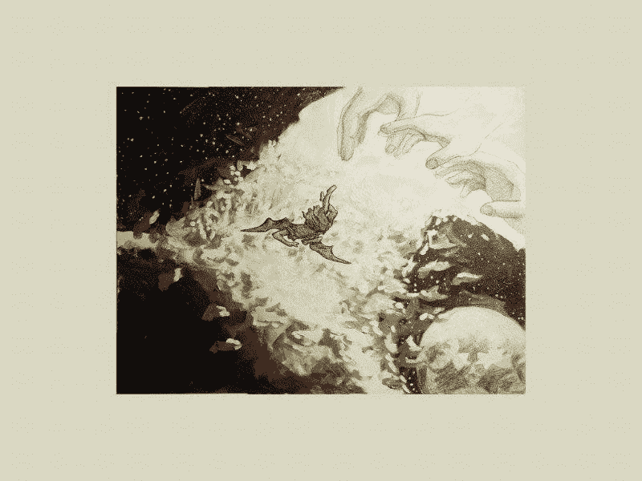

晨星

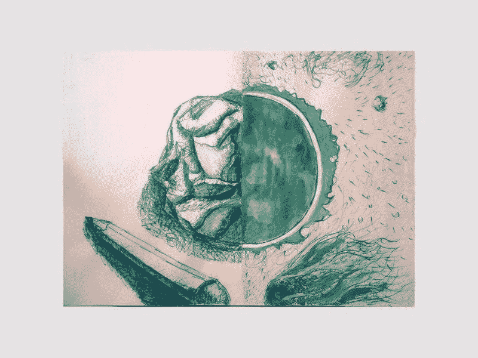

裂开

线

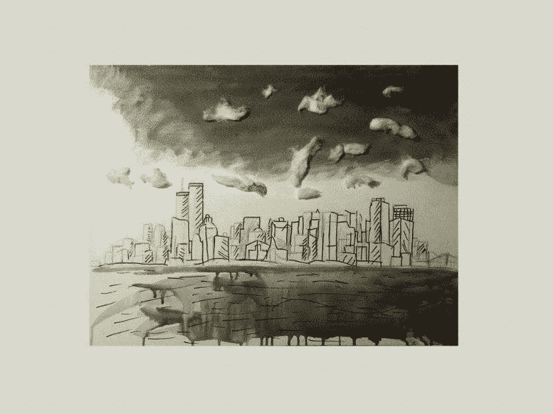

城市的

想

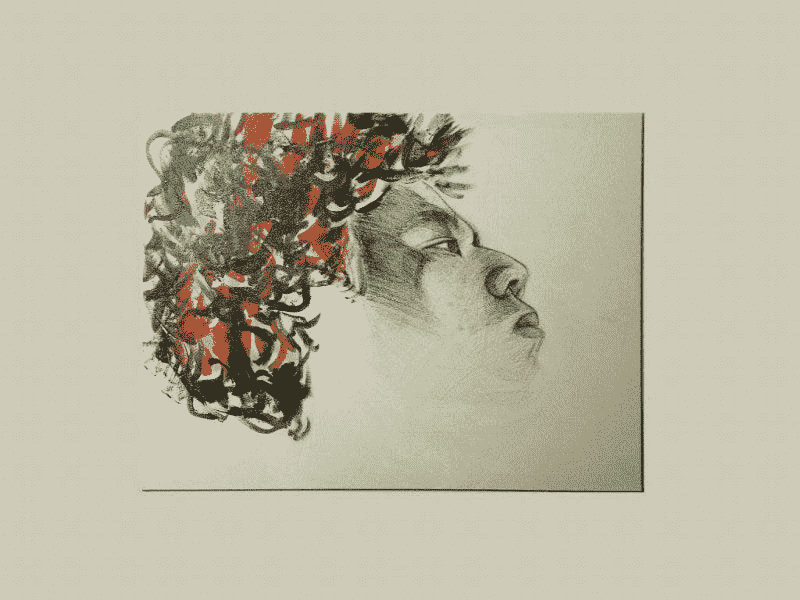

我认识的人

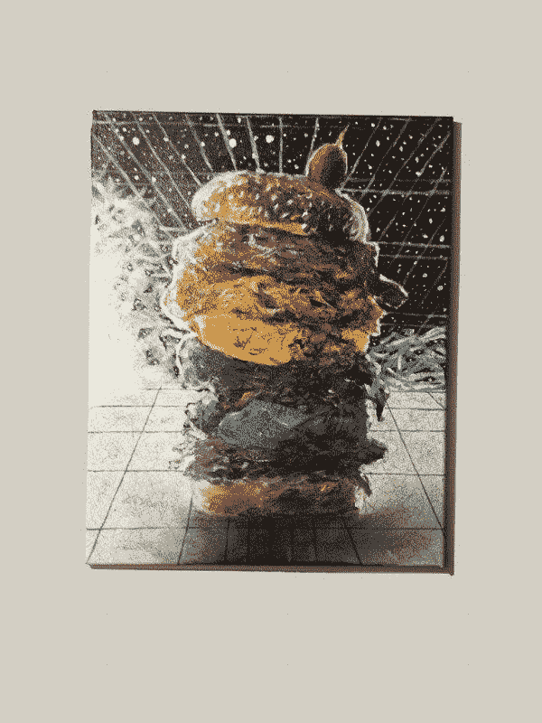

风味

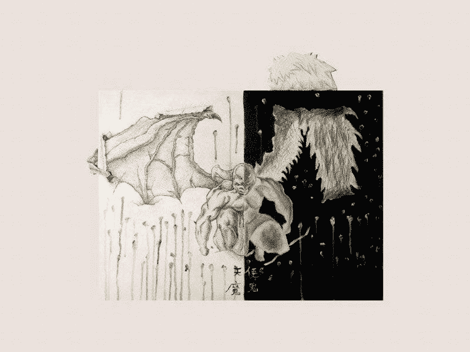

模糊的线条

生活

# 有用的资源

*   [**3 blue 1 brown**](https://www.youtube.com/watch?v=aircAruvnKk&list=PLZHQObOWTQDNU6R1_67000Dx_ZCJB-3pi)——非常适合获得关于数学如何工作的清晰直觉(尤其是观看他的深度学习部分！)
*   **—他们对卷积神经网络的解释是一流的**
*   **[**TensorFlow/Keras 文档**](https://www.tensorflow.org/api_docs/python/tf/keras/backend)——在这里您可以了解我在代码中使用的所有函数和模块**
*   **[**fast . ai**](https://www.fast.ai/)**—如果你想通过编码更深入地了解深度学习，可以查看他们的教程****
*   ****[**Leon A. Gatys 的论文，一种艺术风格的神经算法**](https://arxiv.org/abs/1508.06576)——首次概述神经传递的论文。这是一篇学术论文，所以你的大脑在试图阅读它时会受伤，但至少你会感到聪明，因为你通过这篇文章获得了一般的直觉！****
*   ****[**Sahil Singla 关于走向数据科学**](https://towardsdatascience.com/practical-techniques-for-getting-style-transfer-to-work-19884a0d69eb) 的文章——这篇文章详细介绍了如何获得神经转移的最佳结果。我强烈建议您实现这里概述的技术。****