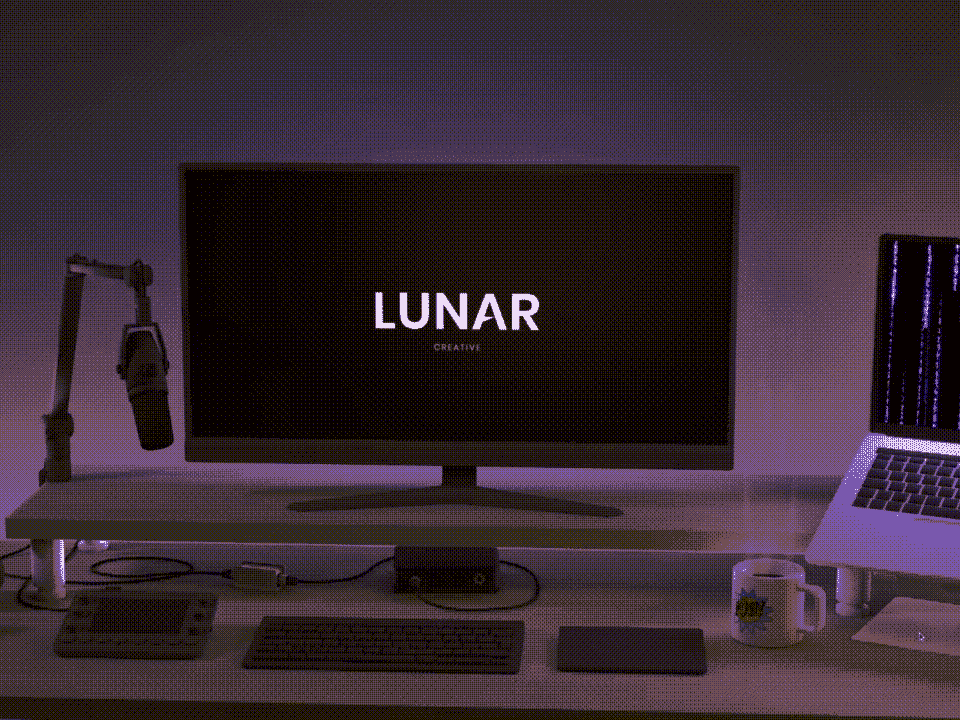
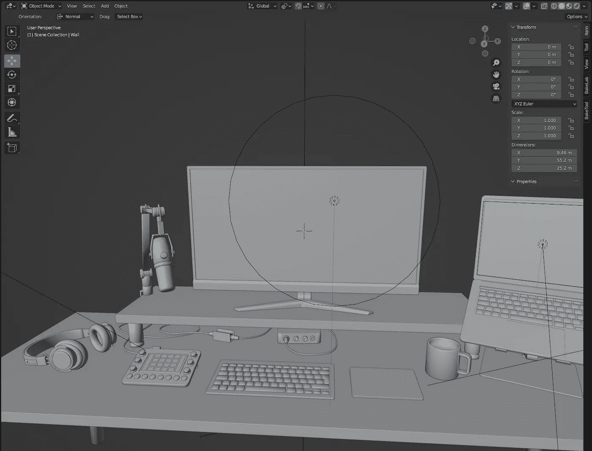
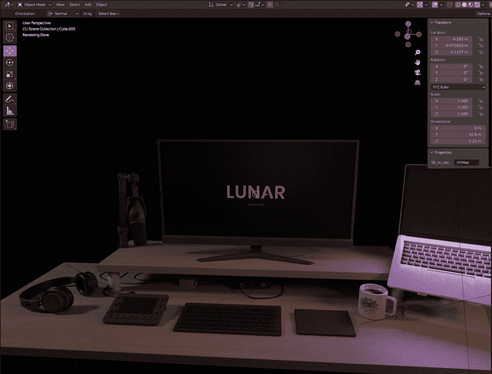
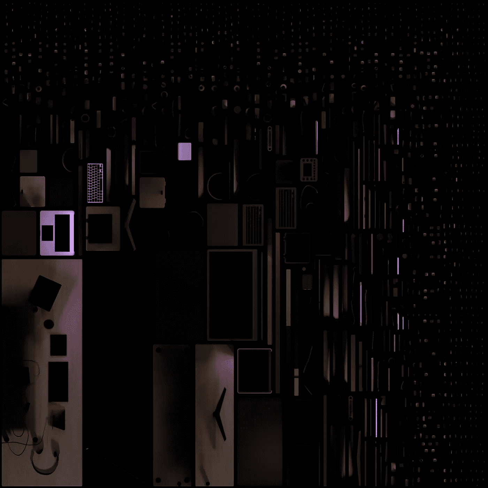
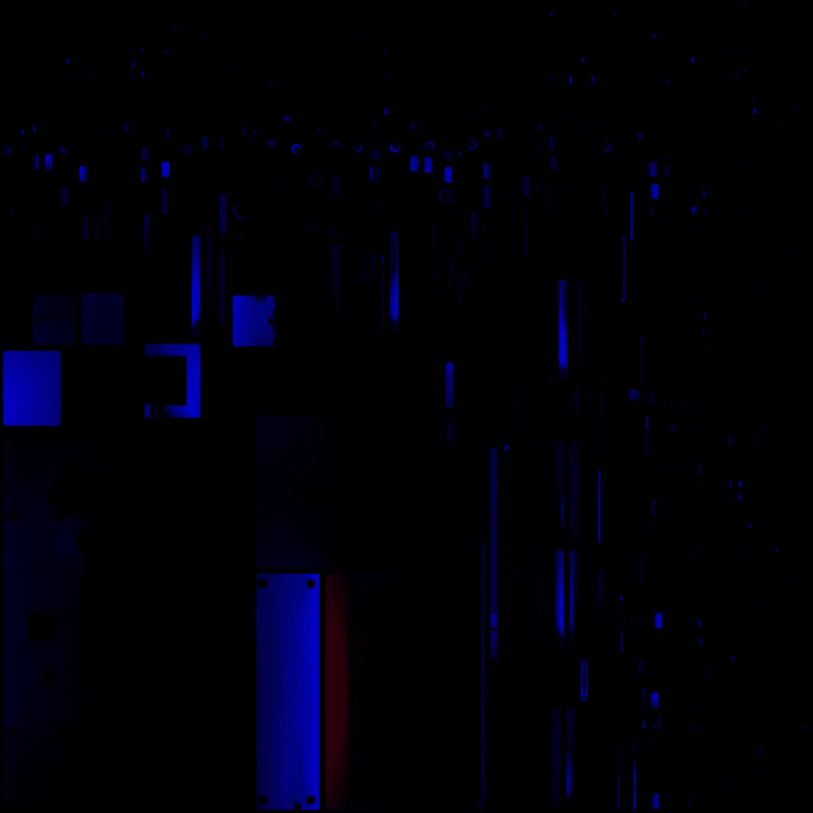

# 如何使用 Three.js、Blender 和 Greensock 为您的网站创建出色的 3D 图形

> 原文：<https://betterprogramming.pub/how-to-create-awesome-3d-graphics-for-your-website-using-three-js-blender-and-greensock-a834cb8a6f6e>

## 创建奇妙用户体验的简要指南

# 背景

如果你曾经尝试过在 WebGL 或 three.js 中创建 3D 图形，你可能会体验到所有东西看起来都很糟糕。很难在代码中创建复杂的几何图形，灯光看起来总是很平，不切实际。

创建真实的光需要实时光线追踪，这对于大多数计算机硬件来说太重了。因此，相反，我们将使用一些先进的技术来“伪造”真实的照明和改变光线条件。

但是首先，让我们使用 3D 建模软件创建我们的几何图形。我推荐用 Blender，免费开源。但是，你可以使用任何你喜欢的 3D 建模软件。

# 系统模型化

学习在 Blender 中创建复杂的 3D 模型需要一些练习。通常从添加与您尝试建模的对象最相似的形状开始。如果您正在建模一个键盘，您通常会使用一个立方体或平面作为起点，对于一个杯子，您通常会使用一个圆柱体，等等。

一旦你添加了你的初始形状，你就开始雕刻它，让它看起来越来越像你正在建模的东西。至于键盘，你可能会修改高度和拉伸宽度。

**亲提示！给所有边缘添加至少一些微小的斜面。这将提高后来添加照明时的真实感。**

一旦你创建了你的 3D 模型，它可能看起来像下面的图片。一旦掌握了窍门，像这样的建模通常只需要几个小时。

截图——模拟我的桌子

# 材料

当三维几何完成后，我们必须添加纹理和材料到所有不同的表面。通常，当我们使用烘焙来创建纹理时，有光泽的金属表面看起来不会很好，所以我建议使用没有光泽的材料，但使用金属纹理。除此之外，你可以发挥创意，或者尝试模仿真实的表面材料，如木材、塑料等。

# 照明设备

现在，我们已经创建了我们的 3D 几何图形，并使用 Blender 或类似工具应用了我们的材料。在我们可以导出模型并在 WebGL 中使用它之前，我们必须添加一些灯光。为了给你的模型增加更多的深度和真实感，我推荐使用几种光源。

一般来说，你至少应该有一个背光、一个按键灯和一个补光灯。主光和补光是两个最重要的光源；他们从相反的角度阐释这个主题。

主光是主光，应该比补光稍微强一点。

**亲提示！**通常较冷的光线从左侧进入场景，较暖的光线从右侧进入场景。

添加照明后，场景可能看起来像这样:

# 烘烤

现在，我们的场景被适当地照亮了，我们必须烘烤这些材料。烘焙是虚幻和统一等游戏引擎用来给场景添加真实感的一种技巧。还记得我们典型的硬件(GPU)不够强大来处理实时光线追踪吗？这个想法是我们提前做这个处理。我们修改我们的材料，也包括照明。这就是所谓的“烘焙”一个警告是，当照明融入我们的材料时，它就变成了静态的。这意味着它不会随着我们或 3D 模型的移动而改变。

有几种技术可以改善这一点，比如阴影贴图和光照贴图。光照贴图是只包含表面反射光的纹理，阴影贴图是包含阴影的纹理。巧妙的使用这些可以创造出真实的灯光效果。

无论如何，要使用 Blender 烘焙 3D 模型的纹理，您必须首先确保它是正确的 UV 展开的。UV 展开是向模型添加接缝的过程，以便模型可以展开到平面上。这样，2D 纹理可以被投影到 3D 模型上。

在简单的几何体中，UV 展开可以自动完成。对于更复杂的任务，您可能需要手动添加一些接缝，以避免奇怪的伪像，尤其是在拐角处。

一旦打开包装，你就可以开始烘烤纹理了。我推荐使用 SimpleBake 之类的插件。这让烘烤变得容易多了。烘焙高质量的纹理时，这个过程通常需要一个小时或更长时间。

对于我的场景，我烘焙了以下两个纹理:

烘焙几何体纹理

用于更改环境光的光照贴图

# 三. js

最后，我们的 3D 模型完成了，我们已经烘焙了所有我们想要在模型中使用的纹理。

现在，我们必须导出模型(也称为网格)和纹理。我们通常将网格导出为 GLTF/GLB，将纹理导出为单独的文件。导出后，我们可以使用不同的加载器导入 Three.js 场景中的资源。

我们的场景现在已经渲染好了，是时候用一些动画来赋予它生命了。在 Three.js 中制作场景动画时，使用`requestAnimationFrame`很重要。

这将创建一个循环，使渲染器在每次屏幕刷新时绘制场景(在典型的屏幕上，这意味着每秒 60 次)。这在性能方面有几个优点，而且如果用户切换到另一个浏览器选项卡，动画会暂停。

对于 Three.js 中的动画场景，我推荐使用[格林斯托克](https://greensock.com/)。Greensock 是在 Three.js 中制作任何对象和属性动画的强大工具。您可以从一组预定义的动画曲线中进行选择，也可以轻松创建自己的曲线。

# 最后的想法

如你所见。使用 three.js 在 WebGL 中学习和创建逼真的 3D 模型并不困难。但是您必须了解并使用几何建模工具，并且必须了解正确照亮场景的高级技术。

最后，你必须学会如何使用 Three.js 处理 WebGL 中的 3D 模型和纹理，以及如何使用带有 Greensock 的`requestAnimationFrame`制作场景动画。

*感谢阅读！敬请关注更多内容。*