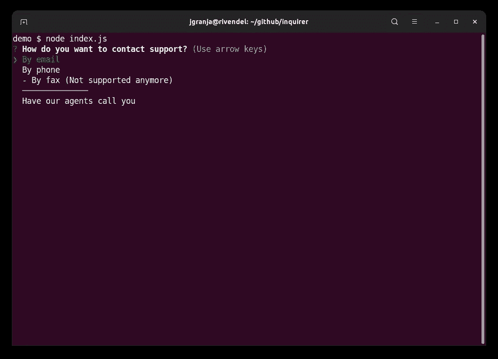
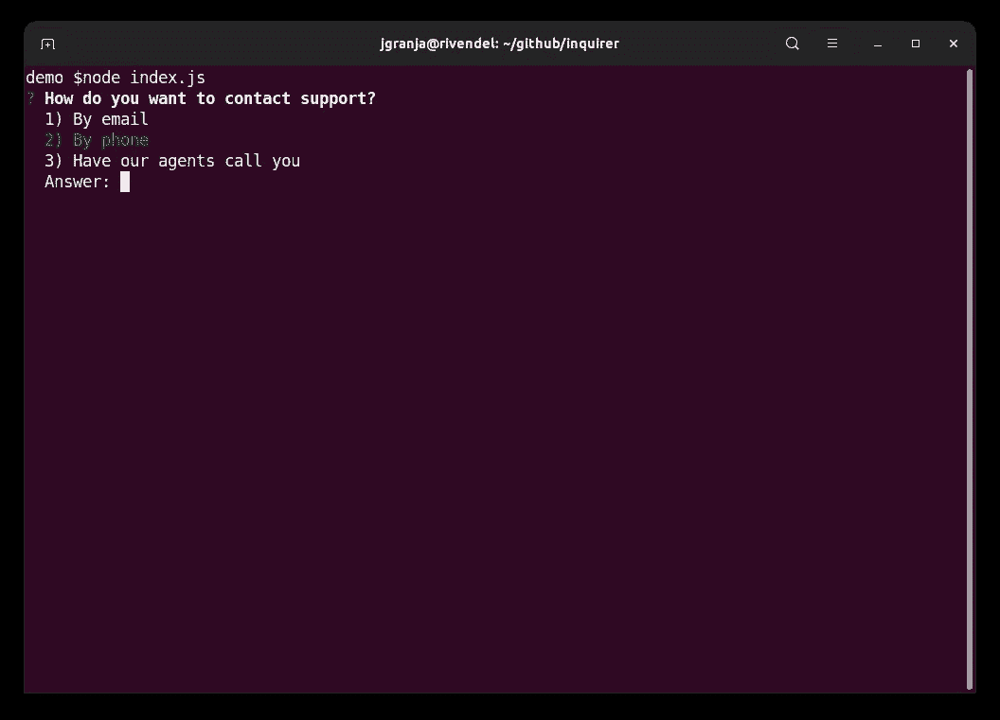
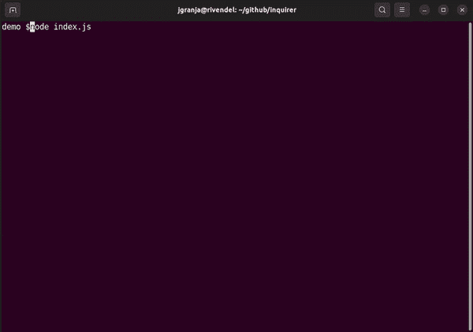
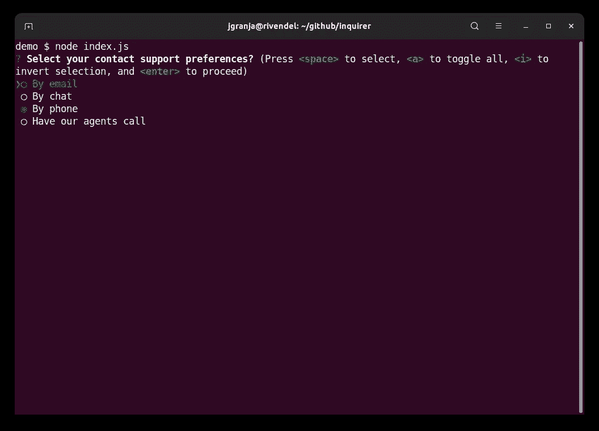
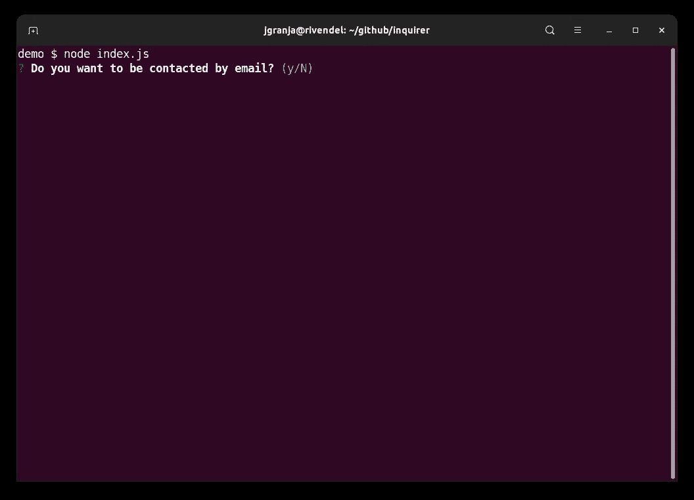
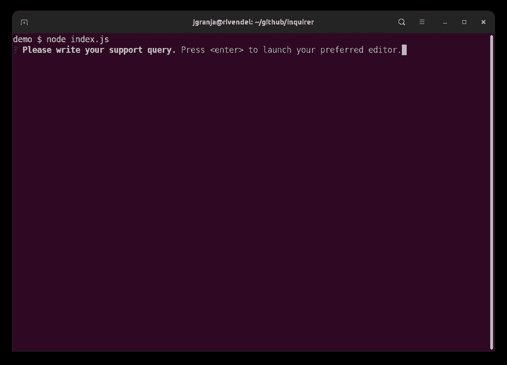
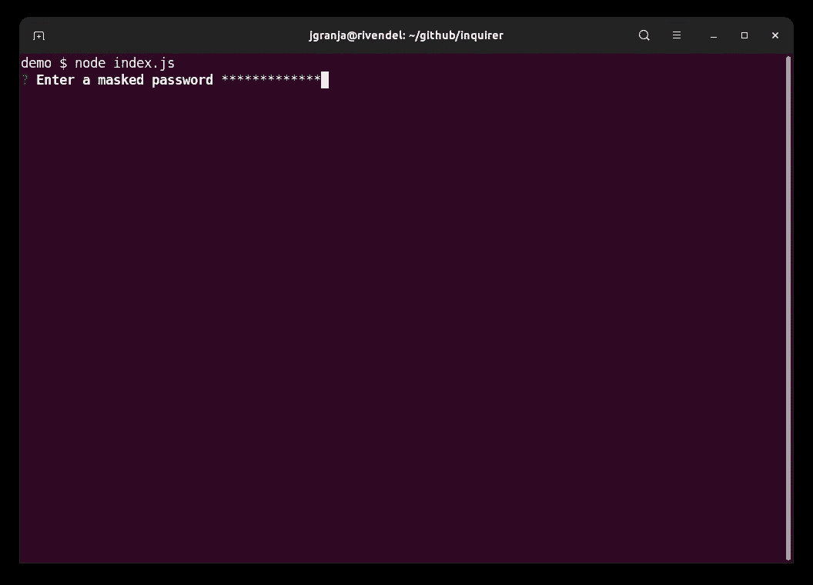
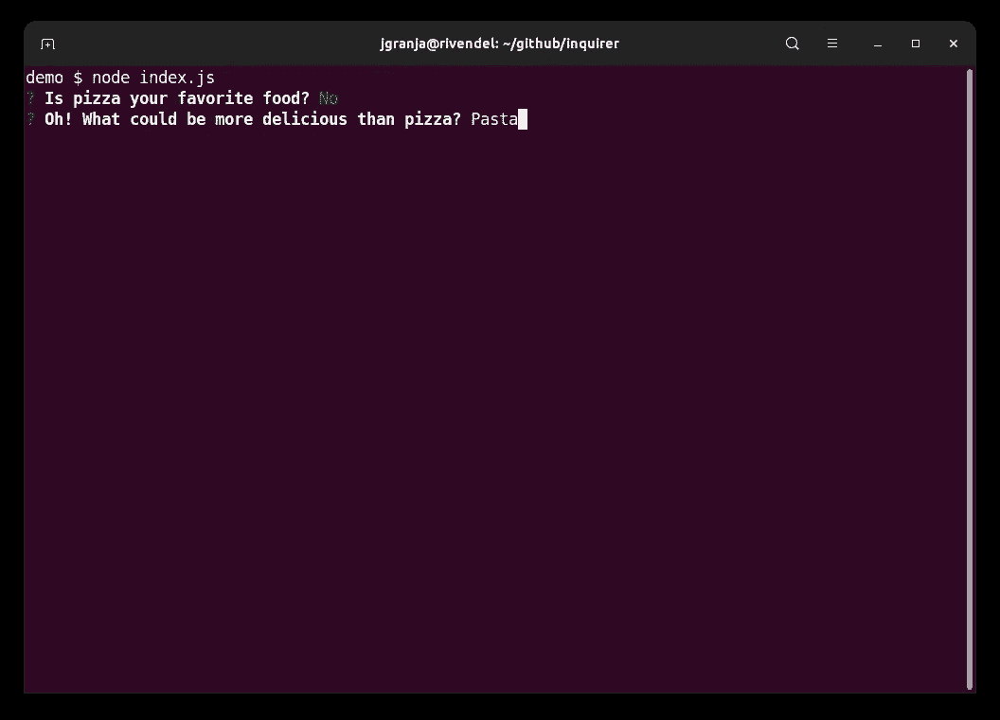

# 如何用 Node.js 创建漂亮的命令行交互

> 原文：<https://betterprogramming.pub/how-to-create-beautiful-command-line-interactions-with-node-js-2fcdfbbac62c>

## Inquierer.js，一个必须知道的 Node.js 库


作者图片

Node.js 最近遇到了很多竞争。一段时间以来，最知名的竞争对手是 Deno。最近，它已经看到了 Bun 如何获得了大量的牵引力和受欢迎程度。但是，不要误以为 Node.js 已经死了。它一直有很多问题和争议，但截至今天，它仍然是一个很好的选择。

Deno 仍有许多工作要做。它最初的大肆宣传似乎已经降温。Node.js 的生态系统是巨大的，Deno 的成熟和习惯还需要一点时间。另一方面，Bun 还不能用于生产。虽然我是 Bun 的忠实粉丝，但 Node.js 还会存在一段时间。

在本文中，我想通过查看创建命令行交互式用户界面是多么简单来举例说明 Node.js 生态系统的丰富性。我们如何实现这一目标？通过使用`Inquirer.js`。你一定很可能遇到过。像`Remix`或`NextJs`这样的流行图书馆在幕后使用它。

# 装置

它是一个`npm`依赖项，因此只需执行以下操作即可轻松安装:

```
npm install --save inquirer
```

尽管`commonjs`模块多年来一直是 node 的主流，但`v9`版本和更高版本都是建立在原生`esm`模块之上的。从版本`12`开始，节点就一直支持`esm`模块。

如果您需要它在旧版本的节点上运行，您可以使用最新版本的`8`来安装它。

```
*// will install the latest 8 versions*
npm install --save inquirer@^8.0.0
```

开始使用这个库所需要做的就是简单地导入它。下面是实现这一点的代码:

```
*// v8 and lower*
const inquirer = require('inquirer');*// v9 an higher*
import inquirer from 'inquirer';
```

# 提示

这个 API 非常直观。都是围绕`Promises`展开的，超级好用，推理。或者，我们可以使用`Rx.Observales`，在他们的文档中称为`React Interface`。在本文中，我们将关注基于承诺的接口。

这就是我们如何把东西打印到屏幕上。API 非常简单:

```
inquirer.prompt(questions) -> promise
```

*   `param` —问题:问题对象的数组。问题将按照与数组中相同的顺序显示。
*   returns:带有一系列响应的承诺。

对于复杂的用例，可以使用`inquirer.registerPrompt`创建插件，或者使用`inquirer.createPrompModule`将逻辑封装在一个自包含的模块中。

# 问题对象类型

这就是将要提供给`inquirer.prompt`方法的内容。这是您如何定义提示给用户的问题。

每个问题对象可以定义多种处理程序。让我们来看看最有用的:

*   `validate`:接收用户输入的函数，必须返回`true`或`false`。我也可以通过在主体内部使用`this.async()`方法来实现异步。
*   `filter`:过滤用户输入的方法。
*   `transform`:转换用户输入的方法。
*   `default`:返回问题默认值的值或函数。如果用户输入回车，它将默认为这个。
*   `when`:有条件隐藏/显示问题的功能。稍后会详细介绍。

最重要的`key`就是`type`那个。如果省略，则默认为`input`。让我们看看可以使用的不同类型:

## 1.投入

它只是最基本的一个。代码如下:

结果如下:


在 Node.js 中执行上述代码的屏幕截图

## 2.目录

要使用`list`类型，我们需要设置`type: 'list'`并提供一个`choices`数组列表。我们可以显示`disabled`选项，并通过使用`new inquirer.Separator`使用分隔符来设计我们的布局。

结果如下:



在 Node.js 中执行上述代码的屏幕截图

## 2.罗尔斯主义者

这个`type`只是对`list`的简化。它不接受选择数组中的对象，只接受字符串。它让我们使用光标或直接输入选项编号来回复。它将验证输入索引。

这是结果:



在 Node.js 中执行上述代码的屏幕截图

## 2.发展

扩展的类型与前一个类似，只是它将隐藏所有选项，以获得一个不太冗长的界面。它将只暴露每个选择的`key`绑定。默认选项将是大写的。

答案总是与`display all the options`联系在一起。建议将默认选项留空，这样，如果用户键入 enter，他们将获得显示给他们的选项列表。

结果如下:



在 Node.js 中执行上述代码的屏幕记录

请注意上面的 gif 图，该设置是如何变得具有响应性和交互性的。它突出显示选中的选项，并在每次击键时给出反馈。这导致了终端上出色的 UX。

## 3.检验盒

复选框的特殊性在于，要有默认值，我们必须将其标记为`check: true`是选项的数组。

结果如下:



在 Node.js 中执行上述代码的屏幕截图

## 4.确认

还实现了确认模式。这是许多应用程序中使用的一种常见模式。

结果如下:



在 Node.js 中执行上述代码的屏幕截图

## 6.编者ˌ编辑

编辑器将启动默认的终端编辑器，以便更舒适地输入。

结果如下:



在 Node.js 中执行上述代码的屏幕截图

## 7.密码

还有一种输入敏感数据的类型。这将完全隐藏输入(就像输入 sudo 密码时一样)或者用我们喜欢的字符屏蔽输入。

结果如下:



在 Node.js 中执行上述代码的屏幕截图

# 问题相关性

在某些情况下，您可能希望根据以前的回答包含或删除问题。有两种方法可以解决这个问题:

*   使用`when`函数:方法返回 true 时显示问题，返回 false 时隐藏问题。
*   嵌套提示:用另一个提示将承诺的结果与前面的答案嵌套。

## 使用时间

## 嵌套提示

嵌套提示很容易，让我们对想要做的事情有更多的了解。当我们得到所有问题的答案时，我们只需要调用`inquirer.prompt`。

代码如下:

上面的代码片段产生了相同的结果:



在 Node.js 中执行上述两个代码的屏幕截图

# 包裹

在 Node.js 中,`Inquirer`库使任何基于过程的设置变得有趣而简单。它提供了对我们想要显示的内容的许多控制和粒度。有很多定制，代码干净易读。

创建一个吸引人且简单的设置过程可能是成功的关键。`Inquirer`从我们这里拿走所有的重担，这样我们就可以专注于真正重要的事情。

如果你有兴趣了解更多，请在这里查看图书馆。